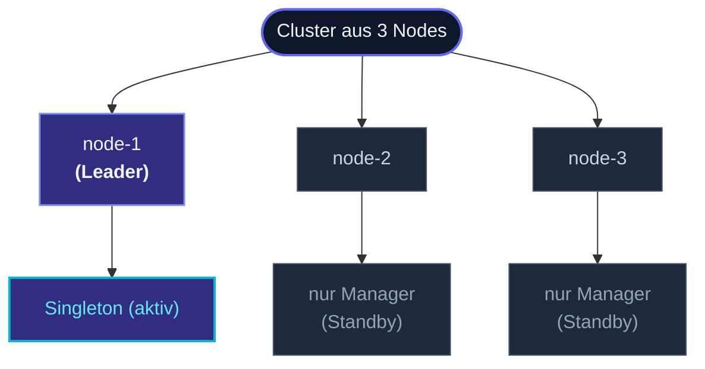

Ein **Cluster-Singleton** ist ein Actor, der *genau einmal* im
gesamten Cluster existiert. Er läuft auf dem Leader-Node; wenn
dieser Node geht, spawnt der nächst-gewählte Leader ihn neu.
Aufrufer auf jedem Node schicken Nachrichten über einen
**Proxy**, der dorthin routet, wo der Singleton aktuell lebt.


```mermaid
flowchart TB
  CLUSTER(["Cluster aus 3 Nodes"])
  N1["node-1<br/><b>(Leader)</b>"]
  N2["node-2"]
  N3["node-3"]
  SING["Singleton (aktiv)"]
  STB1["nur Manager<br/>(Standby)"]
  STB2["nur Manager<br/>(Standby)"]
  CLUSTER --> N1
  CLUSTER --> N2
  CLUSTER --> N3
  N1 --> SING
  N2 --> STB1
  N3 --> STB2
  classDef cluster fill:#0f172a,stroke:#6366f1,stroke-width:2px,color:#f1f5f9;
  classDef leader  fill:#312e81,stroke:#818cf8,stroke-width:1.5px,color:#f1f5f9;
  classDef node    fill:#1e293b,stroke:#475569,color:#cbd5e1;
  classDef active  fill:#312e81,stroke:#06b6d4,stroke-width:2px,color:#67e8f9;
  classDef passive fill:#1e293b,stroke:#475569,color:#94a3b8;
  class CLUSTER cluster
  class N1 leader
  class N2,N3 node
  class SING active
  class STB1,STB2 passive
```

Drei Actors pro Node lassen das funktionieren:

- **ClusterSingletonManager** — auf jedem Node. Beobachtet
  Cluster-Events; spawnt den Singleton, wenn dieser Node Leader
  wird, und stoppt ihn, wenn er aufhört, Leader zu sein.
- **ClusterSingletonProxy** — auf jedem Node, der mit dem Singleton
  *spricht*. Genau das geben `start` und `ref` zurück: einen
  weiterleitenden `ActorRef`, der immer auf den Manager des
  aktuellen Leaders zeigt.
- **Der Singleton-Actor selbst** — der Actor des Nutzers, immer nur
  auf dem Leader instanziiert.

Ein Node, der nur einen Proxy betreibt, kann das Singleton
adressieren, es aber nie hosten — siehe
[Einen Ref bekommen, ohne zu hosten](#einen-ref-bekommen-ohne-zu-hosten).

## Wann einen Singleton verwenden

Die klassischen Anwendungsfälle:

- **Ein Koordinator** — ein Job-Scheduler, ein Saga-Orchestrator,
  ein Rate-Limit-Budget-Tracker — der **eine konsistente Sicht**
  für den ganzen Cluster produzieren muss.
- **Ein Owner einer externen Ressource** — der Actor, der eine
  Verbindung zu einem einzelnen externen System hält (ein
  Lizenzserver, eine Legacy-DB mit Einzelverbindungslizenz).
- **Ein Leader-gewählter Service** — deine eigene gewählte Rolle
  für eine clusterweite Verantwortung.

Wenn du `if (!alreadyExists) spawn(...)` schreiben würdest, ist
ein Singleton vermutlich das Richtige.

## Ein minimales Beispiel

```ts
import { Actor, ActorSystem } from 'actor-ts';
import { Cluster, ClusterOptions, SingletonKey } from 'actor-ts/cluster';

class JobScheduler extends Actor<JobCommand> {
  static readonly singleton = SingletonKey.of<JobCommand>('job-scheduler');
  override onReceive(message: JobCommand): void { /* ... */ }
}

const system  = ActorSystem.create('my-app');
const clusterOptions = ClusterOptions.create()
  .withHost(host)
  .withPort(port)
  .withSeeds(seeds);
const cluster = await Cluster.join(system, clusterOptions);

// Auf jedem Node: ein Aufruf spawnt den Manager dieses Nodes und gibt den
// Ref zurück. Nur der Manager des Leaders konstruiert tatsächlich den
// JobScheduler.
const scheduler = cluster.singleton.start(JobScheduler);

// Irgendwo in der App — derselbe Aufruf auf jedem Node:
scheduler.tell({ kind: 'schedule', jobId: '42' });
```

`start` gibt einen normalen `ActorRef<JobCommand>` zurück — ein
Singleton wird also herumgereicht und gespeichert wie jeder andere
Actor, und keine Consumer-Signatur muss wissen, dass es eines ist.
Hinter den Kulissen findet der Ref den Manager des aktuellen Leaders
über den bekannten Pfad `/system/cluster/singleton/manager-<typeName>`
und leitet Nachrichten dorthin. Bei Leader-Wechseln verschiebt sich
das Ziel automatisch innerhalb einer Gossip-Runde.

## Den Key auf der Actor-Klasse deklarieren

`SingletonKey.of<Command>('type-name')` verbindet den Namen eines
Singletons mit seinem Message-Typ. Deklariert als
`static readonly singleton` auf dem Actor wird beides am Aufrufort
nicht wiederholt, und `start` / `ref` leiten den richtigen
`ActorRef<Command>` allein aus der Klasse ab.

:::caution[Das explizite Typargument ist tragend]
`SingletonKey.of('job-scheduler')` — ohne `<JobCommand>` — inferiert
`SingletonKey<unknown>`, und jeder daraus gewonnene Ref degradiert zu
`ActorRef<unknown>`. Schreibe das Typargument, oder annotiere das Feld:
`static readonly singleton: SingletonKey<JobCommand> = SingletonKey.of('job-scheduler')`.
:::

Ein Actor mit Constructor-Dependencies bekommt eine Factory als
zweites Argument:

```ts
class UserRepository extends PersistentActor<UserRepositoryCommand, Event, State> {
  static readonly singleton = SingletonKey.of<UserRepositoryCommand>('user-repository');
  constructor(private readonly users: ActorRef<UserCommand>) { super(); }
}

const users = cluster.sharding.start(UserActor);
const repository = cluster.singleton.start(UserRepository, () => new UserRepository(users));
```

Eine **Rolle** gehört auf den Key, als zweites Argument:

```ts
class Ingress extends Actor<IngressCommand> {
  static readonly singleton = SingletonKey.of<IngressCommand>('ingress', 'edge');
}
```

Sie ist nicht Teil der Identität — zwei Keys sind genau dann gleich,
wenn ihre Namen übereinstimmen — sie fährt nur mit, damit *jede* Node
dieselbe liest.  Das zählt für eine Node, die nur `ref` aufruft: sie
hat kein Options-Objekt, eine allein über `withRole` gesetzte Rolle ist
für sie also unsichtbar, und ihr Proxy würde einen anderen Host
auflösen als die Manager.

Für `lease`, oder um die Rolle pro Deployment zu überschreiben, werden
Options danebengelegt — oder die volle Builder-Form genutzt, wenn es
keine Klasse gibt, an die ein Static passt:

```ts
const singletonOptions = StartSingletonOptions.create<JobCommand>()
  .withRole('control-plane')    // schlägt eine auf dem Key deklarierte Rolle
  .withBufferSize(5_000);       // Nachrichten, während keine Node hostet
cluster.singleton.start(JobScheduler, singletonOptions);
```

`bufferSize` begrenzt, was der Proxy hält, solange der Cluster keinen
Host hat — normalerweise eine Gossip-Runde, in einem Ausfall aber
unbegrenzt.  Jenseits des Limits (Default 1000) gehen Nachrichten mit
einer Warnung in die Dead Letters, statt den Puffer ewig wachsen zu
lassen.

Der Puffer wird beim ersten Cluster-Event geleert, das einen Host
hervorgebracht haben kann — bei einem Leader-Wechsel, genauso aber,
wenn ein Mitglied hochkommt, gedownt wird oder geht.  Diese
vollständige Menge ist für ein rollenbeschränktes Singleton
entscheidend: Das erste Mitglied, das die Rolle trägt, kann beitreten,
ohne dass sich der Leader überhaupt ändert — und vor v0.17.0 blieb der
Puffer dadurch unbegrenzt ungeleert, während jeder spätere Versand
normal geroutet wurde.

Dass ein Mitglied *unerreichbar* wird, steht bewusst nicht in dieser
Menge — auf keiner der beiden Seiten; siehe
[Unerreichbarkeit ist bewusst kein Trigger](/de/cluster/singleton/manager/#unerreichbarkeit-ist-bewusst-kein-trigger).

:::note[Es gibt bewusst kein `SingletonActor`-Interface]
TypeScripts `implements`-Klausel prüft ausschließlich die
**Instanzseite** einer Klasse — es gibt kein `static implements`, und
`abstract static` ist ein Compile-Fehler. Ein `SingletonActor`-Marker
wäre also strukturell leer: jede Klasse würde ihn erfüllen und geprüft
würde nichts. Ein statisches Feld ist der Träger, der funktioniert, und
es komponiert mit jeder Basisklasse — was zählt, weil ein Singleton
häufig auch ein `PersistentActor` ist und TypeScript nur
Einfachvererbung kennt. Erzwungen wird es am `start`-Aufrufort, der den
Message-Typ gleichzeitig aus dem Key und aus der Actor-Position
ableitet und eine Abweichung zwischen beiden meldet.
:::

## Einen Ref bekommen, ohne zu hosten

`start` nimmt den Node in die Rotation auf: er kann Host werden. Ein
Node, der nur mit dem Singleton *sprechen* muss, ruft stattdessen
`ref` — das Gegenstück zu `ClusterSharding.startProxy`:

```ts
// Kein Manager auf diesem Node — Nachrichten gehen an den, der hostet.
const scheduler = cluster.singleton.ref(JobScheduler);
scheduler.tell({ kind: 'schedule', jobId: '42' });
```

`ref` und `start` geben für denselben Key denselben memoisierten Ref
zurück, und der lokale Manager wird pro Zustellung aufgelöst — ein Node,
der erst `ref` und später `start` ruft, behält also denselben Ref, der
dann einfach lokal statt über die Wire zustellt.

:::caution[`ref` allein hostet nie]
Rufe `start` auf **jedem** Node, der Leader werden kann. Hat der
gewählte Leader nur `ref` gerufen, hostet kein Node das Singleton und
Nachrichten landen mit einer Warnung, die den Typ nennt, in den Dead
Letters.
:::

Zwei Dinge tut der zurückgegebene Ref außerdem nicht:

- **`ref.stop()` ist ein warnender No-Op.** Überall sonst schickt
  `ActorRef.stop()` eine `PoisonPill` an sein Ziel; hier würde das
  töten, was der aktuelle Leader gerade hostet. Um *diesen Node* aus
  der Rotation zu nehmen, rufe `cluster.singleton.stop(key)`.
- **Stoppen ist asynchron.** Der Manager gibt Lease und Envelope-Pfad
  in `postStop` frei, und der Actor-Name bleibt belegt, bis die
  Terminierung abgeschlossen ist — dasselbe Singleton im selben Turn
  erneut zu starten wirft daher mit einer Erklärung statt mit einem
  Duplicate-Name-Fehler.

`cluster.singleton` bietet zusätzlich `isStarted(key)` und
`managerFor(key)` für Diagnose.

## Failover

Wenn der Host-Node den Cluster verlässt:

1. **Erkennung**: Cluster-Gossip propagiert `MemberLeft` /
   `MemberRemoved` für den gehenden Node.
2. **Wahl**: der Cluster wählt einen neuen Leader (deterministisch
   basierend auf der Mitglieder-Sortierreihenfolge).
3. **Hand-over**: der Manager des neuen Leaders bittet jeden Node, der
   hosten könnte, zurückzutreten, und wartet, bis jeder bestätigt hat,
   dass seine Instanz wirklich terminiert ist.
4. **Spawn**: erst dann spawnt er den Singleton.
5. **Routing-Verschiebung**: Proxies auf jedem Node sehen den
   Leader-Wechsel und aktualisieren ihr Forwarding-Ziel.

In-Flight-Nachrichten während des Übergangs landen in Dead
Letters, es sei denn, du hast Durability konfiguriert — siehe
"State über Failover" weiter unten. Nachrichten, die den
*eintretenden* Host erreichen, während er auf Schritt 3 wartet, werden
zurückgehalten und der neuen Instanz übergeben.

Das Übergangsfenster wird vom Timeout des Failure Detectors
begrenzt (typisch ein paar Sekunden für Unreachable-Erkennung).
Singletons sind kein Low-Latency-Failover-Werkzeug; sie tauschen
etwas Unverfügbarkeit beim Failover gegen Einzigartigkeit.

**Wie stark diese Einzigartigkeit ist, hängt von deiner Konfiguration
ab**, und es lohnt sich zu wissen, welche du hast:

- **Default (ohne Lease).** Der Hand-over macht „höchstens eine
  Instanz“ wahr, solange der abtretende Host *erreichbar ist und
  antwortet*. Wenn er das nicht kann — er ist unerreichbar, oder eine
  Partition hat den Cluster geteilt — wartet der eintretende Host
  `handOverTimeoutMs` (10 s) und hostet dann trotzdem, mit einer
  Warnung im Log: Verfügbarkeit wird einer Invariante vorgezogen, die
  nicht bewiesen werden konnte. Für die Dauer dieses Zustands sind zwei
  Instanzen möglich.
- **Mit einer `lease`.** Die Arbitrierung wandert zu einer dritten
  Instanz, die beide Seiten erreichen können, also hält sie genau eine
  von ihnen — und die Lease wird erst freigegeben, wenn die abtretende
  Instanz wirklich terminiert ist. Das ist die Konfiguration für den
  Fall, dass Doppelausführung echten Schaden anrichtet. Siehe
  [Singleton mit Lease](/de/cluster/singleton/with-lease/).

## State über Failover

Die neue Instanz startet mit weißer Weste — so wie ein neu
gestarteter Actor auf einem einzelnen Node. Für State, der
überleben soll:

- **`PersistentActor`** — der Singleton persistiert Events; die
  neue Instanz spielt sie aus dem Journal ab. Die meisten
  Produktions-Singletons nutzen das. Siehe
  [PersistentActor](/de/persistence/persistent-actor/).
- **`DurableState`** — einfacher: snapshotte den aktuellen State;
  restore beim Neustart. Siehe [DurableState](/de/persistence/durable-state/).
- **`DistributedData`** — für State, der *vor* dem Neustart des
  Singletons lesbar sein soll. Die meisten Singletons brauchen das
  nicht; ihr State ist privat zum Singleton.

Ohne eine dieser Lösungen ist jedes Failover ein Frischstart. Für
einen kurzlebigen Koordinator, der nur eingehende Arbeit routet,
ist das oft in Ordnung; für stateful Workflows persistiere.

### Warme Übergabe

Einen Fall beantwortet keine der drei Lösungen gut: Zustand, der
*teuer wiederherzustellen, aber billig zu kopieren* ist — tausende
Events zum Replay, ein großer Read-Through-Cache. Persistenz lässt
den Zustand überleben; schnell macht sie den Nachfolger nicht, denn
der muss trotzdem replayen.

Die warme Übergabe schließt diese Lücke bei einem **geplanten**
Wechsel. Implementiere zwei Methoden, und der Zustand der
abgehenden Instanz reist auf der Übergabe mit, die ohnehin
stattfindet:

```ts
import { Actor } from 'actor-ts';
import { SingletonKey, type WarmHandOverActor } from 'actor-ts/cluster';

class PriceCacheActor extends Actor<PriceCommand> implements WarmHandOverActor {
  static readonly singleton = SingletonKey.of<PriceCommand>('price-cache');
  private prices = new Map<string, number>();

  override async preStart(): Promise<void> {
    // Skipped entirely when a predecessor handed its cache over.
    if (this.prices.size === 0) await this.loadEveryPrice();
  }

  serializeForHandOver(): Uint8Array {
    return new TextEncoder().encode(JSON.stringify([...this.prices]));
  }

  restoreFromHandOver(state: Uint8Array): void {
    this.prices = new Map(JSON.parse(new TextDecoder().decode(state)));
  }
}
```

Auf die Bedingung in `preStart` kommt es an. `restoreFromHandOver`
läuft **nach dem Konstruktor und vor `preStart`** — die einzige
Position, von der aus die Wiederherstellung noch übersprungen werden
kann. Ein `preStart`, das bedingungslos wiederherstellt, zahlt die
Kosten trotzdem und überschreibt danach das Angekommene.

Vier Dinge solltest du wissen, bevor du dich darauf verlässt:

- **Aktiviert wird sie am Actor, nicht in den Options.** Es gibt
  kein Flag. Ein Actor, der nicht beide Methoden implementiert,
  verhält sich genau wie vorher.
- **Sie darf ausbleiben.** Keine Hooks, ein Snapshot über der
  Grenze, ein Serializer oder ein Restore, der wirft, ein Host, der
  gedownt statt gefragt wurde, ein Peer, der nie geantwortet hat —
  jeder dieser Fälle fällt auf den heutigen Kaltstart zurück und
  loggt auf `warn`. Schreibe niemals einen Singleton, dessen
  Korrektheit vom Ankommen des Zustands abhängt; ein Singleton, der
  den Verlust seines Hosts nicht übersteht, kann seine Aufgabe nicht
  erfüllen.
- **`serializeForHandOver` wird nach `postStop` gerufen**, der
  Snapshot ist also endgültig: Keine weitere Nachricht wird noch
  eingerechnet, und was in der Mailbox lag, ist in Dead Letters
  gegangen statt hinein. Eine Instanz, die an einem Crash oder einem
  erschöpften Supervision-Budget gestorben ist, wird nie gefragt —
  der Zustand, der so einen Tod übersteht, ist der Zustand, der ihn
  verursacht hat.
- **Der Snapshot ist begrenzt, standardmäßig auf 1 MiB**
  (`withMaxHandOverStateBytes`). Er reist, während der Singleton
  nirgends läuft — ein sehr großer verlängert den Ausfall also,
  statt ihn zu verkürzen. Ein Snapshot liegt als base64 in einem
  JSON-Frame und kostet auf der Leitung rund ein Drittel mehr; einer,
  der nicht in `maxFrameBytes` des Transports passt, wird unabhängig
  von der Grenze abgelehnt, denn ein zu großer Frame kostet die
  ganze Node-zu-Node-Verbindung und nicht bloß die Nachricht.

Bei einem `PersistentActor`-Singleton kommt ein Gedanke hinzu: Eine
warm gestartete Instanz hält Zustand, der nie aus einem Replay kam —
ihre Sequenznummer muss also mit im Snapshot reisen. Sonst schreibt
ihr erstes `persist` an eine Position, die das Journal schon benutzt
hat, und genau das liest das Fencing korrekt als zweiten Writer.

## Split-Brain und die optionale Lease

Wenn der Cluster partitioniert wird, könnten zwei Hälften jeweils
einen eigenen Leader wählen — und beide würden den Singleton
spawnen. Genau der Fall, gegen den Singletons existieren.

Drei Verteidigungen, in der Reihenfolge der Komplexität:

1. **Eine Downing-Strategie**, die während einer Partition eine
   Gewinnerseite wählt (Standardoption, keine Lease nötig). Die
   Verliererseite fährt sich selbst herunter; nur eine Hälfte
   bleibt aktiv. Siehe
   [Downing-Strategien](/de/cluster/downing-strategies/).
2. **Eine Lease**, die mit den Start-Options übergeben wird:
   ```ts
   const singletonOptions = StartSingletonOptions.create<JobCommand>()
     .withLease(someLeaseImpl);   // z. B. K8s-Lease oder In-Memory für Tests
   cluster.singleton.start(JobScheduler, singletonOptions);
   ```
   Der Manager muss die Lease erfolgreich erwerben, bevor er den
   Singleton spawnen darf. Nur eine Seite einer Partition kann die
   Lease halten, sodass selbst bei zwei Leadern nur ein Singleton
   existiert. Siehe
   [Singleton mit Lease](/de/cluster/singleton/with-lease/).

Die Kombination aus "Downing-Strategie + Lease" ist paranoid-sicher;
jeder allein reicht meist.

## Kosten

Ein Singleton hat Overhead jenseits eines normalen Actors:

- **Jeder Node fährt einen Manager** — sie sind leichtgewichtig
  (eine Zustandsmaschine, die Cluster-Events beobachtet), aber sie
  existieren auf jedem Node.
- **Jeder Node, der den Singleton aufruft, fährt einen Proxy** —
  ebenfalls leichtgewichtig, aber pro `tell` ein zusätzlicher Hop.
- **Leader-Wechsel ist die Kosten des Failovers** — ein Singleton
  ist die paar Sekunden lang unverfügbar, die der Cluster für die
  Konvergenz auf einen neuen Leader braucht.

Wenn Exaktheit nicht erforderlich ist (dir würden N Replicas
genügen), nutze einen [Cluster-Router](/de/cluster/cluster-router/)
oder [Sharding](/de/cluster/sharding/overview/) — beide skalieren
horizontal ohne Leader-Flaschenhals.

## Wann NICHT verwenden

import { Aside } from '@astrojs/starlight/components';

<Aside type="caution" title="Hochdurchsatz-Workloads">
  Ein Singleton ist ein **Skalar** — der gesamte Traffic
  trichtert durch einen Actor. Der Durchsatz ist auf den
  Durchsatz eines Actors begrenzt, egal wie viele Nodes im
  Cluster sind. Für hohen Durchsatz shardiere die Arbeit nach
  irgendeinem Key; jedes Shard skaliert unabhängig.
</Aside>

<Aside type="caution" title="Per-Key-State, der skaliert">
  ```ts
  // ✗ falsche Form — nutzt eine Map innerhalb eines Singletons
  class SessionRegistry extends Actor<...> {
    private sessions = new Map<string, SessionState>();
  }
  ```
  Wenn du Per-Key-State verfolgst und der Key-Raum groß ist, ist
  das ein Sharding-Problem. Nutze stattdessen
  [ClusterSharding](/de/cluster/sharding/overview/) — ein Actor
  *pro Key*, verteilt über Nodes.
</Aside>

<Aside type="caution" title="Kein spezifischer Bedarf an Exactly-One-Semantik">
  Singletons existieren, weil manche Invarianten eine einzige
  Quelle der Wahrheit brauchen. Wenn dein Grund für einen
  Singleton "ich konnte damit leichter mit N=1 denken" ist, prüfe,
  ob die Kosten (Single-Point-Flaschenhals, Failover-Lücke) das
  wert sind. Oft ist ein Router-Pool + ein bisschen Koordination
  besser.
</Aside>

## Wohin als Nächstes

- **[ClusterSingletonManager](/de/cluster/singleton/manager/)** —
  der Per-Node-Manager, der den Singleton wählt + spawnt.
- **[Singleton mit Lease](/de/cluster/singleton/with-lease/)** —
  Split-Brain-Schutz über eine Koordinations-Lease.
- **[Coordination](/de/coordination/overview/)** — die
  Lease-Abstraktion selbst.
- **[Sharding-Überblick](/de/cluster/sharding/overview/)** —
  für das Per-Key-Actor-Muster.
- **[Cluster-Überblick](/de/cluster/overview/)** — die
  Mitgliedschafts- und Leader-Wahl-Maschinerie darunter.

Die [`ClusterSingletonManager`](/api/classes/clustersingletonmanager/)-
und [`ClusterSingletonProxy`](/api/classes/clustersingletonproxy/)-
API-Referenzen decken die vollständige Konfigurationsoberfläche
ab.
