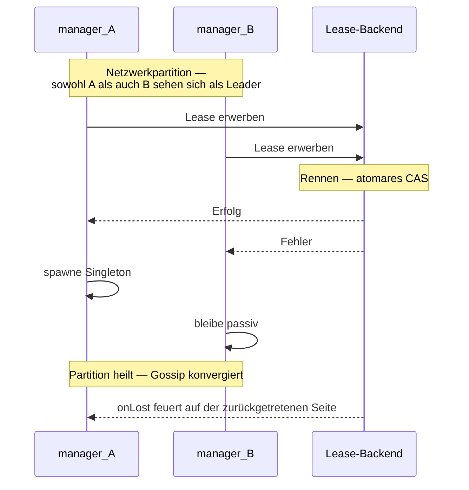

Der [Singleton-Manager](/de/cluster/singleton/manager/) wählt
standardmäßig einen Singleton allein basierend auf Cluster-Gossip.
Bei Partitionen + unzureichendem Downing können **beide Hälften
ihren eigenen Leader wählen** → zwei Singletons existieren.

Die **Single-Writer-Lease** verhindert das:

```ts
import { ClusterSingletonManager, KubernetesLease } from 'actor-ts';

system.actorOf(
  ClusterSingletonManager.props({
    cluster,
    typeName:        'job-scheduler',
    singletonProps:  Props.create(() => new JobScheduler()),
    lease:           new KubernetesLease({
      name:        'job-scheduler-singleton',
      owner:       process.env.POD_NAME!,
      ttlMs:       30_000,
      namespace:   process.env.K8S_NAMESPACE!,
    }),
  }),
  'singleton-manager-job-scheduler',
);
```

Jetzt **spawnt der Manager den Singleton erst nach dem Erwerb der
Lease**. Zwei Manager, die gleichzeitig Leadership beanspruchen,
liefern sich ein Rennen um die Lease; nur einer gewinnt.

## Wie es funktioniert



Das Lease-Backend (K8s-API-Server) liefert die **atomare
Exactly-One-Holder**-Garantie — jenseits der eventuellen
Konsistenz von Gossip.

## Konfiguration

```ts
ClusterSingletonManager.props({
  cluster,
  typeName,
  singletonProps,
  lease,                            // ← optionale Lease
  acquireRetryIntervalMs: 5_000,    // Default — Retry nach fehlgeschlagenem Acquire
});
```

`Lease` ist dieselbe Abstraktion wie bei
[Coordination](/de/coordination/overview/) — InMemoryLease für Tests,
KubernetesLease für Produktion.

## Das Schutzniveau lesen

| Setup | Singleton-Einzigartigkeitsgarantie |
| --- | --- |
| Kein Downing, keine Lease | Best-Effort. Partitionen = doppelte Singletons. |
| Nur Downing-Strategie | Stark in stabilen Netzwerken. |
| Downing + Lease | **Paranoid-sicher**. Beide Invarianten erzwungen. |

Für Singletons, bei denen Doppelausführung **echten Schaden**
anrichten würde (Kunden doppelt belasten, Events doppelt
veröffentlichen), nutze beides.

## Behandlung von Lease-Verlust

```ts
// Innerhalb des Managers (vom Framework verwaltet):
lease.onLost((reason) => {
  // Stoppe den Singleton; retry acquire nach acquireRetryIntervalMs
});
```

Wenn die Lease widerrufen wird (TTL abgelaufen, anderer Halter
hat sie übernommen):

- Der Manager **stoppt den Singleton sofort** — kein geordnetes
  Drainen.
- Der `postStop` des Singletons läuft.
- Der Manager versucht Acquire periodisch erneut.

Bedeutet: wenn das Lease-Backend kurz hickst und sie kurzfristig
widerruft, **startet der Singleton neu** während der Erholung —
gleicher Effekt wie ein kurzer Actor-Neustart.

## Verfügbarkeit des Lease-Backends

```
K8s-API-Ausfall → keine Lease-Renewals → Singleton verliert irgendwann die Lease
  → Singleton stoppt überall
  → kein Singleton verfügbar, bis K8s-API sich erholt
```

Das Lease-Backend wird zum SPOF. Für typische Cluster ist die
K8s-API-Uptime viel höher als die des restlichen Systems, aber
das ist **eine echte Überlegung**. Plane den seltenen Fall ein.

## Failover-Fenster

```
A's Lease hat TTL 30s.
A stürzt ab — kein Renew passiert.
Nach 30s läuft die Lease ab.
B erwirbt + spawnt Singleton.
```

Failover-Fenster = **Lease-TTL**. Konfigurierbar über das
`ttlMs`-Feld der Lease.

Kürzere TTL = schnelleres Failover, aber mehr Renew-Verkehr.
Typisch: 15-30 Sekunden.

## Was während des Fensters passiert

```
Sekunden 0-30:  A's Lease noch gültig (er ist abgestürzt, aber TTL läuft noch)
                B kann nicht acquiren; nirgendwo ein Singleton
                Nachrichten an den Singleton landen in Dead Letters

Sekunden 30+:   B erwirbt; Singleton spawnt
                Wenn Singleton ein PersistentActor ist, läuft Recovery
                Nachrichten werden wieder verarbeitet
```

Während der Lücke **scheitern Nachrichten an den Singleton** —
sie routen zu einem gestoppten Manager und landen in Dead
Letters.

Für Workloads, bei denen das inakzeptabel ist, erwäge:

- **Niedrigeres TTL** (15 s gibt schnelleres Failover, mehr
  Renewals).
- **Pufferung beim Sender** — der Singleton-Proxy kann während
  der Lücke puffern und danach erneut senden.
- **Andere Architektur** — Singletons sind inhärent
  seriell-bei-Failover.

## Vergleich mit Sharding mit Lease

| | Singleton + Lease | Sharding + Lease |
| --- | --- | --- |
| Was geschützt wird | Singleton-Einzigartigkeit | Koordinator-Einzigartigkeit |
| Was bei Lease-Verlust stoppt | Der Singleton-Actor | Allokationen des Koordinators |
| Failover-Fenster-Kosten | Singleton unverfügbar | Neue Shard-Allokationen werden in Warteschlange gestellt |
| Bestehende Arbeit während Failover | Pausiert | Läuft für bereits allokierte Shards weiter |

Singleton-Failover ist **disruptiver** — der Singleton ist die
Workload. Sharding-Failover betrifft nur neue Allokationen —
existierende Entities verarbeiten weiter.

import { Aside } from '@astrojs/starlight/components';

<Aside type="caution" title="Lease in Umgebungen mit nur mTLS">
  ```ts
  new KubernetesLease({ /* keine Auth-Config */ })
  ```
  KubernetesLease nutzt standardmäßig das Service-Account-Token
  des Pods. RBAC muss Lease-CRUD-Berechtigungen erteilen:
  ```yaml
  rules:
    - apiGroups: ["coordination.k8s.io"]
      resources: ["leases"]
      verbs: ["get", "create", "update", "patch", "delete"]
  ```
  Siehe [KubernetesLease](/de/coordination/kubernetes-lease/).
</Aside>

<Aside type="caution" title="Singleton-State über Failover">
  ```ts
  // Singleton mit In-Memory-State — Recovery verliert ihn
  ```
  Für State, der Failover überleben soll, muss der Singleton ein
  PersistentActor sein. Ohne das ist jedes Failover ein
  Frischstart.
</Aside>

## Wohin als Nächstes

- **[Singleton-Überblick](/de/cluster/singleton/overview/)** —
  das Fundament.
- **[Singleton-Manager](/de/cluster/singleton/manager/)** —
  die Per-Node-Wahl-Logik.
- **[Sharding mit Lease](/de/cluster/sharding/with-lease/)** —
  dasselbe Muster für Sharding.
- **[Coordination](/de/coordination/overview/)** — die
  Lease-Abstraktion.
- **[KubernetesLease](/de/coordination/kubernetes-lease/)** —
  Produktions-Backend.
