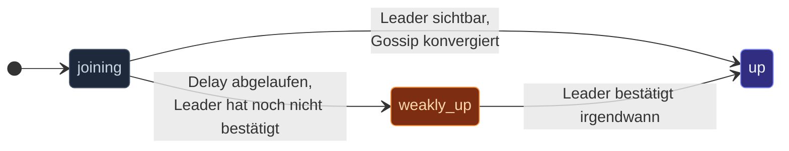
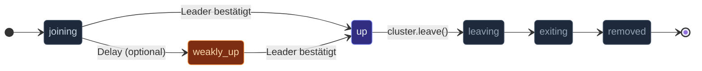

In einem gesunden Cluster wechselt ein joinender Node innerhalb
weniger Gossip-Runden von `joining` zu `up` — sobald der Leader
ihn sieht. Aber wenn der Cluster **partitioniert** ist, enthält
die Sicht des Leaders nicht die partitionierte Seite; ein Node,
der die Minderheits-Seite joint, wartet unbegrenzt.

**Weakly-up** ist ein temporärer Zustand, der diese Sackgasse
löst: nach einem konfigurierten Delay wird ein Joiner, der noch
nicht `up` erreicht hat, automatisch zu `weakly-up` befördert. Er
ist per Gossip in seiner Partition sichtbar; der Cluster kann zu
ihm routen, ohne dass der Leader beteiligt ist — allerdings mit
einigen Einschränkungen.



## Wann das wichtig ist

Im Normalbetrieb passiert der Übergang `joining → up` innerhalb
ein, zwei Sekunden — du bekommst `weakly-up` nie zu Gesicht. Er
kommt nur zum Tragen bei:

- **Kaltstart mit Partition** — mehrere Nodes booten gleichzeitig
  über ein teilweises Netzwerk.
- **Leader-seitiger Ausfall beim Join** — der Leader ist
  unerreichbar, aber der Joiner kann andere Mitglieder erreichen.
- **Gestreckten Clustern mit hoher RTT** — der
  Gossip-zu-Leader-Round-Trip ist langsam genug, um einen
  konfigurierten Schwellwert zu überschreiten.

Ohne Weakly-up macht keines dieser Szenarien Fortschritt; der
Joiner steckt für immer in `joining` (oder bis der Leader
auftaucht).

## Weakly-up aktivieren

```ts
await Cluster.join(
  system,
  ClusterOptions.create()
    .withHost(host)
    .withPort(port)
    .withSeeds(seeds)
    .withWeaklyUpAfterMs(3_000),   // nach 3s in joining automatisch befördern
);
```

Der Default ist `0` (deaktiviert). Wähle einen Wert hoch genug,
sodass der normale `joining → up` der Standardpfad bleibt, aber
niedrig genug, dass ein stockender Join in vernünftiger Zeit
weiterkommt.

3-10 Sekunden ist typisch. Weniger und du würdest bei routinemäßig
langsamen Gossip-Runden befördern; mehr und die Erholung des
stockenden Joins ist schleppend.

## Was Weakly-up-Mitglieder können und nicht können

| Fähigkeit | `weakly-up` |
| --- | --- |
| `tell` von anderen Peers in derselben Partition empfangen | ✓ |
| Cluster-Events abonnieren | ✓ |
| Routee in Cluster-Router-Pools sein | ✗ |
| Sharding-Entities hosten | ✗ |
| Eine Singleton-Wahl gewinnen | ✗ |

Die Aufteilung: **passive Teilnahme funktioniert**, **aktive
Verantwortlichkeiten nicht**. Ein `weakly-up`-Mitglied kann
weiterhin HTTP-Requests bedienen, die bei ihm landen, aber
cluster-verwaltete Verantwortlichkeiten warten auf die vollständige
`up`-Bestätigung.

Das ist absichtlich konservativ — ein Weakly-up-Mitglied könnte
tatsächlich auf der *Minderheits*-Seite einer Partition sein (es
ist bisher einfach nicht bestätigt). Es einen Singleton hosten zu
lassen, würde die Gefahr von Doppel-Leadership bergen.

## Der vollständige Zustandspfad



`weakly-up` ist **temporär** — sobald der Leader erreichbar wird
und Gossip konvergiert, wechselt das Mitglied auf `up`. Es kann
auch direkt von `weakly-up` zu `leaving` oder `removed` gehen,
wenn es gestoppt wird, ohne jemals `up` erreicht zu haben.

## Den Übergang beobachten

```ts
import { MemberWeaklyUp, MemberUp } from 'actor-ts';

cluster.subscribe(MemberWeaklyUp, (evt) => {
  console.log(`${evt.member.address} zu weakly-up befördert`);
});

cluster.subscribe(MemberUp, (evt) => {
  console.log(`${evt.member.address} hat volles up erreicht`);
});
```

In Dashboards oder Monitoring zähle `MemberWeaklyUp`-Events — eine
ungleich-null Rate im Normalbetrieb bedeutet, dass Partitionen
passieren (oder der Schwellwert für dein Netzwerk zu niedrig
gesetzt ist).

## Wann aktivieren, wann nicht

**Aktivieren wenn:**

- Partitionstoleranz beim Kaltstart wichtig ist (Multi-AZ-Deployments,
  CI-Multi-Node-Tests mit unvollkommenem Netzwerk).
- Deine Anwendung Arbeit hat, die nicht *voraussetzt*, dass die
  Cluster-Mitgliedschaft komplett ist (z. B. eine HTTP-API, die
  gecachte Lesevorgänge schon vor vollständiger
  Cluster-Bildung bedienen kann).

**Nicht aktivieren wenn:**

- Die Korrektheit deiner App davon abhängt, dass "jeder Node im
  Cluster sich auf die Mitgliedschaft einigt, bevor irgendetwas
  geschieht." Bleib strikt; lass Joins auf volle Konvergenz
  warten.
- Der Cluster klein und stabil ist und du lieber
  "Join-stuck"-Alerts siehst als stille Halb-Mitgliedschaft.

## Stolperfallen

import { Aside } from '@astrojs/starlight/components';

<Aside type="caution" title="Weakly-up ersetzt kein Downing">
  ```ts
  weaklyUpAfterMs: 3_000;
  // ✗ kein downingProvider
  ```
  Weakly-up hilft beim **Join** während einer Partition; es hilft
  nicht, die Partition *aufzulösen*. Nachdem die Partition geheilt
  ist, brauchst du immer noch eine Downing-Strategie, um die
  Verliererseite zu entfernen. Verwende beides.
</Aside>

<Aside type="caution" title="Weakly-up-Mitglieder können dich überraschen">
  ```ts
  const members = cluster.upMembers();
  // ↑ enthält keine weakly-up Mitglieder
  ```
  `upMembers()` ist strikt — nur volles up. Wenn dein Code anhand
  von "sind mindestens 3 Mitglieder up?" verzweigt, ohne weakly-up
  zu berücksichtigen, kann ein partitionierter Cluster die Prüfung
  auf einer Seite bestehen und auf der anderen versagen. Entscheide
  explizit, welchen Zustand/welche Zustände deine Logik als "live"
  ansieht.
</Aside>

<Aside type="caution" title="Sehr kurze `weaklyUpAfterMs` flattert">
  ```ts
  weaklyUpAfterMs: 200;
  ```
  Unterhalb des `unreachableAfterMs` des Failure Detectors würdest
  du Mitglieder bei routinemäßigen Gossip-Round-Trip-Verzögerungen
  befördern — und sie dann wieder degradieren, sobald die Antwort
  des Leaders endlich ankommt. Halte
  `weaklyUpAfterMs > unreachableAfterMs`.
</Aside>

## Wohin als Nächstes

- **[Cluster-Überblick](/de/cluster/overview/)** — die
  vollständige Mitgliedschafts-Zustandsmaschine.
- **[Joining und Seeds](/de/cluster/joining-and-seeds/)** —
  was vor Weakly-up passiert.
- **[Failure Detector](/de/cluster/failure-detector/)** —
  der Schwellwert, über dem `weaklyUpAfterMs` bleiben sollte.
- **[Downing-Strategien](/de/cluster/downing-strategies/)** —
  der ergänzende Mechanismus für Partitions-Erholung.
