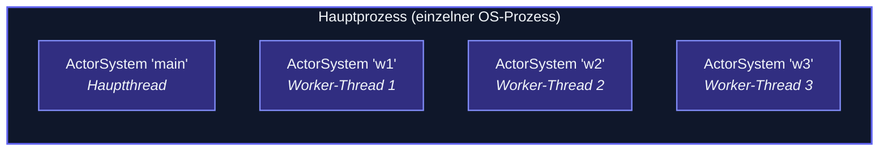

JavaScript ist pro Actor-System Single-Threaded. Für
**Parallelität innerhalb eines einzelnen OS-Prozesses** lässt das
**Worker-Mesh** des Frameworks mehrere `ActorSystem`s laufen —
eines pro Worker-Thread — die alle am selben Cluster über einen
**MessageChannel-Transport** teilnehmen.



Jeder ist aus Sicht des Clusters ein **separater Cluster-Node** —
Gossip + Mitgliedschaft + Sharding gelten alle. Die Kommunikation
zwischen ihnen läuft über In-Process-MessageChannel (keine
Serialisierung zu Bytes, kein TCP).

## Wann verwenden

Zwei Hauptszenarien:

1. **CPU-gebundene Parallelität in einem Prozess** — actor-ts ist
   pro System Single-Threaded; Multi-Threading braucht mehrere
   Systeme. Worker-Mesh verteilt sie.
2. **Isolation innerhalb eines Prozesses** — ein "Worker", der
   ausfällt, reißt das Hauptsystem nicht mit.

Für **Multi-Process**-Parallelität (separate OS-Prozesse) nutze
den regulären Cluster + TCP-Transport. Worker-Mesh ist speziell
für den In-Process-Fall.

## Setup

```ts
// main.ts — Hauptthread
import { Worker } from 'node:worker_threads';
import { ActorSystem, Cluster, ClusterOptions, MessageChannelTransport } from 'actor-ts';

const channel = new MessageChannel();

const w1 = new Worker('./worker.js', {
  workerData: { mainPort: channel.port2 },
  transferList: [channel.port2],
});

const transport = new MessageChannelTransport({
  self:   'main',
  ports: [channel.port1],
});

const system = ActorSystem.create('main');
const clusterOptions = ClusterOptions.create()
  .withHost('main')
  .withPort(0)
  .withSeeds(['main'])
  .withTransport(transport);
await Cluster.join(
  system,
  clusterOptions,
);

// worker.js — läuft im Worker-Thread
import { parentPort, workerData } from 'node:worker_threads';
import { ActorSystem, Cluster, ClusterOptions, MessageChannelTransport } from 'actor-ts';

const transport = new MessageChannelTransport({
  self:  'w1',
  ports: [workerData.mainPort],
});

const system = ActorSystem.create('w1');
const cluster2Options = ClusterOptions.create()
  .withHost('w1')
  .withPort(0)
  .withSeeds(['main'])
  .withTransport(transport);
await Cluster.join(
  system,
  cluster2Options,
);

// Ab hier ist w1 einfach ein weiterer Cluster-Node
```

## Die Mesh-Form

Für **mehrere Worker** braucht jedes Paar einen MessageChannel.
Ein voll vermaschtes Mesh mit 4 Workern braucht 6 Channels
(binomial(4,2)).

Der `MessageChannelTransport` des Frameworks akzeptiert ein
**Array von Ports**:

```ts
new MessageChannelTransport({
  self:  'main',
  ports: [
    portToW1,
    portToW2,
    portToW3,
  ],
});
```

Jeder Port zielt auf einen Peer.

Für größere Meshes ist die **Stern-Topologie** (alle reden mit
main; main leitet weiter) einfacher — nur N-1 Channels nötig.
Aber das macht main zum Flaschenhals.

## Wie es sich vom TCP-Cluster unterscheidet

```
TCP-Transport:                MessageChannelTransport:
- Sockets, Framing            - postMessage zwischen Threads
- Serialisierte Bytes         - Structured Cloning (kein JSON)
- Netzwerklatenz              - Sub-Mikrosekunde
- Cross-Host                  - Nur derselbe Prozess
```

Nachrichten zwischen Worker-Systemen gehen durch **Structured
Clone** — schneller als JSON.stringify + parse und erhalten mehr
Typen (Map, Set, Date etc.).

## Anwendungsfälle

### Sharding über Cores

```ts
// 4-Worker-Mesh; Sharding verteilt Entities über sie:
const startShardingOptions = StartShardingOptions.create()
  .withTypeName('order')
  .withEntityProps(...)
  .withExtractEntityId((message) => message.id)
  .withNumShards(16);
sharding.start(
  startShardingOptions,
);
```

Der Koordinator (auf main) allokiert Shards auf die 4 Worker.
CPU-gebundene Entity-Arbeit parallelisiert über Cores.

### Per-Worker-Isolation

```ts
// Worker, der GPU-gebundene Jobs handhabt:
system.spawn(Props.create(() => new GpuJobActor()), 'gpu-jobs');

// Abstürze in diesem Worker bleiben isoliert von main + anderen Workern
```

Ein abstürzender Worker reißt das Hauptsystem nicht mit —
separate Event-Loops.

## Wann NICHT verwenden

import { Aside } from '@astrojs/starlight/components';

<Aside type="caution" title="Wenn Multi-Process funktioniert, nutze es">
  ```
  Multi-Process-Cluster (TCP-Transport) ist flexibler:
  - Worker können später auf verschiedenen Maschinen sein
  - Verschiedene Runtimes pro Prozess möglich
  - Standardisierte Observability + Deployment-Tools
  ```
  Nutze das Worker-Mesh nur, wenn du speziell In-Process-Parallelität
  brauchst (TCP-Overhead vermeiden, geteilte Prozess-Ressourcen
  etc.).
</Aside>

<Aside type="caution" title="Worker-Komplexität vs. CPU-Parallelität">
  ```
  Die meisten Actor-Workloads sind I/O-gebunden (HTTP, Broker, DB).
  Multi-Threading hilft nicht — das Warten ist der Flaschenhals.
  ```
  Worker-Mesh zahlt sich nur für **CPU-gebundene** Arbeit aus.
  Profilen zuerst; wenn deine Workload I/O-gebunden ist, ist
  Single-Threaded in Ordnung.
</Aside>

<Aside type="caution" title="Gemeinsamer State zwischen Workern">
  ```ts
  // Eine Map zwischen Workern teilen?
  ```
  Worker-Threads haben einen isolierten Heap. State zu teilen
  erfordert die Cluster-Maschinerie (DistributedData, sharded
  Entities) oder Shared-Memory-Primitiven (SharedArrayBuffer).
  Versuche nicht, Objekte direkt zu übergeben.
</Aside>

## Wohin als Nächstes

- **[Cluster-Überblick](/de/cluster/overview/)** — das
  Cluster-Modell, an dem das Worker-Mesh teilnimmt.
- **[Transports](/de/cluster/transports/)** — die
  Transport-Schnittstelle, die MessageChannelTransport
  implementiert.
- **[Sharding](/de/cluster/sharding/overview/)** — der
  Hauptnutzer der Mesh-Parallelität.
