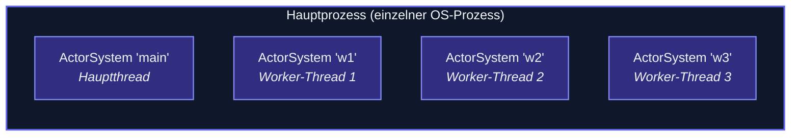

import { Aside } from '@astrojs/starlight/components';

JavaScript ist pro Actor-System Single-Threaded. Für
**Parallelität innerhalb eines einzelnen OS-Prozesses** lässt das
**Worker-Mesh** des Frameworks mehrere `ActorSystem`s laufen —
eines pro Worker-Thread — die alle am selben Cluster über einen
**MessageChannel-Transport** teilnehmen.


```mermaid
flowchart TB
  subgraph PROC["Hauptprozess (einzelner OS-Prozess)"]
    direction TB
    MAIN["ActorSystem 'main'<br/><i>Hauptthread</i>"]
    W1["ActorSystem 'w1'<br/><i>Worker-Thread 1</i>"]
    W2["ActorSystem 'w2'<br/><i>Worker-Thread 2</i>"]
    W3["ActorSystem 'w3'<br/><i>Worker-Thread 3</i>"]
  end
  classDef proc fill:#0f172a,stroke:#6366f1,stroke-width:2px,color:#f1f5f9;
  classDef sys  fill:#312e81,stroke:#818cf8,stroke-width:1.5px,color:#f1f5f9;
  class PROC proc
  class MAIN,W1,W2,W3 sys
```

Jeder ist aus Sicht des Clusters ein **separater Cluster-Node** —
Gossip + Mitgliedschaft + Sharding gelten alle. Die Kommunikation
zwischen ihnen läuft über In-Process-MessageChannel (keine
Serialisierung zu Bytes, kein TCP).

## Wann verwenden

Zwei Hauptszenarien:

1. **CPU-gebundene Parallelität in einem Prozess** — actor-ts ist
   pro System Single-Threaded; Multi-Threading braucht mehrere
   Systeme. Worker-Mesh verteilt sie.
2. **Isolation innerhalb eines Prozesses** — ein Worker, der
   ausfällt, reißt das Hauptsystem nicht mit.  Das gilt für einen
   nicht gefangenen Throw, eine unbehandelte Rejection und ein
   Bootstrap, das sich nicht laden lässt: Das Framework abonniert
   das `error`-Event des Workers, sodass der Fehler bei
   `restartPolicy` landet und nicht auf dem Crash-Pfad des Hosts.
   Siehe [Fehler-Containment](#fehler-containment) dazu, was pro
   Runtime garantiert ist und was nicht.

Für **Multi-Process**-Parallelität (separate OS-Prozesse) nutze
den regulären Cluster + TCP-Transport. Worker-Mesh ist speziell
für den In-Process-Fall.

## Platzierung ohne Code: `actor-ts.parallelism`

Vielleicht brauchst du die API dieser Seite nie.  Mit
`actor-ts.parallelism.workers` größer als null startet `ActorSystem.create`
im Hintergrund ein `WorkerMesh`, und `system.spawn` platziert Actors
darauf — der Anwendungscode ändert sich nicht.  Diese Schicht, ihre
Grenzen und ihre gemessenen Zahlen stehen unter
[Parallelität](/de/fundamentals/parallelism/); was folgt, ist das Mesh
darunter, für den Fall, dass du die Threads selbst steuern willst.  Und
wenn die Arbeit eine *Funktion* ist statt eines Actors — hash das,
komprimiere jenes —, ist ein Mesh das falsche Gewicht:
[`OffloadPool`](/de/fundamentals/blocking-and-cpu-bound-work/) lässt sie
auf einem Worker laufen, ohne Actor-System auf der anderen Seite.

## High-Level-API: `WorkerMesh`

`WorkerMesh` macht den **Main-Thread zum Mitglied** eines Mesh, das es
selbst spawnt.  Es schließt dein `ActorSystem` über einen `MessageChannel`
an einen frischen Cluster an, spawnt N Worker mit einem Bootstrap, das
das Framework mitliefert, und gibt jedem Worker dasselbe Actor-Modul —
sodass die Worker Actors hosten, die du geschrieben hast, der
Main-Thread sie über gewöhnliche `ActorRef`s erreicht und kein
Anwendungscode *in* einem Worker-Skript läuft, das du hättest schreiben
müssen:

```ts
// main.ts — der Main-Thread
import { ActorSystem } from 'actor-ts';
import { WorkerMesh, WorkerMeshOptions } from 'actor-ts/worker';

const system = ActorSystem.create('my-app');
const meshOptions = WorkerMeshOptions.create()
  .withModule(new URL('./actors.js', import.meta.url))
  .withWorkers('auto');
const mesh = await WorkerMesh.start(system, meshOptions);

const encoder = mesh.refFor<EncodeCommand>(mesh.addresses[0], '/user/encoder');
const encoded = await encoder.ask<Encoded>({ kind: 'encode', bytes });

await mesh.terminate();
```

```ts
// actors.ts — von jedem Worker per URL importiert
import { Actor } from 'actor-ts';
import type { WorkerMeshSetupContext } from 'actor-ts/worker';

export class Encoder extends Actor<EncodeCommand> {
  override onReceive(command: EncodeCommand): void { /* CPU-gebundene Arbeit */ }
}

// Optional: läuft einmal pro Worker, sobald sein Node up ist.
export function setup(context: WorkerMeshSetupContext): void {
  context.system.spawn(Encoder, 'encoder');
}
```

Was `start` der Reihe nach tut: Es registriert den eigenen Port des
Main-Threads unter `system.name@main:1` an einem `WorkerBroker`, joint
`system` über ihn in einen Cluster, spawnt die Worker mit dem
mitgelieferten `worker-mesh-bootstrap` und löst auf, sobald jeder Worker
den Handshake abgeschlossen hat **und** jedes Mitglied `up` ist.  Jeder
Worker joint mit dem Main-Thread als Seed, baut sein `ActorSystem` aus
der **effektiven** Konfiguration des Main-Systems — `system.config`,
nicht die Datei, aus der sie kam, sodass ein per Builder auf dem
Main-Thread gesetzter Wert der Wert ist, mit dem die Worker laufen —,
importiert die mit `withModule` benannten Module, registriert jede
exportierte Actor-Klasse unter ihrem **Export-Namen**, führt das `setup`
des Moduls aus, falls es eines hat, und meldet die Registry zurück:
`mesh.workers` listet je Worker Adresse und die Klassen, die er spawnen
kann.  Das Mesh reicht `system.log` sowohl an den Worker-Cluster als
auch an den Broker weiter, den es baut — jede unter [Was das Mesh
meldet](#was-das-mesh-meldet) aufgeführte Zeile erreicht also die Sinks,
in die dein System ohnehin loggt.

| Option | Was |
| --- | --- |
| `withModule(url \| url[])` | Die Actor-Module, die jeder Worker importiert.  **Pflicht**, und nur im Code — bewusst kein Config-Key, siehe unten. |
| `withWorkers(n \| 'auto')` | Worker-Anzahl.  `'auto'` ist die verfügbare Parallelität der Maschine **minus eins** — der Main-Thread ist ein arbeitendes Mitglied —, mindestens 1.  Default `'auto'`. |
| `withMainHostname(host)` / `withWorkerHostname(host)` | Hostname-Komponenten der Adressen beider Seiten.  Defaults `'main'` / `'worker'` — main sortiert vorn, also **führt** main und hostet den Shard-Coordinator.  Ein Worker-Hostname, der vor main sortiert (`'core'`), verschiebt beides auf einen Worker. |
| `withMainPort(port)` / `withBasePort(port)` | Synthetische Port-Komponenten; nichts bindet sie.  Defaults `1` / `2`. |
| `withMainRoles(roles)` / `withWorkerRoles(roles)` | Cluster-Rollen, mit denen jede Seite joint — worauf rollenbeschränkte Singletons, Shards und Router selektieren.  Default keine. |
| `withReadyTimeoutMs(ms)` | Handshake-Frist pro Worker und Membership-Frist für das ganze Mesh.  Default `10000`. |
| `withRestartPolicy(p)` und die `withRestart…`- / `withMaxRestarts`-Knöpfe | Werden an den Worker-Cluster darunter durchgereicht — siehe dessen Tabelle unten. |
| `withBootstrap(url)` | Notausgang für einen Bundler, der das mitgelieferte Bootstrap aus `dist/worker/` verschoben hat.  Default: das mitgelieferte. |
| `withBackend(backend)` | Über dieses `WorkerBackend` spawnen — ein In-Memory-Fake im Test oder ein eigener Adapter für eine Runtime, die die Erkennung nicht kennt.  Ein eigenes implementiert `WorkerBackend`, liefert ein `WorkerLike` (beide aus `actor-ts/worker` exportiert) und deklariert `containsWorkerErrors`; siehe [Eigene Backends](#eigene-backends).  Default: erkannt. |

`refFor(address, path)` liefert eine gewöhnliche `ActorRef`: `tell`,
`ask`, `watch` funktionieren darüber, und der Pfad darf die nackte
`/user/name`-Form haben.  `terminate()` nimmt zuerst die Worker herunter
und verlässt dann den Cluster; ein System, das durch den Coordinated
Shutdown geht, nimmt sein Mesh mit.

<Aside type="note" title="Warum das Actor-Modul kein Config-Key ist">
  `withModule` benennt Code, den die Worker *ausführen*.  Eine Config-Datei
  — `ACTOR_TS_CONFIG`, eine hineingelegte `application.conf` — ist eine
  breitere Angriffsfläche als die Aufrufstelle, und ein Key dort ließe
  etwas anderes als den eigenen Quellcode der Anwendung entscheiden,
  welcher Code auf einem Thread läuft.  Dieselbe Regel hält `bootstrap`
  aus `actor-ts.worker-cluster` heraus.  Alles andere am Mesh *ist*
  konfigurierbar: siehe
  [den Config-Block](#dieselben-knöpfe-aus-einer-config-datei).
</Aside>

<Aside type="caution" title="Eine Nachricht über einen Thread wird geklont">
  Alles, was an einen Worker-Actor geht, läuft durch Structured Clone.
  Eine Plain-Data-Nachricht mit `kind`-Diskriminante kommt intakt an;
  eine Klasseninstanz kommt als nacktes Objekt **ohne Prototyp und ohne
  Methoden** an — still.  Schreibe Worker-gebundene Nachrichten als
  Daten, nicht als Objekte — und behalte den Rückweg im Blick:
  `context.sender` und `replyTo` funktionieren beide über die Grenze.
</Aside>

## Die manuelle Ebene: `WorkerCluster`

`WorkerMesh` baut auf `WorkerCluster` auf — das ist die Ebene für alles,
was in die automatische Form nicht passt: Worker, die *verschiedenen*
Code ausführen, Worker, die gar keine Actors hosten, oder ein Bootstrap,
das du selbst schreiben willst.  Es spawnt einen Worker-Pool aus einem
Entrypoint-Modul, führt den Hello/Init/Ready-Handshake aus, registriert
jeden Worker an einem gemeinsamen `WorkerBroker` und startet abgestürzte
Worker gemäß einer `restartPolicy` neu.  Das zugrunde liegende
Worker-Primitiv wird pro Runtime gewählt — Web Workers auf Bun/Deno,
`node:worker_threads` auf Node —, und der Worker-seitige Helfer
`WorkerNode.join()` spricht, was die Runtime anbietet: die
Web-Worker-Globals oder Nodes `parentPort`.

**Der Main-Thread ist kein Mitglied eines `WorkerCluster`.**  Er leitet
jeden Frame über den Broker weiter und sonst nichts, was drei Folgen hat,
die `WorkerMesh` beseitigt: Der Main-Thread kann keinen Worker-Actor
adressieren, ein `ask` von ihm hat keinen Ort für seine Antwort, und der
Cluster-Leader — und mit ihm der Shard-Coordinator — ist der
niedrigst-adressierte *Worker*.

```ts
// main.ts — Hauptthread
import { WorkerCluster, WorkerClusterOptions } from 'actor-ts/worker';

const workerClusterOptions = WorkerClusterOptions.create()
  .withWorkers(4)
  .withBootstrap(new URL('./worker-node.js', import.meta.url))
  .withSystemName('multi-core')
  .withBasePort(2552);
const cluster = await WorkerCluster.spawn(workerClusterOptions);

console.log(`Spawned ${cluster.size} workers:`);
for (const address of cluster.addresses) console.log('  -', address.toString());

// ...später, beim Shutdown:
await cluster.terminate();
```

Jeder Worker führt das **Bootstrap-Modul** aus.  Es ruft
`WorkerNode.join()` auf, um den Handshake abzuschließen und seine
Adresse, den System-Namen, den Transport und `initData` zu erhalten,
und tritt dann dem Cluster bei wie jeder andere Knoten:

```ts
// worker-node.ts — läuft in jedem Worker
import { ActorSystem } from 'actor-ts';
import { Cluster, ClusterOptions } from 'actor-ts/cluster';
import { WorkerNode } from 'actor-ts/worker';

async function main(): Promise<void> {
  const context = await WorkerNode.join<{ seedAddress?: string }>();
  const system = ActorSystem.create(context.systemName);
  const clusterOptions = ClusterOptions.create()
    .withHost(context.self.host)
    .withPort(context.self.port)
    .withSeeds(context.initData.seedAddress ? [context.initData.seedAddress] : [])
    .withTransport(context.transport);
  await Cluster.join(system, clusterOptions);

  system.spawn(MyActor, 'worker');
  context.ready();   // dem Hauptthread signalisieren, dass der Knoten läuft
}

void main();
```

| Option | Was |
| --- | --- |
| `withBootstrap(url)` | Worker-Entrypoint-Modul.  **Pflicht**, und muss eine `file:`-URL **ohne Host** sein — `new URL('./worker-node.js', import.meta.url)` erzeugt genau das.  Ein `data:`-, `blob:`- oder entfernter Specifier wird abgelehnt, weil er dem Worker-Konstruktor Code von außerhalb des Deployments übergeben würde, und ein Host auf der `file:`-URL ebenso: `file://ein-server/share/worker.js` ist ein UNC-Pfad, das Entrypoint-Modul käme also von jenem Server.  `file://localhost/…` bleibt akzeptiert — diesen Host löscht der URL-Parser, auf allen drei Runtimes. |
| `withWorkers(n \| 'auto')` | Pool-Größe; `'auto'` nutzt die Hardware-Concurrency.  Default `'auto'`. |
| `withSystemName(name)` | `ActorSystem`-Name, den jeder Worker hostet.  Default `'worker-cluster'`. |
| `withHostname(host)` | Hostname-Komponente der Adresse jedes Workers.  Default `'worker'`. |
| `withBasePort(port)` | Port des ersten Workers; jeder weitere inkrementiert.  Default `1`. |
| `withInitData(data)` | Payload, die jedem Worker im `join()`-Context zugestellt wird (`initData`).  Default `null`. |
| `withRestartPolicy(p)` | `'always'` / `'on-failure'` / `'never'`.  Default `'on-failure'`. |
| `withReadyTimeoutMs(ms)` | Handshake-Timeout pro Worker.  Default `10000`. |
| `withRestartMinBackoffMs(ms)` | Wartezeit vor dem ersten Respawn eines abgestürzten Slots.  Default `200`. |
| `withRestartMaxBackoffMs(ms)` | Obergrenze für die Respawn-Wartezeit, die pro Versuch verdoppelt wird.  Default `10000`. |
| `withRestartRandomFactor(f)` | ±-Jitter-Anteil auf jede Respawn-Wartezeit, in `[0, 1]`.  Default `0.2`. |
| `withMaxRestarts(n)` | Restarts pro Slot innerhalb des Fensters, bevor er stillgelegt wird; `-1` für unbegrenzt.  Default `10`. |
| `withRestartWindowMs(ms)` | Gleitendes Fenster, über das das Restart-Budget zählt; `0` setzt es nie zurück.  Default `60000`. |
| `withOnWorkerPermanentlyDown(fn)` | Wird einmal pro Slot aufgerufen, dessen Restart-Budget erschöpft ist.  Default: eine `ERROR`-Zeile über den Logger des Pools. |
| `withBackend(backend)` | Startet über dieses `WorkerBackend` statt über das erkannte — für eine Runtime, die die Erkennung nicht kennt, oder ein In-Memory-Fake im Test.  Ein eigenes implementiert `WorkerBackend`, liefert ein `WorkerLike` (beide aus `actor-ts/worker` exportiert) und deklariert `containsWorkerErrors`; siehe [Eigene Backends](#eigene-backends).  Default: erkannt. |
| `withLogger(logger)` | Wohin der Pool Worker-Exits, Respawns, stillgelegte Slots und — wenn er seinen Broker selbst baut — Broker-Drops meldet; siehe [Was das Mesh meldet](#was-das-mesh-meldet).  Default: ein `ConsoleLogger` auf `Info`. |
| `withBroker(broker)` | Über einen Broker routen, den der Aufrufer besitzt — so, wie `WorkerMesh` zuerst den eigenen Port des Main-Threads darauf legt.  Ein übergebener Broker behält den Logger, mit dem er gebaut wurde.  Default: ein frischer Broker, der über den Logger des Pools meldet. |

Das zurückgegebene `WorkerCluster` bietet `size`, `addresses` (die
`NodeAddress` jedes Workers), den gemeinsamen `broker` und
`terminate()`.  Fehlkonfigurierte Optionen (ein falscher `basePort`,
ein nicht-positives `workers`) werfen `OptionsError` bei `spawn`.

`spawn()` lässt bei einem Fehlschlag keine lebenden Worker zurück: Ein
Worker, dessen Handshake abläuft, wird beendet, bevor die Rejection
weitergegeben wird — und ebenso jedes Geschwister, das erfolgreich
hochgekommen ist, denn die Instanz, die sie besitzt, wird nie
zurückgegeben, sodass sie sonst niemand mehr erreichen könnte.
`terminate()` wartet darauf, dass die Threads tatsächlich verschwinden,
statt nur abzufeuern — innerhalb der unten beschriebenen Schranke.


<Aside type="caution" title="`WorkerNode.join()` in einer async-Funktion aufrufen">
  ```ts
  // ✗ Top-Level-await im Worker-Modul
  const context = await WorkerNode.join();
  ```
  Rufe es aus einer `async function main() { … }` auf, die du
  aufrufst, nicht als Top-Level-`await`.  Auf Bun suspendiert ein
  Top-Level-await im Worker den Modul-Loader, sodass eingehende
  Nachrichten nie dispatchen und der Handshake für immer hängt.
</Aside>

## Dieselben Stellschrauben aus einer Config-Datei

Neun der Optionen aus der Tabelle oben sind zusätzlich
`actor-ts.worker-cluster`-Keys, neben `workers` und `restart-policy`, sodass
ein Deployment das Mesh ohne Rebuild nachjustieren kann:

```hocon
actor-ts.worker-cluster {
  workers               = 4
  system-name           = "ingest"
  hostname              = "ingest-worker"
  base-port             = 100
  ready-timeout         = 30s
  restart-policy        = "on-failure"
  restart-min-backoff   = 500ms
  restart-max-backoff   = 30s
  restart-random-factor = 0.3
  max-restarts          = 20
  restart-window        = 5m
}
```

Das Mesh hat einen eigenen Block für die Felder, die seine eigenen sind —
die Restart-Knöpfe bleiben die des Worker-Clusters, und das Actor-Modul
hat aus dem oben genannten Grund keinen Key:

```hocon
actor-ts.worker-mesh {
  workers         = "auto"    # verfügbare Parallelität minus Main-Thread
  main-hostname   = "main"
  main-port       = 1
  worker-hostname = "worker"  # vor main-hostname sortieren lassen, damit ein Worker führt
  base-port       = 2
  main-roles      = []
  worker-roles    = ["compute"]
}
```

Die Präzedenz ist die im Framework übliche — **explizite Optionen > HOCON >
eingebauter Default**, und zwar pro Feld: `withWorkers(8)` im Code schlägt
`workers = 4` in der Datei, während jedes Feld, das der Aufruf nicht setzt, auf
sie durchfällt.  Die vier Duration-Keys lassen das `Ms`-Suffix ihrer
Builder-Methoden weg und nehmen stattdessen ein Duration-Literal.  `initData`
hat keinen Key, weil es Identität des einzelnen Aufrufs ist, und `backend`
sowie `onWorkerPermanentlyDown`, weil sie lebende Objekte sind, die eine Datei
nicht ausdrücken kann.  `bootstrap` wird bewusst zurückgehalten: Es benennt ein
Modul, das die Runtime *ausführt*, und `ACTOR_TS_CONFIG` oder eine abgelegte
`application.conf` sind eine breitere Angriffsfläche als die Aufrufstelle.

`spawn` ist ein Static ohne `ActorSystem` im Scope und lädt die Config-Kette
daher selbst: dieselbe, die `ActorSystem.create` verwendet, inklusive
`ACTOR_TS_CONFIG` und `./application.conf`.  Ein Wert aus der Datei wird gegen
die gemergten Settings validiert, ein falscher wirft also bei `spawn` genauso
`OptionsError` wie ein falscher im Code.

## Unter der Haube: manuelle Verdrahtung

Das obige `WorkerCluster` übernimmt diese Verdrahtung für dich.  Greife
zum manuellen Weg nur, wenn du volle Kontrolle brauchst — eine eigene
Topologie, einen maßgeschneiderten Handshake oder zusätzliches
Per-Node-Setup.

```ts
// main.ts — Hauptthread
import { Worker } from 'node:worker_threads';
import { ActorSystem } from 'actor-ts';
import { Cluster, ClusterOptions, MessageChannelTransport, NodeAddress } from 'actor-ts/cluster';

const channel = new MessageChannel();

const w1 = new Worker('./worker.js', {
  workerData: { mainPort: channel.port2 },
  transferList: [channel.port2],
});

const mainAddress = new NodeAddress('main', 'main', 0);
const transport = new MessageChannelTransport(mainAddress, channel.port1);

const system = ActorSystem.create('main');
const clusterOptions = ClusterOptions.create()
  .withHost('main')
  .withPort(0)
  .withSeeds(['main'])
  .withTransport(transport);
await Cluster.join(
  system,
  clusterOptions,
);

// worker.js — läuft im Worker-Thread
import { parentPort, workerData } from 'node:worker_threads';
import { ActorSystem } from 'actor-ts';
import { Cluster, ClusterOptions, MessageChannelTransport, NodeAddress } from 'actor-ts/cluster';

const workerAddress = new NodeAddress('w1', 'w1', 0);
const transport = new MessageChannelTransport(workerAddress, workerData.mainPort);

const system = ActorSystem.create('w1');
const cluster2Options = ClusterOptions.create()
  .withHost('w1')
  .withPort(0)
  .withSeeds(['main'])
  .withTransport(transport);
await Cluster.join(
  system,
  cluster2Options,
);

// Ab hier ist w1 einfach ein weiterer Cluster-Node
```

## Die Mesh-Form

Der Transport ist ein **Stern, kein voll vermaschtes Mesh**. Ein
einzelner `WorkerBroker` im Hauptthread ist die Nabe: Er hält
einen `MessagePort` pro Node und leitet jeden Frame an den Node
weiter, den die `to`-Adresse des Envelopes benennt. Der
`MessageChannelTransport` jedes Nodes hält einen **einzelnen
Port** — sein eigenes Ende eines Channels zum Broker, niemals ein
Array:

```ts
import { MessageChannelTransport, NodeAddress } from 'actor-ts/cluster';
import { WorkerBroker } from 'actor-ts/worker';

// Hauptthread: ein Broker ist die Nabe für jeden Node.
const broker = new WorkerBroker();

// Ein MessageChannel pro Worker — der Broker behält das eine Ende und
// der Worker erhält das andere (übertragen via workerData).
const workerAddress = new NodeAddress('w1', 'w1', 0);
const channel = new MessageChannel();
broker.register(workerAddress, channel.port1);

// In diesem Worker hält sein Transport das einzelne ferne Ende:
const transport = new MessageChannelTransport(workerAddress, channel.port2);
```

Also brauchen **N Worker N Channels** (einen pro Worker) — nicht
binomial(N,2). Der Broker leitet jeden Hop weiter, was die
Verdrahtung linear hält, aber den Hauptthread zum Relay für den
gesamten Node-übergreifenden Verkehr macht.

Der Stern ist die gewählte Form, kein erster Entwurf: Direkte
`MessagePort`s von Worker zu Worker stehen auf der Roadmap, abhängig
von einer Messung des eigenen Anteils des Relays am Hop (in einem
Folge-Issue verfolgt), und bis diese Zahl existiert, ist die
Gegenmaßnahme das Dimensionieren — gib `workers` den Actors, die
rechnen, nicht denen, die plaudern.

Ein mit `new WorkerBroker()` gebauter Broker meldet die Frames, die er
verwirft, über einen `ConsoleLogger` auf `Info`;
`new WorkerBroker(system.log)` leitet sie stattdessen durch die Sinks
deines Systems — genau das tut `WorkerMesh` für den Broker, den es baut.

## Wie es sich vom TCP-Cluster unterscheidet

```
TCP-Transport:                MessageChannelTransport:
- Sockets, Framing            - postMessage zwischen Threads
- Serialisierte Bytes         - Structured Cloning (kein JSON)
- Netzwerklatenz              - Zehner-Mikrosekunden pro Hop
- Cross-Host                  - Nur derselbe Prozess
```

Nachrichten zwischen Worker-Systemen gehen durch **Structured
Clone** — schneller, als Text zu rahmen und neu zu parsen.  Er trägt
dieselben reichen Typen (Map, Set, Date …) wie der getaggte
JSON-Tree des TCP-Wire, nur ohne den Text-Round-Trip.  Eine Grenze
bleibt es trotzdem, und neben einem lokalen `tell` keine billige:
gemessen auf dem Actor-Pfad (`benchmarks/worker/mesh-message-cost.ts`,
Bun 1.4, 32 Threads) kostet ein Cross-Thread-`tell` etwa **20 µs**
gegen ~300 ns lokal, ein Cross-Thread-`ask` etwa **180 µs** gegen
~6 µs — Envelope, Ref-Codec, der Relay-Hop des Brokers und zwei Klone.
Dieselben zwei Nodes auf einem Thread zahlen etwa **25 µs** pro `tell`
und **80 µs** pro `ask` — die In-Process-Stufe desselben Benchmarks —,
die Rechnung ist also das Protokoll, nicht der Thread.  Eine
Actor-Nachricht trägt auch keine Transferliste: Ein großer Buffer wird
bei jedem Hop geklont (durch den Stern wäre ein Verschieben bestenfalls
zwei Verschiebungen), verschiebe ihn also einmal über `context.offload`.
Ein Actor, der viele kleine Nachrichten austauscht, zahlt das bei jeder
einzelnen und gewinnt durch den Thread nichts; ein Actor, der pro
Nachricht echte CPU-Arbeit leistet, gewinnt den Kern.  Platziere
entsprechend.

## Anwendungsfälle

### Sharding über Cores

```ts
// 4-Worker-Mesh; Sharding verteilt Entities über sie:
const startShardingOptions = StartShardingOptions.create()
  .withTypeName('order')
  .withEntityActor(...)
  .withExtractEntityId((message) => message.id)
  .withNumShards(16);
sharding.start(
  startShardingOptions,
);
```

Mit `WorkerMesh` führt der Main-Thread per Default und hostet damit den
Koordinator, der die Shards auf die Worker verteilt; rollenbeschränktes
Sharding (`withRole('compute')` gegen `withWorkerRoles(['compute'])`)
hält jede Entity vom Main-Thread fern.  CPU-gebundene Entity-Arbeit
parallelisiert über Cores.  Unter einem bloßen `WorkerCluster` ist der
Main-Thread kein Mitglied, und der Koordinator läuft stattdessen auf dem
niedrigst-adressierten Worker.

### Per-Worker-Isolation

```ts
// Worker, der GPU-gebundene Jobs handhabt:
system.spawn(GpuJobActor, 'gpu-jobs');

// Abstürze in diesem Worker bleiben isoliert von main + anderen Workern
```

Ein abstürzender Worker reißt das Hauptsystem nicht mit —
separate Event-Loops.

## Fehler-Containment

Was "ein ausfallender Worker reißt das Hauptsystem nicht mit"
tatsächlich abdeckt — und was es kostet:

- **Ein nicht gefangener Throw, eine unbehandelte Rejection oder ein
  Bootstrap, das sich nicht laden lässt**, wird abgefangen.  Das
  Framework abonniert das `error`-Event des Workers auf jeder Runtime;
  ohne dieses Abonnement wirft Node den Worker-Fehler erneut im Host
  und Deno rejected eine interne Promise — beide beenden sich mit `1`,
  bevor `restartPolicy` überhaupt gefragt wird.  Das Abonnement ist die
  Hälfte des Frameworks; die andere Hälfte ist der *Adapter*, der es
  einlöst, und das entscheidet sich im Backend, das den Worker gestartet
  hat.  Die beiden mitgelieferten Backends tun es: Der Node-Adapter
  reicht das Abonnement an `worker.on('error')` weiter, und der
  Web-Adapter bricht das native `ErrorEvent` aus dem Listener heraus ab,
  den er installiert — auf Deno hindert ein nackter Listener die Runtime
  nicht am erneuten Werfen.  Ein eigenes Backend muss dasselbe tun und
  sagt, ob es das tut; siehe [Eigene Backends](#eigene-backends).
- **Ein Fehler erzeugt genau einen Respawn.** Node und Bun senden für
  einen einzigen Throw `error` *und danach* das Exit-Event, Deno nur
  `error` — was zuerst eintrifft, treibt den Restart, das andere wird
  verworfen.
- **Respawns warten und haben ein Budget.** Jeder Slot wartet
  `restartMinBackoffMs`, verdoppelt bis `restartMaxBackoffMs` mit
  `restartRandomFactor`-Jitter, und bekommt `maxRestarts` Versuche
  innerhalb von `restartWindowMs`.  Ein Slot, dessen Budget erschöpft
  ist, wird stillgelegt: Für ihn startet kein weiterer Worker, und
  `onWorkerPermanentlyDown` wird einmal mit Index, Adresse und
  Restart-Zahl des Slots aufgerufen.  Ein Ersatz, der nie ready wird,
  zählt gegen dasselbe Budget — ein dauerhaft defektes Bootstrap hört
  also auf, statt zu schleifen.
- **Ein fehlgeschlagener Respawn verkleinert das Mesh um einen
  Worker**, statt den Host zu töten.  `size` sinkt, die Adresse des
  Slots wird beim Broker abgemeldet, und der Fehler wird gemeldet.

Zwei Runtime-Asymmetrien sind erwähnenswert:

<Aside type="caution" title="Deno bestätigt weder Exit noch Shutdown">
  Denos elternseitiger `Worker` sendet überhaupt kein `close`-Event —
  Restarts werden dort ausschließlich von `error` getrieben, und ein
  Worker, der sich *ohne* Throw beendet, bleibt unbemerkt.  Deno sendet
  nach `terminate()` ebenfalls nichts, sodass `terminate()` auf eine
  kurze interne Schranke zurückfällt statt auf eine Bestätigung.  Der
  Thread wird in beiden Fällen beendet; das Framework kann es nur nicht
  beobachten.
</Aside>

### Eigene Backends

`withBackend` nimmt alles, was `WorkerBackend` implementiert — ein
In-Memory-Fake für einen Test oder einen Adapter für eine Runtime, die
die Erkennung nicht kennt.  `spawn(url, options)` liefert ein
`WorkerLike`: die Teilmenge der Web-Worker-Oberfläche, die das Framework
benutzt (`postMessage`, `addEventListener` / `removeEventListener` für
`message`, `close` und `error`, und ein `terminate()`, das auflöst,
sobald der Thread weg ist).  Beide Typen werden aus `actor-ts/worker`
exportiert.

Das eine, was der Compiler an einem solchen Adapter nicht prüfen kann,
ist, ob sein `error`-Abonnement den Fehler des Workers **einfängt**.  Ein
Adapter, der den Handler ablegt und nie verdrahtet, erfüllt den Typ
genauso gut, und von der Elternseite gibt es keine Sonde, die den
Unterschied erkennt — also deklariert das Backend es, und die
Deklaration ist Pflicht:

```ts
import type { WorkerBackend, WorkerLike, WorkerSpawnOptions } from 'actor-ts/worker';

class InMemoryBackend implements WorkerBackend {
  // `true` promises that an `error` listener on the returned worker stops
  // the failure from reaching the host — the per-runtime contract is below.
  readonly containsWorkerErrors = true;

  spawn(url: URL, options?: WorkerSpawnOptions): WorkerLike {
    // Your adapter: the object whose `error` wiring the declaration is about.
    return new InMemoryWorker(url, options?.name);
  }
}
```

Was `true` verspricht, pro Runtime: Auf **Node** wird das Abonnement an
`worker.on('error')` weitergereicht — ein Emitter ohne `error`-Listener
wirft im Host erneut, Exit `1`, und `exit` feuert nie; auf **Deno** ruft
der Listener, den der Adapter installiert, `preventDefault()` auf dem
nativen `ErrorEvent` auf — ein nackter Listener hindert die Runtime
nicht daran, den Fehler als unbehandelte Rejection erneut zu werfen; auf
**Bun** genügt ein weitergereichter Listener.  Ein In-Process-Fake,
dessen `error`-Listener das Einzige sind, was ein simulierter Fehler je
erreicht, ist trivial `true`.  Der Umfang ist das `error`-Event: ein
nicht gefangener Throw, eine unbehandelte Rejection, ein Bootstrap, das
sich nicht laden lässt — nicht `messageerror`.

Deklariere `false`, und das Framework meldet es **einmal pro
Backend-Instanz, vor dem ersten Spawn**, über den Logger des Konsumenten
— `[worker]` für ein Mesh oder einen nackten `WorkerCluster`,
`[offload]` für einen `OffloadPool`, die Konsole für
`ParallelMultiNodeSpec` — und macht weiter: Der Spawn wird nie
verweigert, denn die Deklaration ändert nichts daran, was das Framework
anders tun könnte.  Die Zeile nennt die Backend-Klasse und sagt, was
passieren wird — ein nicht gefangener Throw in einem Worker beendet den
Prozess, statt den Fehler-Handler des Frameworks zu erreichen, und
erreicht damit auch die Restart-Policy nie —, sodass ein Host, der später
so stirbt, eine Zeile hat, die erklärt, warum.

Um ein `true` zu *beweisen*, lass einen Worker abstürzen und überlebe:
Starte über dein Backend ein Bootstrap, das beim Laden wirft, auf Node
und auf Deno, abonniere `error`, und lass das Überleben des Prozesses
selbst die Assertion sein — die Form des mitgelieferten Smoke-Falls
`29-worker-crash-containment`, der dasselbe über sich selbst sagt.
Weniger als das beweist es nicht; die Deklaration ist das, worauf das
Framework reagieren kann.

### Was das Mesh meldet

Jedes der Ereignisse oben erzeugt eine Zeile über den Logger des Pools
— `system.log` in einem `WorkerMesh`, `withLogger` auf einem nackten
`WorkerCluster`, ein `ConsoleLogger` auf `Info`, wenn keins von beiden
gegeben ist.  Alle Zeilen tragen das Präfix `[worker]`, und jede trägt
den Sachverhalt in der Nachricht selbst statt als strukturiertes
Argument, sodass ein Console-Sink und ein Log-Shipper dasselbe sehen:

| Ereignis | Level | Zeile |
| --- | --- | --- |
| Das `error`-Event eines Workers | `ERROR` | `[worker] worker N (addr) failed: <message>` |
| Ein `close`-Event mit einem Code ungleich null, oder ohne Code | `WARN` | `[worker] worker N (addr) exited with code C` / `… exited without an exit code` |
| Ein `close`-Event mit Code 0 | `INFO` | `[worker] worker N (addr) exited with code 0` |
| Die Policy lässt den Slot liegen | `INFO` | `[worker] worker N (addr) is not respawned — restartPolicy 'P'` |
| Ein Restart wird gewährt | `WARN` | `[worker] respawning worker N (addr) in D ms (restart K of M inside W ms)` — `(restart budget unlimited)` unter `maxRestarts: -1` |
| Ein Ersatz wurde nie ready | `ERROR` | `[worker] respawning worker N (addr) failed: <message>` |
| Das Budget ist erschöpft und kein `onWorkerPermanentlyDown` gesetzt | `ERROR` | `[worker] worker N (addr) is permanently down — K restarts inside W ms exhausted its budget` |
| Der Broker weist einen Frame ab | `WARN`; `DEBUG` für ein unbekanntes Ziel | `[worker] broker dropped K frame(s) from <source> — <reason>` |
| Das Backend deklariert `containsWorkerErrors: false` — einmal pro Backend, vor dem ersten Spawn | `ERROR` | `[worker] worker backend <Class> declares containsWorkerErrors=false — an uncaught throw inside a worker will terminate this process instead of reaching the framework's error handler; …` |

Vier Dinge an diesen Zeilen sind wissenswert:

- **Deno meldet nur den Error-Pfad.** Sein elternseitiger `Worker`
  sendet kein `close`, also erscheinen die Exit-Zeilen und die
  "not respawned"-Zeile dort nie — ein Worker, der sich ohne Throw
  beendet, ist für das Log so unsichtbar wie für die Restart-Policy.
- **Bun meldet ein absichtliches `self.close()` als Code 1**, ein
  Worker, der sich selbst herunterfährt, liest sich also als
  `exited with code 1` und wird unter der Default-Policy `'on-failure'`
  neu gestartet.  Die Zeile nennt den Code, den die Runtime geliefert
  hat; sie sagt nie "crashed".
- **Ein Worker, den die Policy liegen lässt, wird gemeldet, nicht
  entfernt.** Die `INFO`-Zeile ist heute alles, was auf diesem Zweig
  passiert: Handle und Broker-Registrierung des Slots werden nicht
  freigegeben, `size` zählt ihn also weiterhin.
- **Broker-Drops werden gefaltet.** Der erste Drop jedes Grundes wird
  sofort gemeldet; spätere werden gezählt und alle 30 Sekunden zu einer
  Zeile pro Grund gefaltet, die den Zähler trägt.  Ein unbekanntes Ziel
  geht auf `DEBUG` hinaus, weil es nach einem Crash die normale Form ist
  — jedes Geschwister gossipt weiter an die tote Adresse, bis der
  Failure Detector konvergiert —, während ein fehlerhafter Umschlag oder
  ein Port, der einen Frame verweigert, irgendwo ein Defekt ist und auf
  `WARN` hinausgeht.  Die Zeile nennt die registrierte Adresse des Ports,
  auf dem der Frame *ankam*, niemals etwas aus dem Frame selbst, und
  `broker.dropped()` liefert die laufenden Zähler pro Grund.

Fehlerhafter Traffic wird verworfen, nicht fatal — und er wird gezählt
und gemeldet, wie die letzte Zeile oben sagt: Der Broker validiert
die Adressen `to` und `from` eines Frames, bevor er ihn weiterleitet —
ein einzelnes fehlerhaftes `postMessage` aus einem Worker wirft also
nicht mehr im Message-Listener des Hosts.  Das `payload` des Frames
validiert der empfangende Transport, nicht der Broker — es durchläuft
dieselben Wire-Prüfungen wie die Frames eines TCP-Peers, ein Frame, der
daran scheitert, erreicht keinen Handler, und ein Handler, der wirft,
wird aufgefangen, statt aus dem Callback des Ports zu entkommen.  Auch
die Absender, die dieser Transport über `peers()` meldet, sind
begrenzt: Ein Channel ohne Broker davor kann diese Liste also nicht
unbegrenzt wachsen lassen.

## Absender-Identität

Der Broker **adressiert jeden Frame auf den Port um, über den er
hereinkam**. Das `from` eines Frames ist die Adresse, unter der dieser
Port registriert wurde — nicht die Adresse, die der sendende Worker
hineingeschrieben hat:

```ts
// Worker 1 sendet einen Frame und behauptet, Worker 2 zu sein …
port1.postMessage({ from: worker2.toJSON(), to: worker3.toJSON(), payload });

// … und der Transport von Worker 3 meldet trotzdem Worker 1 als Absender.
```

Diese Adressen vergibt der Host — `WorkerCluster` erzeugt eine pro
Slot, und bei manueller Verdrahtung übergibst du eine an
`broker.register` —, die Peer-Identität eines empfangenden Nodes
stammt also aus dem Channel und nicht aus dem Payload. Diese Identität
ist es, die sein Failure-Detector gutschreibt, als Absender eines
Envelopes gilt und auf die jede Regel nach dem Muster „darf dieser
Peer das sagen?" schlüsselt. Ohne die Korrektur könnte ein Worker
also ein totes Geschwister lebendig erscheinen lassen und seine
eigenen Nachrichten diesem Geschwister zuschreiben lassen.

Korrigiert wird nur der Slot `system@host:port`. Die optionale
`incarnation`, die eine Adresse tragen kann, wird unverändert
durchgereicht, weil im Cluster noch nichts auf sie schlüsselt.

## Wann NICHT verwenden

<Aside type="caution" title="Wenn Multi-Process funktioniert, nutze es">
  ```
  Multi-Process-Cluster (TCP-Transport) ist flexibler:
  - Worker können später auf verschiedenen Maschinen sein
  - Verschiedene Runtimes pro Prozess möglich
  - Standardisierte Observability + Deployment-Tools
  ```
  Nutze das Worker-Mesh nur, wenn du speziell In-Process-Parallelität
  brauchst (TCP-Overhead vermeiden, geteilte Prozess-Ressourcen
  etc.).
</Aside>

<Aside type="caution" title="Worker-Komplexität vs. CPU-Parallelität">
  ```
  Die meisten Actor-Workloads sind I/O-gebunden (HTTP, Broker, DB).
  Multi-Threading hilft nicht — das Warten ist der Flaschenhals.
  ```
  Worker-Mesh zahlt sich nur für **CPU-gebundene** Arbeit aus.
  Profilen zuerst; wenn deine Workload I/O-gebunden ist, ist
  Single-Threaded in Ordnung.
</Aside>

<Aside type="caution" title="Gemeinsamer State zwischen Workern">
  ```ts
  // Eine Map zwischen Workern teilen?
  ```
  Worker-Threads haben einen isolierten Heap. State zu teilen
  erfordert die Cluster-Maschinerie (DistributedData, sharded
  Entities) oder Shared-Memory-Primitiven (SharedArrayBuffer).
  Versuche nicht, Objekte direkt zu übergeben.
</Aside>

## Wohin als Nächstes

- **[Parallelität](/de/fundamentals/parallelism/)** — Actors auf diesem
  Mesh aus einer Konfigurationszahl, bei unveränderter Anwendung.
- **[Cluster-Überblick](/de/cluster/overview/)** — das
  Cluster-Modell, an dem das Worker-Mesh teilnimmt.
- **[Transports](/de/cluster/transports/)** — die
  Transport-Schnittstelle, die MessageChannelTransport
  implementiert.
- **[Sharding](/de/cluster/sharding/overview/)** — der
  Hauptnutzer der Mesh-Parallelität.
