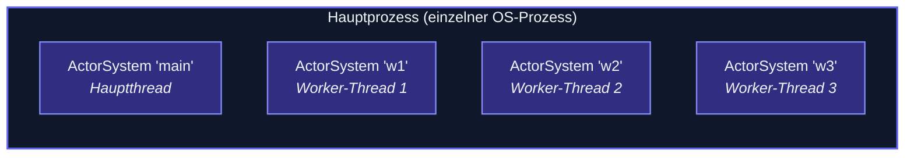

JavaScript ist pro Actor-System Single-Threaded. Für
**Parallelität innerhalb eines einzelnen OS-Prozesses** lässt das
**Worker-Mesh** des Frameworks mehrere `ActorSystem`s laufen —
eines pro Worker-Thread — die alle am selben Cluster über einen
**MessageChannel-Transport** teilnehmen.


```mermaid
flowchart TB
  subgraph PROC["Hauptprozess (einzelner OS-Prozess)"]
    direction TB
    MAIN["ActorSystem 'main'<br/><i>Hauptthread</i>"]
    W1["ActorSystem 'w1'<br/><i>Worker-Thread 1</i>"]
    W2["ActorSystem 'w2'<br/><i>Worker-Thread 2</i>"]
    W3["ActorSystem 'w3'<br/><i>Worker-Thread 3</i>"]
  end
  classDef proc fill:#0f172a,stroke:#6366f1,stroke-width:2px,color:#f1f5f9;
  classDef sys  fill:#312e81,stroke:#818cf8,stroke-width:1.5px,color:#f1f5f9;
  class PROC proc
  class MAIN,W1,W2,W3 sys
```

Jeder ist aus Sicht des Clusters ein **separater Cluster-Node** —
Gossip + Mitgliedschaft + Sharding gelten alle. Die Kommunikation
zwischen ihnen läuft über In-Process-MessageChannel (keine
Serialisierung zu Bytes, kein TCP).

## Wann verwenden

Zwei Hauptszenarien:

1. **CPU-gebundene Parallelität in einem Prozess** — actor-ts ist
   pro System Single-Threaded; Multi-Threading braucht mehrere
   Systeme. Worker-Mesh verteilt sie.
2. **Isolation innerhalb eines Prozesses** — ein "Worker", der
   ausfällt, reißt das Hauptsystem nicht mit.

Für **Multi-Process**-Parallelität (separate OS-Prozesse) nutze
den regulären Cluster + TCP-Transport. Worker-Mesh ist speziell
für den In-Process-Fall.

## High-Level-API: `WorkerCluster`

Broker, Kanäle und den Per-Worker-Handshake von Hand zu verdrahten
(siehe [Unter der Haube](#unter-der-haube-manuelle-verdrahtung) weiter
unten) ist genau das, was `WorkerCluster` automatisiert.  Es spawnt
einen Worker-Pool aus einem Entrypoint-Modul, führt den
Hello/Init/Ready-Handshake aus, registriert jeden Worker an einem
gemeinsamen `WorkerBroker` und startet abgestürzte Worker gemäß einer
`restartPolicy` neu.  Das zugrunde liegende Worker-Primitiv wird pro
Runtime gewählt — Web Workers auf Bun/Deno, `node:worker_threads` auf
Node — sodass derselbe Code überall läuft.

```ts
// main.ts — Hauptthread
import { WorkerCluster, WorkerClusterOptions } from 'actor-ts';

const workerClusterOptions = WorkerClusterOptions.create()
  .withWorkers(4)
  .withBootstrap(new URL('./worker-node.js', import.meta.url))
  .withSystemName('multi-core')
  .withBasePort(2552);
const cluster = await WorkerCluster.spawn(workerClusterOptions);

console.log(`Spawned ${cluster.size} workers:`);
for (const address of cluster.addresses) console.log('  -', address.toString());

// ...später, beim Shutdown:
await cluster.terminate();
```

Jeder Worker führt das **Bootstrap-Modul** aus.  Es ruft
`WorkerNode.join()` auf, um den Handshake abzuschließen und seine
Adresse, den System-Namen, den Transport und `initData` zu erhalten,
und tritt dann dem Cluster bei wie jeder andere Knoten:

```ts
// worker-node.ts — läuft in jedem Worker
import { ActorSystem, Cluster, ClusterOptions, Props, WorkerNode } from 'actor-ts';

async function main(): Promise<void> {
  const context = await WorkerNode.join<{ seedAddress?: string }>();
  const system = ActorSystem.create(context.systemName);
  const clusterOptions = ClusterOptions.create()
    .withHost(context.self.host)
    .withPort(context.self.port)
    .withSeeds(context.initData.seedAddress ? [context.initData.seedAddress] : [])
    .withTransport(context.transport);
  await Cluster.join(system, clusterOptions);

  system.spawn(Props.create(() => new MyActor()), 'worker');
  context.ready();   // dem Hauptthread signalisieren, dass der Knoten läuft
}

void main();
```

| Option | Was |
| --- | --- |
| `withBootstrap(url)` | Worker-Entrypoint-Modul.  **Pflicht.** |
| `withWorkers(n \| 'auto')` | Pool-Größe; `'auto'` nutzt die Hardware-Concurrency.  Default `'auto'`. |
| `withSystemName(name)` | `ActorSystem`-Name, den jeder Worker hostet.  Default `'worker-cluster'`. |
| `withHostname(host)` | Hostname-Komponente der Adresse jedes Workers.  Default `'worker'`. |
| `withBasePort(port)` | Port des ersten Workers; jeder weitere inkrementiert.  Default `1`. |
| `withInitData(data)` | Payload, die jedem Worker im `join()`-Context zugestellt wird (`initData`).  Default `null`. |
| `withRestartPolicy(p)` | `'always'` / `'on-failure'` / `'never'`.  Default `'on-failure'`. |
| `withReadyTimeoutMs(ms)` | Handshake-Timeout pro Worker.  Default `10000`. |
| `withBackend(backend)` | Startet über dieses `WorkerBackend` statt über das erkannte — für eine Runtime, die die Erkennung nicht kennt, oder ein In-Memory-Fake im Test.  Default: erkannt. |

Das zurückgegebene `WorkerCluster` bietet `size`, `addresses` (die
`NodeAddress` jedes Workers), den gemeinsamen `broker` und
`terminate()`.  Fehlkonfigurierte Optionen (ein falscher `basePort`,
ein nicht-positives `workers`) werfen `OptionsError` bei `spawn`.

import { Aside } from '@astrojs/starlight/components';

<Aside type="caution" title="`WorkerNode.join()` in einer async-Funktion aufrufen">
  ```ts
  // ✗ Top-Level-await im Worker-Modul
  const context = await WorkerNode.join();
  ```
  Rufe es aus einer `async function main() { … }` auf, die du
  aufrufst, nicht als Top-Level-`await`.  Auf Bun suspendiert ein
  Top-Level-await im Worker den Modul-Loader, sodass eingehende
  Nachrichten nie dispatchen und der Handshake für immer hängt.
</Aside>

## Unter der Haube: manuelle Verdrahtung

Das obige `WorkerCluster` übernimmt diese Verdrahtung für dich.  Greife
zum manuellen Weg nur, wenn du volle Kontrolle brauchst — eine eigene
Topologie, einen maßgeschneiderten Handshake oder zusätzliches
Per-Node-Setup.

```ts
// main.ts — Hauptthread
import { Worker } from 'node:worker_threads';
import { ActorSystem, Cluster, ClusterOptions, MessageChannelTransport, NodeAddress } from 'actor-ts';

const channel = new MessageChannel();

const w1 = new Worker('./worker.js', {
  workerData: { mainPort: channel.port2 },
  transferList: [channel.port2],
});

const mainAddress = new NodeAddress('main', 'main', 0);
const transport = new MessageChannelTransport(mainAddress, channel.port1);

const system = ActorSystem.create('main');
const clusterOptions = ClusterOptions.create()
  .withHost('main')
  .withPort(0)
  .withSeeds(['main'])
  .withTransport(transport);
await Cluster.join(
  system,
  clusterOptions,
);

// worker.js — läuft im Worker-Thread
import { parentPort, workerData } from 'node:worker_threads';
import { ActorSystem, Cluster, ClusterOptions, MessageChannelTransport, NodeAddress } from 'actor-ts';

const workerAddress = new NodeAddress('w1', 'w1', 0);
const transport = new MessageChannelTransport(workerAddress, workerData.mainPort);

const system = ActorSystem.create('w1');
const cluster2Options = ClusterOptions.create()
  .withHost('w1')
  .withPort(0)
  .withSeeds(['main'])
  .withTransport(transport);
await Cluster.join(
  system,
  cluster2Options,
);

// Ab hier ist w1 einfach ein weiterer Cluster-Node
```

## Die Mesh-Form

Der Transport ist ein **Stern, kein voll vermaschtes Mesh**. Ein
einzelner `WorkerBroker` im Hauptthread ist die Nabe: Er hält
einen `MessagePort` pro Node und leitet jeden Frame an den Node
weiter, den die `to`-Adresse des Envelopes benennt. Der
`MessageChannelTransport` jedes Nodes hält einen **einzelnen
Port** — sein eigenes Ende eines Channels zum Broker, niemals ein
Array:

```ts
import { MessageChannelTransport, NodeAddress, WorkerBroker } from 'actor-ts';

// Hauptthread: ein Broker ist die Nabe für jeden Node.
const broker = new WorkerBroker();

// Ein MessageChannel pro Worker — der Broker behält das eine Ende und
// der Worker erhält das andere (übertragen via workerData).
const workerAddress = new NodeAddress('w1', 'w1', 0);
const channel = new MessageChannel();
broker.register(workerAddress, channel.port1);

// In diesem Worker hält sein Transport das einzelne ferne Ende:
const transport = new MessageChannelTransport(workerAddress, channel.port2);
```

Also brauchen **N Worker N Channels** (einen pro Worker) — nicht
binomial(N,2). Der Broker leitet jeden Hop weiter, was die
Verdrahtung linear hält, aber den Hauptthread zum Relay für den
gesamten Node-übergreifenden Verkehr macht.

## Wie es sich vom TCP-Cluster unterscheidet

```
TCP-Transport:                MessageChannelTransport:
- Sockets, Framing            - postMessage zwischen Threads
- Serialisierte Bytes         - Structured Cloning (kein JSON)
- Netzwerklatenz              - Sub-Mikrosekunde
- Cross-Host                  - Nur derselbe Prozess
```

Nachrichten zwischen Worker-Systemen gehen durch **Structured
Clone** — schneller als JSON.stringify + parse und erhalten mehr
Typen (Map, Set, Date etc.).

## Anwendungsfälle

### Sharding über Cores

```ts
// 4-Worker-Mesh; Sharding verteilt Entities über sie:
const startShardingOptions = StartShardingOptions.create()
  .withTypeName('order')
  .withEntityProps(...)
  .withExtractEntityId((message) => message.id)
  .withNumShards(16);
sharding.start(
  startShardingOptions,
);
```

Der Koordinator (auf main) allokiert Shards auf die 4 Worker.
CPU-gebundene Entity-Arbeit parallelisiert über Cores.

### Per-Worker-Isolation

```ts
// Worker, der GPU-gebundene Jobs handhabt:
system.spawn(Props.create(() => new GpuJobActor()), 'gpu-jobs');

// Abstürze in diesem Worker bleiben isoliert von main + anderen Workern
```

Ein abstürzender Worker reißt das Hauptsystem nicht mit —
separate Event-Loops.

## Wann NICHT verwenden

<Aside type="caution" title="Wenn Multi-Process funktioniert, nutze es">
  ```
  Multi-Process-Cluster (TCP-Transport) ist flexibler:
  - Worker können später auf verschiedenen Maschinen sein
  - Verschiedene Runtimes pro Prozess möglich
  - Standardisierte Observability + Deployment-Tools
  ```
  Nutze das Worker-Mesh nur, wenn du speziell In-Process-Parallelität
  brauchst (TCP-Overhead vermeiden, geteilte Prozess-Ressourcen
  etc.).
</Aside>

<Aside type="caution" title="Worker-Komplexität vs. CPU-Parallelität">
  ```
  Die meisten Actor-Workloads sind I/O-gebunden (HTTP, Broker, DB).
  Multi-Threading hilft nicht — das Warten ist der Flaschenhals.
  ```
  Worker-Mesh zahlt sich nur für **CPU-gebundene** Arbeit aus.
  Profilen zuerst; wenn deine Workload I/O-gebunden ist, ist
  Single-Threaded in Ordnung.
</Aside>

<Aside type="caution" title="Gemeinsamer State zwischen Workern">
  ```ts
  // Eine Map zwischen Workern teilen?
  ```
  Worker-Threads haben einen isolierten Heap. State zu teilen
  erfordert die Cluster-Maschinerie (DistributedData, sharded
  Entities) oder Shared-Memory-Primitiven (SharedArrayBuffer).
  Versuche nicht, Objekte direkt zu übergeben.
</Aside>

## Wohin als Nächstes

- **[Cluster-Überblick](/de/cluster/overview/)** — das
  Cluster-Modell, an dem das Worker-Mesh teilnimmt.
- **[Transports](/de/cluster/transports/)** — die
  Transport-Schnittstelle, die MessageChannelTransport
  implementiert.
- **[Sharding](/de/cluster/sharding/overview/)** — der
  Hauptnutzer der Mesh-Parallelität.
