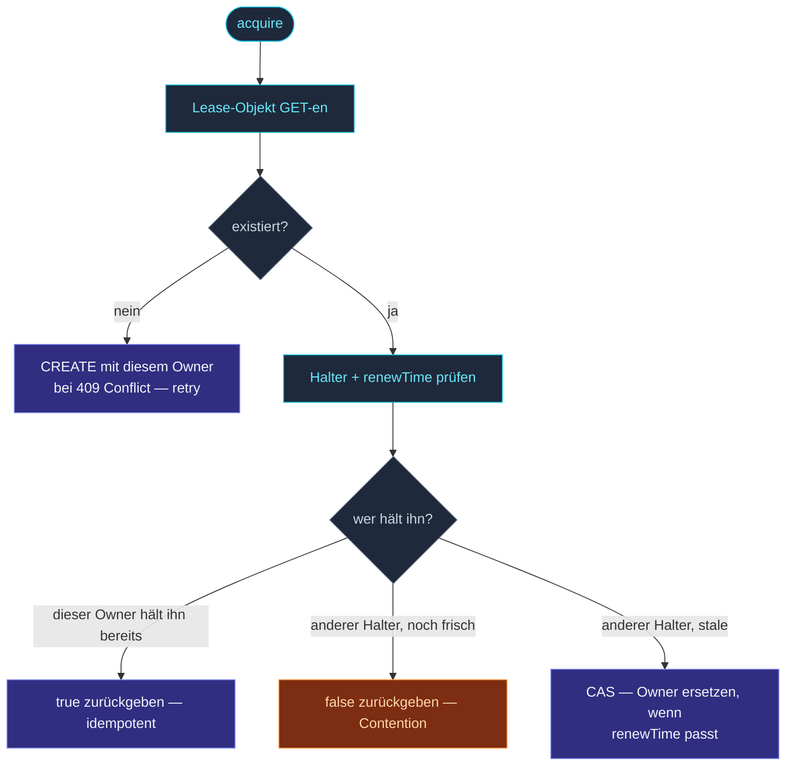

`KubernetesLease` implementiert das
[`Lease`](/de/coordination/lease-api/)-Interface gegen die
eingebaute `Lease`-Ressource von Kubernetes (die
`coordination.k8s.io/v1`-API).  Produktionstauglich: backed
durch etcd, stark konsistent, RBAC-kontrolliert.

```ts
import { KubernetesLease, KubernetesLeaseOptions } from 'actor-ts/coordination';

const kubernetesLeaseOptions = KubernetesLeaseOptions.create()
  .withName('my-singleton-lease')
  .withOwner(process.env.POD_NAME!)
  .withTtlMs(30_000)
  .withRenewalIntervalMs(10_000)
  .withNamespace(process.env.K8S_NAMESPACE!);
const lease = new KubernetesLease(
  kubernetesLeaseOptions,
);
```

Der etcd-backed Store des K8s-API-Servers liefert die
Single-Holder-Garantie.  Zwei Pods, die nebenläufig `acquire()`
aufrufen, produzieren exakt einen Gewinner — unabhängig von
Pod-Scheduling, Netzwerk-Partition zwischen Pods etc.

## Konfiguration

```ts
interface KubernetesLeaseSettings {
  // Aus LeaseSettings:
  name:                  string;
  owner:                 string;
  ttlMs:                 number;
  renewalIntervalMs?:    number;
  acquireRetries?:       number;
  acquireRetryDelayMs?:  number;

  // K8s-spezifisch:
  namespace:             string;
  apiBaseUrl?:           string;     // den In-Cluster-Default überschreiben
  serviceAccountToken?:  string;     // den In-Cluster-Default überschreiben
}
```

| K8s-Feld | Default | Was |
| --- | --- | --- |
| `namespace` | Pflicht | K8s-Namespace, in dem die Lease-Ressource liegt. |
| `apiBaseUrl` | in-cluster | Die URL des K8s-API-Servers — Default `https://kubernetes.default.svc`. |
| `serviceAccountToken` | in-cluster | Das Service-Account-Token des Pods — Default `/var/run/secrets/kubernetes.io/serviceaccount/token`. |

Für Pods, die in-cluster laufen, brauchst du nur `namespace` und
`name` (+ die Standard-`LeaseSettings`-Felder).  Das Framework
liest API-URL und Token von den Standard-Locations.

Für Tests / Dev gegen eine lokale K8s-API (kind, minikube)
überschreibe `apiBaseUrl` + `serviceAccountToken`.

## RBAC

Das ServiceAccount des Pods braucht Rechte, um `Lease`-Ressourcen
zu verwalten:

```yaml
apiVersion: rbac.authorization.k8s.io/v1
kind: Role
metadata:
  name: actor-ts-lease-holder
  namespace: my-app
rules:
  - apiGroups: ["coordination.k8s.io"]
    resources: ["leases"]
    verbs: ["get", "create", "update", "patch", "delete"]
---
apiVersion: rbac.authorization.k8s.io/v1
kind: RoleBinding
metadata:
  name: actor-ts-lease-holder
  namespace: my-app
subjects:
  - kind: ServiceAccount
    name: actor-ts
roleBinding:
  kind: Role
  name: actor-ts-lease-holder
  apiGroup: rbac.authorization.k8s.io
```

Ohne diese rejectet `acquire()` mit 403 (Forbidden).

Ohne `delete` funktioniert `release()`, aber das Lease-Objekt
bleibt nach dem Release stehen (harmlos; das nächste Acquire
nutzt es weiter).

## Was erzeugt wird

Der erste `acquire()`-Aufruf erzeugt ein `Lease`-Objekt:

```bash
$ kubectl get lease -n my-app
NAME                      HOLDER       AGE
my-singleton-lease        pod-abc-1    30s
```

Das Framework schreibt:

- `metadata.name` — den Lease-Namen.
- `spec.holderIdentity` — den Owner.
- `spec.acquireTime` — wann dieser Owner ihn übernommen hat.
- `spec.renewTime` — letztes Renewal (wird alle
  `renewalIntervalMs` aktualisiert).
- `spec.leaseDurationSeconds` — abgeleitet aus `ttlMs`.

Andere Halter prüfen `renewTime + leaseDurationSeconds < now()`,
um zu entscheiden, ob der aktuelle Halter stale ist.

## Acquire-Ablauf



Die Atomarität kommt vom optimistic-concurrency CAS via
`resourceVersion` von K8s — zwei gleichzeitige Versuche, einen
stalen Lease zu beanspruchen, produzieren einen Gewinner.

## Renewal

Während gehalten, patcht das Framework `spec.renewTime` alle
`renewalIntervalMs`:

```
PATCH /apis/coordination.k8s.io/v1/namespaces/<ns>/leases/<name>
{ spec: { renewTime: "2025-05-13T12:00:00.000Z" } }
```

Wenn der Patch fehlschlägt:

- **Transient (5xx, connection refused)** → retry, loggen,
  irgendwann aufgeben, wenn `ttlMs` ohne Erfolg vergeht.
- **CAS-Conflict (409)** → ein anderer Halter hat übernommen;
  `onLost` feuert.

## Verlust-Erkennung

`onLost` feuert, wenn:

- Ein Renewal-Patch einen CAS-Conflict zurückgibt.
- Das Framework feststellt, dass der Lease von jemandem anderem
  modifiziert wurde (ein Probe-GET vor einer kritischen
  Operation).
- Netzwerk-Partition Renewals länger als `ttlMs` verhindert.

Der Handler sollte den eigentumsabhängigen State sofort fallen
lassen — siehe [Lease-API](/de/coordination/lease-api/) für den
Vertrag.

## Kosten

Jeder Lease-Halter erzeugt:

- 1 GET + (potenziell) 1 CREATE beim Acquire.
- 1 PATCH alle `renewalIntervalMs`, solange gehalten.
- 1 PATCH (oder DELETE) beim Release.

Für eine 30-Sekunden-TTL mit 10-Sekunden-Renewal sind das
**~6 API-Calls pro Minute pro Lease**.  Centbeträge in jedem
moderaten K8s-Deployment.

Für Cluster mit vielen Leases (z. B. einer pro Sharded Entity
Type + einer pro Singleton + einer pro Koordinator) ist die
Last auf dem API-Server immer noch vernachlässigbar — K8s
schafft locker tausende Lease-Writes pro Sekunde.

## Wann du es NICHT einsetzt

import { Aside } from '@astrojs/starlight/components';

<Aside type="caution" title="Nicht auf K8s">
  Offensichtlich — aber erwähnenswert.  Für Non-K8s-Deployments
  schreib ein eigenes Lease-Backend (etcd, Consul, deinen
  bestehenden Coordination-Service).  Das Interface ist klein.
</Aside>

<Aside type="caution" title="Verfügbarkeit des API-Servers">
  ```ts
  // Halter ruft acquire() auf, aber der K8s-API-Server ist down
  ```
  Ausfälle des K8s-API-Servers blockieren Lease-Operationen.
  Das Framework retried intern, aber ein anhaltender Ausfall
  verzögert Leadership-Elections.  Für die meisten Setups okay
  — die K8s-API ist üblicherweise zuverlässiger als die Apps,
  die davon abhängen.
</Aside>

<Aside type="caution" title="Token-Rotation">
  ```ts
  serviceAccountToken: 'eyJ...';   // ✗ statisches Token
  ```
  In-Cluster-Tokens werden automatisch rotiert; das via Kubelet
  gemountete Token über den Default-Pfad zu nutzen funktioniert
  nahtlos.  Hartkodierte Tokens laufen ab und müssen manuell
  rotiert werden.
</Aside>

## Tests gegen ein echtes K8s

Für Integrationstests gegen eine echte K8s-API (kind, minikube,
ephemere CI-Cluster):

```ts
const kubernetesLeaseOptions = KubernetesLeaseOptions.create()
  .withName('test-lease-' + crypto.randomUUID())
  .withOwner('test-runner')
  .withTtlMs(5_000)
  .withApiServerUrl('https://localhost:8443')
  .withAuthToken(fs.readFileSync('./test-token', 'utf-8'))
  .withNamespace('test');
const lease = new KubernetesLease(
  kubernetesLeaseOptions,
);

await lease.acquire();
expect(lease.checkAlive()).toBe(true);
await lease.release();
```

Nimm pro Test eindeutige Lease-Namen (Zufalls-UUID-Suffix), damit
parallele Tests sich nicht in die Quere kommen.  Aufräumen mit
`release()` + einer finalen Delete-Runde im Test-Teardown.

## Wohin als Nächstes

- **[Koordination im Überblick](/de/coordination/overview/)** —
  das Gesamtbild.
- **[Lease-API](/de/coordination/lease-api/)** — der Vertrag,
  den `KubernetesLease` implementiert.
- **[InMemoryLease](/de/coordination/in-memory-lease/)** —
  die Dev-/Test-Alternative.
- **[Kubernetes-Deployment](/de/operations/deployment/kubernetes/)** —
  das breitere K8s-Rezept.
- **[Singleton mit Lease](/de/cluster/singleton/with-lease/)** —
  der Haupt-Consumer.
