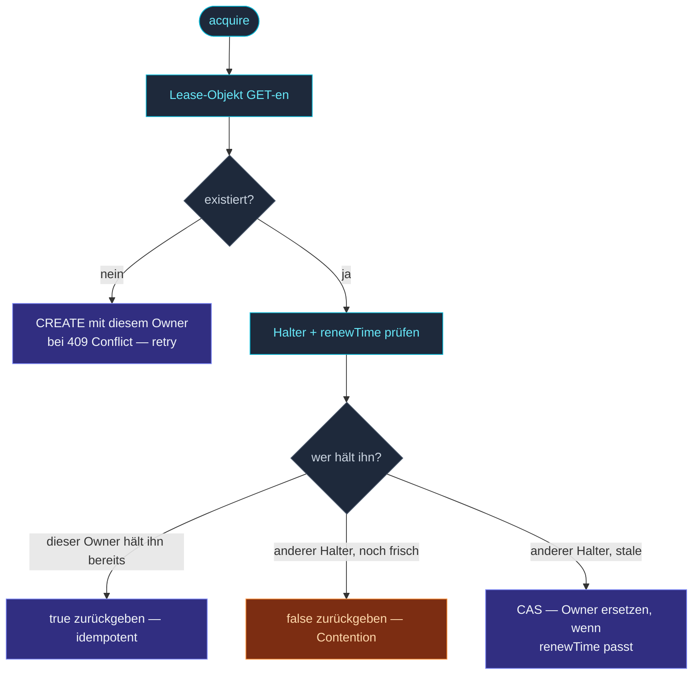

`KubernetesLease` implementiert das
[`Lease`](/de/coordination/lease-api/)-Interface gegen die
eingebaute `Lease`-Ressource von Kubernetes (die
`coordination.k8s.io/v1`-API).  Produktionstauglich: backed
durch etcd, stark konsistent, RBAC-kontrolliert.

```ts
import { KubernetesLease, KubernetesLeaseOptions } from 'actor-ts/coordination';

const kubernetesLeaseOptions = KubernetesLeaseOptions.create()
  .withName('my-singleton-lease')
  .withOwner(process.env.POD_NAME!)
  .withTtlMs(30_000)
  .withRenewalIntervalMs(10_000)
  .withNamespace(process.env.K8S_NAMESPACE!);
const lease = new KubernetesLease(
  kubernetesLeaseOptions,
);
```

Der etcd-backed Store des K8s-API-Servers liefert die
Single-Holder-Garantie.  Zwei Pods, die nebenläufig `acquire()`
aufrufen, produzieren exakt einen Gewinner — unabhängig von
Pod-Scheduling, Netzwerk-Partition zwischen Pods etc.

## Konfiguration

```ts
type KubernetesLeaseOptionsType = {
  // Aus LeaseOptionsType:
  name:                    string;
  owner:                   string;
  ttlMs:                   number;
  renewalIntervalMs?:      number;
  acquireRetries?:         number;
  acquireRetryDelayMs?:    number;

  // K8s-spezifisch:
  namespace?:              string;     // ungesetzt: aus dem Mount gelesen
  namespacePath?:          string;
  tokenPath?:              string;
  caPath?:                 string;
  apiServerUrl?:           string;     // alle drei zusammen, oder keines
  authToken?:              string;     // alle drei zusammen, oder keines
  caCert?:                 string;     // alle drei zusammen, oder keines
  tokenReloadIntervalMs?:  number;
  operationTimeoutMs?:     number;
  leaseNameMaxLength?:     number;
};
```

| K8s-Feld | Default | Was |
| --- | --- | --- |
| `namespace` | aus dem Mount | K8s-Namespace, in dem die Lease-Ressource liegt. Ohne Angabe der, den der ServiceAccount-Mount des Pods meldet. |
| `namespacePath` | `/var/run/…/serviceaccount/namespace` | Datei, aus der der Namespace gelesen wird. |
| `tokenPath` | `/var/run/…/serviceaccount/token` | Datei, aus der das Bearer-Token gelesen wird — ein **Pfad**, nie das Token. |
| `caPath` | `/var/run/…/serviceaccount/ca.crt` | Datei, aus der das CA-Zertifikat für das TLS-Pinning des API-Servers gelesen wird. |
| `apiServerUrl` | in-cluster | Die URL des K8s-API-Servers — ohne Angabe `https://kubernetes.default.svc`. Verlangt `authToken` + `caCert`. |
| `authToken` | in-cluster | Bearer-Token für den API-Server — ohne Angabe aus `tokenPath` gelesen. Verlangt `apiServerUrl` + `caCert`. |
| `caCert` | in-cluster | PEM-kodiertes CA-Zertifikat für das TLS des API-Servers — ohne Angabe aus `caPath` gelesen. Verlangt `apiServerUrl` + `authToken`. |
| `tokenReloadIntervalMs` | `60000` | Wie lange ein vom ServiceAccount-Mount gelesenes Credential wiederverwendet wird, bevor die Token-Datei erneut geprüft wird. Ohne Wirkung auf ein explizit gesetztes `authToken`. |
| `operationTimeoutMs` | `10000` | Obergrenze für einen einzelnen Request an den API-Server. |
| `leaseNameMaxLength` | `253` | Längster Objektname, der unverändert gesendet wird; ein längeres `name` wird deterministisch gekürzt. Siehe unten. |

Für Pods, die in-cluster laufen, brauchst du nur `name` — das Framework liest
API-URL, Token, CA-Zertifikat **und Namespace** von den Standard-Locations.
Setz `namespace` explizit, um ein Lease-Objekt in einem anderen Namespace als
dem des Pods anzusprechen.

Für Tests / Dev gegen eine lokale K8s-API (kind, minikube)
überschreibe `apiServerUrl` + `authToken` + `caCert`.

### Dieselben Einstellungen aus HOCON

Jedes Feld oben außer den drei Credential-*Werten* und den beiden Test-Seams
kann stattdessen aus der Konfiguration kommen, unter
[`actor-ts.coordination`](/de/reference/configuration/#actor-tscoordination):

```hocon
actor-ts.coordination.lease {
  ttl = 30s
  kubernetes {
    namespace         = "actors"
    operation-timeout = 10s
  }
}
```

Explizite Optionen gewinnen weiterhin, dann dieser Block, dann die eingebauten
Defaults.  Das Framework baut keinen `Lease` für dich, deshalb lädt der
Konstruktor die Config-Kette selbst — `ACTOR_TS_CONFIG` und
`./application.conf` werden genauso berücksichtigt wie bei
`ActorSystem.create`.

Es gibt bewusst **keinen Key für `authToken` oder `caCert`**: ein Bearer-Token
gehört nicht in eine Datei, die eingecheckt, geloggt oder im Config-Panel der
DevTools gerendert wird.  `token-path` / `ca-path` / `namespace-path` sind der
vorgesehene Weg, diese Hälfte aus dem Code zu holen — Indirektion auf eine
Datei, nie das Geheimnis selbst — und sie benennen ausschließlich die
In-Cluster-Quelle; einen davon umzubiegen und gleichzeitig ein explizites
`apiServerUrl` zu setzen, wird abgelehnt.

### Die drei Verbindungsfelder sind ein Credential

Sie gelten nur zusammen: entweder alle drei oder keines davon.  Ein
Teilsatz wirft `OptionsError` bei der Konstruktion.

```ts
const partialOptions = KubernetesLeaseOptions.create()
  .withName('my-singleton-lease')
  .withOwner(process.env.POD_NAME!)
  .withTtlMs(30_000)
  .withNamespace('my-app')
  .withApiServerUrl('https://k8s.example.internal');
new KubernetesLease(partialOptions);
// OptionsError: KubernetesLeaseOptions: authToken + caCert must be supplied
// together with apiServerUrl — explicit API-server credentials are
// all-or-nothing
```

Früher fiel jedes Feld für sich auf den In-Cluster-Mount zurück —
eine `apiServerUrl` und sonst nichts anzugeben schickte also das
**eigene ServiceAccount-Token des Pods** an genau diesen Host.  Der
TLS-Pin begrenzte den Schaden — das Ziel musste weiterhin eine Kette
zur Cluster-CA vorweisen —, aber ein Cluster-Credential hat an einer
Adresse, für die es nicht ausgestellt wurde, nichts verloren.

`apiServerUrl` muss `https` verwenden.  Der Client baut ohnehin einen
`node:https`-Request, egal was in der URL steht; eine `http://`-URL
ergab also nie eine Klartext-Verbindung, sondern nur eine
verwirrende.

### Die Lebensdauer eines Credentials hängt von seiner Quelle ab

Die beiden Quellen werden auch *nach* dem Lesen unterschiedlich
behandelt — denn nur eine von beiden kann veralten.

Ein explizit gesetztes `authToken` wird einmal gelesen und für die
Lebensdauer des Prozesses wiederverwendet.  Es gibt nichts, woraus es
neu gelesen werden könnte — es kam aus dem Konstruktor —, ein
Ablaufen ließe es also nur durch sich selbst ersetzen.

Das gemountete ServiceAccount-Token des Pods ist dagegen befristet:
das projizierte Token trägt ein Ablaufdatum, und das Kubelet schreibt
die Datei bei jeder Rotation neu.  Ein gemountetes Credential wird
deshalb höchstens `tokenReloadIntervalMs` lang wiederverwendet;
danach entscheidet die mtime der Token-Datei zwischen einem weiteren
Intervall auf denselben Bytes und einem frischen Read — im
Normalfall kostet das also einen `stat` pro Intervall und Lease statt
drei Datei-Reads.

```ts
const kubernetesLeaseOptions = KubernetesLeaseOptions.create()
  .withName('my-singleton-lease')
  .withOwner(process.env.POD_NAME!)
  .withTtlMs(30_000)
  .withNamespace('my-app')
  .withTokenReloadIntervalMs(30_000);
```

Zusätzlich zum Intervall **invalidiert ein 401 oder 403 vom
API-Server das gecachte Credential**: der Mount wird erneut gelesen
und der Request genau einmal wiederholt, bevor überhaupt etwas als
Lease-Verlust gemeldet wird.  Ein explizites Token wird so nie
wiederholt — es erneut zu schicken würde den Traffic auf einem
ohnehin scheiternden Pfad nur verdoppeln.

Genau das ersetzt das frühere Memoisieren des gemounteten Tokens über
die gesamte Prozesslebensdauer, und dessen Fehlerbild war alles andere
als subtil.  Der erste 401 feuerte `onLost`, `ClusterSingleton`
stoppte das Kind und versuchte alle fünf Sekunden ein Re-Acquire auf
derselben Lease-Instanz — und jeder Versuch schickte dasselbe tote
Bearer-Token erneut.  Der Singleton blieb unten, bis der Pod neu
gestartet wurde; und jedes Replikat, das lange genug lief, steckte im
selben Zustand.

### Lange Namen werden gekürzt, nicht abgelehnt

Der API-Server validiert den Namen eines Lease-Objekts als DNS-1123-Subdomain.
Ein Lease, das nach etwas aus der Anwendung benannt ist — eine Entity-Id, ein
Mandantenschlüssel, ein zusammengesetzter Singleton-Pfad —, kann also länger
werden, als er akzeptiert.  Ein Name jenseits von `leaseNameMaxLength` behält so
viel Kopf, wie hineinpasst, und bekommt einen Hash des **gesamten Originals**:

```ts
// aus 'singleton-<300 Zeichen>' wird 'singleton-xxx…-1f4k9zq'
```

Der Hash ist ein einfacher FNV-1a über den vollständigen Namen, also eine
Funktion des Namens und sonst nichts: zwei Pods müssen aus demselben Lease
denselben Objektnamen ableiten, sonst holte sich jeder seinen eigenen Datensatz
und beide hielten sich für den Halter.  Damit landen auch zwei Namen, die sich
erst hinter dem Schnitt unterscheiden, auf verschiedenen Objekten — was ein
bloßes Abschneiden nicht leisten würde.

Vorher wurde der zu lange Name schlicht gesendet und kam als undurchsichtiger
`K8sLeaseError` aus dem ersten GET zurück — genau in dem Moment, in dem der
Singleton starten wollte.

### Pflichtfelder werden bei der Konstruktion erzwungen

`name`, `owner` und `ttlMs` haben keinen Default.  Der Konstruktor wirft
`OptionsError`, sobald eines davon fehlt — bevor auch nur ein Request den
API-Server erreicht:

```ts
const incompleteOptions = KubernetesLeaseOptions.create()
  .withName('my-singleton-lease')
  .withNamespace('my-app');
new KubernetesLease(incompleteOptions);
// OptionsError: KubernetesLeaseOptions: owner is required
```

Die Prüfung ist nicht kosmetisch.  Ohne `owner` wird das
`Lease`-Objekt ohne `spec.holderIdentity` geschrieben — der
undefinierte Key fällt schlicht aus dem JSON-Body heraus — und ein
Lease ohne Holder liest sich für jeden Pod als frei: jedes
`acquire()` liefert `true`, und die Single-Holder-Garantie ist weg,
ohne dass ein einziger Fehler geloggt würde.  Ein fehlendes `ttlMs`
führt über einen anderen Weg zum selben Ergebnis, denn die daraus
berechnete Ablaufzeit ist `NaN` — und `NaN` liegt nie nach jetzt.

`namespace` wird einen Schritt später geprüft, beim ersten API-Aufruf: ungesetzt
heißt jetzt „lies ihn aus dem ServiceAccount-Mount des Pods", und dieses Lesen
ist asynchron.  Die Prüfung ist nicht verschwunden — sie ist umgezogen:

```ts
// Error: KubernetesLease: no namespace available.  Either set `namespace`
// (in code or as actor-ts.coordination.lease.kubernetes.namespace), or run
// inside a Pod whose ServiceAccount mount carries one.
```

Der Unterschied zu den drei oben ist der entscheidende.  Die drei schalten
ungesetzt die gegenseitige Ausschließung *stillschweigend* ab, der Konstruktor
ist also der einzige Ort, an dem sie auffallen können.  Ein fehlender Namespace
stoppt jeden Request mit dem Fehler oben.

## RBAC

Das ServiceAccount des Pods braucht Rechte, um `Lease`-Ressourcen
zu verwalten:

```yaml
apiVersion: rbac.authorization.k8s.io/v1
kind: Role
metadata:
  name: actor-ts-lease-holder
  namespace: my-app
rules:
  - apiGroups: ["coordination.k8s.io"]
    resources: ["leases"]
    verbs: ["get", "create", "update", "patch", "delete"]
---
apiVersion: rbac.authorization.k8s.io/v1
kind: RoleBinding
metadata:
  name: actor-ts-lease-holder
  namespace: my-app
subjects:
  - kind: ServiceAccount
    name: actor-ts
roleBinding:
  kind: Role
  name: actor-ts-lease-holder
  apiGroup: rbac.authorization.k8s.io
```

Ohne diese rejectet `acquire()` mit 403 (Forbidden).

Ohne `delete` funktioniert `release()`, aber das Lease-Objekt
bleibt nach dem Release stehen (harmlos; das nächste Acquire
nutzt es weiter).

## Was erzeugt wird

Der erste `acquire()`-Aufruf erzeugt ein `Lease`-Objekt:

```bash
$ kubectl get lease -n my-app
NAME                      HOLDER       AGE
my-singleton-lease        pod-abc-1    30s
```

Das Framework schreibt:

- `metadata.name` — den Lease-Namen.
- `spec.holderIdentity` — den Owner.
- `spec.acquireTime` — wann dieser Owner ihn übernommen hat.
- `spec.renewTime` — letztes Renewal (wird alle
  `renewalIntervalMs` aktualisiert).
- `spec.leaseDurationSeconds` — abgeleitet aus `ttlMs`.

Andere Halter prüfen `renewTime + leaseDurationSeconds < now()`,
um zu entscheiden, ob der aktuelle Halter stale ist — aber nie
ungeprüft, denn beide Felder hat genau der Halter geschrieben, über
den sie urteilen sollen:

- `leaseDurationSeconds` zählt höchstens für **4 × das eigene
  `ttlMs`** des Herausforderers.  Der Faktor ist bewusst großzügig
  statt eines harten Clamps auf `ttlMs`: bei einem Rolling Upgrade,
  das die TTL anhebt, würde ein Node mit dem noch kleineren Wert
  sonst einen lebenden Halter für abgelaufen erklären und ihm den
  Lease wegnehmen.
- Eine `renewTime`, die weiter als ein `ttlMs` in der Zukunft liegt,
  ist von einem Halter mit funktionierender Uhr nicht glaubwürdig
  und zählt als **abgelaufen**.  Ihr zu glauben ist genau das, was
  einen einzelnen Write den Lease dauerhaft blockieren lässt.
- Eine fehlende *oder* nicht parsebare `renewTime` zählt als
  **lebend**.  Für einen Record mit Owner, aber ohne brauchbaren
  Zeitstempel ist „irgendwer hält ihn“ die sichere Lesart.

Ein korruptes oder feindliches `Lease`-Objekt kostet damit höchstens
`4 × ttlMs` an Nichtverfügbarkeit, statt den Lease unbegrenzt zu
blockieren.  Konfiguriere auf allen Pods, die um einen Lease
konkurrieren, dasselbe `ttlMs`, dann greift die Toleranz nie.

## Acquire-Ablauf


```mermaid
flowchart TB
  START(["acquire"])
  GET["Lease-Objekt GET-en"]
  EXISTS{"existiert?"}
  CREATE["CREATE mit diesem Owner<br/>bei 409 Conflict — retry"]
  CHECK["Halter + renewTime prüfen"]
  WHO{"wer hält ihn?"}
  SELF["true zurückgeben — idempotent"]
  FRESH["false zurückgeben — Contention"]
  STALE["CAS — Owner ersetzen, wenn<br/>renewTime passt"]
  START --> GET --> EXISTS
  EXISTS -- "nein" --> CREATE
  EXISTS -- "ja" --> CHECK --> WHO
  WHO -- "dieser Owner hält ihn bereits" --> SELF
  WHO -- "anderer Halter, noch frisch" --> FRESH
  WHO -- "anderer Halter, stale" --> STALE
  classDef ok    fill:#312e81,stroke:#818cf8,color:#f1f5f9;
  classDef warn  fill:#7c2d12,stroke:#fb923c,color:#fed7aa;
  classDef step  fill:#1e293b,stroke:#06b6d4,color:#67e8f9;
  classDef branch fill:#1e293b,stroke:#475569,color:#cbd5e1;
  class START,GET,CHECK step
  class SELF,STALE,CREATE ok
  class FRESH warn
  class EXISTS,WHO branch
```

Die Atomarität kommt vom optimistic-concurrency CAS via
`resourceVersion` von K8s — zwei gleichzeitige Versuche, einen
stalen Lease zu beanspruchen, produzieren einen Gewinner.

## Renewal

Während gehalten, `PUT`tet das Framework alle `renewalIntervalMs` das
gesamte `Lease`-Objekt neu — mit hochgesetztem `spec.renewTime`:

```
PUT /apis/coordination.k8s.io/v1/namespaces/<ns>/leases/<name>
{
  metadata: { resourceVersion: "148302", ... },  // für den CAS zurückgeschickt
  spec: { holderIdentity: "pod-abc-1", leaseDurationSeconds: 30,
          renewTime: "2025-05-13T12:00:00.000Z" }
}
```

Der `resourceVersion` aus dem letzten Read macht den Write zu einem
optimistic-concurrency Compare-and-Set — K8s rejectet mit 409, wenn
seither jemand anderes das Objekt modifiziert hat.

**Höchstens ein Renewal-PUT ist jemals unterwegs.**  `renewalIntervalMs`
ist eine Wall-Clock-Taktung, kein Budget pro Request: der Default ist
`ttlMs / 3` — 5 s bei der oben empfohlenen TTL von 15 s — während der
HTTP-Client selbst einen Timeout von 10 s hat, ein einzelner Request
also legitim über zwei Takte laufen kann.  Ein Takt, der einen noch
offenen Request vorfindet, wird **übersprungen**, nicht eingereiht: ein
Renewal trägt nichts, was der nächste nicht auch trägt.  Ohne diesen
Schutz werden beide Writes aus demselben Snapshot gebaut und tragen
denselben `resourceVersion` — der API-Server rejectet dann einen der
*eigenen* Writes des Halters, siehe unten (#761).

Wenn der Write fehlschlägt, gibt das Renewal sofort auf und feuert
`onLost` — es gibt kein Retry-Budget innerhalb der Schleife, mit zwei
Ausnahmen:

- **Transient (5xx, connection refused, Timeout)** → `onLost` feuert.
- **CAS-Conflict (409) oder 404** → das Objekt wird erneut gelesen,
  bevor der Besitz aufgegeben wird: ein 409 sagt nur, dass sich der
  `resourceVersion` bewegt hat, nicht dass jemand anderes den Lease
  übernommen hat.  Was der Re-Read findet, entscheidet:
  - **weg** → jemand hat das Objekt gelöscht; `onLost` feuert.
  - **eine andere `holderIdentity`** → eine echte Übernahme; `onLost`
    feuert.
  - **weiterhin dieser Owner** → nichts wurde verloren.  Der
    `resourceVersion` des Servers wird übernommen, damit der CAS des
    nächsten Takts passt, und die Schleife hält weiter.
- **401 / 403** → abgelehnt wurde das *Credential*, nicht der Lease.
  Bei einem gemounteten ServiceAccount-Token wird der Mount erneut
  gelesen und der PUT genau einmal wiederholt; erst eine zweite
  Ablehnung feuert `onLost`.  Siehe *Die Lebensdauer eines Credentials
  hängt von seiner Quelle ab* weiter oben.

Ein Re-Read, der selbst fehlschlägt, fällt in den transienten Fall und
feuert `onLost`: Besitz, der nicht bestätigt werden kann, darf nicht
angenommen werden.

## Verlust-Erkennung

`onLost` feuert, wenn:

- Ein Renewal-PUT abgelehnt wird **und** der Re-Read eine andere
  `holderIdentity` zeigt — oder gar kein Lease-Objekt mehr.
- Das Framework feststellt, dass der Lease von jemandem anderem
  modifiziert wurde (ein Probe-GET vor einer kritischen
  Operation).
- Netzwerk-Partition Renewals länger als `ttlMs` verhindert.

**Nicht** feuert es bei einem CAS-Conflict, dessen Re-Read weiterhin
diesen Owner nennt.  Dann kollidiert der Halter mit einem seiner
eigenen Writes — ein anderer Controller, der das Objekt anfasst, oder
ein re-`acquire()`, das mit einem Renewal rennt — und der Record gehört
weiterhin uns.

Der Handler sollte den eigentumsabhängigen State sofort fallen
lassen — siehe [Lease-API](/de/coordination/lease-api/) für den
Vertrag.

## Kosten

Jeder Lease-Halter erzeugt:

- 1 GET + (potenziell) 1 CREATE beim Acquire.
- 1 PUT alle `renewalIntervalMs`, solange gehalten — plus 1
  zusätzlicher GET bei dem seltenen Takt, dessen PUT abgelehnt
  wird, um herauszufinden, ob der Lease wirklich verloren ist.
- 1 DELETE beim Release.

Für eine 30-Sekunden-TTL mit 10-Sekunden-Renewal sind das
**~6 API-Calls pro Minute pro Lease**.  Centbeträge in jedem
moderaten K8s-Deployment.

Für Cluster mit vielen Leases (z. B. einer pro Sharded Entity
Type + einer pro Singleton + einer pro Koordinator) ist die
Last auf dem API-Server immer noch vernachlässigbar — K8s
schafft locker tausende Lease-Writes pro Sekunde.

## Wann du es NICHT einsetzt

import { Aside } from '@astrojs/starlight/components';

<Aside type="caution" title="Nicht auf K8s">
  Offensichtlich — aber erwähnenswert.  Für Non-K8s-Deployments
  schreib ein eigenes Lease-Backend (etcd, Consul, deinen
  bestehenden Coordination-Service).  Das Interface ist klein.
</Aside>

<Aside type="caution" title="Verfügbarkeit des API-Servers">
  ```ts
  // Halter ruft acquire() auf, aber der K8s-API-Server ist down
  ```
  Ausfälle des K8s-API-Servers blockieren Lease-Operationen.
  Das Framework retried intern, aber ein anhaltender Ausfall
  verzögert Leadership-Elections.  Für die meisten Setups okay
  — die K8s-API ist üblicherweise zuverlässiger als die Apps,
  die davon abhängen.
</Aside>

<Aside type="caution" title="Token-Rotation">
  ```ts
  authToken: 'eyJ...';   // ✗ statisches Token
  ```
  Das via Kubelet gemountete Token wird alle
  `tokenReloadIntervalMs` neu gelesen — und bei einem 401/403
  sofort —, ein Ablaufen kostet also einen wiederholten Request
  statt des Lease.  Ein hartkodiertes `authToken` bekommt beides
  nicht: es ist von Natur aus statisch, und wenn es abläuft, ist
  der Lease verloren, bis der Prozess mit einem neuen neu
  gestartet wird.
</Aside>

## Tests gegen ein echtes K8s

Für Integrationstests gegen eine echte K8s-API (kind, minikube,
ephemere CI-Cluster):

```ts
import { randomUuid } from 'actor-ts';

const kubernetesLeaseOptions = KubernetesLeaseOptions.create()
  .withName('test-lease-' + randomUuid())
  .withOwner('test-runner')
  .withTtlMs(5_000)
  .withApiServerUrl('https://localhost:8443')
  .withAuthToken(fs.readFileSync('./test-token', 'utf-8'))
  .withCaCert(fs.readFileSync('./test-ca.crt', 'utf-8'))
  .withNamespace('test');
const lease = new KubernetesLease(
  kubernetesLeaseOptions,
);

await lease.acquire();
expect(lease.checkAlive()).toBe(true);
await lease.release();
```

Nimm pro Test eindeutige Lease-Namen (Zufalls-UUID-Suffix), damit
parallele Tests sich nicht in die Quere kommen.  Aufräumen mit
`release()` + einer finalen Delete-Runde im Test-Teardown.

## Wohin als Nächstes

- **[Koordination im Überblick](/de/coordination/overview/)** —
  das Gesamtbild.
- **[Lease-API](/de/coordination/lease-api/)** — der Vertrag,
  den `KubernetesLease` implementiert.
- **[InMemoryLease](/de/coordination/in-memory-lease/)** —
  die Dev-/Test-Alternative.
- **[Kubernetes-Deployment](/de/operations/deployment/kubernetes/)** —
  das breitere K8s-Rezept.
- **[Singleton mit Lease](/de/cluster/singleton/with-lease/)** —
  der Haupt-Consumer.
