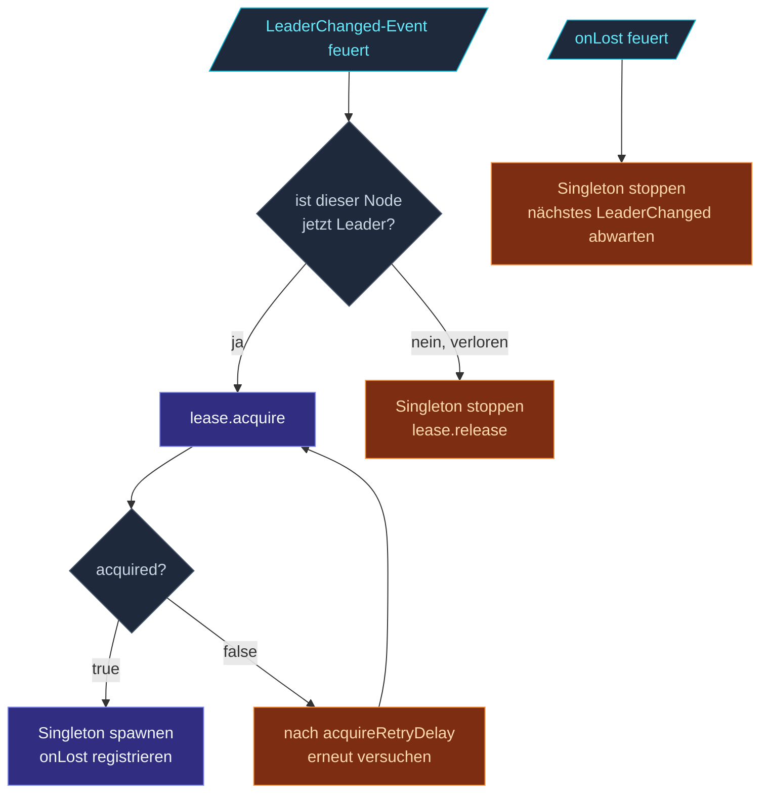

Das `Lease`-Interface ist die Abstraktion des Frameworks für
verteilte Locks.  Implementierungen unterscheiden sich im
Backing Store (in-memory, K8s, etcd); der Vertrag ist identisch.

```ts
interface Lease {
  acquire(): Promise<boolean>;
  release(): Promise<void>;
  checkAlive(): boolean;
  onLost(handler: (reason: string) => void): () => void;
}
```

Drei Methoden, die Arbeit verrichten + eine, die einen Callback
registriert.

## `acquire(): Promise<boolean>`

```ts
const got = await lease.acquire();
if (got) {
  // Wir halten den Lease — fahre mit der Leader-only-Arbeit fort
} else {
  // Jemand anders hat ihn — backoff und später erneut versuchen
}
```

Die Semantik:

- **Resolved mit `true`**, wenn der Lease erfolgreich acquired
  wurde.
- **Resolved mit `false`**, wenn ein anderer Halter den Lease
  besitzt.
- **Rejected** bei transienten Fehlern (Netzwerk, Backend nicht
  verfügbar).

Implementierungen retryen typischerweise intern bis zu
`acquireRetries`-mal, bevor sie mit `false` resolven.  Ein
`false`-Ergebnis heißt "ein anderer Halter hat ihn definitiv";
ein Reject heißt "ich weiß es nicht".

`acquire()` ist idempotent **wenn dieser Caller den Lease bereits
hält** — `acquire()` zweimal hintereinander vom selben Owner
aufzurufen, gibt beide Male `true` zurück.

## `release(): Promise<void>`

```ts
await lease.release();
```

Eigentum freiwillig abgeben.  Aufruf ohne gehaltenen Lease ist
ein No-op — kein Fehler.  Resolved, sobald das Backend das
Release bestätigt hat.

Das Framework ruft `release()`:

- Wenn der Singleton Manager aufhört, Leader zu sein (graceful
  Übergabe an einen anderen Node).
- Wenn das Actor System via
  [Coordinated Shutdown](/de/fundamentals/coordinated-shutdown/)
  herunterfährt.

Für den **nicht-grazilen Fall** — Prozess-Crash — übernimmt die
TTL des Backends die automatische Bereinigung; es wird kein
`release` gesendet.

## `checkAlive(): boolean`

```ts
if (lease.checkAlive()) {
  // Wir halten den Lease noch — fahre fort
}
```

Ein **synchroner, lokaler** Check.  Kein Netzwerk-Roundtrip.
Gibt den jüngsten Wissensstand des Halters zurück: "Halte ich
das noch?"

Vom Framework genutzt, um eigentumsabhängige Arbeit zu gaten —
z. B. ruft der Koordinator vor dem Vergeben einer Shard-Allocation
`checkAlive()` und bricht ab, wenn `false` zurückkommt.

Implementierungen tracken Eigentum lokal; die Renewal-Schleife
des Backends aktualisiert das lokale Flag.  Das heißt,
`checkAlive()` spiegelt **bis zu einem verpassten Renewal an
Veraltung** wider — ein Sub-Sekunden-Fenster, in dem der Lease
tatsächlich weg sein könnte, `checkAlive()` aber noch `true`
liefert.

Für absolute Gewissheit nimm `onLost(...)` und reagiere auf die
Benachrichtigung, statt zu pollen.

## `onLost(handler): () => void`

```ts
const unsubscribe = lease.onLost((reason) => {
  console.log(`Lease verloren: ${reason}`);
  // Leader-only-Arbeit sofort stoppen
});

// Später: unsubscribe();
```

Registriere einen Callback, der feuert, wenn das Eigentum
**unerwartet** verloren geht:

- Das Backend hat gemeldet, der Lease wurde von einem anderen
  Halter übernommen.
- Die TTL ist ohne erfolgreiches Renewal abgelaufen (z. B.
  Netzwerk-Partition).
- Das Backend selbst hat eine Zustands-Inkonsistenz gemeldet.

`onLost` feuert **einmal pro Verlust**.  Danach gibt
`checkAlive()` `false` zurück, und `acquire()` ist nötig, um das
Eigentum zurückzugewinnen.

Der Handler sollte **State, der vom Eigentum abhängt, sofort
fallen lassen** — Arbeit stoppen, Locks freigeben, interessierte
Actors benachrichtigen.  Warte nicht auf teure Operationen; der
Lease ist weg, und jeder andere Halter handelt vielleicht schon.

Gibt eine Unsubscribe-Funktion zurück — aufrufen, um den
Handler zu entfernen, wenn du ihn nicht mehr brauchst.

## Wie das Framework jede Methode nutzt

Für einen Singleton mit Lease:



Gleiches Muster für den Sharding-Koordinator:

1. **`lease.acquire`** vor Verarbeitung von Allocation-Anfragen.
2. **`lease.checkAlive`** vor dem Vergeben jeder Allocation.
3. **`onLost`** → ausstehende Allocations ablehnen, Koordinator
   stoppen.

## Ein eigenes Backend schreiben

```ts
import type { Lease, LeaseOptionsType } from 'actor-ts';

class EtcdLease implements Lease {
  private alive = false;
  private onLostHandlers = new Set<(reason: string) => void>();
  private renewTimer: NodeJS.Timeout | null = null;

  constructor(private readonly settings: LeaseOptionsType & { /* etcd-spezifisch */ }) {}

  async acquire(): Promise<boolean> {
    // Versuche, den etcd-Key atomar von leer auf diesen Owner zu CAS-en.
    // Starte bei Erfolg einen Renewal-Timer.
    // ...
  }

  async release(): Promise<void> {
    // Renewal-Timer stoppen.
    // Den etcd-Key von diesem Owner auf leer CAS-en.
    // ...
  }

  checkAlive(): boolean {
    return this.alive;
  }

  onLost(handler: (reason: string) => void): () => void {
    this.onLostHandlers.add(handler);
    return () => this.onLostHandlers.delete(handler);
  }

  private fireOnLost(reason: string): void {
    this.alive = false;
    for (const h of this.onLostHandlers) {
      try { h(reason); } catch { /* schlucken */ }
    }
  }
}
```

Drei Dinge, die jedes Backend richtig hinkriegen muss:

1. **Atomarität bei `acquire`** — zwei nebenläufige `acquire()`-Aufrufe
   verschiedener Owner müssen genau einen Gewinner produzieren.
   Das Konsistenzmodell des Backends muss das liefern (CAS,
   Paxos, Raft-backed).
2. **Periodisches Renewal** — den Lease im Backend am Leben
   halten.  Konfigurierbares Intervall, typischerweise `ttl / 3`.
3. **`onLost`-Genauigkeit** — feuern, wenn das Eigentum
   tatsächlich übergeht, inklusive des TTL-Ablauf-Falls.

Teste die Implementierung gegen:

- Zwei nebenläufige Acquires von verschiedenen Ownern.
- Netzwerk-Partition, bei der beide Seiten zu renewen versuchen.
- Halter-Crash + neues Acquire nach TTL.
- Halter-Prozess-Pause (z. B. GC-Stall) länger als die TTL.

import { Aside } from '@astrojs/starlight/components';

<Aside type="caution" title="`checkAlive` ist approximativ">
  ```ts
  if (lease.checkAlive()) {
    await doWork();   // könnte direkt nachdem der Lease verloren ging fertig werden
  }
  ```
  Nutze `checkAlive`, um Arbeit zu **gaten**, nicht als Beweis
  des Eigentums.  Für unwiderrufliche Aktionen (Commit zu einem
  externen Service) auch einen Backend-Roundtrip nehmen
  (Acquire-bereits-gehalten ist schnell) oder auf `onLost`
  vertrauen, um neue Arbeit zu stoppen.
</Aside>

<Aside type="caution" title="Nicht durch die TTL schlafen">
  ```ts
  // GC-Pause länger als ttlMs? Lease still verloren.
  ```
  TTL-basierte Leases können nicht zwischen "Halter abgestürzt"
  und "Halter pausiert" unterscheiden.  Wenn dein Prozess länger
  als die TTL pausieren kann (große GC, suspendierte VM), setz
  die TTL länger als deine Worst-Case-Pause.
</Aside>

<Aside type="caution" title="`release` nach `onLost` ist harmlos">
  ```ts
  // Wir haben onLost bekommen; jetzt rufen wir auch release().
  ```
  `release()` ist No-op, wenn der Lease nicht gehalten wird.  Es
  defensiv nach `onLost` aufzurufen ist okay.
</Aside>

## Wohin als Nächstes

- **[Koordination im Überblick](/de/coordination/overview/)** —
  das Gesamtbild.
- **[InMemoryLease](/de/coordination/in-memory-lease/)** —
  die Dev-/Test-Referenz-Implementierung.
- **[KubernetesLease](/de/coordination/kubernetes-lease/)** —
  das Produktions-K8s-Backend.
- **[Singleton mit Lease](/de/cluster/singleton/with-lease/)** —
  der Haupt-Consumer.

Die [`Lease`](/api/interfaces/lease/)-API-Referenz deckt den
vollständigen Vertrag ab.
