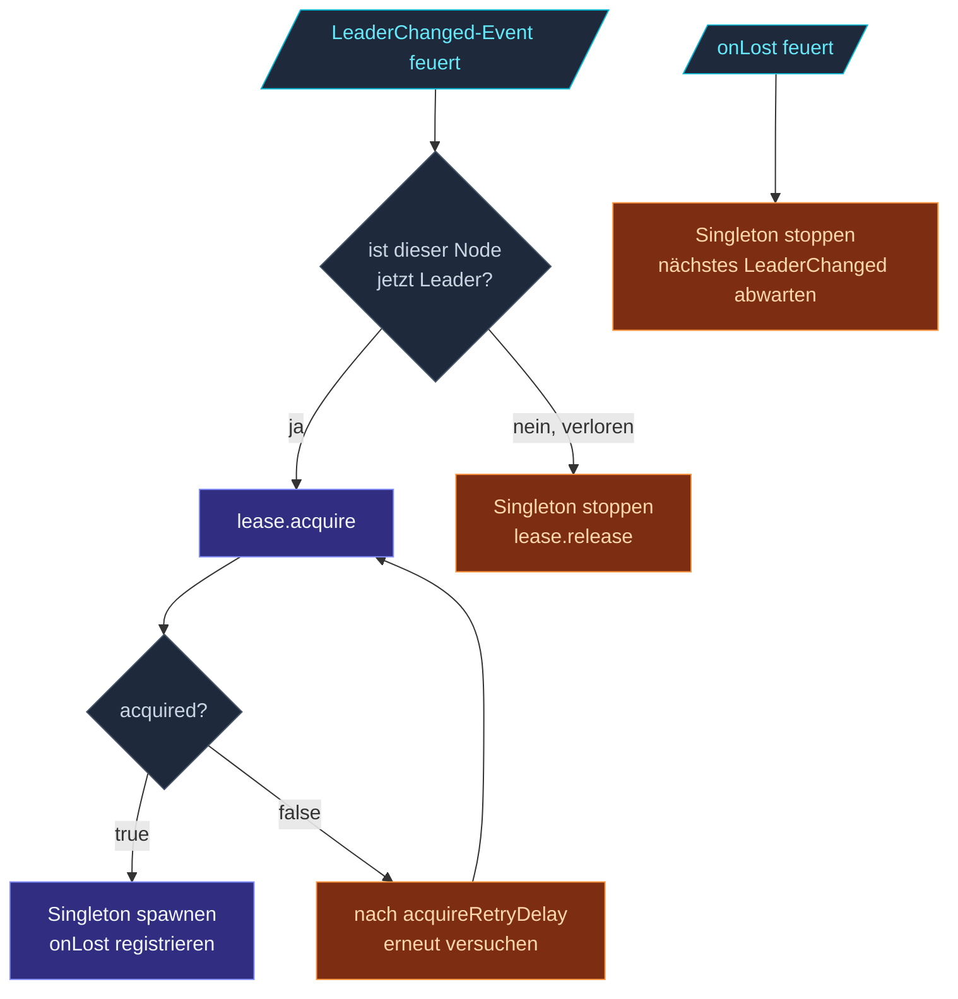

Das `Lease`-Interface ist die Abstraktion des Frameworks für
verteilte Locks.  Implementierungen unterscheiden sich im
Backing Store (in-memory, K8s, etcd); der Vertrag ist identisch.

```ts
interface Lease {
  acquire(): Promise<boolean>;
  acquireWithToken?(): Promise<{ readonly token: string } | null>;
  release(): Promise<void>;
  checkAlive(): boolean;
  onLost(handler: (reason: string) => void): () => void;
}
```

Drei Methoden, die Arbeit verrichten + eine, die einen Callback
registriert.  `acquireWithToken` ist eine optionale fünfte Methode
(mit `?` markiert) — Backends implementieren sie nur, wenn sie
Fencing-Tokens unterstützen.

## `acquire(): Promise<boolean>`

```ts
const got = await lease.acquire();
if (got) {
  // Wir halten den Lease — fahre mit der Leader-only-Arbeit fort
} else {
  // Jemand anders hat ihn — backoff und später erneut versuchen
}
```

Die Semantik:

- **Resolved mit `true`**, wenn der Lease erfolgreich acquired
  wurde.
- **Resolved mit `false`**, wenn ein anderer Halter den Lease
  besitzt.
- **Rejected** bei transienten Fehlern (Netzwerk, Backend nicht
  verfügbar).

Implementierungen retryen typischerweise intern bis zu
`acquireRetries`-mal, bevor sie mit `false` resolven.  Ein
`false`-Ergebnis heißt "ein anderer Halter hat ihn definitiv";
ein Reject heißt "ich weiß es nicht".

`acquire()` ist idempotent **wenn dieser Caller den Lease bereits
hält** — `acquire()` zweimal hintereinander vom selben Owner
aufzurufen, gibt beide Male `true` zurück.

## `acquireWithToken?(): Promise<{ readonly token: string } | null>`

Eine **optionale** Variante von `acquire()`, die bei Erfolg
zusätzlich ein vom Backend ausgestelltes **Fencing-Token**
zurückgibt:

```ts
if (typeof lease.acquireWithToken === 'function') {
  const result = await lease.acquireWithToken();
  if (result) {
    // Acquired — `result.token` ist das Fencing-Token
  }
} else {
  const got = await lease.acquire();   // kein Fencing-Support — Fallback
  // ...
}
```

- **Resolved mit `{ token }`** bei Erfolg — das semantische
  Äquivalent dazu, dass `acquire()` `true` zurückgibt, plus ein
  opakes Token.
- **Resolved mit `null`** bei Contention — äquivalent dazu, dass
  `acquire()` `false` zurückgibt.

Ein Fencing-Token erlaubt es einem externen Beobachter, zwei
Acquires gegen denselben Lease zu ordnen.  Es stützt sich auf das
eigene Optimistic-Concurrency-Primitiv des Koordinations-Service —
Kubernetes `resourceVersion`, Redis `SETNX` mit Zähler, etcd
`revision`.  Tokens sind **opake Strings**, exakt-string
verglichen.

Da die Methode optional ist, **feature-detecten** Consumer sie und
fallen auf einfaches `acquire()` zurück, wenn sie fehlt — genau das
macht die [`LeaseMajority`](/de/cluster/downing-strategies/)-Split-Brain-Strategie.
Sowohl `InMemoryLease` als auch `KubernetesLease` implementieren
sie.

## `release(): Promise<void>`

```ts
await lease.release();
```

Eigentum freiwillig abgeben.  Aufruf ohne gehaltenen Lease ist
ein No-op — kein Fehler.  Resolved, sobald das Backend das
Release bestätigt hat.

**Es rejected, wenn das Backend nicht erreicht werden konnte.**
Ein fehlgeschlagenes `release()` lässt den Record auf dem Server
beansprucht zurück, während dieser Prozess ihn lokal bereits
abgegeben hat — der Halter weiß dann nicht mehr, ob ihm der Lease
gehört, und das ist eine Information, die man braucht.  Backends
müssen den Fehler durchreichen statt ihn zu schlucken; Aufrufer,
die `release()` nur als Cleanup nutzen, kapseln ihn:

```ts
await lease.release().catch(() => { /* best-effort cleanup */ });
```

Alles, was das Framework intern tut, ist bereits so gekapselt.
Der eine Aufrufer, der auf das Reject reagiert, ist
[`LeaseMajority`](/de/cluster/downing-strategies/) — die Strategie
geht in den Fail-safe und beansprucht keine Mehrheit mehr, bis die
Partition heilt.

Das Framework ruft `release()`:

- Wenn der Singleton Manager aufhört, Leader zu sein (graceful
  Übergabe an einen anderen Node).
- Wenn das Actor System via
  [Coordinated Shutdown](/de/fundamentals/coordinated-shutdown/)
  herunterfährt.

Für den **nicht-grazilen Fall** — Prozess-Crash — übernimmt die
TTL des Backends die automatische Bereinigung; es wird kein
`release` gesendet.

Die Kehrseite des No-ops: `release()` tut nichts, solange ein
`acquire()` noch unterwegs ist, denn Eigentum beginnt erst, wenn
dieses Acquire resolved.  Ein Acquire, auf das man nicht mehr
wartet, lässt sich also erst rückgängig machen, wenn es sich
zurückmeldet.

## `checkAlive(): boolean`

```ts
if (lease.checkAlive()) {
  // Wir halten den Lease noch — fahre fort
}
```

Ein **synchroner, lokaler** Check.  Kein Netzwerk-Roundtrip.
Gibt `true` zurück, solange dieser Prozess den Lease hält **und**
seine TTL nicht abgelaufen ist — gemessen ab dem Zeitpunkt, zu dem
der letzte vom Backend akzeptierte Write *gesendet* wurde.  So
liegt die lokale Deadline nie später als die, nach der andere
Halter den Record beurteilen.

Die Antwort stützt sich auf diese Deadline, nicht auf ein Flag.
Ein Flag wird nur von einem Renewal gelöscht, das den Verlust
bemerkt, und eine blockierte Event-Loop — eine GC-Pause, ein
ausgehungerter Container — ist genau das, was dieses Renewal am
Laufen hindert, während ein anderer Halter den Lease in der
Zwischenzeit legitim übernehmen kann.  Deshalb wird
`checkAlive()` an der Deadline selbst `false`, bevor `onLost`
überhaupt feuern konnte (#937).

`LeaseMajority` prüft damit einen gewonnenen Schiedsspruch erneut,
bevor es wieder darauf handelt.  Singleton Manager,
Sharding-Koordinator und Persistence-Fencing reagieren
stattdessen auf `onLost`.

Um Arbeit in dem Moment zu stoppen, in dem das Eigentum weg ist,
registriere `onLost(...)`, statt zu pollen.

## `onLost(handler): () => void`

```ts
const unsubscribe = lease.onLost((reason) => {
  console.log(`Lease verloren: ${reason}`);
  // Leader-only-Arbeit sofort stoppen
});

// Später: unsubscribe();
```

Registriere einen Callback, der feuert, wenn das Eigentum
**unerwartet** verloren geht:

- Das Backend hat gemeldet, der Lease wurde von einem anderen
  Halter übernommen.
- Die TTL ist ohne erfolgreiches Renewal abgelaufen (z. B.
  Netzwerk-Partition oder eine blockierte Event-Loop).  Der erste
  Renewal-Tick nach der Deadline meldet das und gibt den Lease
  auf, statt den abgelaufenen Record zu verlängern — ein anderer
  Halter hat ihn womöglich schon.
- Das Backend selbst hat eine Zustands-Inkonsistenz gemeldet.

`onLost` feuert **einmal pro Verlust**.  Bis dahin gibt
`checkAlive()` bereits `false` zurück — bei abgelaufener TTL ab
der Deadline —, und `acquire()` ist nötig, um das Eigentum
zurückzugewinnen.

Der Handler sollte **State, der vom Eigentum abhängt, sofort
fallen lassen** — Arbeit stoppen, Locks freigeben, interessierte
Actors benachrichtigen.  Warte nicht auf teure Operationen; der
Lease ist weg, und jeder andere Halter handelt vielleicht schon.

Gibt eine Unsubscribe-Funktion zurück — aufrufen, um den
Handler zu entfernen, wenn du ihn nicht mehr brauchst.

## Wie das Framework jede Methode nutzt

Für einen Singleton mit Lease:


```mermaid
flowchart TB
  EVT[/"LeaderChanged-Event feuert"/]
  LEADER{"ist dieser Node<br/>jetzt Leader?"}
  ACQ["lease.acquire"]
  GOT{"acquired?"}
  SPAWN["Singleton spawnen<br/>onLost registrieren"]
  RETRY["nach acquireRetryDelay<br/>erneut versuchen"]
  STOP["Singleton stoppen<br/>lease.release"]
  LOST[/"onLost feuert"/]
  REACT["Singleton stoppen<br/>nächstes LeaderChanged abwarten"]
  EVT --> LEADER
  LEADER -- "ja" --> ACQ --> GOT
  GOT -- "true" --> SPAWN
  GOT -- "false" --> RETRY
  RETRY --> ACQ
  LEADER -- "nein, verloren" --> STOP
  LOST --> REACT
  classDef evt   fill:#1e293b,stroke:#06b6d4,color:#67e8f9;
  classDef ok    fill:#312e81,stroke:#818cf8,color:#f1f5f9;
  classDef warn  fill:#7c2d12,stroke:#fb923c,color:#fed7aa;
  classDef step  fill:#1e293b,stroke:#475569,color:#cbd5e1;
  class EVT,LOST evt
  class SPAWN,ACQ ok
  class RETRY,STOP,REACT warn
  class LEADER,GOT step
```

Gleiches Muster für den Sharding-Koordinator:

1. **`lease.acquire`** vor Verarbeitung von Allocation-Anfragen.
2. **Der eigene Lease-Zustand** gated jede Allocation: Der
   Koordinator handelt nur, solange er den Lease hält, und `onLost`
   ist das, was diesen Zustand löscht.
3. **`onLost`** → zurücktreten: laufende Rebalances abbrechen,
   ausstehende Anfragen verwerfen, dann erneut acquiren, solange
   er noch Leader ist.

## Ein eigenes Backend schreiben

```ts
import type { Lease, LeaseOptionsType } from 'actor-ts/coordination';

class EtcdLease implements Lease {
  private held = false;
  /** Wann der letzte von etcd akzeptierte Write gesendet wurde, plus TTL. */
  private expiresAt = 0;
  private onLostHandlers = new Set<(reason: string) => void>();
  private renewTimer: NodeJS.Timeout | null = null;

  constructor(private readonly settings: LeaseOptionsType & { /* etcd-spezifisch */ }) {}

  async acquire(): Promise<boolean> {
    // Uhr lesen, dann versuchen, den etcd-Key atomar von leer auf
    // diesen Owner zu CAS-en.  Bei Erfolg: held = true,
    // expiresAt = dieser Messwert + ttlMs, Renewal-Timer starten.
    // ...
  }

  async release(): Promise<void> {
    // Renewal-Timer stoppen.
    // Den etcd-Key von diesem Owner auf leer CAS-en.
    // ...
  }

  checkAlive(): boolean {
    // Nie das Flag allein: Eine blockierte Event-Loop hält genau
    // das Renewal auf, das es löschen würde, während ein anderer
    // Owner den Key übernimmt.
    return this.held && Date.now() < this.expiresAt;
  }

  onLost(handler: (reason: string) => void): () => void {
    this.onLostHandlers.add(handler);
    return () => this.onLostHandlers.delete(handler);
  }

  private fireOnLost(reason: string): void {
    this.held = false;
    for (const h of this.onLostHandlers) {
      try { h(reason); } catch { /* schlucken */ }
    }
  }
}
```

Vier Dinge, die jedes Backend richtig hinkriegen muss:

1. **Atomarität bei `acquire`** — zwei nebenläufige `acquire()`-Aufrufe
   verschiedener Owner müssen genau einen Gewinner produzieren.
   Das Konsistenzmodell des Backends muss das liefern (CAS,
   Paxos, Raft-backed).
2. **Periodisches Renewal** — den Lease im Backend am Leben
   halten.  Konfigurierbares Intervall, typischerweise `ttl / 3`.
   Ein Renewal, das erst nach der Deadline drankommt, gibt den
   Lease auf, statt den Record zu verlängern: Ein anderer Owner
   hält ihn womöglich schon.
3. **`onLost`-Genauigkeit** — feuern, wenn das Eigentum
   tatsächlich übergeht, inklusive des TTL-Ablauf-Falls.
4. **`checkAlive` gegen die Deadline** — gegen den Ablauf des
   letzten vom Backend akzeptierten Writes vergleichen, gemessen
   ab dessen Senden.  Ein gehaltenes Flag allein bleibt genau
   durch den Stall hindurch `true`, der den Lease gekostet hat,
   und `LeaseMajority` verlässt sich auf die Antwort.

Teste die Implementierung gegen:

- Zwei nebenläufige Acquires von verschiedenen Ownern.
- Netzwerk-Partition, bei der beide Seiten zu renewen versuchen.
- Halter-Crash + neues Acquire nach TTL.
- Halter-Prozess-Pause (z. B. GC-Stall) länger als die TTL.

import { Aside } from '@astrojs/starlight/components';

<Aside type="caution" title="`checkAlive` gated, beweist aber nichts">
  ```ts
  if (lease.checkAlive()) {
    await doWork();   // könnte direkt nach Ablauf der Deadline fertig werden
  }
  ```
  `checkAlive` stimmt im Moment der Antwort, und nichts hindert die
  Deadline daran, abzulaufen, während die damit gegatete Arbeit
  läuft.  Nutze `checkAlive`, um Arbeit zu **gaten**, nicht als
  Beweis des Eigentums.  Für unwiderrufliche Aktionen (Commit zu
  einem externen Service) auch einen Backend-Roundtrip nehmen
  (Acquire-bereits-gehalten ist schnell) oder auf `onLost`
  vertrauen, um neue Arbeit zu stoppen.
</Aside>

<Aside type="caution" title="Nicht durch die TTL schlafen">
  ```ts
  // GC-Pause länger als ttlMs? Der Lease ist weg.
  ```
  TTL-basierte Leases können nicht zwischen "Halter abgestürzt"
  und "Halter pausiert" unterscheiden.  Ein Halter, der länger als
  seine TTL pausiert, liest `checkAlive()` beim Aufwachen als
  `false`, und sein erstes Renewal meldet den Verlust über
  `onLost`, statt den abgelaufenen Record zu verlängern — ein
  anderer Halter hat ihn womöglich inzwischen übernommen.  Wenn
  dein Prozess länger als die TTL pausieren kann (große GC,
  suspendierte VM), setz die TTL länger als deine
  Worst-Case-Pause.
</Aside>

<Aside type="caution" title="`release` nach `onLost` ist harmlos">
  ```ts
  // Wir haben onLost bekommen; jetzt rufen wir auch release().
  ```
  `release()` ist No-op, wenn der Lease nicht gehalten wird.  Es
  defensiv nach `onLost` aufzurufen ist okay.
</Aside>

## Wohin als Nächstes

- **[Koordination im Überblick](/de/coordination/overview/)** —
  das Gesamtbild.
- **[InMemoryLease](/de/coordination/in-memory-lease/)** —
  die Dev-/Test-Referenz-Implementierung.
- **[KubernetesLease](/de/coordination/kubernetes-lease/)** —
  das Produktions-K8s-Backend.
- **[Singleton mit Lease](/de/cluster/singleton/with-lease/)** —
  der Haupt-Consumer.

Die [`Lease`](/api/interfaces/lease/)-API-Referenz deckt den
vollständigen Vertrag ab.
