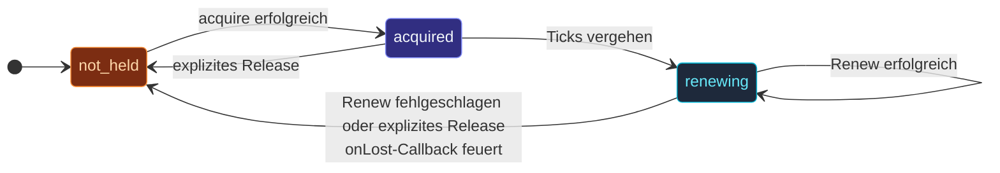

Manchmal braucht der Cluster eine **Single-Holder-Garantie**, die
Mechanismen, die nur auf Membership beruhen, nicht liefern können:

- Der `ClusterSingleton` soll während einer Netzwerk-Partition
  niemals zwei Instanzen spawnen.
- Der Sharding-Koordinator auf der Leader-Seite einer Partition
  soll keine Allocations vergeben, wenn eine andere Seite auch
  einen Leader haben könnte.

Die `Lease`-API gibt dir diese Garantie.  Ein Lease ist ein
**verteilter Lock mit TTL** — höchstens ein Prozess hält ihn
gleichzeitig, mit einem Backend (Kubernetes, etcd, dein eigenes),
das die Single-Holder-Constraint liefert.

## Der Vertrag

```ts
interface Lease {
  acquire(): Promise<boolean>;
  release(): Promise<void>;
  checkAlive(): boolean;
  onLost(handler: (reason: string) => void): () => void;
}
```

Vier Methoden:

- **`acquire()`** — versuche, den Lease zu beanspruchen.  Resolved
  mit `true` bei Erfolg, mit `false` bei Contention (jemand anders
  hat ihn).
- **`release()`** — gib das Eigentum freiwillig ab.  No-op, wenn
  nicht gehalten.
- **`checkAlive()`** — billiger, lokaler "halte ich diesen Lease
  noch?"-Check.
- **`onLost(cb)`** — Registriere einen Callback, der feuert, wenn
  das Eigentum unerwartet verloren geht (TTL ohne Renewal
  abgelaufen, ein anderer Halter hat übernommen).

Das Backend implementiert den Vertrag.  Das eingebaute
**`KubernetesLease`** des Frameworks nutzt native K8s-`Lease`-Ressourcen;
**`InMemoryLease`** ist die Test-/Dev-Option.

## Wann du einen Lease brauchst

Zwei Produktions-Szenarien:

| Szenario | Warum ein Lease hilft |
| --- | --- |
| **Cluster-Singleton** | Verhindert Doppel-Leadership während einer Partition.  Siehe [Singleton mit Lease](/de/cluster/singleton/with-lease/). |
| **Sharding-Koordinator** | Verhindert, dass zwei Koordinatoren konfliktierende Allocations vergeben.  Siehe [Sharding mit Lease](/de/cluster/sharding/with-lease/). |

Für die meisten Cluster reicht eine **Downing-Strategie**.  Leases
sind die **paranoid-sichere** Option:

- Nur Downing-Strategie: der Cluster wählt während einer Partition
  einen Gewinner; bei den meisten Apps reicht das.
- Downing-Strategie + Lease: eine zusätzliche Prüfung, die
  Edge-Case-Doppel-Leadership verhindert, selbst wenn Downing
  fehlzündet.

Wenn du dir die operativen Kosten leisten kannst (K8s-Namespace-Permissions,
etcd-Cluster etc.), aktiviere Leases für jeden Singleton- oder
Sharding-Aufbau, in dem Doppel-Ausführung **echten Schaden**
anrichten würde — Kunde doppelt belasten, Stream-Event doppelt
publizieren.

## Lebenszyklus eines Lease



Der Ablauf:

1. Irgendein Actor (typischerweise ein Singleton Manager) ruft
   `lease.acquire()`.
2. Das Backend versucht, diesen Owner einzutragen.  Erfolg →
   gibt `true` zurück.
3. Während gehalten, **renewt** das Backend alle
   `renewalIntervalMs` (typischerweise `ttl / 3`).
4. Wenn das Renewal fehlschlägt (Netz-Hänger, Backend down, Lease
   übernommen), feuert `onLost` mit dem Grund.
5. Der Actor gibt eigentumsabhängigen State sofort frei.

Die TTL ist kritisch — ein Halter, der ohne `release` abstürzt,
verliert den Lease automatisch, wenn die TTL abläuft.  Andere
Bewerber können dann acquiren.

## Einstellungen

```ts
interface LeaseOptionsType {
  name:                  string;       // eindeutiger Lease-Identifier
  owner:                 string;       // Identifier dieses Halters (Pod-Name / UUID)
  ttlMs:                 number;       // automatisches Ablaufen nach so vielen ms ohne Renewal
  renewalIntervalMs?:    number;       // typischerweise ttl/3
  acquireRetries?:       number;       // max Versuche pro acquire()
  acquireRetryDelayMs?:  number;       // Verzögerung zwischen Versuchen
}
```

| Setting | Typische Werte |
| --- | --- |
| `ttlMs` | 15-30 s.  Kurz genug, um von einem abgestürzten Halter zu erholen, lang genug, um Gossip-/Renewal-Verzögerungen zu tolerieren. |
| `renewalIntervalMs` | ~`ttl / 3`.  Oft genug renewen, dass ein einzelnes fehlgeschlagenes Renew den Lease nicht verliert. |
| `acquireRetries` | 3-10 für Produktion. |
| `acquireRetryDelayMs` | 100-1000 ms. |

## Backends

| Backend | Verwendung |
| --- | --- |
| [`InMemoryLease`](/de/coordination/in-memory-lease/) | Tests und Dev.  In-Process; nicht wirklich verteilt. |
| [`KubernetesLease`](/de/coordination/kubernetes-lease/) | Produktion auf K8s.  Nutzt native K8s-Lease-CRDs. |

Für Non-K8s-Produktions-Deployments würdest du das
`Lease`-Interface gegen deinen Coordination-Service (etcd, Consul,
Zookeeper) implementieren.  Das Interface ist klein — ~50 Zeilen
Glue.

## Ein minimales Beispiel

```ts
import { ClusterSingletonManager, KubernetesLease, KubernetesLeaseOptions, Props } from 'actor-ts';

const kubernetesLeaseOptions = KubernetesLeaseOptions.create()
  .withName('my-app-singleton-lease')
  .withOwner(process.env.POD_NAME!)
  .withTtlMs(30_000)
  .withRenewalIntervalMs(10_000)
  .withNamespace(process.env.K8S_NAMESPACE!);
const lease = new KubernetesLease(
  kubernetesLeaseOptions,
);

system.spawn(
  ClusterSingletonManager.props({
    cluster,
    typeName:        'job-scheduler',
    singletonProps:  Props.create(() => new JobScheduler()),
    lease,           // ← Split-Brain-Schutz
  }),
  'singleton-manager-job-scheduler',
);
```

Der Singleton Manager:

- Versucht, den Lease zu acquiren, bevor er den Singleton spawnt.
- Renewt ihn, während er am Leben ist.
- Released ihn bei einem graceful Shutdown.
- Reagiert auf `lease.onLost(...)`, indem er seinen Singleton
  stoppt.

import { Aside } from '@astrojs/starlight/components';

<Aside type="caution" title="Ein Lease ist keine Silver Bullet">
  ```ts
  // Halter glaubt, er habe den Lease, aber sein Renewal ist noch nicht beim Backend
  // → ein anderer Halter könnte kurz acquiren
  ```
  Leases geben dir **höchstens einen Halter gleichzeitig** — aber
  nur so gut wie das Konsistenzmodell des Backends.
  K8s-Leases nutzen den stark konsistenten etcd-backed Store des
  API-Servers; In-Memory-Leases geben über Prozesse hinweg gar
  nichts.
</Aside>

<Aside type="caution" title="Leases ersetzen kein Downing">
  Nimm beides.  Leases übernehmen die Singleton-/Koordinator-Eindeutigkeit;
  Downing übernimmt die Gesamt-Partition-Recovery des Clusters
  (welche Seite weiterläuft).  Ohne Downing gossipen beide Seiten
  selbst mit Lease ewig weiter — der Lease hält nur die
  Singleton-Invariante.
</Aside>

<Aside type="caution" title="Renewal-Fehler ≠ Lease verloren">
  ```ts
  // Einzelner Renewal-Versuch schlägt fehl — meist transient
  ```
  Das Framework retried Renewals, bevor es den Lease für
  verloren erklärt.  Nicht beim ersten fehlgeschlagenen Renew
  panisch werden; nur `onLost` feuert, wenn das Eigentum
  wirklich weg ist.
</Aside>

## Wohin als Nächstes

- **[Lease-API](/de/coordination/lease-api/)** — der
  vollständige Interface-Vertrag.
- **[InMemoryLease](/de/coordination/in-memory-lease/)** —
  das Dev-/Test-Backend.
- **[KubernetesLease](/de/coordination/kubernetes-lease/)** —
  das K8s-native Produktions-Backend.
- **[Singleton mit Lease](/de/cluster/singleton/with-lease/)** —
  Lease für Singleton-Eindeutigkeit nutzen.
- **[Downing-Strategien](/de/cluster/downing-strategies/)** —
  der komplementäre Partition Resolver.
