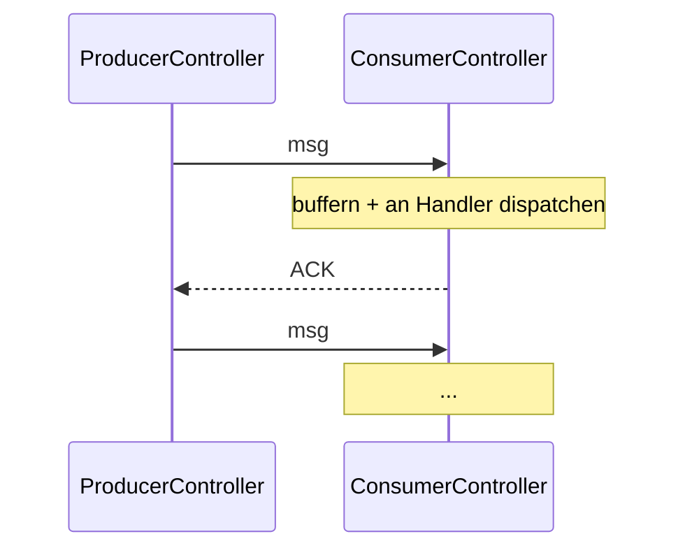

Standardmäßig ist `tell` **Fire-and-Forget**.  Nachrichten können
verloren gehen (gestoppter Empfänger, Mailbox-Overflow,
Netzwerk-Drops in Cluster-Setups).  Für Workloads, in denen
Verluste inakzeptabel sind, liefert das Framework **zuverlässige
Zustellung** über das Paar
**`ProducerController` / `ConsumerController`**.



Ergänzt **Sequence Numbers** + **ACKs** zum einfachen
`tell`-Vertrag.  Der Producer hält unbestätigte Nachrichten;
der Consumer dedupliziert per Sequence Number.

## Wann du dazu greifst

Für Workloads, in denen:

- **Verlust inakzeptabel ist** — Zahlungsinstruktionen,
  Audit-Records, Billing-Events.
- **Duplikate tolerierbar, aber selten sind** — at-least-once mit
  Consumer-seitiger Dedup reicht.
- **Reihenfolge innerhalb eines Streams zählt** — Sequence
  Numbers bewahren sie.

Für Workloads, in denen Verlust akzeptabel ist (Telemetrie,
Metriken, Fire-and-Forget UX Updates), nimm einfaches `tell`.

## at-least-once vs. effectively-once

Die zuverlässige Zustellung des Frameworks ist standardmäßig
**at-least-once** — eine Nachricht kann erneut zugestellt werden,
wenn der Producer zwischen Senden und Empfang des ACK abstürzt.

Für **effectively-once** dedupliziert der Controller eingehende
Duplikate bereits pro `(producerId, seq)` — aber nur innerhalb
seiner In-Memory-Lebensdauer.  Wenn Du Dedup brauchst, das
Consumer-Restarts überlebt, persistiere Deine eigene
processed-Seq zusammen mit dem Business-State im Handler:

```ts
new ConsumerController<DeliveryMessage>({
  handler: async (body) => {
    if (await alreadyProcessed(body.id)) return;   // dein Idempotenz-Check
    await this.handle(body);
    await markProcessed(body.id);
  },
});
```

Der In-Memory-Dedup des Controllers fängt den häufigen
Retransmit-vor-ACK-Fall ab; das persistente Dedup Deines Handlers
fängt Consumer-Crashes mitten in der Verarbeitung ab.  Zusammen
ergeben sie **effectively-once** im durable-Sinn.

## Die zwei Controller

| Controller | Rolle |
| --- | --- |
| **[ProducerController](/de/delivery/producer-controller/)** | Umwickelt die Sender-Seite — vergibt Sequence Numbers, hält unbestätigte Nachrichten, retransmittiert. |
| **[ConsumerController](/de/delivery/consumer-controller/)** | Umwickelt die Empfänger-Seite — ordnet Nachrichten nach Seq, dedupliziert, sendet ACKs. |

Paare sie über einen **Producer-Consumer-Link** — jeder
Producer spricht mit einem Consumer (oder N Consumern via
Routing, aber der Link ist 1:1 pro Stream).

## Ein minimales Beispiel

```ts
import {
  Props,
  ProducerController,
  ProducerControllerOptions,
  ConsumerController,
} from 'actor-ts';

// Consumer-Seite — Handler-Funktion, Auto-ACK bei Resolve:
const consumer = system.spawn(
  Props.create(() => new ConsumerController<OrderEvent>({
    handler: async (order) => {
      await processOrder(order);
    },
  })),
);

// Producer-Seite — umwickelt ausgehende Nachrichten mit Seq- + ACK-Tracking:
const producerControllerOptions = ProducerControllerOptions.create<OrderEvent>()
  .withProducerId('order-producer-1')
  .withConsumer(consumer)
  .withWindowSize(16);
const producer = system.spawn(
  Props.create(() => new ProducerController<OrderEvent>(producerControllerOptions)),
);

producer.tell({
  kind: 'reliable-delivery.send',
  body: { orderId: 'o-1', amount: 100 },
});
```

Das Framework übernimmt Seq-Vergabe, Retransmission und Dedup —
Dein Code macht nur die Business-Logik im Handler.

## Semantik der Sequence Numbers

```
Jeder Producer vergibt strikt aufsteigende Seq-Nummern, beginnend bei 1:
  msg 1, msg 2, msg 3, ...

Der Consumer sieht sie IN ORDER (nachdem Retransmissions sich aufgelöst haben):
  msg 1, msg 2, msg 3, ...

Duplikate (durch Retransmit) erscheinen mit DERSELBEN Seq:
  msg 1, msg 1 (dup), msg 2, ...
  → Consumer dedupliziert per Seq
```

Die Seq ist **pro Producer** — mehrere Producer haben
unabhängige Seq-Räume.

## Mit Persistenz kombinieren

Für vollständige Durability über Producer-/Consumer-Crashes:

```ts
// Producer-Seite: persistiere den In-Flight-Buffer (die
// Nachrichten, die du getellt hast, für die aber noch kein ACK
// kam), damit ein Crash vor dem ACK sie nicht verliert.

// Consumer-Seite: persistiere im Handler die processed-Seq pro
// Producer, damit ein Crash mitten in der Verarbeitung kein
// abgeschlossenes Werk-Stück erneut ausführt.
```

Persistieren auf beiden Seiten gibt **End-to-End
effectively-once**:

- Producer crasht mitten im Send → erholt den persistierten
  In-Flight-Buffer → setzt das Retransmitten unbestätigter
  Nachrichten fort.
- Consumer crasht mitten im Process → erholt die persistierte
  processed-Seq → der Handler dedupliziert die erneute Zustellung.

Ohne Persistenz setzt die Recovery auf beiden Seiten auf null
zurück — der Producer vergisst unbestätigte Nachrichten und der
In-Memory-Dedup des Consumers ist weg.

## Vergleich mit Broker-basierter Zustellung

```
Producer-/ConsumerController:  cluster-interne zuverlässige Zustellung
Kafka / RabbitMQ / NATS:       externe Broker-vermittelte Zustellung
```

Beide erreichen at-least-once + Dedup-via-Seq.  Unterschiede:

| Aspekt | In-Cluster-Controller | Externer Broker |
| --- | --- | --- |
| Operative Komplexität | Niedrig — Teil des Clusters | Hoch — separater Broker zu betreiben |
| Latenz | Sub-Millisekunde | Netzwerk- + Broker-Overhead |
| Durchsatz | Begrenzt durch Single-Actor-Verarbeitung | Höher (Broker skaliert unabhängig) |
| Externe Consumer | Nein (cluster-intern) | Ja |
| Persistenz | Über PersistentActor | In den Broker eingebaut |

Für **cluster-interne** zuverlässige Zustellung nimm die
Controller.  Für **externe Systeme oder Cross-Cluster** einen
Broker (Kafka etc.).

## Wohin als Nächstes

- **[Producer Controller](/de/delivery/producer-controller/)** —
  Sender-seitige Details.
- **[Consumer Controller](/de/delivery/consumer-controller/)** —
  Empfänger-seitige Details.
- **[ACK-Semantik](/de/delivery/ack-semantics/)** — was
  ACKs bedeuten und wann sie feuern.
- **[PersistentActor](/de/persistence/persistent-actor/)** —
  Paarung mit Persistenz für volle Durability.
