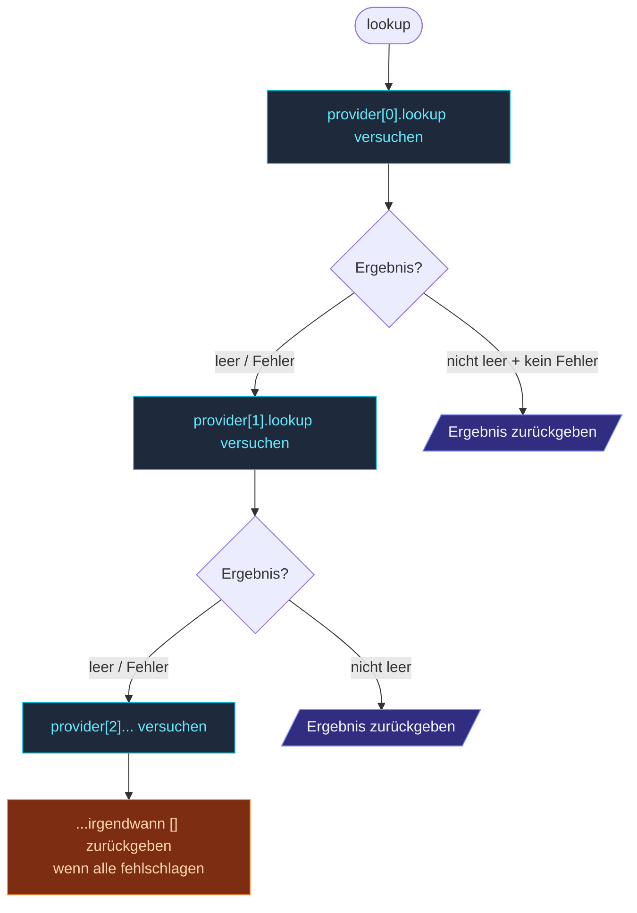

`AggregateSeedProvider` umwickelt mehrere Seed Provider und
probiert sie **der Reihe nach**, gibt das erste nicht-leere
Ergebnis zurück.  Nützlich, wenn:

- Du **erst DNS** willst, mit Fallback auf **statische Seeds**,
  wenn DNS nicht erreichbar ist.
- Derselbe Code in **mehreren Umgebungen** läuft: K8s für Prod,
  statische Config für lokales Dev.
- Du **Disaster Recovery** machst — primärer Discovery-Mechanismus
  + Backup.

```ts
import {
  Cluster,
  ClusterOptions,
  AggregateSeedProvider,
  KubernetesApiSeedProvider,
  KubernetesApiSeedProviderOptions,
  DnsSeedProvider,
  DnsSeedProviderOptions,
  ConfigSeedProvider,
  ConfigSeedProviderOptions,
} from 'actor-ts';

const kubernetesApiSeedProviderOptions = KubernetesApiSeedProviderOptions.create()
  .withNamespace(namespace)
  .withServiceName(labelSelector)
  .withSystemName('my-app')
  .withPort(2552);
const dnsSeedProviderOptions = DnsSeedProviderOptions.create()
  .withHostname('_actor-ts._tcp.example.com')
  .withSystemName('my-app')
  .withUseSrv();
const configSeedProviderOptions = ConfigSeedProviderOptions.create()
  .withSeeds(['fallback-1:2552', 'fallback-2:2552'])
  .withSystemName('my-app');
const provider = new AggregateSeedProvider([
  new KubernetesApiSeedProvider(
    kubernetesApiSeedProviderOptions,
  ),
  new DnsSeedProvider(
    dnsSeedProviderOptions,
  ),
  new ConfigSeedProvider(
    configSeedProviderOptions,
  ),
]);

const seeds = await provider.lookup();
const clusterOptions = ClusterOptions.create()
  .withHost(host)
  .withPort(port)
  .withSeeds(seeds);
await Cluster.join(system, clusterOptions);
```

## Wie die Verkettung funktioniert



Der Provider stoppt beim **ersten nicht-leeren Ergebnis**.  Eine
leere Liste von einem Provider triggert den Fallback zum
nächsten; ein Fehler triggert ebenfalls einen Fallback (mit
geloggtem Error auf Debug-Level).

Wenn **jeder** Provider fehlschlägt oder leer zurückgibt,
resolved `lookup()` zu `[]` — `Cluster.join` des Clusters
bootstrapt sich dann entweder selbst oder retried (abhängig von
seinen eigenen Settings).

## Häufige Muster

### Lokales Dev → Prod K8s

```ts
const k8sSeedProviderOptions = KubernetesApiSeedProviderOptions.create()
  .withNamespace(process.env.K8S_NAMESPACE ?? '')
  .withServiceName('actor-ts')
  .withSystemName('my-app')
  .withPort(2552);
new AggregateSeedProvider([
  seedsFromEnv('ACTOR_TS_SEEDS', 'my-app'),                  // 1.: Env-Var
  new KubernetesApiSeedProvider(k8sSeedProviderOptions),     // 2.: K8s-API
]);
```

Lokales Dev: `export ACTOR_TS_SEEDS=localhost:2552` → nutzt die
Env-Var.  In K8s ist die Env-Var nicht gesetzt; fällt durch zur
K8s-API.

### DNS-first mit statischem Fallback

```ts
const dnsSeedProviderOptions = DnsSeedProviderOptions.create()
  .withHostname('_actor-ts._tcp.example.com')
  .withSystemName('my-app')
  .withUseSrv();
const configSeedProviderOptions = ConfigSeedProviderOptions.create()
  .withSeeds(['known-stable-node-1:2552', 'known-stable-node-2:2552'])
  .withSystemName('my-app');
new AggregateSeedProvider([
  new DnsSeedProvider(
    dnsSeedProviderOptions,
  ),
  new ConfigSeedProvider(
    configSeedProviderOptions,
  ),
]);
```

Erst DNS probieren; wenn leer zurückkommt (DNS-Server-Schluckauf,
beim Bootstrap noch keine Records), bekannte stabile statische
IPs nutzen.

### Multi-Region Disaster Recovery

```ts
const kubernetesApiSeedProviderOptions = KubernetesApiSeedProviderOptions.create()
  .withNamespace('primary-region')
  .withServiceName('actor-ts')
  .withSystemName('my-app')
  .withPort(2552);
const kubernetesApiSeedProvider2Options = KubernetesApiSeedProviderOptions.create()
  .withNamespace('failover-region')
  .withServiceName('actor-ts')
  .withSystemName('my-app')
  .withPort(2552);
new AggregateSeedProvider([
  new KubernetesApiSeedProvider(
    kubernetesApiSeedProviderOptions,
  ),
  new KubernetesApiSeedProvider(
    kubernetesApiSeedProvider2Options,
  ),
]);
```

In einem Multi-Region-Deployment erst die lokale Region
probieren; wenn lokal keine Pods laufen, versuchen, dem
Failover-Region-Cluster beizutreten.  Aggressiv — macht nur
Sinn, wenn die Regionen tatsächlich State teilen sollen.

## Fehlerbehandlung

```ts
const kubernetesApiSeedProviderOptions = KubernetesApiSeedProviderOptions.create()
  .withNamespace('my-app')
  .withServiceName('actor-ts')
  .withSystemName('my-app')
  .withPort(2552);
const configSeedProviderOptions = ConfigSeedProviderOptions.create()
  .withSeeds(['10.0.0.1:2552'])
  .withSystemName('my-app');
new AggregateSeedProvider([
  new KubernetesApiSeedProvider(
    kubernetesApiSeedProviderOptions,
  ),   // wirft 403 außerhalb K8s
  new ConfigSeedProvider(
    configSeedProviderOptions,
  ),
]);
```

Ein 403 von der K8s-API → geloggt + übersprungen → fällt durch
zum Config Provider.  Das macht Aggregate zum richtigen Werkzeug
für "dieser Code-Pfad läuft überall" — das K8s-Lookup wird
einfach zum No-op, wo K8s nicht verfügbar ist.

Fehler werden auf **Debug**-Level geloggt — standardmäßig leise.
Konfiguriere das System auf `debug`, wenn du Sichtbarkeit
willst, welche Provider es probiert / nicht geschafft haben.

## Reihenfolge zählt

Der erste Provider, der ein nicht-leeres Ergebnis zurückgibt,
wird genutzt.  **Teste die Reihenfolge** explizit:

| Reihenfolge | Effekt |
| --- | --- |
| K8s, dann DNS | K8s gewinnt in K8s-Deployments; DNS ist der Fallback. |
| DNS, dann K8s | DNS gewinnt überall; K8s feuert nur, wenn DNS nicht erreichbar ist. |

Den **bevorzugten** Provider zuerst; den **Fallback** zuletzt.

import { Aside } from '@astrojs/starlight/components';

<Aside type="caution" title="Leeres Ergebnis triggert Fallback">
  ```ts
  // 1. Provider gibt [] zurück (noch keine matching Pods) → fällt zurück auf den 2.
  ```
  Leer ist **kein** Fehler, triggert aber den Fallback.  Das
  willst du meist — erster-Node-Up sieht leer, fällt auf einen
  statischen Seed zurück.  Aber wenn dein primärer Provider
  absichtlich leer zurückgibt (z. B. um "keine Peers bereit" zu
  signalisieren), nimm stattdessen einen einzelnen Provider.
</Aside>

<Aside type="caution" title="Latenzen stapeln sich">
  ```ts
  const dnsOptions = DnsSeedProviderOptions.create()
    .withHostname('slow-dns.example')
    .withSystemName('my-app')
    .withUseSrv();
  const configOptions = ConfigSeedProviderOptions.create()
    .withSeeds(['fallback:2552'])
    .withSystemName('my-app');
  new AggregateSeedProvider([
    new DnsSeedProvider(dnsOptions),   // 30s Timeout
    new ConfigSeedProvider(configOptions),
  ]);
  ```
  Wenn der erste Provider in den Timeout läuft, wartest du auf
  diesen Timeout, bevor der zweite probiert wird.  Für
  latenzempfindlichen Boot: schnelle Provider vorn anstellen
  oder kurze Timeouts auf langsamen setzen.
</Aside>

<Aside type="caution" title="Keine Teilergebnisse">
  ```ts
  // K8s gibt ['1.1.1.1:2552'] zurück; DNS gibt ['2.2.2.2:2552'] zurück
  // Aggregate gibt NUR ['1.1.1.1:2552'] zurück — DNS wird nie konsultiert
  ```
  Aggregate ist **First-Wins**, nicht "Vereinigung aller".
  Wenn du die Vereinigung willst (K8s-Pods + DNS-entdeckte VMs
  in einem Hybrid-Setup), brauchst du eine andere Abstraktion
  — entweder vor `Cluster.join` pre-mergen oder einen eigenen
  Provider schreiben.
</Aside>

## Wohin als Nächstes

- **[Discovery im Überblick](/de/discovery/overview/)** — das
  Gesamtbild.
- **[Config Seed Provider](/de/discovery/seed-providers/config/)** —
  Statische-Listen-Provider, häufig als Fallback genutzt.
- **[DNS Seed Provider](/de/discovery/seed-providers/dns/)** —
  der DNS-basierte Provider.
- **[Kubernetes-API Seed Provider](/de/discovery/seed-providers/kubernetes-api/)** —
  der K8s-basierte Provider.
- **[Joining und Seeds](/de/cluster/joining-and-seeds/)** —
  wie das Ergebnis verwendet wird.
