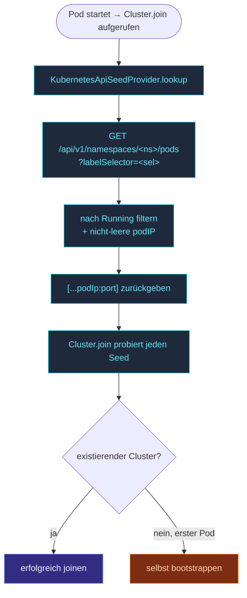

`KubernetesApiSeedProvider` fragt die K8s-API nach Pods, die
einem Label Selector entsprechen, und gibt deren IPs als Seeds
zurück.  Funktioniert ohne DNS, ohne SRV, ohne manuelle
Seed-Listen-Pflege — der Selector ist dein Vertrag.

```ts
import { Cluster, KubernetesApiSeedProvider } from 'actor-ts';

const provider = new KubernetesApiSeedProvider({
  namespace:     process.env.K8S_NAMESPACE!,
  labelSelector: 'app=actor-ts',
  containerPort: 2552,
});

const seeds = await provider.lookup();
await Cluster.join(system, {
  host:  process.env.POD_IP!,
  port:  2552,
  seeds,
});
```

Für jeden Pod, der `app=actor-ts` im Namespace matcht, gibt der
Provider `<pod-ip>:2552` zurück.

## Konfiguration

```ts
interface KubernetesApiSeedProviderSettings {
  namespace:           string;
  labelSelector:       string;
  containerPort:       number;
  apiBaseUrl?:         string;   // In-Cluster-Default überschreiben
  serviceAccountToken?: string;  // In-Cluster-Default überschreiben
}
```

| Feld | Was |
| --- | --- |
| `namespace` | K8s-Namespace, der abgefragt wird — typischerweise dein App-Namespace. |
| `labelSelector` | Der Selector für matching Pods (`app=actor-ts`, `role=compute,env=prod` etc.). |
| `containerPort` | Der Cluster-Transport-Port auf jedem matching Pod. |
| `apiBaseUrl` | Default `https://kubernetes.default.svc` (in-cluster). |
| `serviceAccountToken` | Default das In-Cluster-Token unter `/var/run/secrets/.../token`. |

Für Pods, die in-cluster laufen, sind nur die ersten drei
Pflicht.  Das Framework liest API-URL und SA-Token von den
Standard-Locations.

## RBAC

Das ServiceAccount des Pods braucht Read-Zugriff auf Pods im
Namespace:

```yaml
apiVersion: rbac.authorization.k8s.io/v1
kind: Role
metadata:
  name: actor-ts-pod-reader
  namespace: my-app
rules:
  - apiGroups: [""]
    resources: ["pods"]
    verbs: ["get", "list"]
---
apiVersion: rbac.authorization.k8s.io/v1
kind: RoleBinding
metadata:
  name: actor-ts-pod-reader
  namespace: my-app
subjects:
  - kind: ServiceAccount
    name: actor-ts
roleBinding:
  kind: Role
  name: actor-ts-pod-reader
  apiGroup: rbac.authorization.k8s.io
```

Ohne diese bekommt das Lookup einen 403; `Cluster.join` retried
endlos.

## Was zurückkommt

Für jeden Pod, der dem Selector entspricht:

- **Running Pods** mit nicht-leerem `status.podIP` → eingeschlossen
  als `<podIP>:<containerPort>`.
- **Pending / nicht laufende Pods** → übersprungen (noch keine
  IP).
- **Dieser Pod selbst** → kann inkludiert sein oder nicht, je
  nach Start-Race; der Cluster behandelt Self-as-Seed korrekt.

## Cluster-weit vs. ReplicaSet

```yaml
# Alle Pods in der App matchen:
labelSelector: 'app=actor-ts'

# Nur eine bestimmte Rolle matchen:
labelSelector: 'app=actor-ts,role=compute'

# Über mehrere Deployments hinweg matchen:
labelSelector: 'cluster=my-app'
```

Der Selector definiert die Cluster-Membership beim Bootstrap.
Für die meisten Deployments **ein Selector pro Cluster** — alle
Pods, die ihn tragen, bootstrappen in einen Cluster.

Für rollenbasierte asymmetrische Cluster (`role=compute` für
Worker, `role=gateway` für HTTP) deckt ein einzelner Selector
(`app=actor-ts`) beide ab; das Rollen-Tag innerhalb des Clusters
ist getrennt vom Discovery-Selector.

## Was beim Start passiert



Wenn du der erste Pod hochkommst, gibt die K8s-API nur diesen
Pod zurück.  Die Self-Bootstrap-Logik des Frameworks behandelt
das: `Cluster.join` mit Seeds, die nur sich selbst enthalten,
befördert sich selbst zum Leader.

Nachfolgende Pods sehen die existierenden Pods und joinen über
sie.

## Den Selector tunen

| Selector-Muster | Effekt |
| --- | --- |
| `app=actor-ts` | Ein Cluster über den Namespace. |
| `app=actor-ts,env=prod` | Separate Prod- und Staging-Cluster in einem Namespace. |
| `cluster=my-app-cluster-1` | Expliziter Cluster-Name; mehrere Cluster in einem Namespace. |

Stabiles Selector-Design ist wichtig — die **Identität des
Clusters** liegt implizit im Selector.  Den Selector zu ändern
splittet den Cluster.

## Wann NICHT

import { Aside } from '@astrojs/starlight/components';

<Aside type="caution" title="Pods ohne IPs">
  Pods im `Pending`-State haben keine `podIP` — der Provider
  überspringt sie.  Bis mindestens ein Pod `Running` ist, gibt
  das Lookup eine leere Liste zurück.  Selten ein Problem (der
  erste Pod bootstrapt sich selbst), aber bei schnellen
  Scale-ups daran denken.
</Aside>

<Aside type="caution" title="Cross-Namespace-Lookup">
  ```ts
  namespace: 'other-namespace';   // ✗ ungewöhnlich; RBAC prüfen
  ```
  Das Default-RBAC-Binding oben skoped auf einen Namespace.  Für
  Cross-Namespace-Lookups nimm ClusterRole + ClusterRoleBinding
  oder eine Role pro Quell-Namespace.
</Aside>

<Aside type="caution" title="K8s-API-Rate-Limits">
  ```ts
  // 1000 Pods starten gleichzeitig neu → 1000 Lookups → API throttelt
  ```
  Die K8s-API hat Per-Client-Rate-Limits.  Für sehr große
  Deployments den Start staffeln (StatefulSet
  `podManagementPolicy: OrderedReady`), um Thundering-Herd-Lookups
  zu vermeiden.
</Aside>

## Wohin als Nächstes

- **[Discovery im Überblick](/de/discovery/overview/)** — das
  Gesamtbild.
- **[Kubernetes-Deployment](/de/operations/deployment/kubernetes/)** —
  das vollständige K8s-Rezept.
- **[Config Seed Provider](/de/discovery/seed-providers/config/)** —
  Fallback für Non-K8s.
- **[Aggregate Seed Provider](/de/discovery/seed-providers/aggregate/)** —
  K8s mit Fallback kombinieren.
- **[Joining und Seeds](/de/cluster/joining-and-seeds/)** —
  wie Seeds konsumiert werden.
