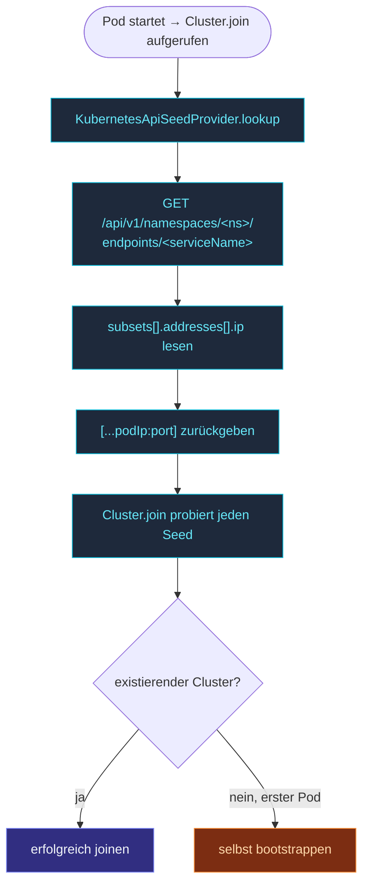

`KubernetesApiSeedProvider` liest die Endpoints eines benannten
Service aus der K8s-API und gibt die IPs der bereiten Pods als
Seeds zurück.  Funktioniert ohne DNS, ohne SRV, ohne manuelle
Seed-Listen-Pflege — der Service ist dein Vertrag.

```ts
import { Cluster, ClusterOptions } from 'actor-ts/cluster';
import { KubernetesApiSeedProvider, KubernetesApiSeedProviderOptions } from 'actor-ts/discovery';

const kubernetesApiSeedProviderOptions = KubernetesApiSeedProviderOptions.create()
  .withNamespace(process.env.K8S_NAMESPACE!)
  .withServiceName('actor-ts')
  .withSystemName('my-app')
  .withPort(2552);
const provider = new KubernetesApiSeedProvider(
  kubernetesApiSeedProviderOptions,
);

const seeds = await provider.lookup();
const clusterOptions = ClusterOptions.create()
  .withHost('0.0.0.0')
  .withAdvertisedHost(process.env.POD_IP!)
  .withPort(2552)
  .withSeeds(seeds);
await Cluster.join(
  system,
  clusterOptions,
);
```

Für jeden bereiten Pod hinter dem Service `actor-ts` im
Namespace gibt der Provider `<pod-ip>:2552` zurück.

Das Adresspaar ist der eigentliche Punkt des Beispiels. Ein Pod kennt
seine eigene IP beim Prozessstart nicht, bindet also `0.0.0.0` — aber
`0.0.0.0` ist keine Identität, und eine Flotte von Pods, die sie alle
verteilten, verteilte denselben String; jeder läse die Ankündigungen
der anderen als Aussagen über sich selbst. `POD_IP` ist die Adresse,
die die Plattform vergeben hat, und genau die gehört in den Gossip.

`POD_IP` gibt es nicht automatisch — die Pod-Spec muss sie exportieren:

```yaml
env:
  - name: POD_IP
    valueFrom:
      fieldRef:
        fieldPath: status.podIP
```

Damit ist `withAdvertisedHost` optional: die Auflösungskette liest
`POD_IP` von selbst, sobald der Bind-Host eine Wildcard ist. Die Zeile
lohnt sich trotzdem — sie hält die Absicht des Deployments im Code statt
in einer Umgebung, die man erst nachschlagen muss.

## Konfiguration

```ts
type KubernetesApiSeedProviderOptionsType = {
  namespace:       string;
  serviceName:     string;
  systemName:      string;
  port:            number;
  fetchEndpoints?: () => Promise<string[]>;  // In-Cluster-API überschreiben
  pinnedAddresses?: readonly string[];       // CIDRs, in die die Pod-IPs fallen müssen
  log?: (message: string, error?: unknown) => void;
};
```

| Feld | Was |
| --- | --- |
| `namespace` | K8s-Namespace, der abgefragt wird — typischerweise dein App-Namespace.  Ein DNS-1123-Label. |
| `serviceName` | Der Service- (oder Endpoints-)Name, dessen bereite Pods den Cluster bilden.  Eine DNS-1123-Subdomain. |
| `systemName` | Der Actor-System-Name, der auf jede entdeckte Adresse gestempelt wird. |
| `port` | Der Cluster-Transport-Port auf jedem Backing-Pod. |
| `fetchEndpoints` | Überschreibt die Endpoints-Fetch-Funktion — Default ist die In-Cluster-API.  Hebt außerdem die Namensregeln oben auf. |
| `pinnedAddresses` | CIDRs, in die die entdeckten Pod-IPs fallen müssen.  Unbesetzt heißt kein Pinning. |
| `log` | Meldet Adressen, die `pinnedAddresses` verworfen hat.  Default: No-op. |

Für Pods, die in-cluster laufen, sind nur die letzten drei Felder
optional — das Framework liest die Endpoints vom Standard-API
unter `https://kubernetes.default.svc` mit dem gemounteten
ServiceAccount-Token.  Die anderen vier Felder sind Pflicht.

## Namen landen im API-Pfad

Die beiden Namen sind das, was der Provider in seine Anfrage
einsetzt — `GET /api/v1/namespaces/<namespace>/endpoints/<serviceName>`
—, deshalb werden beide Segmente prozentkodiert, und beide werden
gegen die Form geprüft, die Kubernetes selbst verlangt:

- `namespace` — ein **DNS-1123-Label**: kleingeschriebene
  alphanumerische Zeichen oder `-`, am Anfang und Ende
  alphanumerisch, höchstens 63 Zeichen.
- `serviceName` — eine **DNS-1123-Subdomain**: punktgetrennte
  Labels dieser Form, höchstens 253 Zeichen, denn ein
  `Endpoints`-Objekt darf einen punktierten Namen tragen.

Beide Werte kommen direkt aus der Umgebung des Pods, wenn du von
dort bootstrappst (`CLUSTER_NAMESPACE` / `CLUSTER_SERVICE_NAME`) —
ein `/`, `..` oder `?` darin würde sonst eine andere API-Ressource
adressieren, mit dem ServiceAccount-Token dieses Pods im Gepäck.
Ein Name außerhalb der Form wird schon bei der Konstruktion mit
einem `OptionsError` abgelehnt, der das Feld benennt, statt später
als rätselhafter 404 aufzuschlagen.

`fetchEndpoints` zu setzen hebt die Formregel auf: deine
Fetch-Funktion baut ihre eigene Anfrage, dort sind die beiden
Felder also reine Labels und müssen nur nicht-leer sein.

Auf der env-getriebenen Leiter — `Cluster.bootstrap()` ohne `seeds`
und ohne `discovery` — kostet ein abgelehnter Name **nur diese
Sprosse**.  Der Kubernetes-Provider fällt weg, die Ablehnung wird
über das Bootstrap-Log gemeldet, und die Sprossen `CLUSTER_SEEDS`
und DNS laufen weiter.  Das ist wichtig, weil `CLUSTER_SERVICE_NAME`
auch die DNS-Sprosse treibt und ein DNS-Hostname die weitere Form
ist: ein SRV-Name wie `_actor-ts._tcp.example.com`, ein
wurzelverankerter FQDN mit Schlusspunkt und Großschreibung sind dort
allesamt zulässig, und keines davon ist eine DNS-1123-Subdomain.
Die gepinnte Form `Cluster.bootstrap({ discovery: 'kubernetes' })`
scheitert weiterhin laut — genau einen Provider zu pinnen ist die
Aussage, dass du keinen Fallback willst.

## Das Pod-CIDR pinnen

Ein `Endpoints`-Objekt darf **jede beliebige** IP nennen, auch
eine, die keinem Pod im Cluster gehört.  `pinnedAddresses`
begrenzt, wohin ein Schreibzugriff auf dieses Objekt den Bootstrap
umlenken kann:

```ts
const kubernetesApiSeedProviderOptions = KubernetesApiSeedProviderOptions.create()
  .withNamespace(process.env.K8S_NAMESPACE!)
  .withServiceName('actor-ts')
  .withSystemName('my-app')
  .withPort(2552)
  .withPinnedAddresses(['10.244.0.0/16'])
  .withLog((message) => logger.warn(message));
```

Einträge sind hier **ausschließlich CIDRs** — Endpoints lösen immer
zu IPs auf, ein Host-Suffix könnte also nie greifen und wird bei
der Konstruktion abgelehnt, ebenso eine leere Liste und ein
fehlerhaftes CIDR.  Adressen außerhalb der Liste werden
herausgefiltert und über `log` gemeldet, eine Meldung pro
verworfener Adresse.

Dieser Provider ist ohnehin der besser verteidigte der beiden: der
Default-Fetcher pinnt TLS auf die ServiceAccount-CA und erbt das
Vertrauensproblem von DNS deshalb nicht so wie der
[DNS-Provider](/de/discovery/seed-providers/dns/).  RBAC, das
Endpoints schreiben darf, ist trotzdem ein sehr viel billigerer
Fund als ein CA-Schlüssel — und genau das kostet dieser Pin einen
Angreifer.

## RBAC

Das ServiceAccount des Pods braucht Read-Zugriff auf die
Endpoints des Service im Namespace:

```yaml
apiVersion: rbac.authorization.k8s.io/v1
kind: Role
metadata:
  name: actor-ts-endpoints-reader
  namespace: my-app
rules:
  - apiGroups: [""]
    resources: ["endpoints"]
    verbs: ["get"]
---
apiVersion: rbac.authorization.k8s.io/v1
kind: RoleBinding
metadata:
  name: actor-ts-endpoints-reader
  namespace: my-app
subjects:
  - kind: ServiceAccount
    name: actor-ts
roleRef:
  kind: Role
  name: actor-ts-endpoints-reader
  apiGroup: rbac.authorization.k8s.io
```

Ohne diese bekommt das Lookup einen 403; `Cluster.join` retried
endlos.

## Was zurückkommt

Aus dem Endpoints-Objekt des Service:

- **Bereite Pods** in `subsets[].addresses[]` → eingeschlossen
  als `<podIP>:<port>`.
- **Nicht bereite / pending Pods** (in `notReadyAddresses`) →
  übersprungen (noch keine bereite IP).
- **Dieser Pod selbst** → kann inkludiert sein oder nicht, je
  nach Readiness-Timing; der Cluster behandelt Self-as-Seed korrekt.

## Cluster-weit vs. ReplicaSet

Die Membership wird durch den `spec.selector` des Service selbst
definiert — der Provider braucht nur den Service-*Namen*:

```yaml
# Ein Service vor jedem Cluster-Pod:
apiVersion: v1
kind: Service
metadata:
  name: actor-ts
spec:
  clusterIP: None        # headless — Endpoints tragen die Pod-IPs
  selector:
    app: actor-ts
  ports:
    - port: 2552
```

Zeig den Provider mit `.withServiceName('actor-ts')` auf diesen
Service.  Für die meisten Deployments **ein Service pro Cluster**
— jeder Pod, den der Service selektiert, bootstrappt in einen
Cluster.

Für rollenbasierte asymmetrische Cluster (Worker vs. HTTP-Gateways)
genügt ein einzelner Service, dessen Selector (`app=actor-ts`)
beide Rollen abdeckt; das Rollen-Tag innerhalb des Clusters ist
getrennt von der Pod-Selektion des Service.

## Was beim Start passiert


```mermaid
flowchart TB
  START(["Pod startet → Cluster.join aufgerufen"])
  LOOKUP["KubernetesApiSeedProvider.lookup"]
  API["GET /api/v1/namespaces/&lt;ns&gt;/<br/>endpoints/&lt;serviceName&gt;"]
  FILTER["subsets[].addresses[].ip lesen"]
  RETURN["[...podIp:port] zurückgeben"]
  JOIN["Cluster.join probiert jeden Seed"]
  CHECK{"existierender Cluster?"}
  OK["erfolgreich joinen"]
  BOOT["selbst bootstrappen"]
  START --> LOOKUP --> API --> FILTER --> RETURN --> JOIN --> CHECK
  CHECK -- "ja" --> OK
  CHECK -- "nein, erster Pod" --> BOOT
  classDef step fill:#1e293b,stroke:#06b6d4,color:#67e8f9;
  classDef ok   fill:#312e81,stroke:#818cf8,color:#f1f5f9;
  classDef warn fill:#7c2d12,stroke:#fb923c,color:#fed7aa;
  class LOOKUP,API,FILTER,RETURN,JOIN step
  class OK ok
  class BOOT warn
```

Wenn du der erste Pod hochkommst, gibt die K8s-API nur diesen
Pod zurück.  Die Self-Bootstrap-Logik des Frameworks behandelt
das: `Cluster.join` mit Seeds, die nur sich selbst enthalten,
befördert sich selbst zum Leader.

Nachfolgende Pods sehen die existierenden Pods und joinen über
sie.

## Ein Service pro Cluster

| Service-Layout | Effekt |
| --- | --- |
| Ein Service, Selector `app=actor-ts` | Ein Cluster über den Namespace. |
| Zwei Services, Selektoren `env=prod` / `env=staging` | Separate Prod- und Staging-Cluster in einem Namespace. |
| Ein Service pro benanntem Cluster | Expliziter Cluster-Name; mehrere Cluster in einem Namespace. |

Stabiles Service-Design ist wichtig — die **Identität des
Clusters** ist der Service, auf den du zeigst.  Zu ändern, welche
Pods der Service selektiert (oder den Service-Namen), splittet den
Cluster.

## Wann NICHT

import { Aside } from '@astrojs/starlight/components';

<Aside type="caution" title="Pods ohne IPs">
  Nicht bereite Pods sind nicht in den Endpoints-`addresses` des
  Service — der Provider überspringt sie.  Bis mindestens ein Pod
  `Ready` ist, gibt das Lookup eine leere Liste zurück.  Selten
  ein Problem (der erste Pod bootstrapt sich selbst), aber bei
  schnellen Scale-ups daran denken.
</Aside>

<Aside type="caution" title="Cross-Namespace-Lookup">
  ```ts
  namespace: 'other-namespace';   // ✗ ungewöhnlich; RBAC prüfen
  ```
  Das Default-RBAC-Binding oben skoped auf einen Namespace.  Für
  Cross-Namespace-Lookups nimm ClusterRole + ClusterRoleBinding
  oder eine Role pro Quell-Namespace.
</Aside>

<Aside type="caution" title="K8s-API-Rate-Limits">
  ```ts
  // 1000 Pods starten gleichzeitig neu → 1000 Lookups → API throttelt
  ```
  Die K8s-API hat Per-Client-Rate-Limits.  Für sehr große
  Deployments den Start staffeln (StatefulSet
  `podManagementPolicy: OrderedReady`), um Thundering-Herd-Lookups
  zu vermeiden.
</Aside>

## Wohin als Nächstes

- **[Discovery im Überblick](/de/discovery/overview/)** — das
  Gesamtbild.
- **[Kubernetes-Deployment](/de/operations/deployment/kubernetes/)** —
  das vollständige K8s-Rezept.
- **[Config Seed Provider](/de/discovery/seed-providers/config/)** —
  Fallback für Non-K8s.
- **[Aggregate Seed Provider](/de/discovery/seed-providers/aggregate/)** —
  K8s mit Fallback kombinieren.
- **[Joining und Seeds](/de/cluster/joining-and-seeds/)** —
  wie Seeds konsumiert werden.
