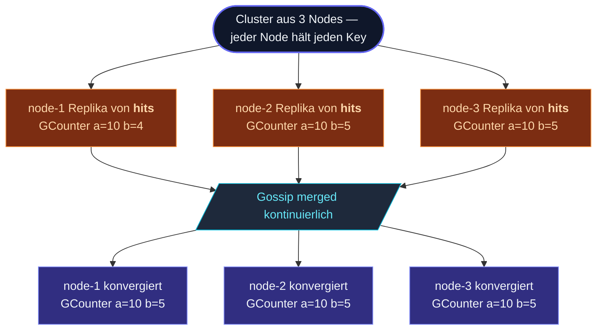

**Distributed Data** ist die Schicht für **eventually consistent
shared state** im Cluster.  Jeder Node hält eine **lokale Replika**
jedes Keys.  Updates werden zuerst lokal angewendet; Gossip
propagiert sie; konfliktierende nebenläufige Updates mergen
automatisch über die CRDT-Semantik des Datentyps.



Der geteilte Zustand ist ein **CRDT** — Conflict-free Replicated
Data Type.  Eine Handvoll sorgfältig entworfener Typen (Counter,
Sets, Register, Maps), deren Merge-Operation **kommutativ,
assoziativ und idempotent** ist: Gossip darf Updates in beliebiger
Reihenfolge zustellen, sie wiederholen oder verlieren — die
Replikas konvergieren trotzdem zum selben Wert.

## Wann du DistributedData einsetzt

Drei Muster:

1. **Cluster-weite Counter und Gauges** — Gesamtzahl der Requests,
   aktive Sessions, aktuelles Rate Limit.  Jeder Node kann lesen
   und schreiben, ohne sich abzustimmen; der gemergte Wert ist
   die globale Wahrheit.
2. **Mengen für Membership** — "welche Sessions sind aktiv",
   "welche Feature Flags sind aktiviert".  Elemente von jedem
   Node hinzufügen und entfernen; die Set-Semantik kümmert sich
   korrekt um nebenläufige Adds.
3. **Konfigurations-Register** — ein einzelner Wert, den Nodes
   schreiben und lesen; Timestamps entscheiden bei nebenläufigen
   Writes über den Gewinner.

## Ein minimales Beispiel

```ts
import { ActorSystem, Cluster, ClusterOptions } from 'actor-ts';
import { DistributedDataId, GCounter } from 'actor-ts';

const system  = ActorSystem.create('my-app');
const clusterOptions = ClusterOptions.create()
  .withHost(host)
  .withPort(port)
  .withSeeds(seeds);
const cluster = await Cluster.join(system, clusterOptions);
const dd      = system.extension(DistributedDataId).start(cluster);

// Counter inkrementieren — keine Koordination, einfach in die lokale Replika mergen.
dd.update<GCounter>(
  'request-count',
  GCounter.empty,
  (c) => c.increment(dd.selfReplicaId(), 1),
);

// Lokale Sicht lesen — liefert den letzten bekannten gemergten Stand.
const counter = dd.get<GCounter>('request-count');
console.log(counter?.value);   // Summe über alle bekannten Replikas
```

Das lokale Update ist sofort wirksam; Gossip propagiert es in
den nächsten Runden zu den Peers.  Reads sind immer lokal (billig,
kein Netzwerk) und liefern, was die lokale Replika aktuell weiß
— was zum globalen Stand konvergiert.

## Die CRDT-Typen

| Typ | Was es ist | Wann |
| --- | --- | --- |
| **`GCounter`** | Grow-only Counter.  Jede Replika zählt ihren eigenen Beitrag; der Wert ist die Summe. | Counts, die nur steigen — Impressions, abgeschlossene Jobs. |
| **`PNCounter`** | Counter mit Inkrement und Dekrement (intern zwei `GCounter`). | Counts, die in beide Richtungen gehen — aktive Sessions. |
| **`GSet`** | Grow-only Set.  Nur Adds, keine Removes. | Append-only Collections — beobachtete Event-Typen, gesehene User. |
| **`ORSet`** | Observed-Remove Set.  Adds und Removes; nebenläufiges Add+Remove löst sich zu Add auf (das Add wurde beobachtet). | Membership-Sets, in denen Elemente kommen und gehen. |
| **`LWWRegister<T>`** | Last-Writer-Wins Register.  Ein einzelner Wert, Gewinner ist der jüngste Timestamp. | Konfig mit einem Wert — Feature Flag, letzter bekannter Leader. |
| **`MVRegister<T>`** | Multi-Value Register.  Nebenläufige Writes werden als Set gehalten; der Caller wählt. | Wenn du erkennen musst, dass "zwei Replikas gleichzeitig geschrieben haben". |
| **`LWWMap<K, V>`** | Eine Map von `K` auf LWW-Werte. | Konfig pro Key mit einem Wert. |
| **`ORMap<K, C>`** | Eine Map, deren Werte selbst CRDTs sind. | Counter pro Key, Sets pro Key. |
| **`GCounterMap<K>`** | Convenience: eine Map von GCounters. | Klicks pro Key, Requests pro Tenant. |

In [CRDT-Typen](/de/distributed-data/crdt-types/) findest du den
Deep Dive zu jedem — `merge()`-Semantik, wann sie passen, wann
nicht.

## Konsistenz-Stellschrauben

Reads und Writes haben beide einen **Consistency**-Parameter:

```ts
await dd.updateAsync('hits', GCounter.empty,
  (c) => c.increment(dd.selfReplicaId(), 1),
  { consistency: 'majority', timeoutMs: 2_000 });

const hits = await dd.getAsync<GCounter>('hits',
  { consistency: 'majority' });
```

| Level | Was es bedeutet |
| --- | --- |
| `'local'` *(Default)* | Lokal anwenden; auf Gossip vertrauen, dass es propagiert.  Read liefert die Sicht der lokalen Replika. |
| `'majority'` | Warten, bis ⌈N/2 + 1⌉ Replikas geACKt haben.  Read merged die Mehrheitsantworten. |
| `'all'` | Auf jedes Up-Member warten.  Stärkste Konsistenz, höchste Latenz. |
| `{ kind: 'count'; n: 3 }` | Auf genau `n` ACKs warten. |

Quorum ändert die Merge-Semantik nicht — jedes Update merged
irgendwann in jede Replika.  Quorum gibt dir nur eine **Garantie**,
*wann* genügend Replikas den Write gesehen haben.

Für die meisten Reads und Writes ist `'local'` der richtige
Default.  Greife zu `'majority'`, wenn:

- Ein Read einen kürzlich von *dir* geschriebenen Write
  reflektieren soll — `'local'` funktioniert nur, wenn du auf
  demselben Node liest, auf dem du geschrieben hast; Majority
  Reads decken den knotenübergreifenden Fall ab.
- Ein Write "durable" sein soll, bevor du dem Client antwortest
  — `'majority'` stellt sicher, dass ein Node-Ausfall ihn nicht
  verliert.

## Auf Änderungen subscriben

```ts
const unsubscribe = dd.subscribe<GCounter>('hits', (counter) => {
  console.log(`hits liegt jetzt bei ${counter.value}`);
});

// ... später
unsubscribe();
```

Der Callback feuert synchron nach jedem erfolgreichen Update
oder Merge, *der den lokalen Wert ändert*.  Nutze ihn, um
DistributedData mit dem Rest deiner App zu verdrahten — etwa um
ein UI bei Änderungen zu aktualisieren oder Folge-Logik
anzustoßen, wenn ein Counter eine Schwelle überschreitet.

## Persistenz

Standardmäßig ist DistributedData nur in-memory.  Wenn der ganze
Cluster neu startet (Cold Start), beginnt jeder Key wieder leer.

Für **Restart-überlebende** Semantik nutzt du die **durable**-Variante:

```ts
import { DistributedDataOptions, InMemoryDurableStateStore } from 'actor-ts';

const store = new InMemoryDurableStateStore();
const distributedDataOptions = DistributedDataOptions.create().withDurableStore(store);
const dd = system.extension(DistributedDataId).start(
  cluster,
  distributedDataOptions,
);
```

`withDurableStore` nimmt jeden [`DurableStateStore`](/de/persistence/durable-state/)
(hier InMemory; ein SQL- oder Object-Storage-Backend in Produktion).
Die Durable-Schicht persistiert die **gesamte Sicht** der Replika in
den Store; beim Neustart wird der Stand wiederhergestellt, bevor sie
Gossip beitritt.

Siehe [Durable Storage](/de/distributed-data/durable-storage/)
für die Konfigurationsdetails.

## Wann du DistributedData NICHT einsetzt

import { Aside } from '@astrojs/starlight/components';

<Aside type="caution" title="Starke Konsistenz nötig">
  DistributedData ist **eventually consistent**.  Ein Read kann
  für ein paar hundert ms nach einem Write auf einem anderen
  Node noch veralteten Stand liefern.  Wenn du in Echtzeit
  brauchst, dass "jeder Read jeden vorherigen Write sieht",
  nimm einen Singleton oder einen Persistent Actor mit
  expliziter Koordination.
</Aside>

<Aside type="caution" title="Hohe Kardinalität im Keyspace">
  Jeder Node hält jeden Key.  10 000 Keys sind in Ordnung; 10
  Millionen sind es nicht.  Für State pro Key in dieser
  Größenordnung nimm
  [Sharding](/de/cluster/sharding/overview/) — jede Entity ist
  dann ein Actor auf einem Node, nicht repliziert.
</Aside>

<Aside type="caution" title="Große Werte pro Key">
  Ein 10 MB großes Blob in jeder Gossip-Runde zu jedem Node zu
  schicken, ist Verschwendung.  DistributedData ist für *kleinen*
  geteilten Zustand gedacht — Counter, Flags, ID-Sets.  Für
  große Daten (komplette Konfigurationen, Dokumente) nimm ein
  Persistent Journal oder einen dedizierten Key-Value-Store mit
  Referenz-Lookups.
</Aside>

<Aside type="caution" title="Reihenfolge-empfindliche Logik">
  CRDT-Merge ist per Design **reihenfolge-unabhängig**.  Wenn die
  Korrektheit deiner App davon abhängt, ob "Inkrement, Dekrement,
  Inkrement" oder "Inkrement, Inkrement, Dekrement" gelaufen ist,
  produziert das CRDT denselben Endwert (`+1` in beiden Fällen),
  aber die Zwischenzustände sind weg.  Meistens kein Problem;
  wenn doch, brauchst du Event Sourcing, kein CRDT.
</Aside>

## Wohin als Nächstes

- **[CRDT-Typen](/de/distributed-data/crdt-types/)** —
  Deep Dive zur Semantik jedes Typs.
- **[Replikation](/de/distributed-data/replication/)** — wie
  Gossip Updates zwischen Replikas verteilt.
- **[Quorum Reads/Writes](/de/distributed-data/quorum-reads-writes/)** —
  die Konsistenz-Stellschrauben im Detail.
- **[Durable Storage](/de/distributed-data/durable-storage/)** —
  für State, der Restarts überlebt.
- **[Cluster im Überblick](/de/cluster/overview/)** — das
  Membership-Modell darunter.
- **[Sharding im Überblick](/de/cluster/sharding/overview/)** —
  die Per-Key-Alternative, wenn Keys zu zahlreich für Replikation
  sind.

Die [`DistributedData`](/api/classes/distributeddata/)-API-Referenz
deckt die vollständige Extension-Oberfläche ab.
