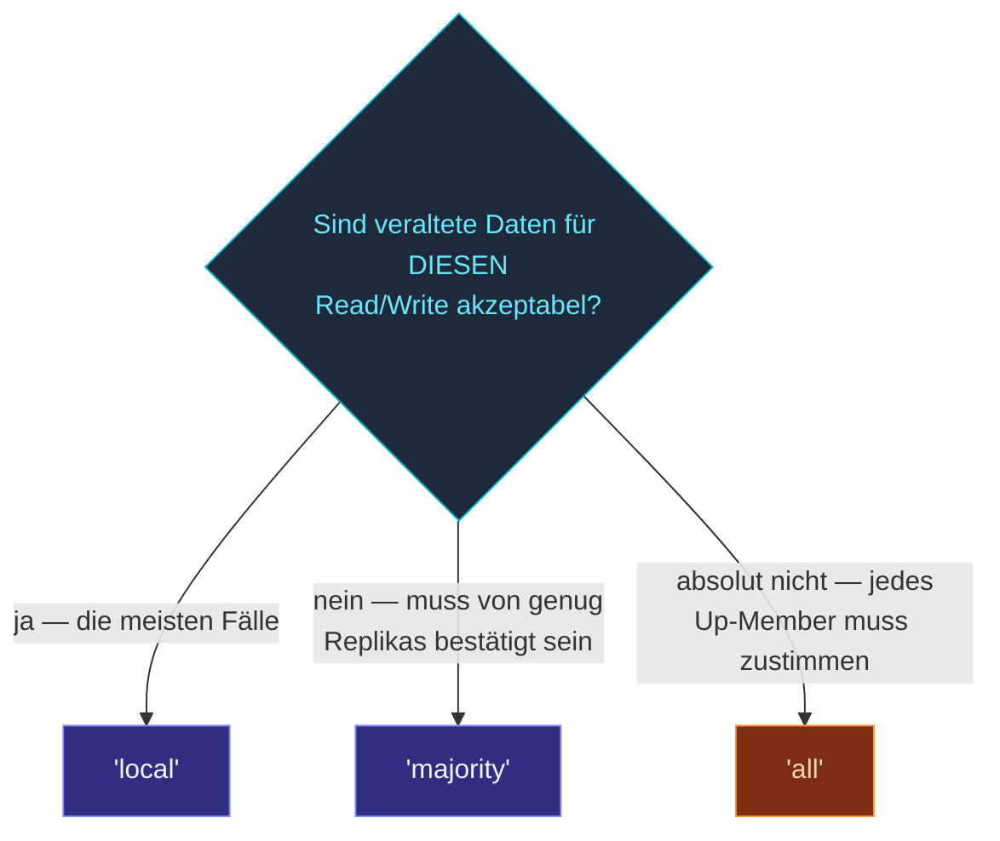

Die Default-Operationen `update` / `get` von DistributedData sind
**nur lokal** — sie werden sofort auf die lokale Replika
angewendet; die Propagation passiert via Gossip.  Für Workloads,
die stärkere Garantien brauchen, warten die Varianten
**`updateAsync`** und **`getAsync`** auf explizite
Replika-Bestätigungen.

## Local — der Default

```ts
dd.update<GCounter>(
  'hits',
  GCounter.empty,
  (c) => c.increment(dd.selfReplicaId(), 1),
);

const counter = dd.get<GCounter>('hits');
```

Diese Operationen:

- **`update`** — wende lokal an, fire-and-forget.  Kehrt sofort
  zurück.
- **`get`** — lese die Sicht der lokalen Replika.

Unter der Haube propagiert Gossip Updates über die nächsten
Runden an andere Replikas.

Das ist der richtige Default — 99 % der DD-Operationen nutzen
diese.

## Wann Local nicht reicht

Drei häufige Fälle:

1. **Read-after-Write über Nodes hinweg.**  Node A schreibt,
   Node B liest sofort — der Write ist vielleicht noch nicht
   gegossipt, also sieht Node B veraltete Daten.
2. **Bestätigter Write.**  Die App will wissen "mindestens N
   andere Replikas haben mein Update, bevor ich weitermache" —
   z. B. bevor dem Client geantwortet wird.
3. **Strongest-known Read.**  Wenn Veraltung für diesen Read
   inakzeptabel ist (Saldo-Check vor einer Zahlung), zwinge den
   Read, die Mehrheit der Replikas zu konsultieren.

## `updateAsync` — auf Write-Bestätigungen warten

```ts
await dd.updateAsync<GCounter>(
  'hits',
  GCounter.empty,
  (c) => c.increment(dd.selfReplicaId(), 1),
  { consistency: 'majority', timeoutMs: 2_000 },
);
```

Wendet lokal an + schickt an die Gossip-Schicht und **wartet
dann auf Bestätigungen** der konfigurierten Anzahl Replikas.

| `consistency` | Worauf gewartet wird |
| --- | --- |
| `'local'` (Default) | Nur auf sich selbst — das lokale Anwenden ist das ACK. |
| `'majority'` | ⌈N/2 + 1⌉ Replikas haben geACKt. |
| `'all'` | Jede Replika der Up-Member hat geACKt. |
| `{ kind: 'count'; n: 3 }` | Genau `n` Replikas haben geACKt. |

Das Promise:

- **Resolved**, wenn genug ACKs innerhalb von `timeoutMs`
  eintreffen.
- **Rejected** mit einem Timeout-Fehler, wenn nicht.

Ein Timeout **macht den lokalen Write nicht rückgängig** — der
Wert ist bereits lokal angewendet und gossipt normal weiter.
Der Reject signalisiert nur "ich bin mir nicht sicher, ob genug
Replikas ihn innerhalb der Deadline gesehen haben".

## `getAsync` — Lesen mit Konsistenz

```ts
const counter = await dd.getAsync<GCounter>('hits',
  { consistency: 'majority' });
```

Dieselben `consistency`-Optionen.  Der Replicator fragt andere
Replikas nach ihrer Sicht, **merged** die Antworten und gibt den
gemergten Wert zurück.

Das heißt, ein Majority Read sieht **mindestens jeden Write, der
Majority-bestätigt wurde** — den letzten "confirmed"-Wert.

## Konsistenz-Level wählen



`'majority'` ist der Sweet Spot für "wichtige" Reads/Writes —
deckt die meisten Failure-Szenarien zu moderater Latenz ab.
`'all'` garantiert Konsistenz, **scheitert aber, wenn auch nur
eine Replika down** (oder langsam) ist — das macht es spröde.

## Pragmatische Muster

### Majority schreiben + lokal lesen

```ts
// Mit Majority schreiben — garantiert, dass andere Replikas Bescheid wissen
await dd.updateAsync('counter', ..., { consistency: 'majority' });

// Lokal lesen — schnell, und der Wert spiegelt (eventually) wider,
// was andere Writer mit Majority geschrieben haben
const value = dd.get('counter');
```

Das ist das **häufige Produktionsmuster**.  Writes zahlen die
Majority-Kosten; Reads sind billig.  Der Cluster konvergiert
irgendwann.

### Majority vor einer kritischen Entscheidung lesen

```ts
// Majority lesen — den letzten bekannten Wert im Cluster sehen
const balance = await dd.getAsync<PNCounter>('balance',
  { consistency: 'majority' });

if (balance.value() < 0) {
  // ... Transaktion ablehnen
}
```

Für einmalige Reads, bei denen Veraltung zählt, zahl die Kosten
für einen starken Read.  Mach nicht jeden Read zu einem
Majority Read — das hebelt das Local-First-Design aus.

### All-Write für unwiderrufliche Änderungen

```ts
await dd.updateAsync('config-locked', ..., { consistency: 'all' });
```

Selten — wenn du brauchst, dass jede Replika die Änderung
gesehen hat, bevor es weitergeht.  Spröde (jede ausgefallene
Replika lässt die Operation scheitern), also wirklich nur für
echt-unwiderrufliche Zustandsübergänge.

## Timeouts

```ts
await dd.updateAsync('x', ..., {
  consistency: 'majority',
  timeoutMs:   5_000,
});
```

Default-Timeout ist `gossipIntervalMs × 5` — fünf Gossip-Runden,
typischerweise 5 Sekunden.  Pro Call überschreiben, wenn:

- **Strengeres Latenz-Budget** — niedriger setzen; früh ablehnen,
  wenn Konsistenz nicht erreicht werden kann.
- **Lockerer** — bei cross-region Clustern mit hoher Gossip-RTT
  das Timeout erhöhen.

Bei Timeout wirft das Promise einen Fehler, den du fangen kannst:

```ts
try {
  await dd.updateAsync('x', ..., { consistency: 'majority', timeoutMs: 1_000 });
} catch (e) {
  // Der Write hat lokal funktioniert, aber das Quorum kam nicht rechtzeitig.
  // Entscheide: erneut versuchen, Fehler nach oben geben, Eventual-Consistency akzeptieren.
}
```

## Was Quorum nicht garantiert

import { Aside } from '@astrojs/starlight/components';

<Aside type="caution" title="`'majority'` ist nicht Linearisierbarkeit">
  Ein Majority Write + ein Majority Read geben dir **keine**
  vollständig linearisierbare Semantik.  Nebenläufige Writes
  mergen weiterhin nach CRDT-Regeln; Majority garantiert nur,
  dass genug Replikas Bescheid wissen.  Für echte
  linearisierbare Shared State nimm einen Singleton.
</Aside>

<Aside type="caution" title="Quorum über einen instabilen Cluster">
  ```ts
  // Cluster aus 3 Nodes; einer ist immer wieder unerreichbar
  await dd.updateAsync('x', ..., { consistency: 'majority' });
  // Mal klappt es (2 ACKs), mal nicht (1 ACK)
  ```
  Quorum ist **im-Moment**.  Wenn sich die Up-Member-Menge des
  Clusters während des Calls ändert, kann das Quorum-Kriterium
  vorübergehend nicht erfüllt sein.  Den entstehenden Timeout
  behandeln — wiederholen oder akzeptieren.
</Aside>

<Aside type="caution" title="Nicht jede Operation quorumen">
  ```ts
  // Jeder Write ist Majority — teuer
  for (const item of items) {
    await dd.updateAsync('counter', ..., { consistency: 'majority' });
  }
  ```
  Quorum-Operationen kosten Gossip-RTT (typischerweise 1-2 s).
  Bei Bulk-Writes **batche und quorume einmal am Ende** oder
  akzeptiere lokale Writes und lass Gossip propagieren.
</Aside>

## Wohin als Nächstes

- **[Distributed Data im Überblick](/de/distributed-data/overview/)** —
  das Gesamtbild.
- **[Replikation](/de/distributed-data/replication/)** —
  wie lokale Writes an Peers propagieren.
- **[Durable Storage](/de/distributed-data/durable-storage/)** —
  für State, der Full-Cluster-Restarts überlebt.
- **[Daten gestalten](/de/distributed-data/crdt-types/designing-data/)** —
  wann DDs Eventual Consistency die falsche Wahl ist.
