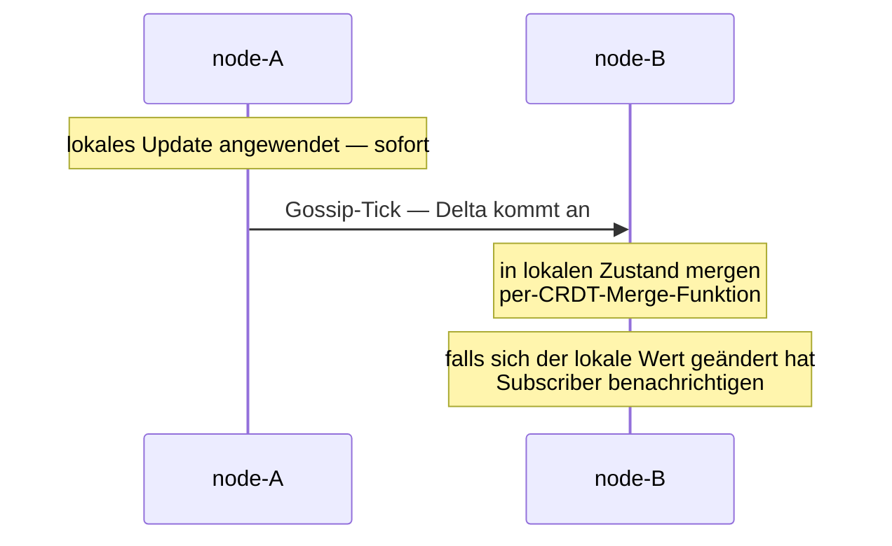

DistributedData repliziert Zustand via **Gossip**:

- Alle `gossipIntervalMs` wählt jeder Node einen zufälligen Peer.
- Der Node sendet seine **State Deltas** seit dem letzten Gossip
  mit diesem Peer.
- Der Peer merged; wenn sich sein Zustand geändert hat,
  benachrichtigt er die lokalen Subscriber.

Das bedeutet, Writes propagieren **eventually** — typischerweise
in 1-2 Gossip-Runden (1-2 Sekunden default).  Für die meisten
Workloads ist das ausreichend; für Fälle, in denen es das nicht
ist, siehe
[Quorum Reads/Writes](/de/distributed-data/quorum-reads-writes/).

## Der Ablauf



Lokale Writes sind **sofort**.  Gossip ist für die
**Propagation**.

## Konfiguration

```ts
const distributedDataOptions = DistributedDataOptions.create()
  .withGossipInterval(1_000);
const dd = system.extension(DistributedDataId).start(
  cluster,
  distributedDataOptions,   // default 1s
);
```

Der Default für `gossipIntervalMs` ist 1 Sekunde — gewählt als
Balance zwischen Propagation-Geschwindigkeit und Gossip-Bandbreite.
Kleinere Intervalle → schnellere Konvergenz + mehr Traffic.
Größere → weniger Traffic, langsamere Konvergenz.

Für typische Anwendungen:

| Workload | Intervall |
| --- | --- |
| Latenz-empfindlicher Shared State (Online-Präsenz) | 250-500 ms |
| Default für die meisten Apps | 1 s |
| Counter / Flags, die sich selten ändern | 2-5 s |
| Sehr große Cluster, wo Bandbreite zählt | 5-10 s |

## Was gegossipt wird

**Nur Deltas** — DistributedData tracked, was jeder Peer gesehen
hat, und sendet nur die Änderungen seit dem letzten erfolgreichen
Austausch.

So ist das Gossip-Volumen proportional zur **Update-Rate**, nicht
zur Gesamt-State-Größe.  Eine Map mit einer Million Einträgen,
die sich nicht ändert, kostet im Gossip nichts; ein kleiner
Counter, der 1000-mal pro Sekunde inkrementiert wird, kostet viel
mehr.

Die Ausnahme: bei einem frischen Peer-Beitritt (oder nach einer
langen Partition) ist der erste Gossip der **Full State** — es
gibt keine Delta-Historie.

## Auswahl des Peers pro Runde

```ts
// Bei jedem Gossip-Tick wählt der Node EINEN zufälligen erreichbaren Peer.
```

Round-Robin-Gossip wäre vorhersagbarer, erzeugt aber
synchronisierte Wellen; ein zufälliger Peer pro Tick verteilt die
Last und konvergiert typischerweise in O(log N) Runden bei N
Peers.

Nach K Runden ist die Wahrscheinlichkeit, dass ein bestimmter
Peer das Update **nicht** erhalten hat, `(1 - 1/N)^K` — für N=10
Nodes und K=5 Runden also < 60 % Wahrscheinlichkeit, dass ein
Peer es nicht gesehen hat; nach K=20 Runden < 13 %.

In der Praxis ist die Konvergenz viel schneller, weil **Gossip
multi-hop** ist: Peers regossipen, was sie erhalten haben.

## Auf Änderungen subscriben

```ts
const unsubscribe = dd.subscribe<GCounter>('hits', (counter) => {
  console.log(`hits liegt jetzt bei ${counter.value()}`);
});

// Später:
unsubscribe();
```

Subscriber feuern **synchron nach jedem erfolgreichen Merge**, der
den lokalen Wert ändert (Deep-Equal-Check über das `toJSON` des
CRDT).

Das heißt:

- **Lokale Updates** → Subscriber feuert sofort.
- **Remote Updates** → Subscriber feuert, wenn Gossip ankommt
  und der Merge den lokalen Wert ändert.
- **Idempotente Updates** → Subscriber feuert NICHT (keine
  Änderung).

Für Dashboard-Widgets, Echtzeit-UI-Updates oder Business-Logik,
die auf Änderungen irgendwo im Cluster reagieren soll, ist
`subscribe` der Hook.

## Peers vergessen

Wenn `MemberRemoved` für ein Cluster-Mitglied feuert:

- Der Replicator vergisst den Gossip-Empfangszustand dieses Peers.
- Die Tombstones des Peers (für ORSet etc.) werden gemäß den
  Pruning-Regeln des CRDT irgendwann aus dem lokalen Zustand
  entfernt.

Das heißt: **Ein Peer, der den Cluster verlässt, leakt keine
Gossip-Historie** — sein Slot im Version Vector verschwindet.

Für Replikas, die später **unter derselben Identität wieder
beitreten könnten** (stabile Pod-Namen, persistente Volumes),
gibt es ein kurzes Fenster, in dem der Zustand des Peers
teilweise vergessen sein kann.  Meist harmlos — ein frisches
Handshake bringt alles zurück.

## Bandbreitenkosten

Grobe Zahlen für einen 10-Node-Cluster mit Default-Gossip von 1
Sekunde:

- **Idle Steady State** — minimaler Traffic (~1 KB/sec pro Paar,
  meist leere Deltas).
- **Aktive Workload** — proportional zur Write-Rate.  Pro Write
  geht eine Delta-Nachricht von ~100-500 Bytes über die nächsten
  Gossip-Runden an jeden Peer.

Für sehr große Cluster (50+ Nodes) kann das Gossip-Volumen
relevant werden.  Das Gossip des Frameworks ist im
**Anti-Entropy**-Stil — all-to-all über die Zeit — was O(N) pro
Node pro Runde skaliert.  Größere Cluster wollen vielleicht ein
größeres `gossipIntervalMs` oder eine andere Gossip-Topologie
(aktuell nicht konfigurierbar; bei Bedarf ein Issue).

## Langsame Propagation diagnostizieren

```ts
// Node-A schreibt:
dd.update('hits', ..., (c) => c.increment('a', 1));

// Node-B liest, aber der Wert spiegelt es nicht wider:
console.log(dd.get('hits')?.value());   // ← zeigt veralteten Wert
```

Wenn dich das überrascht:

1. **Warte eine Gossip-Runde** (Default 1 s).  Die meiste
   sichtbare Veraltung löst sich in 1-2 Gossip-Zyklen.
2. **Prüfe `gossipIntervalMs`** — wenn höher als der Default
   gesetzt, ist die Wartezeit proportional.
3. **Nutze `getAsync` mit `consistency: 'majority'`** für Reads,
   die den letzten bekannten Stand über die Replikas hinweg
   reflektieren müssen.
4. **Prüfe Cluster-Membership** — wenn node-B von node-A aus
   unerreichbar ist, fließt kein Gossip.

import { Aside } from '@astrojs/starlight/components';

<Aside type="caution" title="Gossip überbrückt keine Partitionen">
  ```ts
  // node-A und node-B können einander nicht erreichen (Partition)
  // node-A schreibt "x"
  // node-B liest — sieht "x" nie, bis die Partition geheilt ist
  ```
  Das ist per Design — CRDTs garantieren Eventual Convergence,
  nicht Echtzeit-Zustellung.  Partitions-tolerante Systeme
  sollten das akzeptieren und Lesepfade entwerfen, die mit
  veralteten Daten während einer Partition funktionieren.
</Aside>

<Aside type="caution" title="Subscriber feuern bei jeder Änderung">
  ```ts
  dd.subscribe('hits', (counter) => {
    expensiveCall();   // läuft jedes Mal, wenn sich der Counter ändert
  });
  ```
  In einer Workload mit vielen Writes können Subscriber viele
  Male pro Sekunde feuern.  Debounce oder throttle im Handler,
  wenn teure Arbeit dranhängt.
</Aside>

<Aside type="caution" title="Subscriptions sind lokal">
  ```ts
  // Subscribe auf node-A sieht keine Updates, die noch nicht gegossipt wurden
  ```
  Eine Subscription feuert, wenn der **lokale** Wert sich ändert
  — nicht, wenn der "wahre" Wert des Clusters sich ändert.
  Updates von node-B triggern den Subscriber auf node-A erst,
  wenn das Gossip eintrifft.
</Aside>

## Wohin als Nächstes

- **[Distributed Data im Überblick](/de/distributed-data/overview/)** —
  das Gesamtbild.
- **[Quorum Reads/Writes](/de/distributed-data/quorum-reads-writes/)** —
  die Konsistenz-Stellschrauben für stärkere Garantien.
- **[Durable Storage](/de/distributed-data/durable-storage/)** —
  Replika-State für Restart-Recovery auf Disk persistieren.
- **[Cluster im Überblick](/de/cluster/overview/)** — das
  Membership-Modell darunter.
