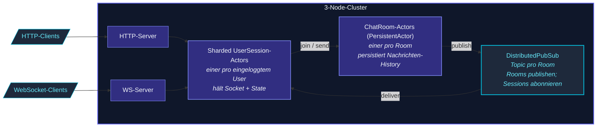

Das Chat-Sample ist eine **komplette Demo-App**, die zeigt, wie
die Teile des Frameworks zusammenspielen:

- **Cluster** aus 3 Nodes (über Docker Compose).
- **Sharded User-Session-Actors** - einer pro eingeloggtem User.
- **DistributedPubSub** für Cross-Node-Chatroom-Broadcasts.
- **PersistentActor** für die Chatroom-History.
- **HTTP + WebSocket** für das Client-Interface.

Zu finden unter [`examples/chat/`](https://github.com/pathosDev/actor-ts/tree/main/examples/chat)
im Repo.

## Architektur



Der vollständige Pfad eines "User sendet Nachricht"-Flows:

```
1. Der WS-Client des Users sendet "send-message" an seinen HTTP-Server.
2. Der WS-Handler leitet an den UserSession-Actor des Users weiter (sharded).
3. UserSession fragt den zuständigen ChatRoom-Actor (sharded nach Room-ID).
4. ChatRoom persistiert die Nachricht via PersistentActor.persist().
5. ChatRoom publisht auf DistributedPubSub auf das Topic "room.<roomId>".
6. Jede UserSession, die dieses Topic abonniert hat, empfängt die Nachricht.
7. UserSessions pushen an ihre jeweiligen WS-Clients.
```

Cluster + Persistenz + PubSub + WebSocket - alle zusammen am
Werk.

## Ausführen

```bash
# Repo klonen:
git clone https://github.com/pathosDev/actor-ts.git
cd actor-ts/examples/chat

# Alles starten (Cluster + Cassandra + WS):
docker compose up -d

# Cluster prüfen:
curl http://localhost:8551/cluster/members
# → 3 members "up"

# Chat-UI öffnen:
open http://localhost:3000
```

Das Docker-Compose-Setup startet:

- 3 actor-ts-Pods.
- 1 Cassandra-Node (geteiltes Journal für persistente Rooms).
- 1 Nginx vor den HTTP+WS-Endpoints.

## Demonstrierte Schlüssel-Patterns

### Sharded Sessions

```ts
const startShardingOptions = StartShardingOptions.create<SessionMessage>()
  .withTypeName('session')
  .withEntityProps(Props.create(() => new UserSessionActor()))
  .withExtractEntityId((message) => message.userId)
  .withRememberEntities(true);
const sessionRegion = cluster.sharding.start(startShardingOptions);
```

Ein Actor pro eingeloggtem User, verteilt über die Nodes.
`rememberEntities` erhält die Registry über Failover hinweg.

### PersistentActor für Rooms

```ts
class ChatRoomActor extends PersistentActor<RoomCommand, RoomEvent, RoomState> {
  readonly persistenceId = `room-${this.roomId}`;
  // ... onCommand persistiert; onEvent aktualisiert State ...
}
```

Jeder Room-Actor zeichnet jede Nachricht auf; Recovery spielt
sie zurück.

### Distributed Pub/Sub für Fan-out

```ts
// ChatRoom publisht nach dem Persistieren:
ps.mediator.tell(new Publish(`room.${roomId}`, message));

// UserSession abonniert, wenn der User einem Room beitritt:
ps.mediator.tell(new Subscribe(`room.${roomId}`, this.self));
```

Sessions auf beliebigen Nodes empfangen Room-Nachrichten,
unabhängig davon, auf welchem Node der ChatRoom publisht.

### WebSocket pro User

```ts
class UserSessionActor extends Actor<SessionMessage> {
  private ws: WebSocket | null = null;

  override onReceive(message: SessionMessage): void {
    if (message.kind === 'connect-ws') this.ws = message.socket;
    if (message.kind === 'inbound')    this.ws?.send(JSON.stringify(message.payload));
  }
}
```

Jede Session hält den WebSocket ihres Users; Sends pushen direkt
zum Client.

## Was es nicht demonstriert

- **Sharded Daemon Processes** - das Chat-Sample braucht keine
  fixen Background-Worker.
- **DistributedData CRDTs** - Chat-Daten gehen durch
  PersistentActor, nicht DD.
- **Replicated Event Sourcing** - ein Single-Writer pro Room
  reicht aus.

Dafür siehe die
[eigenständigen Snippets](/de/examples/stand-alone-snippets/)
oder das [Voice-Sample](/de/examples/voice-sample/).

## Dateistruktur

```
examples/chat/
├── docker-compose.yml
├── README.md
├── package.json
├── src/
│   ├── main.ts                  # Einstieg: Cluster-Join + HTTP/WS-Bind
│   ├── actors/
│   │   ├── UserSessionActor.ts
│   │   └── ChatRoomActor.ts
│   ├── messages.ts              # geteilte Nachrichten-Typen
│   └── handlers/
│       ├── httpRoutes.ts
│       └── wsHandlers.ts
└── ui/                          # minimale HTML/JS-Chat-UI
```

~500 Zeilen TypeScript insgesamt.  Gute Größe, um es
end-to-end zu lesen.

## Wohin als Nächstes

- **[Voice-Sample](/de/examples/voice-sample/)** -
  Broker-Integration + Projektionen.
- **[Sharding-Übersicht](/de/cluster/sharding/overview/)** -
  das Actor-pro-Entity-Pattern.
- **[DistributedPubSub](/de/cluster/pubsub/)** - Cluster-PubSub.
- **[PersistentActor](/de/persistence/persistent-actor/)** -
  Event-Sourced Rooms.
