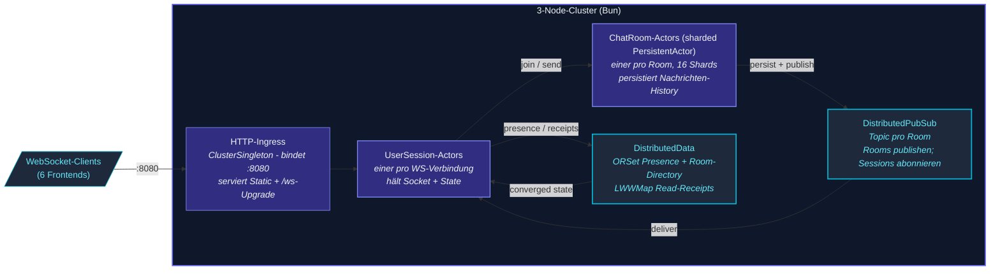

Das Chat-Sample ist eine **komplette Demo-App**, die zeigt, wie
die Teile des Frameworks zusammenspielen:

- **TCP-Cluster** aus 3 Bun-Prozessen, per Gossip verbunden.
- **Sharded Chatroom-Actors** - ein `ChatRoomActor` pro Room,
  über den Cluster als 16 Shards verteilt.
- **DistributedPubSub** für Cross-Node-Chatroom-Broadcasts.
- **PersistentActor** für die Chatroom-History (SQLite-Journal +
  Snapshots).
- **DistributedData** für Presence, das Laufzeit-Room-Directory
  und Read-Receipts.
- **ClusterSingleton** als HTTP-Eingangstür - ein Node bindet
  `:8080`; bei Failover übernimmt ein überlebender Node den Bind.
- **WebSocket-only**-Client-Protokoll - ein einziger
  `/ws`-Endpoint trägt Login, Rooms, History, Presence und
  Nachrichten.

Zu finden unter [`examples/chat/`](https://github.com/pathosDev/actor-ts/tree/main/examples/chat)
im Repo.

## Architektur


```mermaid
flowchart LR
  WS[/"WebSocket-Clients<br/>(6 Frontends)"/]
  subgraph CLUSTER["3-Node-Cluster (Bun)"]
    direction TB
    ING["HTTP-Ingress<br/><i>ClusterSingleton - bindet :8080<br/>serviert Static + /ws-Upgrade</i>"]
    US["UserSession-Actors<br/><i>einer pro WS-Verbindung<br/>hält Socket + State</i>"]
    ROOM["ChatRoom-Actors (sharded PersistentActor)<br/><i>einer pro Room, 16 Shards<br/>persistiert Nachrichten-History</i>"]
    PUB["DistributedPubSub<br/><i>Topic pro Room<br/>Rooms publishen; Sessions abonnieren</i>"]
    DD["DistributedData<br/><i>ORSet Presence + Room-Directory<br/>LWWMap Read-Receipts</i>"]
    ING --> US
    US -- "join / send" --> ROOM
    ROOM -- "persist + publish" --> PUB
    PUB -- "deliver" --> US
    US -- "presence / receipts" --> DD
    DD -- "converged state" --> US
  end
  WS -- ":8080" --> ING
  classDef client  fill:#1e293b,stroke:#06b6d4,color:#67e8f9;
  classDef cluster fill:#0f172a,stroke:#6366f1,stroke-width:2px,color:#f1f5f9;
  classDef edge    fill:#312e81,stroke:#818cf8,color:#f1f5f9;
  classDef actor   fill:#312e81,stroke:#818cf8,stroke-width:1.5px,color:#f1f5f9;
  classDef bus     fill:#1e293b,stroke:#06b6d4,stroke-width:2px,color:#67e8f9;
  class WS client
  class CLUSTER cluster
  class ING edge
  class US,ROOM actor
  class PUB,DD bus
```

Der vollständige Pfad eines "User sendet Nachricht"-Flows:

```
1. Der WS-Client sendet einen "send"-Frame über /ws an den Ingress-Singleton.
2. Der Ingress routet ihn an den UserSession-Actor dieser Verbindung (einer pro Socket).
3. UserSession informiert die zuständige ChatRoom-Entity (sharded nach Room-Name).
4. ChatRoom persistiert die Nachricht via PersistentActor.persist().
5. ChatRoom publisht auf DistributedPubSub auf das Topic des Rooms.
6. Jede UserSession, die dieses Topic abonniert hat, empfängt die Nachricht.
7. Jede UserSession pusht sie an ihren eigenen WS-Client.
```

Cluster + Persistenz + PubSub + WebSocket - alle zusammen am
Werk.

## Ausführen

```bash
# Repo klonen und Dev-Deps installieren:
git clone https://github.com/pathosDev/actor-ts.git
cd actor-ts
bun install

# 3-Node-Cluster starten - drei Terminals, gleicher Befehl, keine Flags:
bun examples/chat/backend/main.ts
bun examples/chat/backend/main.ts
bun examples/chat/backend/main.ts

# Chat-UI öffnen (eine URL, egal welcher Node den Singleton hält):
open http://localhost:8080/
```

Jeder Node führt dasselbe Binary aus. Sie finden einander,
indem sie den Cluster-Port-Bereich ab `2551` scannen, sodass
sich die drei Terminals ohne konfigurierte Seeds auf
`2551 / 2552 / 2553` einpendeln. Der Cluster wählt dann einen
Node, der den HTTP-Ingress-`ClusterSingleton` betreibt; dieser
bindet `:8080` und serviert den Frontend-Selector sowie den
`/ws`-Endpoint. Die Persistenz ist ein lokales SQLite-Journal +
Snapshot-Store unter `./data/` - keine externe Datenbank.
Beende den Node, der den Singleton hält, und ein überlebender
Node bindet `:8080` innerhalb weniger Sekunden neu; die
persistierte History bleibt erhalten.

### Den Round-Trip verifizieren

`smoke-test.ts` meldet Alice an, sendet drei Nachrichten, wartet
auf die Broadcast-Echos, meldet dann Bob über eine frische
Verbindung an und prüft, dass er Alices History sieht — dazu
Direktnachrichten, Tipp-Indikatoren, Lesebestätigungen und das
Auth-Hardening.

```bash
# Against the cluster you already have up:
bun examples/chat/smoke-test.ts

# Or let it bring its own node up, on ports of its own:
bun examples/chat/smoke-test.ts --spawn-backend
```

`--spawn-backend` startet einen einzelnen Node auf `:8090`
(Cluster `:2590`) gegen ein Wegwerf-Journal und stoppt ihn danach
wieder. Diese Ports liegen außerhalb des Auto-Discovery-Fensters
des Backends, sodass ein selbst gestarteter Lauf weder einem
bereits laufenden Cluster beitritt noch mit ihm kollidiert.

Genau dieses Flag lässt CI die Datei unbeaufsichtigt ausführen:
sie ist Teil des [Beispiel-Gates](/de/examples/overview/#in-ci-abgesichert),
eine Framework-Änderung, die den Chat-Protokoll-Round-Trip bricht,
wird damit zum roten Check.

`failover-test.ts` — das Geschwister-Skript, das den
Singleton-Halter killt und auf einen überlebenden Node wartet, der
`:8080` neu bindet — bleibt ein manueller Schritt: zwei seiner drei
Backends wurden dabei beobachtet, wie sie einen sauberen Exit
überlebten und ihre Cluster-Ports gegen alles Nachfolgende hielten.

## Demonstrierte Schlüssel-Patterns

### Sharded Chatrooms

```ts
const chatRoomRegion = cluster.sharding.start('ChatRoom', ChatRoomActor,
  StartShardingOptions.create<ChatRoomCommand>()
    .withExtractEntityId((message) => message.room)
    .withNumShards(16));
```

Ein `ChatRoomActor` pro Room, über den Cluster als 16 Shards
verteilt - beende einen beliebigen Node, und die überlebenden
Nodes übernehmen dessen Rooms. Direct-Message-Channels nutzen
dasselbe Pattern in einer separaten Region, gekeyt auf die
kanonische DM-Pair-ID.

### PersistentActor für Rooms

```ts
class ChatRoomActor extends PersistentActor<ChatRoomCommand, ChatEvent, ChatState> {
  readonly persistenceId = `room-${this.roomName}`;
  // ... onCommand persistiert; onEvent aktualisiert State ...
}
```

Jeder Room-Actor zeichnet jede Nachricht auf; Recovery spielt
sie zurück.

### Distributed Pub/Sub für Fan-out

```ts
// ChatRoom publisht nach dem Persistieren:
ps.mediator.tell(new Publish(`room.${roomId}`, message));

// UserSession abonniert, wenn der User einem Room beitritt:
ps.mediator.tell(new Subscribe(`room.${roomId}`, this.self));
```

Sessions auf beliebigen Nodes empfangen Room-Nachrichten,
unabhängig davon, auf welchem Node der ChatRoom publisht.

### WebSocket pro User

```ts
class UserSessionActor extends Actor<SessionMessage> {
  private ws: WebSocket | null = null;

  override onReceive(message: SessionMessage): void {
    match(message)
      .with({ kind: 'connect-ws' }, (m) => this.onConnectWs(m))
      .with({ kind: 'inbound' }, (m) => this.onInbound(m))
      .exhaustive();
  }

  private onConnectWs(message: ConnectWsMessage): void {
    this.ws = message.socket;
  }

  private onInbound(message: InboundMessage): void {
    this.ws?.send(JSON.stringify(message.payload));
  }
}
```

Jede Session hält den WebSocket ihres Users; Sends pushen direkt
zum Client.

## Was es nicht demonstriert

- **Sharded Daemon Processes** - das Chat-Sample braucht keine
  fixen Background-Worker.
- **Replicated Event Sourcing** - ein Single-Writer pro Room
  reicht aus.

Dafür siehe die
[eigenständigen Snippets](/de/examples/stand-alone-snippets/)
oder das [Voice-Sample](/de/examples/voice-sample/).

## Dateistruktur

```
examples/chat/
├── README.md
├── application.conf            # HOCON: Log-Level, Gossip-Kadenz
├── data/                       # SQLite-Journal + Snapshots (gitignored)
├── backend/
│   ├── main.ts                 # Einstieg: nur Wiring (Cluster, Persistenz, Sharding, Singleton)
│   ├── config.ts               # CLI-Argument-Parsing
│   ├── routes.ts               # HTTP-DSL-Route (Frontend-Selector)
│   ├── auth/                   # scrypt-Passwortprüfung + HMAC-Session-Tokens
│   ├── discovery/              # Same-Host-Port-Scan-Seed-Provider
│   └── actors/
│       ├── ChatRoomActor.ts             # sharded PersistentActor (pro Room)
│       ├── ChatRoomDirectoryActor.ts    # DistributedData ORSet (Laufzeit-Rooms)
│       ├── DirectMessageChannelActor.ts # sharded PersistentActor (pro DM-Paar)
│       ├── UserSessionActor.ts          # Session pro WS-Verbindung
│       ├── OnlineUsersActor.ts          # DistributedData ORSet (Presence)
│       ├── ReadReceiptsActor.ts         # DistributedData LWWMap (Read-Pointer)
│       ├── HttpIngressActor.ts          # ClusterSingleton: hält den :8080-Bind
│       └── WebsocketIngressActor.ts     # WS-Plumbing pro Verbindung
├── shared/
│   ├── protocol.ts             # geteilte WS-Nachrichten-Typen
│   ├── rooms.ts                # Default-Room-Liste
│   ├── users.ts                # Test-Credentials
│   └── directMessage.ts        # Kanonisierung der DM-Pair-ID
├── static/                     # gebaute Frontend-Assets (@fastify/static)
├── frontend-{plain,angular,react,next,svelte,lit}/   # sechs UI-Varianten
├── smoke-test.ts               # Single-Node-Messaging-Round-Trip
└── failover-test.ts            # HTTP-Singleton-Failover
```

Jeder Actor lebt in seiner eigenen Datei unter
`backend/actors/`; `main.ts` ist reines Wiring. Sechs Frontends
teilen sich ein WebSocket-Protokoll, sodass du sie direkt
nebeneinander vergleichen kannst.

## Wohin als Nächstes

- **[Voice-Sample](/de/examples/voice-sample/)** -
  Broker-Integration + Projektionen.
- **[Sharding-Übersicht](/de/cluster/sharding/overview/)** -
  das Actor-pro-Entity-Pattern.
- **[DistributedPubSub](/de/cluster/pubsub/)** - Cluster-PubSub.
- **[PersistentActor](/de/persistence/persistent-actor/)** -
  Event-Sourced Rooms.
