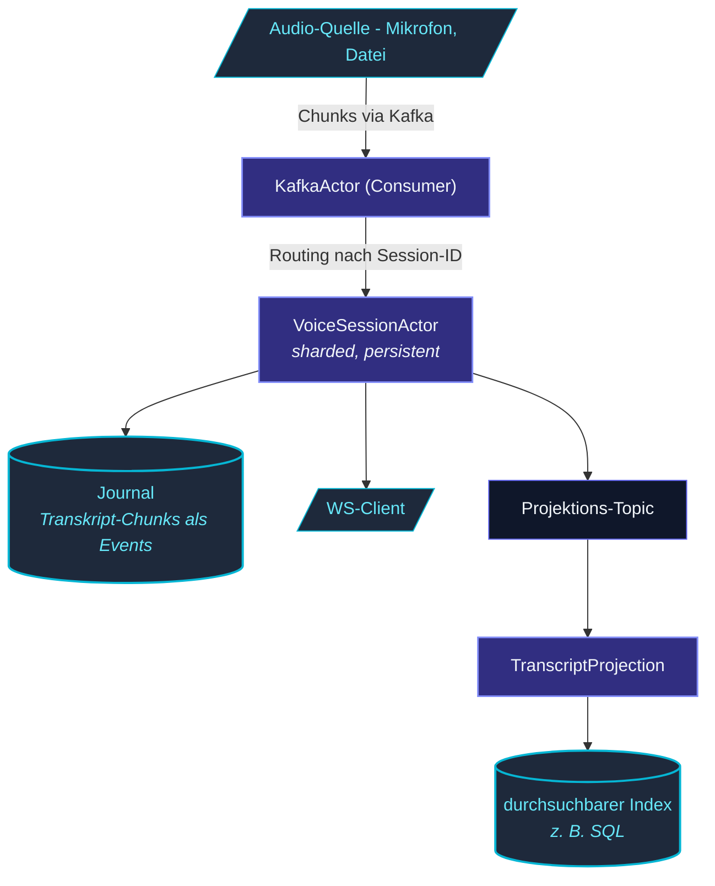

Das Voice-Sample ist eine **Streaming-Audio-App**, die zeigt:

- **Kafka-Integration** - Audio-Chunks fließen über ein
  Kafka-Topic herein.
- **Sharded Session-Actors** - einer pro aktiver Voice-Session.
- **PersistentActor** - Transkript wird als Events persistiert.
- **Projektion** - Read-Side-View für Transkript-Suche.
- **WebSocket** - Live-Transkript-Streaming zum Client.

Zu finden unter [`examples/voice/`](https://github.com/pathosDev/actor-ts/tree/main/examples/voice)
im Repo.

## Architektur



## Ausführen

```bash
git clone https://github.com/pathosDev/actor-ts.git
cd actor-ts/examples/voice

docker compose up -d
# Startet: 3 actor-ts-Nodes, Kafka, Zookeeper, Cassandra, Nginx

# Audio streamen (Mock-Client):
bun run client/mock-stream.ts ./test-audio.wav

# Transkripte beobachten:
open http://localhost:3000
```

Die Transkripte erscheinen live in der UI, während die
Audio-Chunks verarbeitet werden.

## Demonstrierte Schlüssel-Patterns

### Broker-Integration

```ts
const kafka = system.actorOf(
  Props.create(() => new KafkaActor({
    brokers: ['kafka:9092'],
    consumer: { groupId: 'voice-processor', topics: ['audio-chunks'] },
  })),
);

kafka.tell({ kind: 'subscribe', subscriber: dispatchActor });
```

Ein Broker-Actor konsumiert Audio-Chunks; ein Dispatch-Actor
routet sie an die passende sharded Session.

### Sharded + persistente Session

```ts
class VoiceSessionActor extends PersistentActor<SessionCmd, SessionEvent, SessionState> {
  readonly persistenceId = `voice-${this.sessionId}`;

  override onEvent(state, event) {
    if (event.kind === 'chunk-transcribed') {
      return { ...state, transcript: state.transcript + event.text };
    }
    return state;
  }

  async onCommand(state, cmd: SessionCmd) {
    if (cmd.kind === 'audio-chunk') {
      const text = await transcribe(cmd.audioBytes);
      this.persist({ kind: 'chunk-transcribed', text, ts: Date.now() }, () => {
        // Push an den WS-Client
        this.context.system.eventStream.publish(new TranscriptUpdate(this.sessionId, text));
      });
    }
  }

  override tagsFor(event: SessionEvent) {
    return event.kind === 'chunk-transcribed' ? ['transcript'] : undefined;
  }
}
```

Beachte:

- **Sharded** - ein Actor pro Session-ID, verteilt über die
  Nodes.
- **Persistent** - Transkripte überleben Restart + Failover.
- **Getaggt** - `'transcript'`-Events füttern die Projektion.

### Projektion für Suche

```ts
const projection = ProjectionActor.byTag<SessionEvent>({
  name: 'transcript-search',
  tag:  'transcript',
  query: new CassandraQuery({ /* ... */ }),
  offsetStore: new SqliteOffsetStore({ path: '/var/lib/offsets.db' }),
  async handle(event) {
    if (event.event.kind === 'chunk-transcribed') {
      await searchDb.execute(
        `INSERT INTO transcripts (sessionId, text, ts) VALUES (?, ?, ?)
         ON CONFLICT (sessionId, ts) DO NOTHING`,
        [event.persistenceId, event.event.text, event.event.ts],
      );
    }
  },
});

system.actorOf(Props.create(() => projection));
```

Die Projektion liest die `'transcript'`-getaggten Events des
Journals und schreibt in eine such-optimierte Tabelle - getrennt
vom Session-Journal.

### WebSocket-Pushes

```ts
// Im HTTP-Server, beim WS-Upgrade:
const session = sharding.entityRefFor('voice', sessionId);
session.tell({ kind: 'subscribe-ws', subscriber: wsBridge });
```

Der Session-Actor pusht Transkript-Updates an abonnierte
WS-Clients - mehrere Clients können abonnieren (mehrere Geräte,
die denselben Call beobachten).

## Was es nicht demonstriert

- **Cluster-Singleton-Koordinatoren** - Voice-Sessions brauchen
  keinen Leader; sie sind pro Session sharded.
- **DistributedData** - Transkript-State gehört zu einer
  einzigen Session; kein replizierter State nötig.
- **Komplexes Routing** - geradliniges 1:1-Routing von
  Audio-Chunk → Session.

Dafür siehe die
[eigenständigen Snippets](/de/examples/stand-alone-snippets/)
oder das [Chat-Sample](/de/examples/chat-sample/).

## Dateistruktur

```
examples/voice/
├── docker-compose.yml
├── README.md
├── package.json
├── src/
│   ├── main.ts                       # Einstieg
│   ├── actors/
│   │   ├── VoiceSessionActor.ts     # sharded + persistent
│   │   ├── DispatchActor.ts          # routet Kafka-Msgs
│   │   └── TranscriptProjection.ts   # Read-Side
│   ├── messages.ts
│   ├── transcribe.ts                 # Mock-Transkription
│   └── handlers/
│       └── wsBridge.ts
├── client/
│   └── mock-stream.ts
└── ui/
```

~700 Zeilen.  Etwas größer als das Chat-Sample; die
Broker-Integration kommt mit Setup-Aufwand.

## Anpassung für die Praxis

Für eine produktive Voice-Pipeline-App:

- Ersetze das Mock-`transcribe()` durch ein echtes ASR
  (Whisper, Deepgram).
- Füge den Management-Endpoint + Metriken für Ops-Visibility
  hinzu.
- Ersetze das SQL der Such-Projektion durch dein tatsächliches
  Such-Backend (Elasticsearch, OpenSearch).
- Füge Auth hinzu (der Mock spart sie aus).

Das Skeleton ist wiederverwendbar für jedes
**Streaming-Input + Per-Stream-State + Read-Side-Index**-Workload -
Payments, IoT, Log-Ingestion, etc.

## Wohin als Nächstes

- **[Chat-Sample](/de/examples/chat-sample/)** - Cluster
  + PubSub.
- **[Eigenständige Snippets](/de/examples/stand-alone-snippets/)** -
  häppchengroße Beispiele.
- **[Kafka](/de/io/kafka/)** - der Broker-Actor.
- **[PersistentActor](/de/persistence/persistent-actor/)** -
  Event-Sourced Sessions.
- **[Projektionen](/de/persistence/projections/)** -
  Read-Side-Views.
