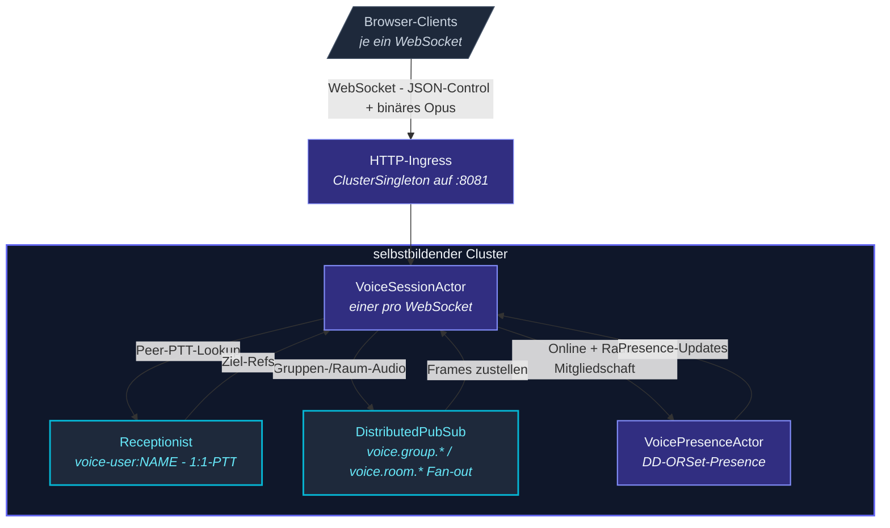

Das Voice-Sample ist ein **verteiltes Walkie-Talkie**: drei Voice-Modi
(1:1-Push-to-Talk, 1:N-Gruppen-Megafon, N:N-Räume im Teams-Stil) über
einen WebSocket pro Client, bedient von einem selbstbildenden Cluster.
Es ist das Schwester-Sample zum [Chat-Sample](/de/examples/chat-sample/)
und exerziert bewusst die Framework-Primitiven durch, die das
Chat-Sample *nicht* nutzt:

- **Receptionist** - 1:1-Push-to-Talk: die Session eines Nutzers über
  den Schlüssel `voice-user:<name>` nachschlagen und ihm das Audio
  direkt zustellen.
- **DistributedPubSub** - 1:N-Gruppen-Megafon und N:N-Raum-Fan-out über
  die Topics `voice.group.<name>` / `voice.room.<name>`.
- **DistributedData-ORSets** - globale Online-Presence
  (`voice.online-users`) und Raum-Mitgliedschaft pro Raum
  (`voice.room-users.<name>`).
- **ClusterSingleton** - eine einzige HTTP- + WebSocket-Front-Door, die
  per Failover zwischen Nodes wechselt.
- **Kein `ClusterSharding`, keine `PersistenceExtension`** - Voice ist
  ephemer per Design. Der Server ist ein reiner Audio-Relay; es gibt
  kein Journal, keine Transkription, keinen gespeicherten State. Das ist
  der bewusste didaktische Kontrast zum Chat-Sample.

Audio läuft als **binäre** Frames über den bestehenden WebSocket pro
Client - kein WebRTC, kein SFU, kein Transcoding - damit der
PubSub-Fan-out, das Receptionist-Lookup und die DD-ORSet-Presence
sichtbar die tragenden Teile sind.

Zu finden unter [`examples/voice/`](https://github.com/pathosDev/actor-ts/tree/main/examples/voice)
im Repo.

## Architektur


```mermaid
flowchart TB
  CLIENTS[/"Browser-Clients<br/><i>je ein WebSocket</i>"/]
  SINGLETON["HTTP-Ingress<br/><i>ClusterSingleton auf :8081</i>"]
  subgraph CLUSTER["selbstbildender Cluster"]
    direction TB
    SESSION["VoiceSessionActor<br/><i>einer pro WebSocket</i>"]
    RECEPTIONIST["Receptionist<br/><i>voice-user:NAME - 1:1-PTT</i>"]
    PUBSUB["DistributedPubSub<br/><i>voice.group.* / voice.room.* Fan-out</i>"]
    PRESENCE["VoicePresenceActor<br/><i>DD-ORSet-Presence</i>"]
    SESSION -- "Peer-PTT-Lookup" --> RECEPTIONIST
    SESSION -- "Gruppen-/Raum-Audio" --> PUBSUB
    SESSION -- "Online + Raum-Mitgliedschaft" --> PRESENCE
    RECEPTIONIST -- "Ziel-Refs" --> SESSION
    PUBSUB -- "Frames zustellen" --> SESSION
    PRESENCE -- "Presence-Updates" --> SESSION
  end
  CLIENTS -- "WebSocket - JSON-Control + binäres Opus" --> SINGLETON
  SINGLETON --> SESSION
  classDef client  fill:#1e293b,stroke:#475569,color:#cbd5e1;
  classDef cluster fill:#0f172a,stroke:#6366f1,stroke-width:2px,color:#f1f5f9;
  classDef edge    fill:#312e81,stroke:#818cf8,color:#f1f5f9;
  classDef actor   fill:#312e81,stroke:#818cf8,stroke-width:1.5px,color:#f1f5f9;
  classDef bus     fill:#1e293b,stroke:#06b6d4,stroke-width:2px,color:#67e8f9;
  class CLIENTS client
  class CLUSTER cluster
  class SINGLETON edge
  class SESSION,PRESENCE actor
  class RECEPTIONIST,PUBSUB bus
```

Der komplette Pfad eines "Gruppen-PTT-Knopf halten"-Flows:

```
1. Alice hält den PTT-Knopf einer Gruppen-Karte.
2. Ihr Browser sendet voice-target { mode: 'group', group: 'engineering' }.
3. Alices VoiceSessionActor setzt sein aktuelles Ziel auf das Gruppen-Topic.
4. Jeder ~100-ms-Audio-Chunk trifft als binärer WS-Frame ein.
5. Die Session publiziert ihn via DistributedPubSub auf voice.group.engineering.
6. Jede auf dieses Topic abonnierte Session erhält den Frame...
7. ...und schreibt ein längenpräfigiertes [nameLen][name][opus]-Envelope in ihren WebSocket.
8. Bei PTT-Up publiziert voice-stop einen finalen End-Marker, damit Receiver flushen.
```

Receptionist + PubSub + CRDT-Presence + WebSocket - alles im
Zusammenspiel, ohne Datenbank auf dem heißen Pfad.

## Ausführen

```bash
# Repo klonen:
git clone https://github.com/pathosDev/actor-ts.git
cd actor-ts

# Drei Terminals, keine Flags - ein selbstbildender TCP-Cluster:
bun examples/voice/backend/main.ts
bun examples/voice/backend/main.ts
bun examples/voice/backend/main.ts

# Die UI öffnen (bedient vom Node, der das Singleton hält):
open http://localhost:8081/
```

Wähle ein Frontend, klicke einmal auf "Enable mic" (sowohl der
Browser-Berechtigungsdialog als auch das `AudioContext`-Unlock brauchen
eine Nutzer-Geste) und melde dich mit einem Demo-Account an:

```
alice / wonderland
bob / builder
charlie / chaplin
diana / prince
```

Probiere die Modi: halte den PTT-Knopf neben dem Namen eines anderen
Nutzers (1:1), halte den Knopf einer Gruppen-Karte (1:N-Gruppe) oder
betritt einen Raum und schalte "Talk" um (N:N-Raum). Beende den Node,
der aktuell das `http-ingress`-Singleton hält, und ein Überlebender
bindet `:8081` innerhalb von ~5-10 s neu.

### Das Relay verifizieren

`smoke-test.ts` braucht weder Browser noch Setup — es startet
seinen eigenen Ein-Node-Cluster auf isolierten Ports, öffnet zwei
WebSocket-Clients und läuft alle drei Modi mit einem gefälschten
32-Byte-Audio-Payload durch; geprüft werden der Envelope-Round-Trip
und der Selbst-Filter im Raum-Modus:

```bash
bun examples/voice/smoke-test.ts
```

Weil es sein eigenes Backend mitbringt, läuft es unbeaufsichtigt im
[Beispiel-Gate](/de/examples/overview/#in-ci-abgesichert) bei jedem
Push, der `src/` oder `examples/` berührt. Audio-Wiedergabe deckt es
nicht ab — das ist Sache des Browsers.

## Demonstrierte Schlüssel-Patterns

### 1:1-Push-to-Talk über den Receptionist

```ts
// Jede Session registriert sich beim Login unter einem Schlüssel pro Nutzer:
const userServiceKey = (username: string) =>
  ServiceKey.of<BinaryFrame | BinaryStreamEnd>(`voice-user:${username}`);

this.deps.receptionist.tell(new Register(userServiceKey(username), this.self, null));

// Bei PTT-Down (Peer-Modus) sucht der Sender das Ziel per Find:
this.deps.receptionist.tell(new Find(userServiceKey(target), this.self));

// Auf die Listing-Antwort hin: Refs cachen und jeden Chunk direkt zustellen:
for (const ref of cachedRefs) ref.tell(binaryFrame);
```

Die Refs werden für die Dauer des Tastendrucks gecacht - kein
Registry-Lookup pro Audio-Frame.

### Gruppen- + Raum-Fan-out über DistributedPubSub

```ts
// Gruppen werden beim Login eager abonniert, Räume lazy bei room-enter:
this.deps.mediator.tell(new Subscribe(groupTopic(group), this.self));

// Jeder Audio-Chunk während eines Gruppen-/Raum-Drucks wird aufs Topic publiziert:
this.deps.mediator.tell(new Publish(topic, binaryFrame));
```

`groupTopic(g)` ist `voice.group.${g}` und `roomTopic(r)` ist
`voice.room.${r}`. Das Topic fächert an **jeden** Abonnenten inklusive
des Senders auf, daher verwerfen Empfänger ihre eigenen Frames (ein
Self-Filter auf `senderUsername`).

### Presence über DistributedData-ORSets

```ts
// VoicePresenceActor mutiert ein ORSet pro Schlüssel:
this.dd.update<ORSet<string>>(
  key, // 'voice.online-users' oder 'voice.room-users.<room>'
  () => ORSet.empty<string>(),
  (current) => current.add(this.replicaId, username),
);

// ...und fächert DD-Änderungen an abonnierte Sessions auf:
this.dd.subscribe<ORSet<string>>(key, (next) => {
  const users = [...next.value()];
  // ein PresenceChanged an jeden lokalen Abonnenten pushen
});
```

Ein globales Set verfolgt, wer online ist; ein Set pro Raum verfolgt,
wer darin ist. Keine sharded Entity besitzt den Raum-State - es ist
reine CRDT-Mitgliedschaft plus ein PubSub-Topic.

### HTTP-Front-Door als ClusterSingleton

```ts
const singletonOptions = StartSingletonOptions.create()
  .withTypeName('http-ingress')
  .withActor(httpIngressFactory({ host, httpPort, staticDir, /* ...Abhängigkeiten */ }));
cluster.singleton.start(singletonOptions);
```

Genau ein Node bindet zu jeder Zeit `:8081`; der `HttpIngressActor`
bindet in `preStart` und löst die Bindung in `postStop`, sodass Failover
den Port automatisch auf einen Überlebenden verschiebt.

## Was es nicht demonstriert

- **`ClusterSharding`** - es gibt keine sharded Entity. Räume sind reine
  DD-ORSet-Mitgliedschaft plus ein PubSub-Topic; Sessions sind ein
  einfacher `Actor` pro WebSocket. (Das ist der bewusste Kontrast zum
  [Chat-Sample](/de/examples/chat-sample/), das seine Räume sharded.)
- **Persistierung / Event-Sourcing** - kein Journal, kein
  `PersistentActor`, nichts gespeichert. Voice ist ephemer; eine
  abgebrochene Session verschwindet einfach aus den ORSets.
- **WebRTC / SFU / Transcoding** - der Server ist ein reiner Relay und
  Audio läuft über den bestehenden WebSocket. Medienverarbeitung ist
  außerhalb des Scopes.

Für Sharding und Persistierung siehe das
[Chat-Sample](/de/examples/chat-sample/) oder die
[eigenständigen Snippets](/de/examples/stand-alone-snippets/).

## Dateistruktur

```
examples/voice/
├── application.conf
├── README.md
├── smoke-test.ts                    # Ein-Node-, Zwei-Client-Relay-Test
├── backend/
│   ├── main.ts                      # Einstieg: Cluster-Join + Extensions + Singleton
│   ├── config.ts                    # Argument-/Port-Parsing
│   ├── routes.ts
│   ├── actors/
│   │   ├── HttpIngressActor.ts      # ClusterSingleton-HTTP-Front-Door
│   │   ├── WebsocketIngressActor.ts # spawnt eine Session pro WS-Verbindung
│   │   ├── VoiceSessionActor.ts     # einer pro WebSocket - der Relay-Dreh- und Angelpunkt
│   │   └── VoicePresenceActor.ts    # DD-ORSet-Presence
│   ├── auth/                        # Demo-Credentials + Session-Tokens
│   ├── discovery/                   # Same-Host-Seed-Scan
│   └── plugins/                     # Statische-Datei-Auslieferung
├── shared/                          # protocol, frameCodec, groups, rooms, users
├── frontend-{plain,lit,svelte,react,next,angular}/
└── static/                          # gebaute Frontend-Artefakte, ausgeliefert unter /
```

`backend/main.ts` ist reines Wiring; die interessante Logik steckt in
`VoiceSessionActor.ts` (dem Relay-Dreh- und Angelpunkt) und
`VoicePresenceActor.ts` (der CRDT-Presence). Sechs Frontends - plain JS,
Lit, Svelte, React, Next, Angular - sprechen alle dasselbe
Wire-Protokoll.

## Anpassung für die Praxis

Für eine produktive Voice-App:

- **Reliability** - `DistributedPubSub` ist at-most-once; verlorene
  Frames verursachen hörbare Knackser. Ergänze adaptive Jitter-Buffer
  und eine Retransmission-Schicht über dem Relay.
- **Playback** - tausche die `MediaSource`-Pipeline des Empfängers gegen
  `WebCodecs` + einen Ring-Buffer für feinere Kontrolle über Latenz und
  Buffering.
- **Skalierung** - N gleichzeitige Sprecher bedeuten N
  `MediaSource`-Instanzen im Browser jedes Zuhörers; ergänze
  serverseitiges Mixing für große Räume.
- **Sicherheit** - ersetze die Klartext-Demo-Credentials durch gehashte
  Passwörter und Token-Rotation und stelle das Ganze hinter TLS/WSS.
- **Topologie** - für Peer-to-Peer-Medien ergänze WebRTC oder einen SFU
  auf dem Medienpfad und behalte actor-ts für Signaling, Discovery und
  Presence.

Das Muster verallgemeinert auf jedes **ephemere Fan-out**-Workload -
Live-Cursor, Presence, Telemetrie-Broadcast, Multiplayer-Input - bei dem
Receptionist + DistributedPubSub + DistributedData eine Datenbank auf
dem heißen Pfad ersetzen.

## Wohin als Nächstes

- **[Chat-Sample](/de/examples/chat-sample/)** - das sharded +
  persistente Schwester-Sample.
- **[Receptionist](/de/discovery/receptionist/)** - clusterweites
  Actor-Ref-Lookup per Schlüssel.
- **[DistributedPubSub](/de/cluster/pubsub/)** - Topic-Fan-out über
  Nodes.
- **[Sets (ORSet)](/de/distributed-data/crdt-types/sets/)** - das CRDT
  hinter der Presence.
- **[ClusterSingleton](/de/cluster/singleton/overview/)** - die
  Single-Instance-Front-Door.
