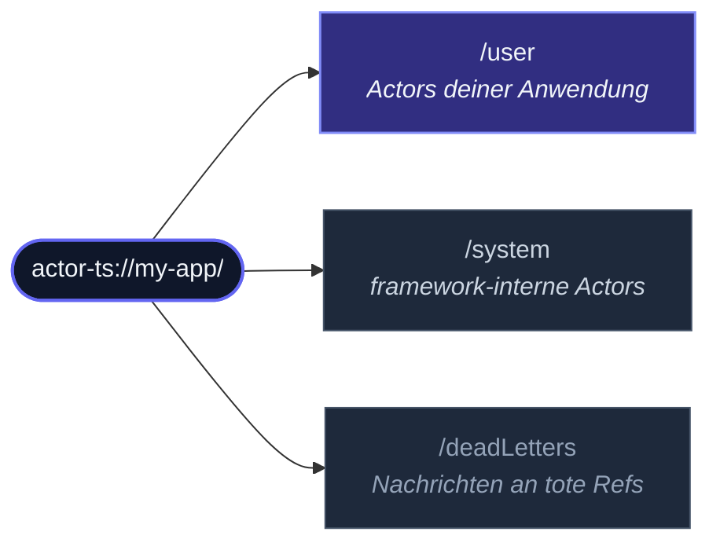

Das `ActorSystem` ist der **Top-Level-Container** für Actors.  Eines
pro logischer Anwendung — manchmal eines pro Prozess, manchmal ein
paar, die nebeneinander laufen (z.B. ein Worker-Thread-Isolations-Setup).
Jeder Actor lebt innerhalb eines Systems; das System besitzt den
Dispatcher (der die Nachrichtenverarbeitung plant), den Scheduler (der
Timer ausführt), den Supervisionsbaum (der Actor-Fehler abfängt), den
Event-Stream und alle Extensions, die du registriert hast.

## Eines erstellen

```ts
import { ActorSystem } from 'actor-ts';

const system = ActorSystem.create('my-app');
```

Der String ist der **Name** des Systems — er erscheint in
Actor-Pfaden (`actor-ts://my-app/user/...`), Log-Zeilen und der
Cluster-Identifikation.  Verschiedene Systeme können mit
verschiedenen Namen koexistieren; derselbe Name in einem Cluster-Setup
bedeutet "ich trete dem bestehenden Cluster bei", ein anderer Name
bedeutet "ich bin ein separater Cluster".

`create` kehrt synchron zurück.  Die Root-Guardians des Systems werden
eifrig erzeugt; User-Actors existieren noch nicht — du spawnst sie
über `actorOf` (unten beschrieben).

## Konfiguration

`ActorSystem.create` nimmt ein optionales Settings-Objekt als zweites
Argument:

```ts
const system = ActorSystem.create('my-app', {
  logLevel:   'info',
  configFile: './application.conf',
});
```

Die vollständige Settings-Form:

| Feld | Zweck |
| --- | --- |
| `logger` | Eigene `Logger`-Instanz.  Standardmäßig ein Console-Logger, der `logLevel` respektiert. |
| `logLevel` | Einer von `debug` / `info` / `warn` / `error` / `silent`. |
| `dispatcher` | Eigener `Dispatcher`.  Standardmäßig ein Microtask-basierter Dispatcher; Tests tauschen typischerweise einen Immediate- oder Manual-Dispatcher ein. |
| `scheduler` | Eigener `Scheduler`.  Standardmäßig ein Echtzeit-Scheduler; Tests injizieren `ManualScheduler`, um die Zeit zu kontrollieren. |
| `config` | Entweder eine vorgefertigte `Config` oder ein einfaches Objekt mit HOCON-Overrides.  Wird über die Referenz-Defaults + einer eventuellen `application.conf` gelegt. |
| `configFile` | Expliziter Pfad zu einer `application.conf`-Datei.  Überschreibt die `ACTOR_TS_CONFIG`-Env-Variable und das CWD-Lookup. |

Konstruktor-Settings gewinnen immer gegenüber allem in der Config —
sie sind die expliziten Code-Level-Overrides.

### HOCON-Config-Dateien

Für größere Anwendungen bevorzuge eine `application.conf`-Datei im
Projekt-Root:

```hocon
actor-ts {
  log-level = "info"
  dispatcher {
    throughput = 100
  }
  cluster {
    gossip-interval = 500ms
    failure-detector.unreachable-after = 1500ms
  }
}
```

Das Framework lädt sie automatisch, wenn vorhanden.  ENV-Substitution
(`${?ENV_NAME}`) funktioniert wie in der HOCON-Spec definiert — aus
der Umgebung gezogene Werte fallen auf den Default zurück, wenn sie
nicht gesetzt sind.  Siehe [Konfiguration](/de/reference/configuration/)
für jeden Schlüssel, den das Framework liest.

## Actors spawnen

Top-Level-Actors werden über `system.actorOf` gespawnt:

```ts
import { Props } from 'actor-ts';

const root = system.actorOf(
  Props.create(() => new MyRootActor()),
  'root',   // optionaler Name; Framework wählt einen, wenn weggelassen
);
```

Die zurückgegebene `ActorRef` ist ein Handle, keine Instanz.  Gib es
weiter, speichere es, übergib es an andere Actors.

Innerhalb eines Actors werden **Child-Actors** über `context.spawn`
gespawnt, nicht über `system.actorOf`:

```ts
class Parent extends Actor<...> {
  override onReceive(msg) {
    const child = this.context.spawn(
      Props.create(() => new Child()),
      'worker',
    );
  }
}
```

Kinder sind an den Lebenszyklus des Parents gebunden — wenn der
Parent stoppt, stoppen zuerst alle Kinder.  Fehler von Kindern
eskalieren an die [Supervisor-Strategie](/de/fundamentals/supervision/)
des Parents.  Top-Level-Actors (aus `system.actorOf`) eskalieren
stattdessen an den Root-Guardian des Systems.

## Die Guardian-Hierarchie

Jeder Actor hat einen Pfad unter dem System-Root.  Drei
"Guardian"-Top-Level-Actors sitzen direkt unter dem Root:



Wenn du `system.actorOf(props)` aufrufst, wird der Actor unter
`/user` erzeugt.  Wenn das System terminiert, stoppen die Guardians in
umgekehrter Reihenfolge nacheinander: User-Actors zuerst (damit sie
ihre Arbeit beenden können), dann die System-Internas.

Der `/deadLetters`-"Actor" ist speziell — Nachrichten an ein `tell`
auf einer gestoppten Ref oder an eine nie existierte Ref werden
dorthin geleitet.  Standardmäßig loggt das System Dead Letters auf
`debug`-Level; abonniere den Event-Stream, wenn du programmatisch
reagieren willst.

## Extensions

**Extensions** sind das Plugin-System des Frameworks.  Cluster,
Persistenz, DistributedData, DistributedPubSub, HTTP — sie sind alle
Extensions.  Du registrierst sie einmal auf System-Ebene und erreichst
sie dann über `system.extension(...)`:

```ts
import { Cluster, DistributedDataId } from 'actor-ts';

const cluster = await Cluster.join(system, { /* ... */ });
const dd = system.extension(DistributedDataId).start(cluster);
```

Extensions sind **lazy**: sie initialisieren sich nicht, bis du nach
ihnen greifst.  Eine App, die nie
`system.extension(DistributedDataId)` aufruft, startet nie einen
DD-Replicator.  Das hält Single-Process-Apps klein; übernimm Features,
indem du nach ihnen greifst, lass sie weg, indem du es nicht tust.

### Eine eigene Extension schreiben

```ts
import { type Extension, type ExtensionId } from 'actor-ts';

class MetricsCollector implements Extension {
  constructor(private readonly system: ActorSystem) {}
  incCounter(name: string): void { /* ... */ }
}

const MetricsCollectorId: ExtensionId<MetricsCollector> = {
  name: 'MetricsCollector',
  create: (system) => new MetricsCollector(system),
};

// Lookup ist idempotent — der erste Aufruf erzeugt, folgende Aufrufe
// geben die gecachte Instanz zurück.
const metrics = system.extension(MetricsCollectorId);
metrics.incCounter('login.success');
```

Extensions sind nützlich, wenn:

- Du übergreifenden Zustand brauchst, der von vielen Actors geteilt
  wird (ein Connection-Pool, ein Metrics-Collector).
- Der Zustand teuer zu initialisieren ist und nicht existieren sollte,
  wenn niemand danach greift (ein Cluster-Join, ein DD-Replicator).
- Du eine saubere Möglichkeit willst, Test-Doubles in Unit-Tests zu
  injizieren (überschreibe den `ExtensionId`-Resolver).

## Terminieren

```ts
await system.terminate();
```

`terminate` führt einen geordneten Shutdown durch:

1. Cluster benachrichtigen (falls beigetreten) — "ich verlasse"
   gossipen, damit Peers nicht mehr zu diesem Node routen.
2. `/user` rekursiv stoppen — deine Actors bekommen `postStop`,
   Kinder zuerst.  Actors mit laufenden async `onReceive`s beenden
   ihre aktuelle Nachricht, bevor sie stoppen.
3. `/system` stoppen — Framework-Internas wickeln sich ab.
4. Dispatcher und Scheduler schließen — keine neuen Nachrichten,
   keine neuen Timer.
5. Das zurückgegebene Promise resolven.

Für Produktions-Apps wickelst du das typischerweise in einen
SIGTERM-Handler:

```ts
process.on('SIGTERM', async () => {
  await system.terminate();
  process.exit(0);
});
```

…aber das Framework bietet ein reicheres Pattern dafür — siehe
[Coordinated Shutdown](/de/fundamentals/coordinated-shutdown/)
für das 12-phasige Ordered-Shutdown-DSL, das K8s-PreStop-Hooks,
laufende HTTP-Requests, das Drainen von Brokern usw. handhabt.

import { Aside } from '@astrojs/starlight/components';

<Aside type="caution" title="Ruf `terminate` nicht aus einem Actor heraus auf">
  Innerhalb eines `onReceive` führt `await system.terminate()` zu
  einem Self-Deadlock: die Mailbox des Actors kann die nächste
  Nachricht nicht verarbeiten, bis `onReceive` zurückkehrt, aber
  `terminate` wartet darauf, dass der Actor stoppt, was nicht
  passiert, bis `onReceive` zurückkehrt.  Wenn ein Actor einen
  Shutdown triggern will, sende eine Nachricht an einen
  Top-Level-Supervisor, der `terminate` auf dem System von außerhalb
  der Actor-Welt aufruft (z.B. ein CoordinatedShutdown-Task oder
  `setImmediate`).
</Aside>

## Wie viele Systeme pro Prozess?

Die übliche Antwort ist **eins**.  Ein zweites System im selben
Prozess bedeutet einen separaten Cluster, einen separaten Dispatcher,
einen separaten Supervisionsbaum — typischerweise mehr Overhead, als
der Use Case rechtfertigt.

Zwei Situationen, in denen ein zweites System Sinn macht:

- **Worker-Thread-Isolation**: der Hauptthread läuft mit einem
  System, ein Worker-Thread mit einem anderen, beide spannen
  denselben Cluster über den `MessageChannelTransport` auf.  Das ist
  das [Worker-Mesh](/de/cluster/worker-mesh/)-Pattern — mehrere
  Systeme pro OS-Prozess, alle Teil desselben Clusters.
- **Test-Fixtures**: ein `TestActorSystem` pro Testfall, damit das
  Cleanup garantiert ist.  Siehe [TestKit](/de/testing/testkit/).

## Häufige Fallstricke

<Aside type="caution" title="Spawnen, bevor `await system.extension(...).start(...)` resolved">
  Cluster + DistributedData + DistributedPubSub brauchen alle eine
  kurze Aufwärmphase, bevor sie nutzbar sind.  Wenn du
  `system.actorOf(...)` einen Actor erzeugst, der sofort auf
  `chat.room.general` publisht, während der PubSub-Mediator noch
  initialisiert, geht der Publish in die Dead Letters.  Entweder
  await die `start(...)` der Extension zuerst oder puffere ausgehende
  Nachrichten, bis du das `MemberUp`-Event des Clusters beobachtest.
</Aside>

<Aside type="caution" title="ActorRefs zwischen System-Instanzen teilen">
  Eine `ActorRef` zeigt auf einen Actor innerhalb **eines bestimmten**
  ActorSystems.  Sie an einen Actor in einem anderen System
  weiterzugeben (z.B. über eine Worker-Thread-Grenze hinweg ohne den
  Cluster-Transport) funktioniert nicht — das empfangende System hat
  keine Möglichkeit, an den fremden Actor zu liefern.
  Cross-System-Kommunikation läuft über den Cluster-Transport, der
  Refs in ein Wire-Format serialisiert, das das empfangende System
  auflösen kann.
</Aside>

<Aside type="caution" title="`await` auf `terminate` vergessen">
  `system.terminate()` gibt ein Promise zurück.  Ohne `await` (oder
  `.then`) kann der Prozess beenden, bevor die Shutdown-Sequenz
  fertig ist — Actors bekommen kein `postStop`, Journals werden
  nicht geflusht, Broker werden nicht gedrained.  Immer `await`en.
</Aside>

## Wie es weitergeht

- **[Actor](/de/fundamentals/actor/)** — die Klasse, die du
  in das System spawnst.
- **[Coordinated Shutdown](/de/fundamentals/coordinated-shutdown/)** —
  Graceful-Shutdown-DSL jenseits eines einfachen `terminate`.
- **[Cluster-Überblick](/de/cluster/overview/)** — wenn du
  von einem System pro Prozess zu vielen Systemen in einem Cluster
  gehst.
- **[Konfiguration](/de/reference/configuration/)** — jeder
  HOCON-Schlüssel, den das Framework liest, gruppiert nach
  Extension.

Die [`ActorSystem`-Klassen-API-Referenz](/api/classes/actorsystem/)
dokumentiert jede hier diskutierte öffentliche Methode.
