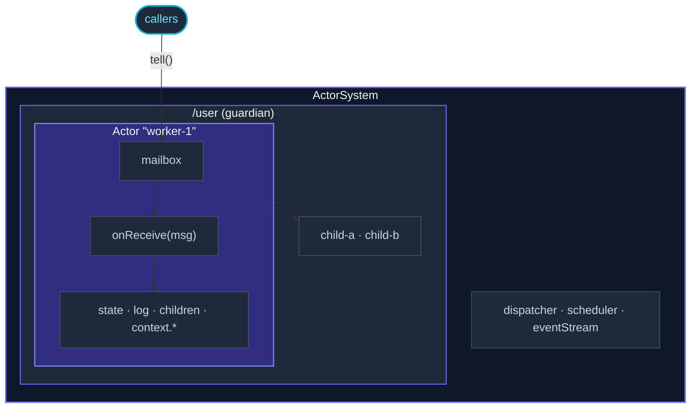

Der Bereich **Fundamentals** deckt alles ab, was du brauchst, um
Single-Node-Actor-Systeme zu schreiben.  Alle zwanzig-und-ein-paar
Seiten existieren, weil sie auf einem mentalen Bild aufbauen: Ein
*Actor* ist ein Ding mit Zustand und Verhalten, das Nachrichten eine
nach der anderen verarbeitet.  Verschiedene Seiten zoomen auf
verschiedene Teile dieses Bildes.

Diese Seite ist die Landkarte.

## Das Bild

Jede Box entspricht ein oder zwei Seiten:

- Die **ActorSystem**-Box selbst —
  [Actor-System](/de/fundamentals/actor-system/).
- Jeder **Actor** —
  [Actor](/de/fundamentals/actor/) (die Klasse) +
  [Props](/de/fundamentals/props/) (wie du ihn konstruierst).
- Die **Mailbox** —
  [Mailboxes](/de/fundamentals/mailboxes/).
- Der **tell**-Pfeil —
  [Nachrichten](/de/fundamentals/messages/).
- Die Scheduling-Logik der **onReceive**-Schleife —
  [Dispatcher](/de/fundamentals/dispatchers/).
- Die **context.***, die der Actor verwendet —
  [Become und Stash](/de/fundamentals/become-and-stash/),
  [Death Watch](/de/fundamentals/death-watch/),
  [Timer und Scheduling](/de/fundamentals/timers-and-scheduling/),
  [Receive-Timeout](/de/fundamentals/receive-timeout/),
  [Logging](/de/fundamentals/logging/).
- Das Fehler-Handling der **Eltern-Kind**-Beziehung —
  [Supervision](/de/fundamentals/supervision/).
- Der **Pfad**, der jeden Actor benennt —
  [Actor-Pfade](/de/fundamentals/actor-paths/).
- Systemweites Pub/Sub an der Seite —
  [Event-Stream](/de/fundamentals/event-stream/).
- Terminierungssignale von außen —
  [Poison Pill und Kill](/de/fundamentals/poison-pill-and-kill/).
- Sauberer Shutdown des gesamten Systems —
  [Coordinated Shutdown](/de/fundamentals/coordinated-shutdown/).
- Request/Reply auf Basis von `tell` —
  [Ask-Pattern](/de/fundamentals/ask-pattern/).
- Das `kind`-Matching-Idiom, das jede Seite verwendet —
  [Pattern Matching](/de/fundamentals/pattern-matching/).

Das ist die ganze Liste.  Etwa zwanzig Seiten, jede ~250-400 Zeilen,
jede mit Fokus auf einem Ausschnitt.

## Eine Lesereihenfolge

Drei sinnvolle Pfade:

### Schnellster Weg zu "Ich kann einen Actor schreiben"

Für Entwickler, die sofort mit dem Coden loslegen wollen:

1. [Actor](/de/fundamentals/actor/) — die Klasse.
2. [Nachrichten](/de/fundamentals/messages/) — die
   Discriminated-Union-Konvention.
3. [Pattern Matching](/de/fundamentals/pattern-matching/) —
   das `match().exhaustive()`-Idiom.
4. [Actor-System](/de/fundamentals/actor-system/) — wie du den
   Actor spawnst.
5. [Ask-Pattern](/de/fundamentals/ask-pattern/) — wie du
   Antworten liest.

Das sind etwa eine Stunde Lesezeit, danach kannst du eine funktionierende
Spielzeug-App schreiben.

### Weg zu "Ich verstehe das Modell"

Für Entwickler, die das konzeptionelle Bild wollen, bevor sie Code schreiben:

1. [Actor-System](/de/fundamentals/actor-system/) — der
   Container.
2. [Actor](/de/fundamentals/actor/) — die Entität.
3. [Mailboxes](/de/fundamentals/mailboxes/) +
   [Dispatcher](/de/fundamentals/dispatchers/) — was die
   Eine-nach-der-anderen-Verarbeitung möglich macht.
4. [Supervision](/de/fundamentals/supervision/) +
   [Death Watch](/de/fundamentals/death-watch/) — die
   "let it crash"-Philosophie.
5. [Coordinated Shutdown](/de/fundamentals/coordinated-shutdown/) —
   wie Systeme sauber enden.

Danach ist der Rest nur noch Detailarbeit.

### Weg zu "Ich portiere ein bestehendes System"

Für Entwickler, die von einem anderen Runtime-Modell migrieren
(Promise/await-Suppe, Worker Threads, BullMQ-artige Queues):

1. [Warum Actors](/de/intro/why-actors/) — die Begründung.
2. [Nachrichten](/de/fundamentals/messages/) — Methoden
   ersetzen.
3. [Actor](/de/fundamentals/actor/) — Klassen mit geteiltem
   Zustand ersetzen.
4. [Supervision](/de/fundamentals/supervision/) — try/catch
   durch let-it-crash ersetzen.
5. [Ask-Pattern](/de/fundamentals/ask-pattern/) — `await`-Aufrufer
   mit actor-internen Abläufen verbinden.

Und dann weiter zu den [Migrations-Guides](/de/migration/overview/)
für den konkreten Framework-Vergleich.

## Die Form, der jede Konzept-Seite folgt

Jede Fundamentals-Seite ist gleich aufgebaut:

1. **Was es ist** — ein Satz, in der Description im Seitentitel.
2. **Ein minimales Beispiel** — lauffähiger Code, ~15-30 Zeilen, inklusive
   Imports.
3. **Wie es funktioniert** — die technischen Details, in Prosa.
4. **Wann (nicht) anwenden** — konkrete Situationen + Alternativen.
5. **Häufige Fallstricke** — Asides, die die häufigsten Fehler markieren.
6. **Wie es weitergeht** — 3-5 interne Links.

Es geht nicht darum, jede Seite auswendig zu lernen; es geht darum, die
*Form* zu kennen, damit du zu dem Abschnitt skimmen kannst, den du
brauchst.  Die "Häufige Fallstricke"-Sammlung über alle Seiten hinweg ist
die mit Abstand beste Ressource, wenn du debuggst.

## Jenseits der Fundamentals

Sobald dir diese Seiten vertraut sind, baut der Rest der Website darauf
auf:

- **[Typed](/de/typed/overview/)** — eine strengere, standardmäßig
  typisierte API für dasselbe Modell.
- **[Routing](/de/routing/overview/)** — Fan-Out über mehrere
  Actors mit Load-Balancing-Strategien.
- **[Patterns](/de/patterns/circuit-breaker/)** — wiederverwendbare
  Bausteine (Circuit Breaker, Retry-Helfer, Backoff-Supervisor).
- **[Cluster](/de/cluster/overview/)** — der Schritt von einem
  Node zu vielen.
- **[Persistence](/de/persistence/overview/)** — Actor-Zustand,
  der Restarts überlebt.

Jeder dieser Bereiche hat eine eigene Überblicksseite nach demselben
Muster.

## Wo soll ich anfangen?

Wenn du bis hierher gelesen hast und einfach nur etwas schreiben willst:

- **[Quickstart](/de/intro/quickstart/)** — ein funktionierendes
  Hello-Actor in 5 Minuten.
- **[Actor](/de/fundamentals/actor/)** — die Grundlagenseite für
  alles weitere.
