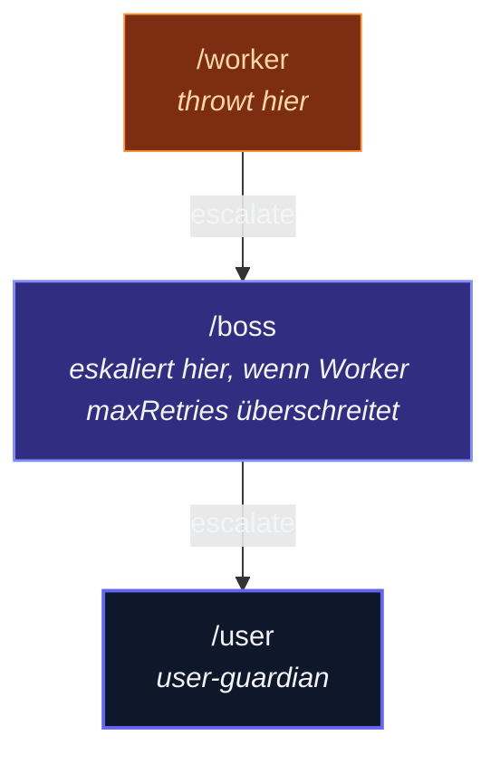

Wenn das `onReceive` eines Actors throwt — synchron oder über ein
abgewiesenes `Promise` — crasht der Fehler nicht den Prozess.  Er
reist hoch zum **Parent** des Actors, der über seine
**Supervisor-Strategie** entscheidet, was zu tun ist.  Vier Ausgänge;
du wählst einen pro Fehlerklasse.

Das ist die "let it crash"-Philosophie, die actor-ts von Erlang erbt:
jeden Fehler inline an der Aufrufstelle zu behandeln, ist brüchig.
Ein Supervisor eine Ebene höher hat einen breiteren Blick — er weiß,
ob der abgestürzte Actor austauschbar ist (neu starten), kritischen
Zustand hält (an einen höheren Supervisor eskalieren) oder ganz
aufgeben sollte (stoppen und Kompensation triggern).

## Die vier Direktiven

Wenn ein Kind throwt, gibt der Decider des Supervisors eine davon
zurück:

| Direktive | Was sie tut |
| --- | --- |
| **`Restart`** | Wirf die kaputte Instanz weg.  Baue eine frische aus derselben `Props`-Factory.  Die Mailbox wird beibehalten; die neue Instanz nimmt die nächste Nachricht auf. |
| **`Resume`** | Behalte den Zustand des Actors.  Überspringe die fehlschlagende Nachricht.  Mache mit der nächsten in der Mailbox weiter. |
| **`Stop`** | Stoppe den Actor permanent.  Kinder werden zuerst gestoppt.  Weitere Nachrichten gehen in Dead Letters. |
| **`Escalate`** | Wirf den Fehler erneut bei dem *eigenen* Parent des Supervisors.  Der Supervisor selbst wird dann meist neu gestartet. |

`Restart` ist der Default — die `defaultStrategy` des Frameworks gibt
für jeden Fehler `Restart` zurück.  Verwende die anderen drei, wenn
Restart nicht die richtige Semantik für deine Domäne ist.

## Ein minimales Beispiel

```ts
import { Actor, ActorSystem, Props, OneForOneStrategy, Directive } from 'actor-ts';

class Worker extends Actor<{ kind: 'do-it' } | { kind: 'fail' }> {
  override onReceive(msg: { kind: 'do-it' } | { kind: 'fail' }): void {
    if (msg.kind === 'fail') throw new Error('boom');
    this.log.info('did the work');
  }
}

class Boss extends Actor<{ kind: 'spawn-worker' }> {
  // Eigene Supervisor-Strategie für die Kinder dieses Boss: immer
  // restarten, aber bei 5 Restarts pro Minute cappen — darüber das
  // Kind stoppen.
  override supervisorStrategy = new OneForOneStrategy(
    (err) => Directive.Restart,
    { maxRetries: 5, withinTimeRangeMs: 60_000 },
  );

  override onReceive(msg: { kind: 'spawn-worker' }): void {
    const worker = this.context.spawnAnonymous(Props.create(() => new Worker()));
    worker.tell({ kind: 'do-it' });
    worker.tell({ kind: 'fail' });   // <- throwt
    worker.tell({ kind: 'do-it' });  // <- neue Instanz, nach Restart
  }
}
```

Die Supervisor-Strategie des Boss fängt den Throw des Workers ab.
Der Boss sieht den Fehler, wendet die `Restart`-Direktive an, und der
Worker verarbeitet die nächste Nachricht auf einer frischen Instanz.
Drei Nachrichten, drei Log-Zeilen — die `Error: boom` der zweiten
taucht im Log des Boss auf, nicht als uncaught Exception.

## One-for-One vs All-for-One

Zwei *Strategie-Scopes* — sie steuern, ob die Direktive nur auf das
fehlschlagende Kind oder auf alle Kinder des Parents angewendet wird:

import { Aside } from '@astrojs/starlight/components';

**`OneForOneStrategy`** — restarte/stoppe/etc. nur das fehlschlagende
Kind.  Die Geschwister laufen weiter.  Das ist der Default.  Verwende
es, wenn Kinder voneinander unabhängig sind: eine abstürzende
User-Session sollte die anderen Sessions nicht betreffen.

**`AllForOneStrategy`** — wende die Direktive auf *jedes* Kind an,
wenn eines fehlschlägt.  Verwende es, wenn Kinder Zustand teilen oder
eng koordinieren — ein kleiner Cluster von Actors, der zusammen
restarten muss, z.B. ein Producer-Consumer-Paar, das über einen
internen Channel spricht.

```ts
import { AllForOneStrategy, Directive } from 'actor-ts';

override supervisorStrategy = new AllForOneStrategy(
  () => Directive.Restart,
  { maxRetries: 3, withinTimeRangeMs: 30_000 },
);
```

Die überwältigende Mehrheit des actor-ts-Codes verwendet
`OneForOneStrategy`.  Greife zu All-for-One nur, wenn du explizit
entschieden hast, dass die Zustände der Kinder gekoppelt sind.

## Per-Error-Decider

Der Decider empfängt den Fehler und gibt eine Direktive zurück — du
kannst also unterschiedliche Antworten pro Fehlerklasse haben:

```ts
import { decideBy, Directive, OneForOneStrategy } from 'actor-ts';

class TransientNetworkError extends Error {}
class CorruptedStateError   extends Error {}
class UnknownProblem        extends Error {}

override supervisorStrategy = new OneForOneStrategy(
  decideBy(
    [
      { match: TransientNetworkError, then: Directive.Resume   },  // schlechte Nachricht überspringen
      { match: CorruptedStateError,   then: Directive.Restart  },  // sauberer Reboot
      { match: UnknownProblem,        then: Directive.Escalate },  // Großeltern fragen
    ],
    Directive.Restart,   // Fallback, wenn nichts matchte
  ),
);
```

`decideBy` ist ein Helfer, der einen Decider aus einer Liste von
`{ errorClass, directive }`-Mappings mit einem Fallback baut.  Du
kannst den Decider auch handgeschrieben als einfache Funktion
schreiben — `(err: Error) => Directive` —, wenn du anspruchsvollere
Logik brauchst.

## Restart-Semantik — was verloren geht, was bleibt

Wenn `Restart` feuert:

1. Das Framework ruft **`preRestart(reason, message?)`** auf der
   kurz-vor-dem-Verwerfen-stehenden Instanz auf.  Default: stoppt
   alle Kinder, ruft `postStop`.  Überschreibe, um Ressourcen
   freizugeben, die außerhalb des Actors gehalten werden
   (File-Handles, offene Sockets, Broker-Verbindungen).
2. Die Instanz wird verworfen.  Alle Instanzfelder (`this.count`,
   `this.handle`, …) sind verloren.
3. Eine neue Instanz wird aus derselben `Props.create`-Factory
   gebaut.
4. Das Framework ruft **`postRestart(reason)`** auf der frischen
   Instanz auf.  Default: ruft `preStart`.  Überschreibe, um
   Ressourcen erneut zu erwerben.
5. Die Mailbox wird **beibehalten**.  Die nächste Nachricht (die
   *nach* der fehlgeschlagenen) wird auf der neuen Instanz
   verarbeitet.

Die fehlgeschlagene Nachricht selbst wird **standardmäßig
verworfen** — sie bleibt außerhalb der Mailbox.  Überschreibe
`preRestart`, wenn du andere Semantik brauchst (z.B. die
fehlgeschlagene Nachricht in eine Dead-Letter-Queue zur Inspektion
schieben).

Wenn du willst, dass **Zustand über Restart hinweg erhalten bleibt**,
muss der Actor diesen Zustand irgendwo extern persistieren —
typischerweise in einem Journal über
[`PersistentActor`](/de/persistence/persistent-actor/) oder einem
geteilten `DistributedData`-Eintrag.  Restart bewahrt explizit KEINEN
In-Memory-Zustand; das ist der ganze Sinn — "let it crash" vertraut
dem Recovery-Pfad mehr als dem Per-Message-Guard.

<Aside type="tip" title="`preStart` versus `postRestart`">
  `preStart` läuft einmal auf dem brandneuen Actor.  `postRestart`
  läuft bei jedem Restart.  Der Framework-Default macht sie
  äquivalent (`postRestart` ruft `preStart`), die meisten Actors
  überschreiben also nur `preStart` für Ressourcen-Akquisition.
  Überschreibe `postRestart` separat, wenn der Restart anderes
  Verhalten braucht als der allererste Start — z.B. "bei Restart
  logge den Grund, aber emittiere nicht erneut das Welcome-Event."
</Aside>

## Restart-Limits + das Zeitfenster

Jede Strategie hat zwei numerische Knöpfe, die "give up"-Verhalten
steuern:

- **`maxRetries`** — wie viele Restart-Versuche der Supervisor
  toleriert, bevor er eskaliert.  `-1` = unbegrenzt.
- **`withinTimeRangeMs`** — ein gleitendes Zeitfenster in
  Millisekunden zum Zählen von Retries.  `0` = kein Fenster (Zählungen
  werden nie zurückgesetzt, `maxRetries` ist also ein Lifetime-Cap
  für den Prozess).

```ts
new OneForOneStrategy(
  () => Directive.Restart,
  { maxRetries: 10, withinTimeRangeMs: 60_000 },   // bis zu 10 Restarts/Minute
);
```

Wenn ein Kind 11-mal in einer Minute restartet, eskaliert der 11.
Fehler stattdessen — der Supervisor selbst wirft den Fehler an seinen
Parent.  Das schützt vor unendlichen Restart-Loops (ein Kind, das
permanent auf einem dauerhaft-kaputten Zustand crasht).

Für Exponential-Backoff-Retries verwende das
[BackoffSupervisor-Pattern](/de/patterns/backoff-supervisor/) — es
wickelt ein Kind mit einem Backoff-Timer, sodass aufeinanderfolgende
Restarts progressiv verzögert werden, statt sofort + gecappt.

## Eingebaute Strategien

Das Framework exportiert drei fertige Strategien für häufige Fälle:

| Strategie | Verhalten |
| --- | --- |
| `defaultStrategy` | Restart alles, Cap 10/Minute.  Der Framework-Default, wenn du nicht überschreibst. |
| `stoppingStrategy` | Stoppe das fehlschlagende Kind sofort, kein Restart.  Nützlich, wenn die Aufgabe des Parents ist, bei Bedarf Ersatz zu spawnen. |
| `escalatingStrategy` | Eskaliere immer an die Großeltern.  Das Kind gibt auf; der Parent reicht die Kanne weiter. |

Verwende diese für Actors, bei denen das Standardverhalten passt;
baue sonst eine eigene `OneForOneStrategy` oder `AllForOneStrategy`.

## Die Eskalations-Kette

Eskalation läuft den Parent-Baum hoch:



Wenn die Strategie von `/boss` `Escalate` zurückgibt, throwt der
Fehler erneut bei der Strategie von `/user`.  `/user` ist der
Root-User-Guardian; wenn *seine* Strategie eskaliert, tritt das
System in einen Fatal-Error-Zustand — meist gefolgt von
`system.terminate()`.

Das bedeutet, dass "uncaught Errors" nur passieren, wenn jede Ebene
explizit eskaliert, bis zur Wurzel.  Stops sind ein normaler,
erwarteter Ausgang; Eskalation-zur-Wurzel ist das "wir wissen nicht,
was wir tun sollen"-Signal.

## Top-Level-Actors

Actors, die über `system.spawnAnonymous(...)` gespawnt werden, haben den
**Root-User-Guardian** als Parent.  Seine Strategie ist
`defaultStrategy` — Restart bei Fehler, gecappt bei 10/Minute.
Überschreibe, indem du eine Strategie in `Props` übergibst:

```ts
const ref = system.spawn(
  Props.create(() => new MyTopActor())
    .withSupervisorStrategy(stoppingStrategy),
);
```

…oder indem du dem Actor seine eigene Children-Strategie gibst.  Zwei
verschiedene Dinge: die Strategie, die die Fehler *dieses* Actors
*behandelt* (auf `Props` gesetzt) vs. die Strategie, die *dieser
Actor verwendet* für SEINE Kinder (als `override supervisorStrategy`
auf der Klasse gesetzt).

## Häufige Fallstricke

<Aside type="caution" title="Zustand, den du brauchtest, überlebt den Restart">
  ```ts
  class CountServer extends Actor<...> {
    private count = 0;  // ← bei Restart verloren!
    onReceive(msg: ...) {
      if (msg.causesACrash) throw new Error('oops');
      this.count++;
    }
  }
  ```
  Bei `Restart` wird `count` auf 0 zurückgesetzt.  Wenn der Count
  über Fehler hinweg wichtig ist, entweder:
  - persistiere ihn (verwende `PersistentActor`),
  - speichere ihn an einer geteilten Stelle (`DistributedData`),
  - oder wähle `Resume` statt `Restart`, damit der Zustand überlebt.
  Wähle bewusst; nimm nicht versehentlich `Restart` und verliere
  Daten.
</Aside>

<Aside type="caution" title="Resume + korrupter Zustand">
  `Resume` überspringt die fehlschlagende Nachricht, behält aber den
  Zustand des Actors.  Wenn der Zustand der Auslöser des Throws war
  (eine korrupte interne Datenstruktur), wird die *nächste* Nachricht
  wahrscheinlich auf dieselbe Weise fehlschlagen.  `Restart` baut
  eine saubere Instanz; das ist meist sicherer, wenn der Fehler
  zustands-getrieben ist.  Verwende `Resume` für transiente Fehler
  (Netzwerk-Aussetzer, kurze DB-Nichtverfügbarkeit), bei denen der
  Zustand selbst gesund ist.
</Aside>

<Aside type="caution" title="Unendlicher Restart-Loop">
  Ohne `maxRetries` erzeugt ein Kind, das bei jeder Nachricht
  crashed, einen unendlichen Loop — Restart → nächste Nachricht
  verarbeiten → Crash → Restart …  Die `defaultStrategy` des
  Frameworks cappt bei 10 pro Minute genau, um das zu verhindern.
  Wenn du eigene Strategien entwirfst, setze immer `maxRetries` +
  `withinTimeRangeMs`, außer du hast einen spezifischen Grund, es
  nicht zu tun.
</Aside>

<Aside type="caution" title="Async-Errors werden gefangen — uncaught Promise-Rejections nicht">
  ```ts
  override async onReceive(msg) {
    await operationThatRejects();   // ✓ vom Supervisor gefangen
    
    setTimeout(() => {
      somethingThatThrows();        // ✗ NICHT gefangen — läuft außerhalb von onReceive
    }, 100);
  }
  ```
  Der Supervisor sieht nur, was `onReceive` throwt oder mit was es
  rejected.  Code, der in einem losgelösten Callback läuft (rohes
  `setTimeout`, rohe `Promise.then`-Chains, die dem Actor entkommen),
  umgeht die Supervision.  Verwende `context.scheduler` für
  actor-gebundene Timer; sie propagieren Fehler zurück in die
  Mailbox.
</Aside>

## Wie es weitergeht

- **[Actor](/de/fundamentals/actor/)** — die Basisklasse, deren
  `preRestart` / `postRestart`-Hooks du überschreibst.
- **[BackoffSupervisor](/de/patterns/backoff-supervisor/)** —
  Exponential-Backoff-Variante für transiente Fehler.
- **[Death Watch](/de/fundamentals/death-watch/)** —
  beobachten, wann ein Actor *stoppt* (vs. fangen, wann er throwt).
- **[CircuitBreaker](/de/patterns/circuit-breaker/)** — wenn
  der Fehler in einem Downstream-Call ist und du *bevor* der Call
  fehlschlägt zurücktreten willst.
- **[Coordinated Shutdown](/de/fundamentals/coordinated-shutdown/)** —
  Graceful-Shutdown, wenn das ganze System herunterkommen muss.

Die [`Supervision`-Modul-API-Referenz](/api/) dokumentiert jede hier
diskutierte Direktive, Strategie-Klasse und jeden Helfer.
