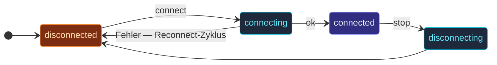

Jeder Protokoll-Actor in `actor-ts/io/broker` — `KafkaActor`,
`MqttActor`, `NatsActor` usw. — erbt von `BrokerActor`.  Die
Basisklasse besitzt den **gemeinsamen Lifecycle**:
Verbindungszustandsautomat, Reconnect-mit-Backoff, Outbound-Buffer,
Subscriber-Fan-out, Publishen von Lifecycle-Events.

`BrokerActor` (die abstrakte Basis) besitzt:

- **Lifecycle-Zustandsautomat** — `disconnected ↔ connecting ↔ connected ↔ disconnecting`.
- **Outbound-Buffer** — Nachrichten, die vor stehender Verbindung gesendet werden.
- **Reconnect-Schleife** — exponentielles Backoff bei Verbindungsverlust.
- **Subscriber-Tracking** — Fan-out für eingehende Events.

Subklassen implementieren drei Protokoll-Hooks:

| Hook | Wann aufgerufen |
| --- | --- |
| `connectImpl` | Die protokollspezifische Verbindung öffnen. |
| `disconnectImpl` | Sie sauber schließen. |
| `dispatchOutgoing(envelope)` | Eine einzelne gepufferte Nachricht auf die Leitung senden. |

Subklassen implementieren die drei Protokoll-Hooks; den Rest macht
die Basisklasse.  Diese Seite dokumentiert das, was **geteilt**
wird.  Für protokollspezifische Details siehe die
[Seiten pro Protokoll](/de/io/overview/).

## Der Zustandsautomat



Vier Zustände:

- **`disconnected`** — initial; aktuell nicht verbunden.
- **`connecting`** — `connectImpl` läuft.
- **`connected`** — Verbindung steht; Nachrichten fließen.
- **`disconnecting`** — `disconnectImpl` läuft.

Ein `disconnected` → `connecting` → Fehler löst eine
**Reconnect-Schleife** aus: Backoff + Retry bis Erfolg oder bis
`maxAttempts` erschöpft sind.

## Subklassen-Kontrakt

```ts
abstract class BrokerActor<S, Cmd, P> extends Actor<Cmd> {
  // Subklassen implementieren:
  protected abstract configKey(): string;
  protected abstract builtInDefaults(): Partial<S>;
  protected abstract readSettingsFromConfig(config: Config): Partial<S>;
  protected abstract requiredSettings(): ReadonlyArray<keyof S>;
  protected abstract endpointLabel(): string;

  protected abstract connectImpl(): Promise<void>;
  protected abstract disconnectImpl(): Promise<void>;
  protected abstract dispatchOutgoing(envelope: OutboundEnvelope<P>): Promise<void>;
}
```

Drei Kategorien:

- **Settings-Glue** (`configKey`, `builtInDefaults`,
  `readSettingsFromConfig`, `requiredSettings`,
  `endpointLabel`) — beschreibt, wie sich die Settings aus den
  drei Ebenen zusammensetzen (Konstruktor + HOCON + Defaults) und
  wie validiert wird.
- **Protokoll-Hooks** (`connectImpl`, `disconnectImpl`,
  `dispatchOutgoing`) — die protokollspezifische Arbeit.

`endpointLabel` ist die menschenlesbare Verbindungs-Identität
("amqp://localhost:5672", "kafka-cluster-1"), die in Log-Zeilen und
Lifecycle-Events auftaucht.

## Was die Basisklasse für dich erledigt

### Outbound-Buffering

```ts
this.outbound({ topic: 'orders', payload: ... });
```

Subklassen rufen `this.outbound(envelope)` zum Senden auf.  Die
Basisklasse:

- Wenn **connected** — ruft sofort `dispatchOutgoing(envelope)`
  auf.
- Wenn **disconnected** — puffert bis zu `outboundBuffer.capacity`
  Envelopes.  Beim Reconnect wird der Buffer geleert.

Überlauf gemäß Policy: `'drop-oldest'` / `'drop-new'` / `'reject'`
(wirft `BrokerBufferOverflow`).

### Subscriber-Tracking

```ts
this.onReceive(msg) {
  if (msg.kind === 'subscribe') {
    this.subscribe(msg.topic, msg.subscriber);
  }
  if (msg.kind === 'unsubscribe') {
    this.unsubscribe(msg.topic, msg.subscriber);
  }
}
```

`subscribe(topic, ref)` registriert `ref` als interessiert an den
eingehenden Nachrichten von `topic`.  Die Basisklasse **death-
watcht** die Ref — wenn sie stoppt, wird die Subscription
automatisch entfernt.  Keine Lecks.

Wenn das Protokoll eine eingehende Nachricht pusht, ruft die
Subklasse auf:

```ts
this.fanOut(topic, inboundMessage);
```

Die Basisklasse stellt sie an jeden Subscriber für dieses Topic
zu.

### Reconnect-mit-Backoff

```ts
reconnect: {
  minBackoffMs:   500,
  maxBackoffMs:   30_000,
  randomFactor:   0.2,
  maxAttempts:    -1,    // -1 = unbegrenzt
}
```

Pro Actor konfigurierbar.  Die Basisklasse verwendet dieselbe
exponentielle Backoff-Mathematik wie die
[BackoffPolicy](/de/patterns/backoff-policy/), mit Jitter, um
synchronisierte Retries über alle Clients zu vermeiden.

Jeder Versuch löst `BrokerReconnectAttempt` auf dem Event-Stream
aus; nachdem `maxAttempts` erschöpft sind (sofern endlich), löst
`BrokerReconnectFailed` aus und der Actor bleibt getrennt.

### Lifecycle-Events

Publisht auf `system.eventStream`:

| Event | Wann |
| --- | --- |
| `BrokerConnected` | Ein `connectImpl` war erfolgreich. |
| `BrokerDisconnected` | Ein `disconnectImpl` lief oder eine Verbindung ist fehlgeschlagen. |
| `BrokerReconnectAttempt` | Ein Reconnect-Versuch startet gerade. |
| `BrokerReconnectFailed` | `maxAttempts` erschöpft. |
| `BrokerBufferOverflow` | Der Outbound-Buffer hat ein Envelope verworfen. |
| `BrokerNotConnected` | Gesendet ohne Verbindung. |

Subscribiere, um jeden Broker-Actor einheitlich zu beobachten:

```ts
system.eventStream.subscribe(monitorRef, BrokerConnected);
system.eventStream.subscribe(monitorRef, BrokerDisconnected);
```

Die Events enthalten `actorPath` — so unterscheidest du Events
verschiedener Broker-Actors im System.

## Auflösung der Settings

```
1. builtInDefaults()           ← niedrigste Priorität (immer angewendet)
2. readSettingsFromConfig()    ← HOCON-Überschreibungen
3. Konstruktor-Argument        ← höchste Priorität (pro Instanz)
```

`preStart` mergt die drei Ebenen, validiert gegen
`requiredSettings()` und legt das Ergebnis für den Rest des Actor-
Lebens unter `this.settings` ab.

Fehlende Pflicht-Settings führen zu einem frühen Fehler-Throw in
`preStart` — der Actor durchläuft den Fehlerpfad des Supervisors,
bevor er überhaupt versucht, sich zu verbinden.

## Einen eigenen Protokoll-Actor schreiben

```ts
import { BrokerActor, type OutboundEnvelope, type BrokerCommonOptionsType } from 'actor-ts';

interface MyProtocolOptionsType extends BrokerCommonOptionsType {
  readonly url: string;
}

class MyProtocolActor extends BrokerActor<MyProtocolOptionsType, Cmd, MyPayload> {
  private conn: MyClient | null = null;

  protected configKey() { return 'actor-ts.io.broker.my-protocol'; }
  protected builtInDefaults() { return { /* ... */ }; }
  protected readSettingsFromConfig(c) { /* HOCON parsen */ return {}; }
  protected requiredSettings() { return ['url'] as const; }
  protected endpointLabel() { return this.settings.url; }

  protected async connectImpl(): Promise<void> {
    this.conn = await MyClient.connect(this.settings.url);
    this.conn.onMessage((m) => this.fanOut(m.topic, m));
  }

  protected async disconnectImpl(): Promise<void> {
    await this.conn?.close();
    this.conn = null;
  }

  protected async dispatchOutgoing(env: OutboundEnvelope<MyPayload>): Promise<void> {
    await this.conn!.send(env.payload);
  }
}
```

Den Rest übernimmt die Basisklasse.  Die meisten Drittanbieter-
Clients (kafkajs, nats.js usw.) haben eine eventbasierte
Message-Receive-API, die sich sauber auf `this.fanOut(...)`
abbilden lässt.

## Wohin als Nächstes

- **[I/O-Übersicht](/de/io/overview/)** — das große
  Bild: welche Protokolle ausgeliefert werden.
- **[Kafka](/de/io/kafka/)** / **[MQTT](/de/io/mqtt/)** /
  **[NATS](/de/io/nats/)** / usw. — Seiten pro Protokoll.
- **[Event-Stream](/de/fundamentals/event-stream/)** —
  wo Lifecycle-Events publisht werden.
- **[Backoff-Policy](/de/patterns/backoff-policy/)** —
  die Mathematik hinter der Reconnect-Schleife.
