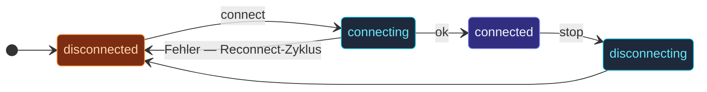

Jeder Protokoll-Actor in `actor-ts/io/broker` — `KafkaActor`,
`MqttActor`, `NatsActor` usw. — erbt von `BrokerActor`.  Die
Basisklasse besitzt den **gemeinsamen Lifecycle**:
Verbindungszustandsautomat, Reconnect-mit-Backoff, Outbound-Buffer,
Subscriber-Fan-out, Publishen von Lifecycle-Events.

`BrokerActor` (die abstrakte Basis) besitzt:

- **Lifecycle-Zustandsautomat** — `disconnected ↔ connecting ↔ connected ↔ disconnecting`.
- **Outbound-Buffer** — Nachrichten, die vor stehender Verbindung gesendet werden.
- **Reconnect-Schleife** — exponentielles Backoff bei Verbindungsverlust.
- **Subscriber-Tracking** — Fan-out für eingehende Events.
- **Gewünschte Subscriptions** — Protokoll-Subscriptions, die jede einzelne
  Verbindung überleben und bei jedem Reconnect neu aufgebaut werden.

Subklassen implementieren drei Protokoll-Hooks:

| Hook | Wann aufgerufen |
| --- | --- |
| `connectImplementation` | Die protokollspezifische Verbindung öffnen. |
| `disconnectImplementation` | Sie schließen — beim Stoppen **und vor jedem Re-Connect-Versuch**. |
| `dispatchOutgoing(envelope)` | Eine einzelne gepufferte Nachricht auf die Leitung senden. |

Subklassen implementieren die drei Protokoll-Hooks; den Rest macht
die Basisklasse.  Diese Seite dokumentiert das, was **geteilt**
wird.  Für protokollspezifische Details siehe die
[Seiten pro Protokoll](/de/io/overview/).

## Der Zustandsautomat


```mermaid
stateDiagram-v2
  direction LR
  [*] --> disconnected
  disconnected --> connecting: connect
  connecting --> connected: ok
  connecting --> disconnected: Fehler — Reconnect-Zyklus
  connected --> disconnecting: stop
  disconnecting --> disconnected
  classDef ok    fill:#312e81,stroke:#818cf8,color:#f1f5f9;
  classDef warn  fill:#7c2d12,stroke:#fb923c,color:#fed7aa;
  classDef step  fill:#1e293b,stroke:#06b6d4,color:#67e8f9;
  class connected ok
  class disconnected warn
  class connecting,disconnecting step
```

Vier Zustände:

- **`disconnected`** — initial; aktuell nicht verbunden.
- **`connecting`** — `connectImplementation` läuft.
- **`connected`** — Verbindung steht; Nachrichten fließen.
- **`disconnecting`** — `disconnectImplementation` läuft.

Ein `disconnected` → `connecting` → Fehler löst eine
**Reconnect-Schleife** aus: Backoff + Retry bis Erfolg oder bis
`maxAttempts` erschöpft sind.

Jeder Re-Connect-Versuch startet auf sauberem Grund: die Basisklasse ruft
zuerst `disconnectImplementation` auf, wenn ein früherer Versuch
irgendetwas geöffnet hat — eine Subklasse baut also nie eine neue
Verbindung auf den Handles der toten auf.  Damit ist
`disconnectImplementation` ein **idempotenter** Kontrakt: er darf auf
einer bereits toten Verbindung aufgerufen werden und muss ausschließlich
die lebenden Handles verwerfen, niemals die gewünschten Subscriptions
(siehe unten).

Wird der Aktor gestoppt, während ein Reconnect-Versuch läuft, wird diese
Verbindung **verworfen** statt übernommen.  Reconnect läuft auf dem
System-Scheduler, entkoppelt von der Mailbox — ein Versuch, der schon in
`connectImplementation` steckt, lässt sich nicht mehr abbrechen und läuft
weiter, nachdem `postStop` zurückgekehrt ist.  Die Basisklasse prüft daher
beim Verlassen des Handshakes erneut, ob der Aktor noch lebt, und ruft
andernfalls ein weiteres Mal `disconnectImplementation` auf und bleibt
`disconnected`: kein `BrokerConnected`, kein Leeren des Puffers, kein
weiterer Retry.  Ohne diese Prüfung installierte ein *erfolgreicher*
Handshake lebende Handles auf einem beendeten Aktor, und ein
*gescheiterter* stellte den Backoff-Timer neu und verband sich endlos
weiter, denn `maxAttempts` ist standardmäßig `Infinity` (#708).

## Subklassen-Kontrakt

```ts
abstract class BrokerActor<S, Command, P, Subscription = never> extends Actor<Command> {
  // Subklassen implementieren:
  protected abstract configKey(): string;
  protected abstract builtInDefaultOptions(): Partial<S>;
  protected abstract readOptionsFromConfig(config: Config): Partial<S>;
  protected abstract requiredOptions(): ReadonlyArray<keyof S>;
  protected abstract endpointLabel(): string;

  protected abstract connectImplementation(): Promise<void>;
  protected abstract disconnectImplementation(): Promise<void>;
  protected abstract dispatchOutgoing(envelope: OutboundEnvelope<P>): Promise<void>;

  protected abstract onCommand(command: Command): void | Promise<void>;

  // Optional — nur für Refs, die die Subklasse selbst beobachtet:
  protected onTerminated(signal: Terminated): void | Promise<void> {}
}
```

Vier Kategorien:

- **Settings-Glue** (`configKey`, `builtInDefaultOptions`,
  `readOptionsFromConfig`, `requiredOptions`,
  `endpointLabel`) — beschreibt, wie sich die Settings aus den
  drei Ebenen zusammensetzen (Konstruktor + HOCON + Defaults) und
  wie validiert wird.
- **Protokoll-Hooks** (`connectImplementation`, `disconnectImplementation`,
  `dispatchOutgoing`) — die protokollspezifische Arbeit.
- **Nachrichtenverarbeitung** (`onCommand`) — ein Command aus der Mailbox.
  Hier lebt die `match(...).exhaustive()`-Dispatch-Tabelle einer Subklasse.
- **Death-Watch** (`onTerminated`) — optional; siehe *Subscriber-Tracking*.

`endpointLabel` ist die menschenlesbare Verbindungs-Identität
("amqp://localhost:5672", "kafka-cluster-1"), die in Log-Zeilen und
Lifecycle-Events auftaucht.

**Gib den Verbindungs-String so zurück, wie er konfiguriert ist —
redigiere ihn nicht selbst.** Die Basisklasse schickt jede
Verwendung durch `redactedEndpointLabel()`, was Userinfo und
Query-String entfernt; `amqp://svc:pw@rabbit:5671/orders` erreicht
`BrokerConnected` also als `amqp://rabbit:5671/orders`. Das wiegt
schwerer, als es aussieht: Die vier Lifecycle-Events landen auf dem
systemweiten `EventStream`, der keinen Autorisierungsbegriff kennt
— jeder Actor im System kann sie also lesen — und eine
Reconnect-Schleife publiziert sie bei jedem Backoff-Tick erneut,
über die gesamte Dauer eines Ausfalls. Eine zusammengesetzte
Server-Liste behält ihre Gestalt und verliert jede Credential
(`nats://***@a:4222,nats://***@b:4222`), ein Label ohne Credential
kommt unverändert zurück. Rufe `redactedEndpointLabel()` auch in
deinen eigenen Log-Zeilen auf.

`onReceive` ist **versiegelt** — die Basisklasse besitzt die Methode, damit
sie `Terminated` abfangen kann, bevor deine Dispatch-Tabelle es sieht.
Implementiere stattdessen `onCommand`; dort kommt alles außer dem
Death-Watch-Signal an.

## Was die Basisklasse für dich erledigt

### Outbound-Buffering

```ts
this.enqueueOutbound(payload);
```

Subklassen rufen `this.enqueueOutbound(payload)` zum Senden auf; es
gibt `true` zurück, wenn die Nachricht gesendet oder gepuffert
wurde, `false`, wenn sie verworfen wurde.  Die Basisklasse:

- Wenn **connected** — verpackt `payload` in ein `OutboundEnvelope`
  und ruft sofort `dispatchOutgoing(envelope)` auf.
- Wenn **disconnected** (oder `connecting`) — puffert bis zu
  `outboundBuffer` Envelopes (Default `1000`).  Beim Reconnect wird
  der Buffer der Reihe nach geleert.

Bei Überlauf verwirft die Basisklasse immer das **älteste**
gepufferte Envelope (FIFO) und publisht ein `BrokerBufferOverflow`-
Event auf dem Event-Stream — es wird nie geworfen.  Mit
`outboundBuffer: 0` ist das Puffern deaktiviert: die Nachricht wird
verworfen und ein `BrokerNotConnected`-Event publisht.

### Subscriber-Tracking

```ts
import { match } from 'ts-pattern';

protected override onCommand(command: MyCommand): void {
  match(command)
    .with({ kind: 'subscribe' }, (c) => this.onSubscribe(c))
    .with({ kind: 'unsubscribe' }, (c) => this.onUnsubscribe(c))
    .exhaustive();
}

private onSubscribe(command: SubscribeCommand): void {
  this.subscribeRef(command.topic, command.subscriber);
}

private onUnsubscribe(command: UnsubscribeCommand): void {
  this.unsubscribeRef(command.topic, command.subscriber);
}
```

`subscribeRef(topic, ref)` registriert `ref` als interessiert an den
eingehenden Nachrichten von `topic` und **death-watcht** die Ref — für eine
lokale Ref; siehe den Hinweis weiter unten.

import { Aside } from '@astrojs/starlight/components';

<Aside type="tip" title="Das Entfernen beim Tod erledigt die Basisklasse">
  Oben steht nirgends `Terminated`, und das muss es auch nicht: `onReceive`
  ist versiegelt, die Basisklasse fängt das Signal also ab, entfernt den
  Subscriber aus jedem Topic, das er hielt, und reicht an `onCommand` nur
  echte Commands weiter.  Deine Dispatch-Tabelle beschreibt allein dein
  eigenes Protokoll, und `.exhaustive()` ist darauf genau richtig.

  Früher war das Aufgabe der Subklasse, und man konnte es in beide Richtungen
  falsch machen: ein Matcher ohne `Terminated`-Arm *wirft* auf dem
  ungematchten Signal, was der Standard-Supervisor mit einem Restart
  beantwortet — ein voller Broker-Reconnect pro Subscriber-Tod, bis
  `maxRetries: 10` die Bridge endgültig stoppt — und einer, der es mit
  `.otherwise()` verschluckte, leckte stattdessen: die tote Ref blieb in
  jedem Topic und kostete bei jedem Fan-out ein `tell` in die Dead Letters
  (#1111, #709).

  `pruneTerminatedSubscriber(ref)` gibt es weiterhin, für eine Subklasse, die
  einen Subscriber bewusst entfernt statt auf die Death-Watch zu warten.  Es
  liefert zurück, ob überhaupt etwas entfernt wurde, und macht **kein**
  `unwatch`: auf dem Todespfad hat die Zelle die Watch bereits fallen
  gelassen, wenn das Signal ankommt.
</Aside>

<Aside type="note" title="Eigene Refs beobachten">
  Überschreibe `onTerminated(signal)`, wenn dein Aktor `context.watch` für
  etwas anderes als einen Subscriber aufruft — ein Zustellziel, den
  Absender einer Anfrage.  Der Hook läuft **nach** dem Entfernen durch die
  Basisklasse, die Subscriber-Registry hat die tote Ref also bereits
  vergessen.  `MqttActor` nutzt ihn für seine Zustellziele pro Pattern.
</Aside>

<Aside type="caution" title="Die Death-Watch feuert nur für einen lokalen Subscriber">
  `context.watch` registriert einen Watcher, wenn die Ref eine `LocalActorRef`
  ist, und ist andernfalls ein stiller No-op — ein **entfernter** Subscriber
  erzeugt also nie ein `Terminated`: er bleibt in jedem Topic, das er hielt,
  bis der Broker-Aktor selbst stoppt, und kostet bei jedem Fan-out weiter ein
  `tell` über die Node-Grenze.  Keine `Terminated`-basierte Bereinigung kann
  daran etwas ändern — das Signal kommt nie an.  Nachverfolgt als #918.
</Aside>

`unsubscribeRef` vergleicht über den Pfad der Ref statt über das Ref-Objekt —
eine andere Ref auf denselben Actor unsubscribed also trotzdem.

Wenn das Protokoll eine eingehende Nachricht pusht, ruft die
Subklasse auf:

```ts
this.fanOutToTopic(topic, inboundMessage);
```

Die Basisklasse stellt sie an jeden Subscriber für dieses Topic
zu.

### Desired Subscriptions

Das Subscriber-Tracking oben spielt *innerhalb* des Actor-Systems — welche
lokalen Refs welches Topic wollen.  Eine **gewünschte Subscription** ist
die andere Hälfte: die Subscription, die der Actor *auf dem Broker* hält
und die bei jedem Verbindungsaufbau neu gesetzt werden muss.

Die Basisklasse hält diese Menge getrennt von den lebenden Handles,
damit sie jede einzelne Verbindung überlebt:

```ts
// Vormerken (und sofort setzen, falls verbunden).
await this.rememberSubscription('orders.new', target);
// Entfernen — auf dem Broker und aus der gewünschten Menge.
await this.forgetSubscription('orders.new');
```

Subklassen liefern drei Hooks:

| Hook | Zweck |
| --- | --- |
| `initialSubscriptions()` | In den Options deklarierte Subscriptions.  **Einmalig** vor dem ersten Connect in die gewünschte Menge übernommen. |
| `applySubscription(key, subscription)` | Eine Subscription auf der lebenden Verbindung setzen.  Muss einen bereits lebenden Key tolerieren. |
| `revokeSubscription(key)` | Eine abbauen.  Optional — mehrere Protokolle können eine einzelne Subscription nur mitsamt dem ganzen Consumer aufgeben. |

und spielen die ganze Menge aus `connectImplementation` heraus erneut ein:

```ts
protected async connectImplementation(): Promise<void> {
  this.connection = await MyClient.connect(this.options.url);
  await this.applyDesiredSubscriptions();   // konfiguriert + zur Laufzeit
}
```

Getrieben wird das Wiedereinspielen von der Subklasse und nicht von der
Basisklasse, weil der richtige Punkt im Handshake protokollspezifisch ist
— kafkajs etwa will jedes `subscribe` vor `consumer.run` haben.

Was das bringt:

- Eine zur Laufzeit hinzugefügte Subscription **überlebt einen
  Reconnect** — sie ist nicht bloß ein Aufruf auf einer Verbindung, die
  gerade stirbt.
- Ein `subscribe`, das **während einer Trennung** eintrifft, wird
  vorgemerkt und beim nächsten Connect gesetzt, statt verworfen zu werden.
- Das Übernehmen aus den Options passiert **nur einmal**, ein
  `unsubscribe` zur Laufzeit wird also nicht vom nächsten Reconnect
  wiederbelebt.
- Ein erneutes `rememberSubscription` auf einem lebenden Key baut ihn
  zuerst ab, damit eine geänderte Nutzlast (etwa ein anderer
  Ziel-Actor) tatsächlich greift.
- Eine Subscription, die **nicht** gesetzt werden kann, wird als Warnung
  geloggt, und der Rest der Menge geht trotzdem durch.  Ein schlechtes
  Subject reißt die Verbindung nicht mit — hinterlässt den Actor aber
  auch nicht stillschweigend verbunden-und-taub.

`MqttActor` ist älter als dieser Mechanismus und behält seine eigene,
reichhaltigere Registry (QoS pro Topic, mehrere Targets pro Pattern,
Deathwatch auf jedem) — mit den gleichen Reconnect-Garantien.

### Reconnect-mit-Backoff

```ts
reconnect: {
  initialDelayMs: 200,
  maxDelayMs:     30_000,
  factor:         2,
  maxAttempts:    Infinity,   // der Default — endlos wiederholen
  randomFactor:   0.2,        // der Default — ±20 % Jitter
}
```

Pro Actor konfigurierbar (oder `reconnect: false`, um
Auto-Reconnect ganz zu deaktivieren).  Jeder Versuch wartet
`min(initialDelayMs * factor^(attempt - 1), maxDelayMs)`, multipliziert
mit einem zufälligen `1 ± randomFactor`.

Der Jitter ist das, was eine **Flotte** davon abhält, im Gleichschritt zu
wiederholen.  Ohne ihn ist die Verzögerung eine reine Funktion des
Versuchszählers und dieser Optionen — jeder Broker-Actor, der denselben
Broker im selben Moment verloren hat, wacht also in derselben Millisekunde
auf, Welle für Welle, und die Herde kann den sich erholenden Broker unten
halten.  `randomFactor: 0` stellt den vollständig deterministischen
Zeitplan wieder her.

Dieselbe Streuung gilt für den **Circuit Breaker**: Ist der Breaker offen,
prüft der Actor irgendwo in
`[resetMs, resetMs × (1 + randomFactor)]` erneut statt exakt zum Stichtag.
Dieser Jitter ist einseitig — ein Breaker wird nie zu früh erneut versucht.

Jeder Versuch löst `BrokerReconnectAttempt` auf dem Event-Stream
aus (dessen `delayMs` ist der tatsächlich eingeplante, gejitterte Wert);
nachdem `maxAttempts` erschöpft sind (sofern endlich), löst
`BrokerReconnectFailed` aus und der Actor bleibt getrennt.

Für einen deterministischen Test lässt sich die Zufallsquelle injizieren —
`random: () => 0.5` fixiert jede Verzögerung auf ihren ungejitterten Wert:

```ts
reconnect: { initialDelayMs: 100, random: () => 0.5 }
```

### Liveness-Deadlines

Alles oben Beschriebene wird von `handleConnectionLost` ausgelöst, und
das wird nur aufgerufen, wenn der Transport ein Ende **meldet** — ein
`close`-Event, ein `error`, ein Stream, der `done` gemeldet hat.  Ein
Peer, der ohne FIN oder RST verschwindet, meldet nichts davon.  Ein
verfallener NAT-Eintrag, ein mit `SIGKILL` beendeter Container, eine
Route, die anfängt zu verschlucken: der Socket bleibt offen, der Actor
bleibt `connected`, und die Reconnect-Maschinerie läuft nie.

Zwei Uhren schließen diese Lücke.  Beide sind **pro Protokoll
opt-in**, weil nur die Anwendung weiß, wie still ihr Peer sein darf:

- **`idleTimeoutMs`** — eine **Lese**-Deadline.  Kommt so lange nichts
  vom Peer, wird die Verbindung über den gewöhnlichen
  `handleConnectionLost`-Pfad als verloren gemeldet; alles auf dieser
  Seite gilt damit unverändert: `BrokerDisconnected`, Backoff, Puffer,
  Breaker.  Zurückgesetzt wird sie von eingehenden Bytes und
  ausdrücklich *nicht* von ausgehenden: ein Client, der in ein
  schwarzes Loch schreibt, ist genau der Fall, der sie auslösen muss.
- **`connectTimeoutMs`** — eine Deadline für einen einzelnen
  `connectImplementation`-Aufruf.  Jedes Protokoll beendet seinen
  Connect über ein Event (`connect`, `open`, Response-Header), und
  keines hat eine Uhr — ein Peer, der den Handshake abschließt und dann
  stehen bleibt, hält den Actor unbegrenzt in `connecting`.  Läuft die
  Deadline ab, wird der Versuch abgebrochen, und der Fehler nimmt den
  Weg, den ein abgelehnter Connect ohnehin nimmt.

`TcpSocketActor`, `SseActor` und `WebsocketClientActor` bieten beide
an.  Setze `idleTimeoutMs` **oberhalb** des Heartbeats, den der Peer
ohnehin sendet; darunter kappt die Deadline gesunde Verbindungen in
Endlosschleife.  `0` (der Default) schaltet beide ab.

Protokolle mit eigener Liveness auf Protokollebene brauchen das nicht:
`MqttActor` hat MQTT-`keepAlive`, und `KafkaActor` fährt einen
Consumer-Heartbeat.

### Lifecycle-Events

Publisht auf `system.eventStream`:

| Event | Wann |
| --- | --- |
| `BrokerConnected` | Ein `connectImplementation` war erfolgreich. |
| `BrokerDisconnected` | Eine bestehende Verbindung ging verloren. Ein geordneter Stopp publisht es nicht. |
| `BrokerReconnectAttempt` | Ein Reconnect-Versuch startet gerade. |
| `BrokerReconnectFailed` | `maxAttempts` erschöpft. |
| `BrokerBufferOverflow` | Der Outbound-Buffer hat ein Envelope verworfen. |
| `BrokerNotConnected` | Gesendet ohne Verbindung. |

Subscribiere, um jeden Broker-Actor einheitlich zu beobachten:

```ts
system.eventStream.subscribe(monitorRef, BrokerConnected);
system.eventStream.subscribe(monitorRef, BrokerDisconnected);
```

Die Events enthalten `actorPath` — so unterscheidest du Events
verschiedener Broker-Actors im System.

## Auflösung der Settings

```
1. builtInDefaultOptions()           ← niedrigste Priorität (immer angewendet)
2. readOptionsFromConfig()    ← HOCON-Überschreibungen
3. Konstruktor-Argument        ← höchste Priorität (pro Instanz)
```

`preStart` mergt die drei Ebenen, validiert gegen
`requiredOptions()` und legt das Ergebnis für den Rest des Actor-
Lebens unter `this.options` ab.

Fehlende Pflicht-Settings führen zu einem frühen Fehler-Throw in
`preStart` — der Actor durchläuft den Fehlerpfad des Supervisors,
bevor er überhaupt versucht, sich zu verbinden.

## Einen eigenen Protokoll-Actor schreiben

```ts
import { match } from 'ts-pattern';
import { BrokerActor, type OutboundEnvelope, type BrokerCommonOptionsType } from 'actor-ts/io';

interface MyProtocolOptionsType extends BrokerCommonOptionsType {
  readonly url: string;
}

class MyProtocolActor extends BrokerActor<MyProtocolOptionsType, Command, MyPayload> {
  private connection: MyClient | null = null;

  protected configKey() { return 'actor-ts.io.broker.my-protocol'; }
  protected builtInDefaultOptions() { return { /* ... */ }; }
  protected readOptionsFromConfig(c) { /* HOCON parsen */ return {}; }
  protected requiredOptions() { return ['url'] as const; }
  protected endpointLabel() { return this.options.url; }

  protected async connectImplementation(): Promise<void> {
    this.connection = await MyClient.connect(this.options.url);
    this.connection.onMessage((m) => this.fanOutToTopic(m.topic, m));
  }

  // Wird beim Stoppen UND vor jedem Re-Connect-Versuch aufgerufen —
  // idempotent und auch auf einer bereits toten Verbindung sicher.
  protected async disconnectImplementation(): Promise<void> {
    await this.connection?.close();
    this.connection = null;
  }

  protected async dispatchOutgoing(env: OutboundEnvelope<MyPayload>): Promise<void> {
    await this.connection!.send(env.payload);
  }

  // `onReceive` ist von der Basisklasse versiegelt — implementiere `onCommand`.
  protected override onCommand(command: Command): void {
    match(command)
      .with({ kind: 'subscribe' }, (c) => this.onSubscribe(c))
      .exhaustive();
  }

  private onSubscribe(command: SubscribeCommand): void {
    this.subscribeRef(command.topic, command.subscriber);
  }
}
```

Den Rest übernimmt die Basisklasse.  Die meisten Drittanbieter-
Clients (kafkajs, nats.js usw.) haben eine eventbasierte
Message-Receive-API, die sich sauber auf `this.fanOutToTopic(...)`
abbilden lässt.

## Wohin als Nächstes

- **[I/O-Übersicht](/de/io/overview/)** — das große
  Bild: welche Protokolle ausgeliefert werden.
- **[Kafka](/de/io/kafka/)** / **[MQTT](/de/io/mqtt/)** /
  **[NATS](/de/io/nats/)** / usw. — Seiten pro Protokoll.
- **[Event-Stream](/de/fundamentals/event-stream/)** —
  wo Lifecycle-Events publisht werden.
- **[Backoff-Policy](/de/patterns/backoff-policy/)** —
  ein eigenständiges Backoff-Primitiv (die Reconnect-Schleife rechnet selbst).
