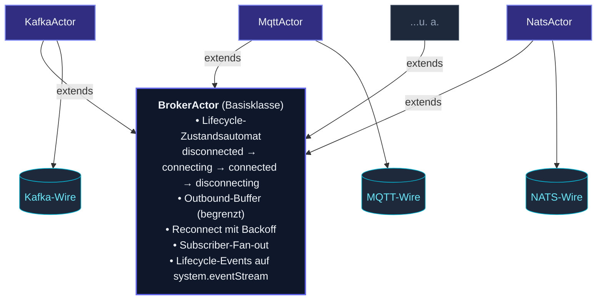
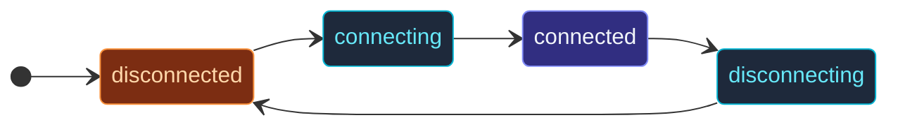

Actors erledigen In-Process-Arbeit sauber; die **Außenwelt** ist
chaotischer — Sockets verbinden und trennen sich, Broker fallen aus,
HTTP-Clients stapeln sich, Payloads überqueren Protokollgrenzen.

Die I/O-Module des Frameworks verpacken jedes Protokoll in einem
**Actor, der das Protokoll hinter einem einheitlichen Vertrag
verbirgt**: Connect bei `preStart`, Events an Subscriber publishen,
wenn Nachrichten eintreffen, ausgehende Nachrichten bei getrennter
Verbindung puffern, Reconnect mit Backoff, Lifecycle-Events auf dem
Event-Stream sichtbar machen.



Subklassen implementieren drei Hooks (`connectImpl`, `disconnectImpl`,
`dispatchOutgoing`); den Rest übernimmt die Basisklasse.

## Die verfügbaren Broker

| Modul | Protokoll | Typischer Einsatz |
| --- | --- | --- |
| `KafkaActor` | Apache Kafka | Durables Log mit hohem Durchsatz; Consumer-Group-Fan-out. |
| `MqttActor` | MQTT 3.1.1 / 5 | IoT, Telemetrie; QoS 0/1/2 + Retained Messages. |
| `AmqpActor` | RabbitMQ / AMQP 0.9.1 | Topic-/Queue-Routing, Work Queues. |
| `NatsActor` | NATS core | Leichtgewichtiges Pub/Sub; Request/Reply. |
| `JetStreamActor` | NATS JetStream | Durables Streaming auf NATS. |
| `RedisStreamsActor` | Redis XADD/XREAD | Leichtgewichtiges Streaming + Consumer Groups. |
| `GrpcClientActor` / `GrpcServerActor` | gRPC | Typisierter RPC + Streaming. |
| `WebsocketClientActor` | WebSocket | Ausgehende Verbindung (Broker-basierter Client). |
| `websocket()`-Route + `WebsocketServerActor` | WebSocket | Eingehende Verbindungen — über die HTTP-Route-DSL gebunden, kein Broker. |
| `SseActor` | Server-Sent Events | Client, der den Einweg-Event-Stream eines Servers konsumiert. |
| `TcpSocketActor` | Raw TCP | Eigene Protokolle. |
| `UdpSocketActor` | Raw UDP | Telemetrie, Datagramme mit niedriger Latenz. |

Jeder hat seine eigene Seite in diesem Abschnitt.  Diese Übersicht
behandelt das **gemeinsame Muster**, das sie alle teilen.

## Der Lifecycle-Zustandsautomat



Lineare Übergänge im Normalbetrieb:

- **`disconnected`** — Initialzustand; aktuell nicht verbunden.
- **`connecting`** — `connectImpl` läuft.
- **`connected`** — Verbindung steht; Nachrichten fließen.
- **`disconnecting`** — `disconnectImpl` läuft.

Ein Fehler während `connected` löst einen Übergang nach `disconnected`
+ eine Reconnect-Schleife aus.  Ein Stop läuft aus jedem Zustand über
`disconnecting`.

Subscribiere die Lifecycle-Events über den Event-Stream:

```ts
import { BrokerConnected, BrokerDisconnected, BrokerReconnectAttempt } from 'actor-ts';

class Monitor extends Actor<BrokerConnected | BrokerDisconnected | BrokerReconnectAttempt> {
  override preStart(): void {
    this.system.eventStream.subscribe(this.self, BrokerConnected);
    this.system.eventStream.subscribe(this.self, BrokerDisconnected);
    this.system.eventStream.subscribe(this.self, BrokerReconnectAttempt);
  }
  override onReceive(event: BrokerConnected | BrokerDisconnected | BrokerReconnectAttempt): void {
    this.log.info(`broker event: ${event.constructor.name}`);
  }
}
```

Das Event-Payload enthält, welcher Broker-Actor es ausgelöst hat
(über `actorPath`), sodass ein einzelner Monitor alle Broker im
System beobachten kann.

## Reconnect mit Backoff

Wenn ein verbundener Broker unerwartet die Verbindung verliert,
plant die Basisklasse einen Reconnect mit exponentiellem Backoff.
Konfigurierbar über `BrokerCommonOptionsType`:

```ts
{
  reconnect: {
    minBackoffMs:  500,
    maxBackoffMs:  30_000,
    randomFactor:  0.2,
    maxAttempts:   -1,    // -1 = unbegrenzt
  }
}
```

Jeder Versuch löst ein `BrokerReconnectAttempt`-Event aus.  Wenn
`maxAttempts` überschritten wird (sofern endlich), meldet der Actor
`BrokerReconnectFailed` und bleibt getrennt; gepufferte Nachrichten
in der Outbound-Queue werden gemäß Buffer-Policy irgendwann
verworfen.

## Outbound-Buffer

Solange die Verbindung getrennt ist, schlagen ausgehende Nachrichten
nicht sofort fehl — sie werden in einem begrenzten Outbound-Buffer
eingereiht.  Sobald die Verbindung wiederhergestellt ist, wird der
Buffer geleert.

Konfigurierbare Größe + Überlauf-Policy:

```ts
{
  outboundBuffer: {
    capacity: 1_000,
    overflow: 'drop-oldest',   // oder 'drop-new' oder 'reject'
  }
}
```

Wenn der Buffer überläuft, publisht die Basisklasse ein
`BrokerBufferOverflow`-Event, damit du es in Metriken verdrahten
kannst.

## Subscriber-Fan-out

Für eingehende Nachrichten (z. B. eine Kafka-Nachricht, die auf einem
subscribierten Topic landet) publisht der Broker-Actor an
**Subscriber** — Actor-Refs, die sich als interessiert registriert
haben:

```ts
const kafkaOptions = KafkaOptions.create()
  .withBrokers('localhost:9092')
  .withConsumer({ groupId: 'my-app', topics: ['orders'] });
const kafka = system.spawn(
  Props.create(() => new KafkaActor(
    kafkaOptions,
  )),
);

const handler = system.spawnAnonymous(Props.create(() => new OrderHandler()));

kafka.tell({ kind: 'subscribe', subscriber: handler });
// Jede eingehende Order wird jetzt an `handler` gesendet.
```

Verschiedene Broker-Actors haben unterschiedliche Subscription-
Semantiken (ein einzelnes Topic bei MQTT, eine Consumer-Group + Topic-
Liste bei Kafka), aber das Muster ist konsistent: Subscriber-Ref
registrieren, eingehende Protokollnachrichten als Actor-Nachrichten
empfangen.

## Reihenfolge der Settings

Drei Ebenen, höchste Priorität zuerst:

1. **Konstruktor-Argument** — was du beim Spawnen des Actors
   übergeben hast.
2. **HOCON-Config** unter einem protokollspezifischen Key (z. B.
   `actor-ts.io.kafka { bootstrap-servers = "..." }`).
3. **Eingebaute Defaults** — vernünftige Produktions-Defaults, die
   der Actor mitbringt.

Das heißt: Du kannst systemweite Defaults in `application.conf`
setzen und pro Instanz über den Konstruktor überschreiben.  Die
Unterseiten der einzelnen Broker buchstabieren aus, welche Keys
jedes Protokoll liest.

## Wann ein Broker-Actor passt

Drei gute Einsatzbereiche:

1. **Einen externen Broker** in die Actor-Welt **brücken** — Kafka-,
   MQTT-, NATS-Nachrichten müssen zu Actor-Nachrichten werden und
   umgekehrt.  Bau das Protokoll nicht selbst; benutze die
   mitgelieferten Actors.
2. **Langlebige Verbindungen** zu einem Service, der Daten pusht —
   gRPC-Streams, WebSocket-Clients, SSE-Consumer.  Der Broker-Actor
   übernimmt Reconnect und Buffering.
3. **Sich gegenseitig ausschließender Ressourcenbesitz** — genau
   eine TCP-Verbindung zu einem Legacy-Service.  Das Broker-Actor-
   Modell serialisiert den Zugriff von Natur aus.

## Was **kein** Broker-Actor ist

import { Aside } from '@astrojs/starlight/components';

<Aside type="caution" title="One-Shot-HTTP-Requests sind keine Broker-Actors">
  Für "fetch diese URL, kriege ein JSON zurück" ist ein einfacher
  `fetch()`-Aufruf in `onReceive` eines Actors die richtige Form —
  keine langlebige Verbindung, keine Reconnect-Logik, kein Buffering
  nötig.  Broker-Actors sind für Verbindungen, die viele Nachrichten
  überspannen.
</Aside>

<Aside type="caution" title="HTTP-Server sind ein separates Modul">
  Das Framework hat ein eigenes [HTTP](/de/http/overview/)-Modul
  mit Route-DSL, Marshalling, Middleware und drei pluggable Backends
  (Fastify, Express, Hono).  Es baut nicht auf `BrokerActor` auf —
  HTTP-Server passen nicht in die Form
  "eine Verbindung, viele Nachrichten".
</Aside>

## Einen eigenen Broker-Actor schreiben

Implementiere die drei abstrakten Methoden und verdrahte die
Settings:

```ts
import { BrokerActor, type BrokerCommonOptionsType } from 'actor-ts';

class MyProtocolActor extends BrokerActor<MyOutbound> {
  protected configKey() { return 'actor-ts.io.my-protocol'; }
  protected builtInDefaultOptions(): BrokerCommonOptionsType { return { /* Defaults */ }; }
  protected readOptionsFromConfig(c) { /* HOCON parsen */ }
  protected requiredOptions() { return ['url']; }

  protected async connectImpl(): Promise<void> {
    // Verbindung aufbauen.  Bei Fehler werfen.
  }
  protected async disconnectImpl(): Promise<void> {
    // Verbindung aufräumen.
  }
  protected async dispatchOutgoing(env: OutboundEnvelope<MyOutbound>): Promise<void> {
    // Payload über die Verbindung senden.
  }
}
```

Die Basisklasse kümmert sich um Zustandsübergänge, Buffering,
Reconnect, Event-Publishing.  Subklassen besitzen nur die
protokollspezifischen Teile.

## Wohin als Nächstes

- **Seiten pro Protokoll** — [Kafka](/de/io/kafka/),
  [MQTT](/de/io/mqtt/), [AMQP](/de/io/amqp/),
  [NATS](/de/io/nats/), [Redis Streams](/de/io/redis-streams/),
  [gRPC](/de/io/grpc/), [WebSocket-Client](/de/io/websocket/),
  [WebSocket-Server](/de/io/server-websocket/),
  [SSE](/de/io/sse/), [TCP](/de/io/tcp/),
  [UDP](/de/io/udp/).
- **[BrokerActor-Basisklasse](/de/io/broker-actor-base/)** —
  der gemeinsame Lifecycle und die gemeinsame Konfiguration.
- **[HTTP-Übersicht](/de/http/overview/)** — das separate
  HTTP-Server-Modul.
- **[Event-Stream](/de/fundamentals/event-stream/)** — wo
  Broker-Lifecycle-Events publisht werden.

Die [`BrokerActor`](/api/classes/brokeractor/)-API-Referenz deckt
die komplette Oberfläche der Basisklasse ab.
