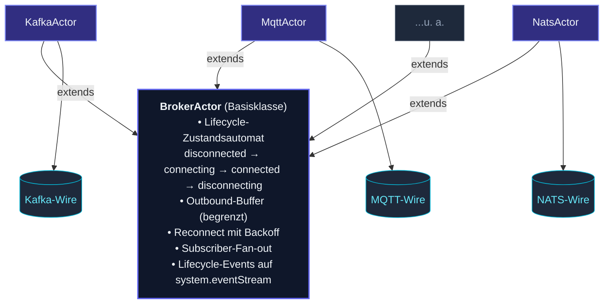
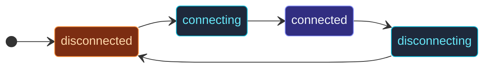

Actors erledigen In-Process-Arbeit sauber; die **Außenwelt** ist
chaotischer — Sockets verbinden und trennen sich, Broker fallen aus,
HTTP-Clients stapeln sich, Payloads überqueren Protokollgrenzen.

Die I/O-Module des Frameworks verpacken jedes Protokoll in einem
**Actor, der das Protokoll hinter einem einheitlichen Vertrag
verbirgt**: Connect bei `preStart`, Events an Subscriber publishen,
wenn Nachrichten eintreffen, ausgehende Nachrichten bei getrennter
Verbindung puffern, Reconnect mit Backoff, Lifecycle-Events auf dem
Event-Stream sichtbar machen.


```mermaid
flowchart TB
  BASE["<b>BrokerActor</b> (Basisklasse)<br/>• Lifecycle-Zustandsautomat<br/>disconnected → connecting → connected → disconnecting<br/>• Outbound-Buffer (begrenzt)<br/>• Reconnect mit Backoff<br/>• Subscriber-Fan-out<br/>• Lifecycle-Events auf system.eventStream"]
  K["KafkaActor"]
  M["MqttActor"]
  N["NatsActor"]
  ETC["...u. a."]
  WK[("Kafka-Wire")]
  WM[("MQTT-Wire")]
  WN[("NATS-Wire")]
  K -- "extends" --> BASE
  M -- "extends" --> BASE
  N -- "extends" --> BASE
  ETC -- "extends" --> BASE
  K --> WK
  M --> WM
  N --> WN
  classDef base   fill:#0f172a,stroke:#6366f1,stroke-width:2px,color:#f1f5f9;
  classDef sub    fill:#312e81,stroke:#818cf8,stroke-width:1.5px,color:#f1f5f9;
  classDef wire   fill:#1e293b,stroke:#06b6d4,color:#67e8f9;
  classDef etc    fill:#1e293b,stroke:#475569,color:#94a3b8;
  class BASE base
  class K,M,N sub
  class WK,WM,WN wire
  class ETC etc
```

Subklassen implementieren drei Hooks (`connectImplementation`, `disconnectImplementation`,
`dispatchOutgoing`); den Rest übernimmt die Basisklasse.

## Die verfügbaren Broker

| Modul | Protokoll | Typischer Einsatz |
| --- | --- | --- |
| `KafkaActor` | Apache Kafka | Durables Log mit hohem Durchsatz; Consumer-Group-Fan-out. |
| `MqttActor` | MQTT 3.1.1 / 5 | IoT, Telemetrie; QoS 0/1/2 + Retained Messages. |
| `AmqpActor` | RabbitMQ / AMQP 0.9.1 | Topic-/Queue-Routing, Work Queues. |
| `NatsActor` | NATS core | Leichtgewichtiges Pub/Sub; Request/Reply. |
| `JetStreamActor` | NATS JetStream | Durables Streaming auf NATS. |
| `JetStreamKeyValueActor` | NATS JetStream KV | Revisioniertes Key-Value-Bucket mit Compare-and-Swap + Watch. |
| `JetStreamObjectStoreActor` | NATS JetStream Object Store | Benannte Blobs mit Metadaten. |
| `RedisStreamsActor` | Redis XADD/XREAD | Leichtgewichtiges Streaming + Consumer Groups. |
| `GrpcClientActor` / `GrpcServerActor` | gRPC | Typisierter RPC + Streaming. |
| `WebsocketClientActor` | WebSocket | Ausgehende Verbindung (Broker-basierter Client). |
| `websocket()`-Route + `WebsocketServerActor` | WebSocket | Eingehende Verbindungen — über die HTTP-Route-DSL gebunden, kein Broker. |
| `SseActor` | Server-Sent Events | Client, der den Einweg-Event-Stream eines Servers konsumiert. |
| `TcpSocketActor` | Raw TCP | Eigene Protokolle — ausgehende Verbindung. |
| `TcpServerActor` | Raw TCP | Eigene Protokolle — bindet einen Port, bedient jede angenommene Verbindung. |
| `UdpSocketActor` | Raw UDP | Telemetrie, Datagramme mit niedriger Latenz. |
| `EmailBridgeActor` | IMAP (rein) + SMTP (raus) | Ops-/Alerting-Bridge — ein Postfach als Quelle, gepooltes SMTP als Senke. |

Jeder hat seine eigene Seite in diesem Abschnitt.  Diese Übersicht
behandelt das **gemeinsame Muster**, das sie alle teilen.

## Der Lifecycle-Zustandsautomat


```mermaid
stateDiagram-v2
  direction LR
  [*] --> disconnected
  disconnected --> connecting
  connecting --> connected
  connected --> disconnecting
  disconnecting --> disconnected
  classDef ok    fill:#312e81,stroke:#818cf8,color:#f1f5f9;
  classDef warn  fill:#7c2d12,stroke:#fb923c,color:#fed7aa;
  classDef step  fill:#1e293b,stroke:#06b6d4,color:#67e8f9;
  class connected ok
  class disconnected warn
  class connecting,disconnecting step
```

Lineare Übergänge im Normalbetrieb:

- **`disconnected`** — Initialzustand; aktuell nicht verbunden.
- **`connecting`** — `connectImplementation` läuft.
- **`connected`** — Verbindung steht; Nachrichten fließen.
- **`disconnecting`** — `disconnectImplementation` läuft.

Ein Fehler während `connected` löst einen Übergang nach `disconnected`
+ eine Reconnect-Schleife aus.  Ein Stop läuft aus jedem Zustand über
`disconnecting`.

Subscribiere die Lifecycle-Events über den Event-Stream:

```ts
import { BrokerConnected, BrokerDisconnected, BrokerReconnectAttempt } from 'actor-ts/io';

class Monitor extends Actor<BrokerConnected | BrokerDisconnected | BrokerReconnectAttempt> {
  override preStart(): void {
    this.system.eventStream.subscribe(this.self, BrokerConnected);
    this.system.eventStream.subscribe(this.self, BrokerDisconnected);
    this.system.eventStream.subscribe(this.self, BrokerReconnectAttempt);
  }
  override onReceive(event: BrokerConnected | BrokerDisconnected | BrokerReconnectAttempt): void {
    this.log.info(`broker event: ${event.constructor.name}`);
  }
}
```

Das Event-Payload enthält, welcher Broker-Actor es ausgelöst hat
(über `actorPath`), sodass ein einzelner Monitor alle Broker im
System beobachten kann.

## Reconnect mit Backoff

Wenn ein verbundener Broker unerwartet die Verbindung verliert,
plant die Basisklasse einen Reconnect mit exponentiellem Backoff.
Konfigurierbar über `BrokerCommonOptionsType`:

```ts
{
  reconnect: {
    initialDelayMs: 200,
    maxDelayMs:     30_000,
    factor:         2,
    randomFactor:   0.2,
    // maxAttempts weggelassen → Infinity (endlos wiederholen); eine
    // endliche positive Zahl begrenzt die Versuche.  reconnect: false
    // schaltet ihn ab.
  }
}
```

Jede Verzögerung wird mit `1 ± randomFactor` gejittert (Default ±20 %),
damit eine Flotte von Broker-Actors, die denselben Broker gemeinsam
verloren hat, nicht im Gleichschritt wiederholt; `randomFactor: 0`
schaltet das ab.

Jeder Versuch löst ein `BrokerReconnectAttempt`-Event aus.  Wenn
`maxAttempts` überschritten wird (sofern endlich), meldet der Actor
`BrokerReconnectFailed` und bleibt getrennt; Nachrichten im
Outbound-Buffer werden bei Überlauf älteste zuerst verworfen.

## Outbound-Buffer

Solange die Verbindung getrennt ist, schlagen ausgehende Nachrichten
nicht sofort fehl — sie werden in einem begrenzten Outbound-Buffer
eingereiht.  Sobald die Verbindung wiederhergestellt ist, wird der
Buffer geleert.

Konfigurierbare Größe — eine einfache Nachrichtenanzahl:

```ts
{
  outboundBuffer: 1_000,   // Nachrichten, die bei Trennung gehalten werden; 0 = Fail-Fast
}
```

Wenn der Buffer voll ist, wird die **älteste** Nachricht verworfen
(FIFO) und die Basisklasse publisht ein `BrokerBufferOverflow`-Event,
damit du es in Metriken verdrahten kannst.  Mit `outboundBuffer: 0`
gibt es stattdessen Fail-Fast — eine bei Trennung gesendete ausgehende
Nachricht wird verworfen und ein `BrokerNotConnected`-Event publisht.

## Subscriber-Fan-out

Für eingehende Nachrichten (z. B. ein Kafka-Record, der auf einem
subscribierten Topic landet) liefert der Broker-Actor jede einzelne an
eine **Target**-Actor-Ref, die du vorab über `withTarget` festlegst:

```ts
const handler = system.spawnAnonymous(OrderHandler);

const kafkaOptions = KafkaOptions.create()
  .withBrokers('localhost:9092')
  .withConsumer({ groupId: 'my-app' })
  .withTopics(['orders'])
  .withTarget(handler);
const kafka = system.spawnAnonymous(
  () => new KafkaActor(kafkaOptions),
);
// Jeder eingehende Order-Record wird jetzt an `handler` gesendet.

// Zur Laufzeit ein weiteres Topic zum laufenden Consumer hinzufügen:
kafka.tell({ kind: 'subscribe', topic: 'shipments' });
```

Verschiedene Broker-Actors haben unterschiedliche Subscription-
Semantiken (ein einzelnes Topic bei MQTT, eine Consumer-Group + Topic-
Liste bei Kafka), aber das Muster ist konsistent: den Actor auf eine
Target-Ref richten und eingehende Protokollnachrichten als
Actor-Nachrichten empfangen.

## Reihenfolge der Settings

Drei Ebenen, höchste Priorität zuerst:

1. **Konstruktor-Argument** — was du beim Spawnen des Actors
   übergeben hast.
2. **HOCON-Config** unter einem protokollspezifischen Key (z. B.
   `actor-ts.io.broker.kafka { brokers = "..." }`).
3. **Eingebaute Defaults** — vernünftige Produktions-Defaults, die
   der Actor mitbringt.

Das heißt: Du kannst systemweite Defaults in `application.conf`
setzen und pro Instanz über den Konstruktor überschreiben.  Die
Unterseiten der einzelnen Broker buchstabieren aus, welche Keys
jedes Protokoll liest.

## Wann ein Broker-Actor passt

Drei gute Einsatzbereiche:

1. **Einen externen Broker** in die Actor-Welt **brücken** — Kafka-,
   MQTT-, NATS-Nachrichten müssen zu Actor-Nachrichten werden und
   umgekehrt.  Bau das Protokoll nicht selbst; benutze die
   mitgelieferten Actors.
2. **Langlebige Verbindungen** zu einem Service, der Daten pusht —
   gRPC-Streams, WebSocket-Clients, SSE-Consumer.  Der Broker-Actor
   übernimmt Reconnect und Buffering.
3. **Sich gegenseitig ausschließender Ressourcenbesitz** — genau
   eine TCP-Verbindung zu einem Legacy-Service.  Das Broker-Actor-
   Modell serialisiert den Zugriff von Natur aus.

## Was **kein** Broker-Actor ist

import { Aside } from '@astrojs/starlight/components';

<Aside type="caution" title="One-Shot-HTTP-Requests sind keine Broker-Actors">
  Für "fetch diese URL, kriege ein JSON zurück" ist ein einfacher
  `fetch()`-Aufruf in `onReceive` eines Actors die richtige Form —
  keine langlebige Verbindung, keine Reconnect-Logik, kein Buffering
  nötig.  Broker-Actors sind für Verbindungen, die viele Nachrichten
  überspannen.
</Aside>

<Aside type="caution" title="HTTP-Server sind ein separates Modul">
  Das Framework hat ein eigenes [HTTP](/de/http/overview/)-Modul
  mit Route-DSL, Marshalling, Middleware und drei pluggable Backends
  (Fastify, Express, Hono).  Es baut nicht auf `BrokerActor` auf —
  HTTP-Server passen nicht in die Form
  "eine Verbindung, viele Nachrichten".
</Aside>

## Einen eigenen Broker-Actor schreiben

Implementiere die drei abstrakten Methoden und verdrahte die
Settings:

```ts
import { BrokerActor, type BrokerCommonOptionsType } from 'actor-ts/io';

class MyProtocolActor extends BrokerActor<MyOutbound> {
  protected configKey() { return 'actor-ts.io.my-protocol'; }
  protected builtInDefaultOptions(): BrokerCommonOptionsType { return { /* Defaults */ }; }
  protected readOptionsFromConfig(c) { /* HOCON parsen */ }
  protected requiredOptions() { return ['url']; }

  protected async connectImplementation(): Promise<void> {
    // Verbindung aufbauen.  Bei Fehler werfen.
  }
  protected async disconnectImplementation(): Promise<void> {
    // Verbindung aufräumen.
  }
  protected async dispatchOutgoing(env: OutboundEnvelope<MyOutbound>): Promise<void> {
    // Payload über die Verbindung senden.
  }
}
```

Die Basisklasse kümmert sich um Zustandsübergänge, Buffering,
Reconnect, Event-Publishing.  Subklassen besitzen nur die
protokollspezifischen Teile.

## Wohin als Nächstes

- **Seiten pro Protokoll** — [Kafka](/de/io/kafka/),
  [MQTT](/de/io/mqtt/), [AMQP](/de/io/amqp/),
  [NATS](/de/io/nats/), [NATS JetStream](/de/io/jetstream/),
  [JetStream KV + Object Store](/de/io/jetstream-kv/),
  [Redis Streams](/de/io/redis-streams/),
  [gRPC](/de/io/grpc/), [WebSocket-Client](/de/io/websocket/),
  [WebSocket-Server](/de/http/websocket/),
  [SSE](/de/io/sse/), [TCP](/de/io/tcp/),
  [UDP](/de/io/udp/), [E-Mail-Bridge](/de/io/email-bridge/).
- **[BrokerActor-Basisklasse](/de/io/broker-actor-base/)** —
  der gemeinsame Lifecycle und die gemeinsame Konfiguration.
- **[HTTP-Übersicht](/de/http/overview/)** — das separate
  HTTP-Server-Modul.
- **[Event-Stream](/de/fundamentals/event-stream/)** — wo
  Broker-Lifecycle-Events publisht werden.

Die [`BrokerActor`](/api/classes/brokeractor/)-API-Referenz deckt
die komplette Oberfläche der Basisklasse ab.
