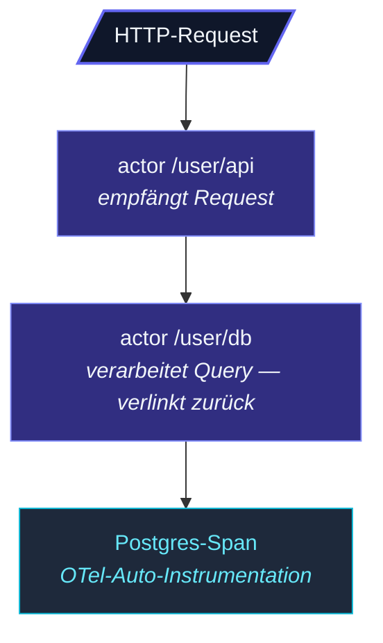

Ein produktives Actor-System braucht drei Dinge, damit es von
außen beobachtbar ist:

| Säule | Was sie beantwortet | Modul |
| --- | --- | --- |
| **Metriken** | „Wie hoch ist die Rate / Anzahl / Latenz gerade?" | [`MetricsExtension`](/de/observability/metrics/core-metrics/) |
| **Tracing** | „Was hat dieser einzelne Request gemacht?" | [`TracingExtension`](/de/observability/tracing/tracer-api/) |
| **Management** | „Läuft das System und ist es gesund?" | [`HttpManagement`](/de/observability/management/overview/) |

Alle drei sind **Extensions** — sie laufen nicht, bis du danach
greifst. Eine App, die Observability ignoriert, hat keinen
Overhead durch ungenutzte Metrik-Puffer oder nicht gestartete
Trace-Exporter.

## Metriken

```ts
import { ActorSystem, MetricsExtensionId } from 'actor-ts';

const system = ActorSystem.create('my-app');
const metrics = system.extension(MetricsExtensionId);

const requests = metrics.counter('http.requests.total', { route: '/orders' });
requests.inc();

const latency = metrics.histogram('http.requests.duration_ms', { route: '/orders' });
latency.observe(42);

const active = metrics.gauge('sessions.active');
active.set(123);
```

Vier Metrik-Typen:

- **Counter** — monoton steigend. Gesamtanzahl der Requests,
  Gesamtfehler.
- **Gauge** — Wert zu einem Zeitpunkt. Aktive Sessions, aktuelle
  Speichernutzung.
- **Histogram** — gesampelte Verteilung. Request-Latenz, Payload-
  Größe. Erlaubt es, p50/p95/p99 zur Scrape-Zeit zu berechnen.
- **Timer** — `timer.start()` gibt eine Stop-Funktion zurück;
  baut auf Histogram auf für timing-spezifische Ergonomie.

Jede Metrik hat einen Namen + Labels (Key-Value-Paare). Labels
erlauben es dir, dieselbe Metrik nach Dimensionen zu zerlegen —
`http.requests.total` nach `route` oder `status`.

### Exporter

Die Metriken selbst sind framework-intern; sie zu einem
Metrik-Backend zu bringen, geschieht über einen **Exporter**:

| Exporter | Backend |
| --- | --- |
| `PrometheusExporter` | Stellt einen `/metrics`-Endpoint bereit, den Prometheus scrapt. |
| `PromClientAdapter` | Schiebt in die `prom-client`-Bibliothek, falls du sie schon nutzt. |
| `OtelMetricsAdapter` | Meldet via OpenTelemetry. |

Siehe [Prometheus-Exporter](/de/observability/metrics/prometheus-exporter/)
für den Deep-Dive zu jedem.

### Stock-Metriken

Das Framework zeichnet automatisch eine Basislinie an Metriken
auf, sobald die Extension gestartet wird:

- **Actor-Metriken** — Message-Counts pro Actor-Typ,
  Verarbeitungsdauer-Histogramme, Mailbox-Tiefe-Gauges.
- **Mailbox-Metriken** — Enqueue-Rate, Dequeue-Rate, Anzahl
  gedroppter Nachrichten für Bounded Mailboxes.
- **Cluster-Metriken** — Anzahl der Mitglieder nach Zustand,
  Gossip-Lag, Reachability-Flips.

Siehe [Stock-Metriken](/de/observability/metrics/stock-metrics/)
für die vollständige Liste. Damit bekommst du „Verarbeiten meine
Actor Nachrichten?" Out-of-the-Box, ohne einen einzigen
Metrik-Code zu schreiben.

## Tracing

```ts
import { ActorSystem, TracingExtensionId } from 'actor-ts';
import { OtelTracerAdapter } from 'actor-ts';

const system = ActorSystem.create('my-app');
system.extension(TracingExtensionId).configure({
  tracer: new OtelTracerAdapter({ /* OTel SDK Setup */ }),
});
```

Mit aktiviertem Tracing **bekommt jede Actor-Nachricht ihren
eigenen Span**. Der Span trägt:

- Den Pfad des Actors.
- Die Klasse / Art der Nachricht.
- Den Parent-Span-Kontext (aus dem aktiven Span des Senders).
- Die Dauer von `onReceive`.

Spans **verketten sich über Tells hinweg** — ein Actor, der einen
Request verarbeitet und einem anderen Actor etwas tellt, gibt
den aktuellen Span-Kontext via Envelope weiter; der Span des
zweiten Actors verlinkt zurück zum ersten.



Das Endergebnis: ein Trace pro logischem Request, selbst wenn er
durch 4-5 Actor hüpft.

Der Exporter ist OpenTelemetry-konform. Nutze
[OtelTracerAdapter](/de/observability/tracing/otel-adapter/)
in Produktion; ein [RecordingTracer](/de/observability/tracing/recording-tracer/)
existiert für Tests.

## Management-Endpunkte

```ts
import { HttpManagement, ActorSystem } from 'actor-ts';

const system = ActorSystem.create('my-app');

const management = await HttpManagement.start(system, {
  port: 8558,
  cluster,   // optional, für /cluster-Endpunkte
});
```

Das startet einen kleinen HTTP-Server (getrennt vom HTTP-Server
deiner App), der Endpunkte für den Betrieb bereitstellt:

| Endpunkt | Was |
| --- | --- |
| `GET /health/ready` | Liveness — läuft das System? |
| `GET /health/alive` | Readiness — ist das System bereit für Traffic? |
| `GET /cluster/members` | Liste der Cluster-Mitglieder (wenn Cluster konfiguriert ist). |
| `GET /sharding/regions` | Sharding-Regionen, gehostete Shards pro Node. |
| `GET /metrics` | Prometheus-Exposition, wenn `PrometheusExporter` konfiguriert ist. |

Nützlich für K8s-Probes (Liveness + Readiness) und Ad-hoc-
Operations-Debugging. Siehe
[HTTP-Endpunkte](/de/observability/management/http-endpoints/)
für die volle Oberfläche.

### Health Checks

```ts
management.addHealthCheck('db', async () => {
  if (!(await db.ping())) return { ok: false, reason: 'db unreachable' };
  return { ok: true };
});
```

Eigene Checks hängen sich in `/health/ready` ein — ein
fehlschlagender Check lässt den Endpunkt 503 zurückgeben, was
K8s als „nicht zu diesem Pod routen" liest.

Siehe [Health Checks](/de/observability/management/health-checks/)
für die Konfiguration.

## Was zuerst verdrahten

Für ein neues Produktivsystem:

1. **Metriken** — zumindest die Stock-Metriken, mit einem
   Prometheus-Exporter. Counter- und Gauge-Dashboards geben dir
   „was macht das System gerade?".
2. **Health Checks** — Liveness + Readiness für K8s. Selbst wenn
   dein Workload keine fancy Probes braucht, will K8s diese
   Endpunkte.
3. **Tracing** — zuletzt. Tracing ist aufwendiger
   (Exporter-Konfiguration, Sampling, Kosten) und bringt
   abnehmenden Grenznutzen für einfache Apps. Füge es hinzu,
   wenn du Multi-Actor-Requests hast und Ende-zu-Ende-Latenz
   sehen musst.

Für ein Dev-/Staging-Umfeld ist nichts davon Pflicht —
Console-Logs decken die Basics ab.

## Wann Observability NICHT aktivieren

import { Aside } from '@astrojs/starlight/components';

<Aside type="caution" title="Lokale Entwicklung ohne Monitoring-Stack">
  Die Extensions kosten sehr wenig, wenn nichts ihre Daten
  exportiert, aber sie sind nicht gratis. In lokaler Entwicklung /
  Einzel-Entwickler-Workflows ist es in Ordnung, sie aus zu
  lassen, bis du tatsächlich ein Monitoring-Backend hast —
  `system.log.info('...')` ist das einfachste Werkzeug.
</Aside>

<Aside type="caution" title="Jede Nachricht tracen in Hochdurchsatz-Systemen">
  Ein Actor-System mit Millionen Nachrichten pro Sekunde,
  ungesampelt getraced, bedeutet eine Million Spans pro
  Sekunde — genug, um die meisten OTel-Collector zu überlasten.
  Konfiguriere Sampling am Exporter; das Framework zeichnet
  Spans für jede Nachricht auf, egal was, aber der Exporter
  entscheidet, was er sendet.
</Aside>

<Aside type="caution" title="`/metrics` öffentlich exponieren">
  ```
  GET /metrics  ← enthält exakte Request-Volumina, Fehlerzahlen, ...
  ```
  Metrik-Exporter sind meist okay für ein internes Netz, aber
  sie im Internet zu exponieren leakt Betriebszustand. Stelle
  den Management-Server hinter ein privates Netz / VPN /
  authentifizierten Proxy.
</Aside>

## Wo es weitergeht

### Metriken

- **[Core-Metriken](/de/observability/metrics/core-metrics/)** —
  Counter / Gauge / Histogram / Timer im Detail.
- **[Prometheus-Exporter](/de/observability/metrics/prometheus-exporter/)** —
  Scrape-Endpunkt-Setup.
- **[Stock-Metriken](/de/observability/metrics/stock-metrics/)** —
  die Out-of-the-Box-Metriken für Actor/Mailbox/Cluster.

### Tracing

- **[Tracer-API](/de/observability/tracing/tracer-api/)** —
  der Tracer-Vertrag + Recording.
- **[OTel-Adapter](/de/observability/tracing/otel-adapter/)** —
  OpenTelemetry-Integration.
- **[Actor-Tracing](/de/observability/tracing/actor-tracing/)** —
  Per-Actor-Span-Propagierung.

### Management

- **[Health Checks](/de/observability/management/health-checks/)** —
  Liveness + Readiness.
- **[HTTP-Endpunkte](/de/observability/management/http-endpoints/)** —
  der volle Endpunkt-Satz des Management-Servers.
