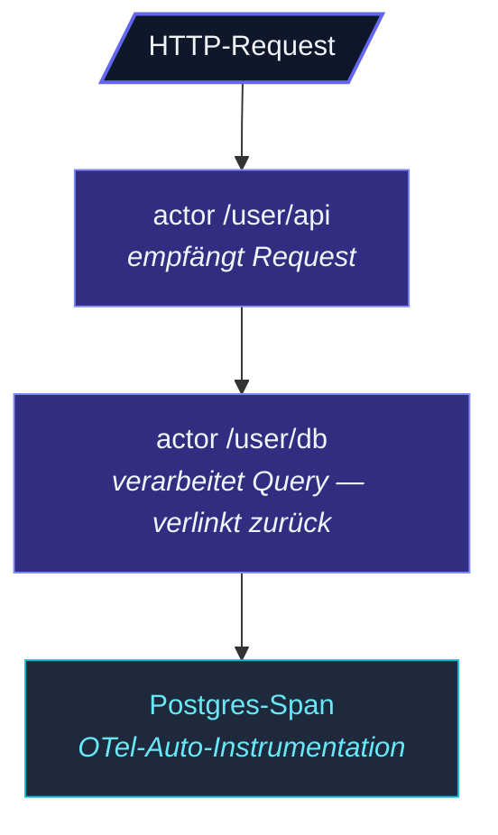

Ein produktives Actor-System braucht vier Dinge, damit es von
außen beobachtbar ist:

| Säule | Was sie beantwortet | Modul |
| --- | --- | --- |
| **Logs** | „Was ist in welcher Reihenfolge passiert, und was hing dran?" | [`MultiSinkLogger`](/de/observability/logging/multi-sink/) |
| **Metriken** | „Wie hoch ist die Rate / Anzahl / Latenz gerade?" | [`MetricsExtension`](/de/observability/metrics/core-metrics/) |
| **Tracing** | „Was hat dieser einzelne Request gemacht?" | [`TracingExtension`](/de/observability/tracing/tracer-api/) |
| **Management** | „Läuft das System und ist es gesund?" | [`managementRoutes`](/de/observability/management/overview/) |

Logging läuft immer — jeder Actor hat `this.log`, standardmäßig auf die
Konsole.  Die anderen drei sind **Extensions**: Sie laufen nicht, bis du
danach greifst.  Eine App, die sie ignoriert, hat keinen Overhead durch
ungenutzte Metrik-Puffer oder nicht gestartete Trace-Exporter.

## Logs

Der Standard-Logger schreibt an eine Stelle.  Mit `withLogSinks` schickst
du dieselben Records an mehrere gleichzeitig, jede mit eigenem
Mindest-Level:

```ts
import { ActorSystem, ActorSystemOptions, ConsoleSink, FileSink, FileSinkOptions, LogLevel } from 'actor-ts';

const fileSinkOptions = FileSinkOptions.create()
  .withDirectory('/var/log/my-app')
  .withRotateInterval('daily');
const systemOptions = ActorSystemOptions.create()
  .withLogSinks([new ConsoleSink(), new FileSink(fileSinkOptions)]);
const system = ActorSystem.create('my-app', systemOptions);
```

Records werden einmal gebaut, an jeden Sink aufgefächert, dessen Level
passt, über eine begrenzte Queue zugestellt und beim Terminieren
geflusht.  Ein kaputtes Ziel reißt weder die anderen noch die Anwendung
mit.

### Welcher Sink?

**Fang mit OTLP an.**  Ein Endpunktformat erreicht Grafana Loki 3+,
Parseable, SigNoz, Datadog, Axiom, Honeycomb, New Relic und jeden
OpenTelemetry Collector — ein plattformspezifischer Sink lohnt sich also
nur dort, wo OTLP nicht hinkommt oder etwas verliert:

| Du willst | Nimm |
| --- | --- |
| einen Collector oder die meisten SaaS-Plattformen | [OTLP](/de/observability/logging/integrations/#otlp--opentelemetry-über-http) |
| Log-Dateien auf der Maschine | [Datei-Sink](/de/observability/logging/file-sink/) |
| Graylog | [GELF](/de/observability/logging/integrations/#graylog--gelf) — sein OTLP-Input kann nur gRPC |
| Sentry | [den Sentry-Sink](/de/observability/logging/integrations/#sentry) — die Gruppierung *ist* das Produkt |
| Loki mit expliziter Label-Kontrolle | [Loki-Push](/de/observability/logging/integrations/#grafana-loki) |
| Seq, Splunk, Parseable | [deren native Sinks](/de/observability/logging/integrations/) |
| rsyslog, syslog-ng, eine Appliance | [Syslog](/de/observability/logging/integrations/#syslog-rfc-5424) |
| eine Container-Plattform, die stdout einsammelt | nichts — `ConsoleSink` im `json`-Modus ist bereits NDJSON |

Bewusst **nicht** dabei: `journald` und das Windows Event Log.  Beide
erreicht man, indem man NDJSON nach stdout schreibt und die Plattform es
einsammeln lässt — was der Console-Sink schon tut.  Ein eigener Sink
brächte ein Binärprotokoll ohne zusätzliche Reichweite.

## Metriken

```ts
import { ActorSystem, MetricsExtensionId } from 'actor-ts';

const system = ActorSystem.create('my-app');
const metrics = system.extension(MetricsExtensionId);

const requests = metrics.counter('http.requests.total', { route: '/orders' });
requests.inc();

const latency = metrics.histogram('http.requests.duration_ms', { route: '/orders' });
latency.observe(42);

const active = metrics.gauge('sessions.active');
active.set(123);
```

Vier Metrik-Typen:

- **Counter** — monoton steigend. Gesamtanzahl der Requests,
  Gesamtfehler.
- **Gauge** — Wert zu einem Zeitpunkt. Aktive Sessions, aktuelle
  Speichernutzung.
- **Histogram** — gesampelte Verteilung. Request-Latenz, Payload-
  Größe. Erlaubt es, p50/p95/p99 zur Scrape-Zeit zu berechnen.
- **Timer** — `timer.start()` gibt eine Stop-Funktion zurück;
  baut auf Histogram auf für timing-spezifische Ergonomie.

Jede Metrik hat einen Namen + Labels (Key-Value-Paare). Labels
erlauben es dir, dieselbe Metrik nach Dimensionen zu zerlegen —
`http.requests.total` nach `route` oder `status`.

### Exporter

Die Metriken selbst sind framework-intern; sie zu einem
Metrik-Backend zu bringen, geschieht über einen **Exporter**:

| Exporter | Backend |
| --- | --- |
| `PrometheusExporter` | Stellt einen `/metrics`-Endpoint bereit, den Prometheus scrapt. |
| `PromClientAdapter` | Schiebt in die `prom-client`-Bibliothek, falls du sie schon nutzt. |

Siehe [Prometheus-Exporter](/de/observability/metrics/prometheus-exporter/)
für den Deep-Dive zu jedem.

### Stock-Metriken

Das Framework zeichnet automatisch eine Basislinie an Metriken
auf, sobald die Extension gestartet wird:

- **Actor-Metriken** — ein Counter der an `onReceive` zugestellten
  Nachrichten (`actor_messages_delivered_total`) und ein
  Handler-Dauer-Histogramm (`actor_message_handler_seconds`).
- **Mailbox-Metriken** — ein Counter der Nachrichten, die von der
  Overflow-Policy einer Bounded Mailbox verworfen werden
  (`actor_mailbox_dropped_total`).
- **Cluster-Metriken** — ein Gauge der aktuell im Up-Zustand
  befindlichen Mitglieder (`cluster_members_up`) und ein Counter
  der Gossip-Runden (`cluster_gossip_rounds_total`).

Siehe [Stock-Metriken](/de/observability/metrics/stock-metrics/)
für die vollständige Liste. Damit bekommst du „Verarbeiten meine
Actor Nachrichten?" Out-of-the-Box, ohne einen einzigen
Metrik-Code zu schreiben.

## Tracing

```ts
import * as otel from '@opentelemetry/api';
import { ActorSystem, TracingExtensionId, otelTracer, OtelAdapterOptions } from 'actor-ts';

const system = ActorSystem.create('my-app');
const otelAdapterOptions = OtelAdapterOptions.create().withApi(otel);
system.extension(TracingExtensionId).enable(otelTracer(otelAdapterOptions));
```

Mit aktiviertem Tracing **bekommt jede Actor-Nachricht ihren
eigenen Span**. Der Span trägt:

- Den Pfad des Actors.
- Die Klasse / Art der Nachricht.
- Den Parent-Span-Kontext (aus dem aktiven Span des Senders).
- Die Dauer von `onReceive`.

Spans **verketten sich über Tells hinweg** — ein Actor, der einen
Request verarbeitet und einem anderen Actor etwas tellt, gibt
den aktuellen Span-Kontext via Envelope weiter; der Span des
zweiten Actors verlinkt zurück zum ersten.


```mermaid
flowchart TB
  REQ[/"HTTP-Request"/]
  API["actor /user/api<br/><i>empfängt Request</i>"]
  DB["actor /user/db<br/><i>verarbeitet Query — verlinkt zurück</i>"]
  PG["Postgres-Span<br/><i>OTel-Auto-Instrumentation</i>"]
  REQ --> API --> DB --> PG
  classDef root  fill:#0f172a,stroke:#6366f1,stroke-width:2px,color:#f1f5f9;
  classDef actor fill:#312e81,stroke:#818cf8,color:#f1f5f9;
  classDef ext   fill:#1e293b,stroke:#06b6d4,color:#67e8f9;
  class REQ root
  class API,DB actor
  class PG ext
```

Das Endergebnis: ein Trace pro logischem Request, selbst wenn er
durch 4-5 Actor hüpft.

Der Tracer ist eine Brücke zu OpenTelemetry. Nutze
[otelTracer](/de/observability/tracing/otel-adapter/)
in Produktion; ein [RecordingTracer](/de/observability/tracing/recording-tracer/)
existiert für Tests.

## Management-Endpunkte

```ts
import { managementRoutes, ActorSystem } from 'actor-ts';

const system = ActorSystem.create('my-app');

// cluster is optional — pass null to skip the /cluster/* endpoints
const { routes, health } = managementRoutes(system, cluster);
await system.http(8558).bind(routes);
```

Das startet einen kleinen HTTP-Server (getrennt vom HTTP-Server
deiner App), der Endpunkte für den Betrieb bereitstellt:

| Endpunkt | Was |
| --- | --- |
| `GET /health` | Liveness — läuft der Prozess? |
| `GET /ready` | Readiness — bereit für Traffic (Cluster up + Checks)? |
| `GET /cluster/members` | Liste der Cluster-Mitglieder (wenn ein Cluster übergeben wird). |
| `GET /cluster/shards?type=<name>` | Shard-Verteilung für einen sharded Typ. |
| `GET /metrics` | Prometheus-Exposition (Opt-in via `enableMetricsEndpoint`). |

Nützlich für K8s-Probes (Liveness + Readiness) und Ad-hoc-
Operations-Debugging. Siehe
[HTTP-Endpunkte](/de/observability/management/http-endpoints/)
für die volle Oberfläche.

### Health Checks

```ts
health.addReadiness(async () => {
  const ok = await db.ping();
  return { name: 'db', status: ok, detail: ok ? undefined : 'db unreachable' };
});
```

Eigene Checks hängen sich in `/ready` ein — ein
fehlschlagender Check lässt den Endpunkt 503 zurückgeben, was
K8s als „nicht zu diesem Pod routen" liest.

Siehe [Health Checks](/de/observability/management/health-checks/)
für die Konfiguration.

## Was zuerst verdrahten

Für ein neues Produktivsystem:

1. **Logs an einen dauerhaften Ort** — ein Datei-Sink oder ein
   Plattform-Sink. Am schnellsten eingerichtet, und das Erste, wonach
   nach einem Vorfall gefragt wird.
2. **Metriken** — zumindest die Stock-Metriken, mit einem
   Prometheus-Exporter. Counter- und Gauge-Dashboards geben dir
   „was macht das System gerade?".
3. **Health Checks** — Liveness + Readiness für K8s. Selbst wenn
   dein Workload keine fancy Probes braucht, will K8s diese
   Endpunkte.
4. **Tracing** — zuletzt. Tracing ist aufwendiger
   (Exporter-Konfiguration, Sampling, Kosten) und bringt
   abnehmenden Grenznutzen für einfache Apps. Füge es hinzu,
   wenn du Multi-Actor-Requests hast und Ende-zu-Ende-Latenz
   sehen musst.

Für ein Dev-/Staging-Umfeld ist nichts davon Pflicht —
Console-Logs decken die Basics ab.

## Wann Observability NICHT aktivieren

import { Aside } from '@astrojs/starlight/components';

<Aside type="caution" title="Lokale Entwicklung ohne Monitoring-Stack">
  Die Extensions kosten sehr wenig, wenn nichts ihre Daten
  exportiert, aber sie sind nicht gratis. In lokaler Entwicklung /
  Einzel-Entwickler-Workflows ist es in Ordnung, sie aus zu
  lassen, bis du tatsächlich ein Monitoring-Backend hast —
  `system.log.info('...')` ist das einfachste Werkzeug.
</Aside>

<Aside type="caution" title="Jede Nachricht tracen in Hochdurchsatz-Systemen">
  Ein Actor-System mit Millionen Nachrichten pro Sekunde,
  ungesampelt getraced, bedeutet eine Million Spans pro
  Sekunde — genug, um die meisten OTel-Collector zu überlasten.
  Konfiguriere Sampling am Exporter; das Framework zeichnet
  Spans für jede Nachricht auf, egal was, aber der Exporter
  entscheidet, was er sendet.
</Aside>

<Aside type="caution" title="`/metrics` öffentlich exponieren">
  ```
  GET /metrics  ← enthält exakte Request-Volumina, Fehlerzahlen, ...
  ```
  Metrik-Exporter sind meist okay für ein internes Netz, aber
  sie im Internet zu exponieren leakt Betriebszustand. Stelle
  den Management-Server hinter ein privates Netz / VPN /
  authentifizierten Proxy.
</Aside>

## Wo es weitergeht

### Logs

- **[Multi-Sink-Logging](/de/observability/logging/multi-sink/)** —
  die Pipeline, Level pro Sink, Redaktion, Flush beim Shutdown.
- **[Datei-Sink](/de/observability/logging/file-sink/)** —
  zeitgestempelte Dateien, Rotation, Retention, gzip.
- **[Plattform-Integrationen](/de/observability/logging/integrations/)** —
  OTLP, Graylog, Loki, Seq, Splunk, Parseable, Sentry, Syslog.
- **[Logging-Grundlagen](/de/fundamentals/logging/)** —
  Level, `withFields`, das MDC, das bei jedem `tell` mitreist.

### Metriken

- **[Core-Metriken](/de/observability/metrics/core-metrics/)** —
  Counter / Gauge / Histogram / Timer im Detail.
- **[Prometheus-Exporter](/de/observability/metrics/prometheus-exporter/)** —
  Scrape-Endpunkt-Setup.
- **[Stock-Metriken](/de/observability/metrics/stock-metrics/)** —
  die Out-of-the-Box-Metriken für Actor/Mailbox/Cluster.

### Tracing

- **[Tracer-API](/de/observability/tracing/tracer-api/)** —
  der Tracer-Vertrag + Recording.
- **[OTel-Adapter](/de/observability/tracing/otel-adapter/)** —
  OpenTelemetry-Integration.
- **[Actor-Tracing](/de/observability/tracing/actor-tracing/)** —
  Per-Actor-Span-Propagierung.

### Management

- **[Health Checks](/de/observability/management/health-checks/)** —
  Liveness + Readiness.
- **[HTTP-Endpunkte](/de/observability/management/http-endpoints/)** —
  der volle Endpunkt-Satz des Management-Servers.

### DevTools

Die drei Säulen oben dienen dazu, ein System von außen und über die Zeit
zu beobachten. Willst du stattdessen gerade jetzt *hineinschauen* — in
den Actor-Baum, die Mailboxes, das, was ein einzelner Actor tut —, hänge
die [DevTools](/de/observability/devtools/overview/)-UI an. Sie ist ein
Debugger, kein Monitoring-Stack: standardmäßig Loopback und ohne Auth,
und aus, bis du danach greifst.

- **[DevTools — Überblick](/de/observability/devtools/overview/)** —
  Attachen, Dashboard, Schalter pro Panel, Sicherheit.
- **[Tap-Protokoll](/de/observability/devtools/protocol/)** —
  der versionierte Wire-Contract, falls du einen eigenen Client willst.
