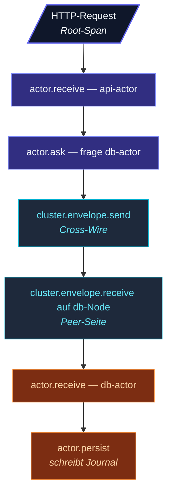

Wenn die Tracing-Extension konfiguriert ist, **erzeugt das
Framework automatisch einen Span pro Actor-Message** plus
Infrastruktur-Spans für Cluster-Wire-Envelopes. Spans
**verketten sich über Tells hinweg** — ein Message-Handler, der
einem anderen Actor etwas `tell`t, gibt den aktiven Span-Kontext
weiter, sodass der Span des Empfängers zurück zum Sender
verlinkt.

## Auto-instrumentierte Spans

| Span-Name | Wann | Bemerkenswerte Attribute |
| --- | --- | --- |
| `actor.receive` | Einmal pro an `onReceive` gelieferter Message. | `actor.path`, `actor.class`, `messaging.message_kind` |
| `actor.persist` | Aufruf von PersistentActor.persist(). | `persistence.id`, `persistence.sequence_nr` |
| `actor.ask` | Ein `ask(...)`-Aufruf. | `actor.path` des Targets |
| `cluster.envelope.send` | Ausgehender Cross-Cluster-Envelope. | `peer.address`, `messaging.message_kind` |
| `cluster.envelope.receive` | Eingehender Cross-Cluster-Envelope. | Gleich |

Für einen typischen Request-Flow:



Jeder Span trägt die Trace-ID — dein Tracing-Backend näht sie
zu einem Trace zusammen.

## Kausale Verkettung

```ts
// Innerhalb eines Actors:
override async onReceive(msg) {
  // tracer.activeSpan() gibt den actor.receive-Span zurück
  // tell erzeugt einen Envelope mit gesetztem traceparent
  this.downstream.tell({ kind: 'derived', from: msg.id });
  // Der actor.receive-Span des Downstream-Actors hat DIESEN Span als Parent
}
```

`tell` snapshottet den aktiven Span-Kontext auf den Envelope
(via `tracer.injectContext()`). Beim Empfangen führt das
Framework `tracer.withActiveSpan(span, ...)` aus, damit das
`onReceive` des Actors die Kette sieht.

Über Cluster-Nodes reitet derselbe `traceparent` auf dem Wire-
Envelope. Der empfangende Node extrahiert ihn; sein
`actor.receive`-Span verlinkt zurück zum Sender.

## Span-Attribute

```ts
// actor.receive-Attribute:
{
  'actor.path':            'actor-ts://my-app/user/api/sessions/user-42',
  'actor.class':           'SessionActor',
  'actor.system':          'my-app',
  'messaging.message_kind': 'login',
  // Bei Fehler persistiert:
  'error.message':         '...',
}
```

Für Cluster-Envelopes:

```ts
{
  'peer.address':          'actor-ts://my-app@10.0.0.5:2552',
  'messaging.message_kind': 'login',
  'wire.bytes':            234,
}
```

Diese folgen OpenTelemetry-Semantic-Conventions, wo zutreffend,
sodass Standard-Dashboards (Honeycomb, Datadog, Grafana Tempo)
ohne Anpassung funktionieren.

## Auto-Tracing deaktivieren

```ts
system.extension(TracingExtensionId).configure({
  tracer:              new OtelTracerAdapter(...),
  autoSpanReceive:     false,   // actor.receive nicht auto-spannen
  autoSpanPersist:     false,
  autoSpanClusterWire: true,
});
```

Nützlich, wenn du nur **manuelle Spans** an spezifischen
Code-Stellen willst oder das Span-Volumen in sehr hochdurchsatz-
starken Systemen reduzieren möchtest.

Die Auto-Instrumentierung des Frameworks ist standardmäßig
**opt-in**, wenn ein Nicht-Noop-Tracer gesetzt ist; bei Bedarf
pro Kategorie deaktivieren.

## Anwendungs-Level-Spans hinzufügen

```ts
override async onReceive(msg) {
  const tracer = this.context.system.extension(TracingExtensionId).tracer;
  const span = tracer.startSpan('process-order', {
    attributes: {
      'order.id':     msg.orderId,
      'order.amount': msg.amount,
    },
  });
  try {
    await tracer.withActiveSpan(span, async () => {
      // ... Verarbeitung ...
    });
    span.setStatus('ok');
  } catch (e) {
    span.recordException(e as Error);
    span.setStatus('error', (e as Error).message);
    throw e;
  } finally {
    span.end();
  }
}
```

Anwendungs-Spans erscheinen **als Kinder des automatisch
erzeugten `actor.receive`-Spans** — deine Custom-Logik sitzt
natürlich innerhalb der Verarbeitung des Actors.

## MDC-Integration

Wenn Tracing aktiv ist, mergt das Framework `traceId` und
`spanId` in den
[LogContext](/de/fundamentals/logging/), sodass jede Log-Zeile,
die während eines Spans emittiert wird, sie enthält:

```
[2025-05-13T12:00:00Z] INFO ... actor processing {traceId=abc, spanId=def, correlationId=...}
```

Heißt: deine Logs und Traces teilen IDs — klicke von einem
langsamen Trace in Honeycomb zu den passenden Log-Zeilen in Loki.
Außerdem: Spans schließen die bestehenden MDC-Keys als Attribute
ein.

## Performance

Wenn Tracing **deaktiviert** ist (NoopTracer), ist die Auto-
Instrumentierung **Null-Overhead** — die Hot-Paths des
Frameworks short-circuiten, ohne Spans zu allokieren oder
Async-Storage-Lookups zu machen.

Wenn **aktiviert**, fügt jede verarbeitete Nachricht hinzu:

- Eine Span-Allokation (kleines Objekt).
- Ein paar Attribut-Schreibvorgänge.
- Ein AsyncLocalStorage-Scope.

Gesamtkosten pro Nachricht: **~5-10 Mikrosekunden**. Signifikant
für Millionen-msg-pro-Sekunde-Systeme; ansonsten
vernachlässigbar.

import { Aside } from '@astrojs/starlight/components';

<Aside type="caution" title="Trace-Volumen in Hochdurchsatz-Systemen">
  ```ts
  // 100 000 Messages/sec × 1 Span je = 100K Spans/sec
  ```
  Bei dieser Rate **immer samplen**. Siehe die Sampling-Sektion
  des OTel-Adapters für die typischen 1-10 % in Produktion.
</Aside>

<Aside type="caution" title="Span-Attribute aus Message-Inhalten">
  ```ts
  // Das Framework inkludiert messaging.message_kind standardmäßig
  // Es inkludiert NICHT automatisch Message-Feldwerte
  ```
  Das ist Absicht — Message-Inhalte können PII oder große
  Payloads enthalten. Füge eigene Attribute manuell dort hinzu,
  wo es sicher und nützlich ist.
</Aside>

<Aside type="caution" title="`pipeTo` propagiert den aktiven Span nicht">
  ```ts
  pipeTo(externalCall(), target);
  // Das onReceive des Targets sieht den aktiven Span des Aufrufers nicht
  ```
  Manueller Workaround:
  ```ts
  const ctx = tracer.injectContext();
  pipeTo(externalCall(), target, { sender: this.self });
  // Dann liest das Target seinen eigenen Carrier aus den Message-Metadaten, falls nötig
  ```
  Das ist eine bekannte Limitation; Spans verketten sich aktuell
  nicht automatisch über pipeTo.
</Aside>

## Wo es weitergeht

- **[Tracer-API](/de/observability/tracing/tracer-api/)** —
  das zugrundeliegende Interface.
- **[OTel-Adapter](/de/observability/tracing/otel-adapter/)** —
  zu deinem Tracing-Backend pipen.
- **[Recording-Tracer](/de/observability/tracing/recording-tracer/)** —
  für Test-Assertions.
- **[Logging — LogContext](/de/fundamentals/logging/)** —
  der MDC, der mit Trace-IDs angereichert wird.
