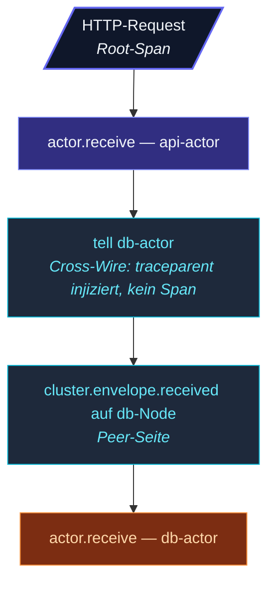

Wenn die Tracing-Extension konfiguriert ist, **erzeugt das
Framework automatisch einen Span pro Actor-Message** plus einen
Infrastruktur-Span für eingehende Cluster-Wire-Envelopes. Spans
**verketten sich über Tells hinweg** — ein Message-Handler, der
einem anderen Actor etwas `tell`t, gibt den aktiven Span-Kontext
weiter, sodass der Span des Empfängers zurück zum Sender
verlinkt.

## Auto-instrumentierte Spans

| Span-Name | Wann | Bemerkenswerte Attribute |
| --- | --- | --- |
| `actor.receive` | Einmal pro an `onReceive` gelieferter Message. | `actor.path`, `actor.message.type` |
| `cluster.envelope.received` | Eingehender Cross-Cluster-Envelope mit Parent-Trace-Kontext. | `cluster.from`, `cluster.to.path` |

Für einen typischen Request-Flow:


```mermaid
flowchart TB
  R[/"HTTP-Request<br/><i>Root-Span</i>"/]
  API["actor.receive — api-actor"]
  TELL["tell db-actor<br/><i>Cross-Wire: traceparent injiziert, kein Span</i>"]
  RECV["cluster.envelope.received auf db-Node<br/><i>Peer-Seite</i>"]
  DB["actor.receive — db-actor"]
  R --> API --> TELL
  TELL --> RECV --> DB
  classDef root fill:#0f172a,stroke:#6366f1,stroke-width:2px,color:#f1f5f9;
  classDef api  fill:#312e81,stroke:#818cf8,color:#f1f5f9;
  classDef wire fill:#1e293b,stroke:#06b6d4,color:#67e8f9;
  classDef db   fill:#7c2d12,stroke:#fb923c,color:#fed7aa;
  class R root
  class API api
  class TELL,RECV wire
  class DB db
```

Jeder Span trägt die Trace-ID — dein Tracing-Backend näht sie
zu einem Trace zusammen.

## Kausale Verkettung

```ts
// Innerhalb eines Actors:
override async onReceive(message) {
  // tracer.activeSpan() gibt den actor.receive-Span zurück
  // tell erzeugt einen Envelope mit gesetztem traceparent
  this.downstream.tell({ kind: 'derived', from: message.id });
  // Der actor.receive-Span des Downstream-Actors hat DIESEN Span als Parent
}
```

`tell` snapshottet den aktiven Span-Kontext auf den Envelope
(via `tracer.injectContext()`). Beim Empfangen führt das
Framework `tracer.withActiveSpan(span, ...)` aus, damit das
`onReceive` des Actors die Kette sieht.

Über Cluster-Nodes reitet derselbe `traceparent` auf dem Wire-
Envelope. Der empfangende Node extrahiert ihn; sein
`actor.receive`-Span verlinkt zurück zum Sender.

## Span-Attribute

```ts
// actor.receive-Attribute:
{
  'actor.path':         'actor-ts://my-app/user/api/sessions/user-42',
  'actor.message.type': 'LoginMessage',
}
// Bei einem Fehler zeichnet der Span die Exception auf und setzt
// einen Error-Status (span.recordException(err) + span.setStatus('error', …)) —
// es gibt kein error.message-Attribut.
```

Für Cluster-Envelopes:

```ts
// cluster.envelope.received-Attribute:
{
  'cluster.from':    'actor-ts://my-app@10.0.0.5:2552',
  'cluster.to.path': '/user/api/sessions/user-42',
}
```

Diese folgen OpenTelemetry-Semantic-Conventions, wo zutreffend,
sodass Standard-Dashboards (Honeycomb, Datadog, Grafana Tempo)
ohne Anpassung funktionieren.

## Span-Volumen steuern

Auto-Instrumentierung ist **alles-oder-nichts** — sie ist aktiv,
sobald du einen Nicht-Noop-Tracer aktivierst, und aus (null
Overhead), wenn der Tracer der Default-`NoopTracer` ist.  Es gibt
keine Per-Kategorie-Schalter.

Um das Span-Volumen in sehr hochdurchsatzstarken Systemen zu
reduzieren, **sample auf SDK-Ebene** (siehe
[OTel-Adapter → Sampling](/de/observability/tracing/otel-adapter/#sampling)),
statt Kategorien abzuschalten — das Framework zeichnet mit voller
Rate auf, aber das SDK exportiert nur einen Bruchteil.  Die
Auto-Instrumentierung ganz abzuschalten bedeutet, den `NoopTracer`
zu installieren, was auch deine manuellen Spans deaktiviert, da sie
durch denselben Tracer laufen.

## Anwendungs-Level-Spans hinzufügen

```ts
override async onReceive(message) {
  const tracer = this.context.system.extension(TracingExtensionId).get();
  const span = tracer.startSpan('process-order', {
    attributes: {
      'order.id':     message.orderId,
      'order.amount': message.amount,
    },
  });
  try {
    await tracer.withActiveSpan(span, async () => {
      // ... Verarbeitung ...
    });
    span.setStatus('ok');
  } catch (e) {
    span.recordException(e as Error);
    span.setStatus('error', (e as Error).message);
    throw e;
  } finally {
    span.end();
  }
}
```

Anwendungs-Spans erscheinen **als Kinder des automatisch
erzeugten `actor.receive`-Spans** — deine Custom-Logik sitzt
natürlich innerhalb der Verarbeitung des Actors.

## MDC-Integration

Das Framework mergt `traceId` / `spanId` **nicht** automatisch
in den
[LogContext](/de/fundamentals/logging/) — Log-Zeilen werden
**nicht** von Haus aus mit den IDs des aktiven Spans versehen.
Die MDC-Felder, die du selbst setzt (z. B. `correlationId`),
fließen wie gewohnt in jede Log-Zeile; die Trace-IDs sind nur
dann dabei, wenn du sie hinzufügst.

Um IDs zwischen Logs und Traces zu teilen, kopiere sie selbst vom
aktiven Span in den MDC:

```ts
const span = tracer.activeSpan();
if (span) {
  const { traceId, spanId } = span.context();
  LogContext.with({ traceId, spanId }, () => {
    // hier emittierte Log-Zeilen tragen jetzt traceId + spanId
  });
}
```

Mit den IDs im MDC teilen deine Logs und Traces sie — du kannst
von einem langsamen Trace in Honeycomb zu den passenden
Log-Zeilen in Loki springen.

## Performance

Wenn Tracing **deaktiviert** ist (NoopTracer), ist die Auto-
Instrumentierung **Null-Overhead** — die Hot-Paths des
Frameworks short-circuiten, ohne Spans zu allokieren oder
Async-Storage-Lookups zu machen.

Wenn **aktiviert**, fügt jede verarbeitete Nachricht hinzu:

- Eine Span-Allokation (kleines Objekt).
- Ein paar Attribut-Schreibvorgänge.
- Ein AsyncLocalStorage-Scope.

Gesamtkosten pro Nachricht: **~5-10 Mikrosekunden**. Signifikant
für Millionen-msg-pro-Sekunde-Systeme; ansonsten
vernachlässigbar.

import { Aside } from '@astrojs/starlight/components';

<Aside type="caution" title="Trace-Volumen in Hochdurchsatz-Systemen">
  ```ts
  // 100 000 Messages/sec × 1 Span je = 100K Spans/sec
  ```
  Bei dieser Rate **immer samplen**. Siehe die Sampling-Sektion
  des OTel-Adapters für die typischen 1-10 % in Produktion.
</Aside>

<Aside type="caution" title="Span-Attribute aus Message-Inhalten">
  ```ts
  // Das Framework inkludiert actor.message.type standardmäßig
  // Es inkludiert NICHT automatisch Message-Feldwerte
  ```
  Das ist Absicht — Message-Inhalte können PII oder große
  Payloads enthalten. Füge eigene Attribute manuell dort hinzu,
  wo es sicher und nützlich ist.
</Aside>

<Aside type="caution" title="`pipeTo` propagiert den aktiven Span nicht">
  ```ts
  pipeTo(externalCall(), target);
  // Das onReceive des Targets sieht den aktiven Span des Aufrufers nicht
  ```
  Manueller Workaround:
  ```ts
  const context = tracer.injectContext();
  pipeTo(externalCall(), target, { sender: this.self });
  // Dann liest das Target seinen eigenen Carrier aus den Message-Metadaten, falls nötig
  ```
  Das ist eine bekannte Limitation; Spans verketten sich aktuell
  nicht automatisch über pipeTo.
</Aside>

## Wo es weitergeht

- **[Tracer-API](/de/observability/tracing/tracer-api/)** —
  das zugrundeliegende Interface.
- **[OTel-Adapter](/de/observability/tracing/otel-adapter/)** —
  zu deinem Tracing-Backend pipen.
- **[Recording-Tracer](/de/observability/tracing/recording-tracer/)** —
  für Test-Assertions.
- **[Logging — LogContext](/de/fundamentals/logging/)** —
  der MDC, den du selbst mit Trace-IDs versehen kannst.
