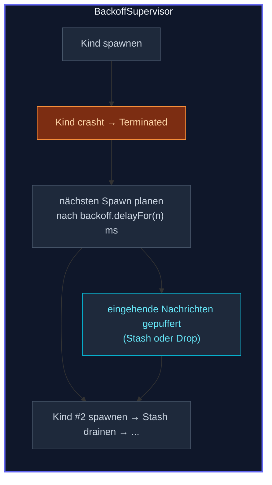

Die Default-Supervisor-Strategie des Frameworks startet ein Kind
bis zu 10-mal pro Minute neu.  Für transiente Fehler kann das
bedeuten, **eine kaputte Abhängigkeit zu hämmern** — einen Broker,
der reconnected, eine DB, die sich erholt — mit
Restart-nach-Restart, jeder identisch crashend.

**`BackoffSupervisor`** ist die Alternative.  Er wickelt einen
einzelnen Child-Actor und plant seinen Restart mit einem
Exponential-Backoff (200 ms, 400, 800, …, bei einem Max gecappt),
plus Jitter, damit eine Herde von Clients sich nicht synchronisiert.

## Ein minimales Beispiel

```ts
import { ActorSystem, Props, Actor, BackoffSupervisor } from 'actor-ts';

class Flaky extends Actor<{ kind: 'do-it' }> {
  override preStart(): void {
    if (Math.random() < 0.7) throw new Error('upstream not ready');
  }
  override onReceive(msg: { kind: 'do-it' }): void {
    this.log.info('ok');
  }
}

const system = ActorSystem.create('demo');

const supervisor = system.spawn(
  BackoffSupervisor.props({
    childProps: Props.create(() => new Flaky()),
    minBackoff: 200,
    maxBackoff: 10_000,
    randomFactor: 0.2,
  }),
  'flaky-supervisor',
);

// Sende Nachrichten an den Supervisor — sie werden an das aktuelle
// Kind weitergeleitet oder während eines Backoff-Fensters gestasht.
supervisor.tell({ kind: 'do-it' });
```

Der Supervisor:

1. Spawnt ein `Flaky`-Kind unter `stoppingStrategy` (ein Crash =
   ein sauberer Stop, kein Default-Restart).
2. Death-Watch'd das Kind.
3. Bei `Terminated` plant er einen One-Shot-Timer, um ein frisches
   Kind nach `policy.delayFor(restartCount)` ms zu spawnen.
4. Puffert Nachrichten, die während des Backoff-Fensters ankommen.

Wenn das Kind schließlich erfolgreich startet und Nachrichten
verarbeitet, werden die gepufferten Nachrichten an es geflusht
(mit erhaltenen Original-Sender-Refs für Ask-artige Antworten).

## Der Mechanismus

Fünf Schritte, in Ausführungsreihenfolge:



Das Framework benennt aufeinanderfolgende Kinder `child-1`,
`child-2`, `child-3`, … sodass alte Terminierungen nicht mit neuen
Spawns kollidieren.

## Konfiguration

Die `BackoffOptions<T>`-Form:

```ts
interface BackoffOptions<T> {
  childProps:        Props<T>;
  childName?:        string;
  minBackoff:        number;
  maxBackoff:        number;
  randomFactor?:     number;   // Default 0.2
  policy?:           BackoffPolicy;
  resetCounter?:     ResetCounter;  // Default 'after-min-stable'
  forward?:          ForwardStrategy;  // Default 'stash'
  triggerOn?:        TerminationTrigger;  // Default 'any'
  maxStashSize?:     number;  // Default 1000
  drainGraceMs?:     number;  // Default min(50, minBackoff)
  forwardDuringGrace?: boolean;  // Default true
  clock?:            () => number;
}
```

Die interessantesten Felder:

### `triggerOn`

| Wert | Wann respawnen |
| --- | --- |
| `'any'` *(default)* | Respawn bei jeder Terminierung — sowohl Crashes als auch sauberen Stops. |
| `'failure'` | Respawn nur bei Crashes.  Ein sauberer `context.stopSelf()` bedeutet "dieses Kind ist fertig"; der Supervisor stoppt sich danach selbst. |
| `'stop'` | Respawn nur bei sauberen Stops (z.B. ein transienter Connection-Actor, der sich periodisch abbaut).  Crashes propagieren nach oben. |

`'failure'` ist der richtige Default, wenn du "Restart bei
unerwartetem Tod" modellierst — ein sauberer Self-Stop ist eine
bewusste Wahl, die der Supervisor ehren sollte.  `'any'` restartet
bei jeder Terminierung — die breiteste Policy, nützlich, wenn der
Supervisor sich nicht darum kümmert, warum das Kind gestoppt hat.

### `forward` — was mit Nachrichten zu tun ist, während das Kind tot ist

```ts
forward: 'stash',   // bis zu maxStashSize puffern, nach Respawn drainen
// oder
forward: 'drop',    // still verwerfen (Debug-geloggt)
```

Stashen erhält Sender-Refs, sodass Ask-Antworten nach dem Respawn
weiter funktionieren — eine Nachricht, die während des Kinds-down
gefragt wurde, bekommt ihre Antwort, sobald das neue Kind sie
behandelt.

Verwerfen ist der richtige Anruf für "transiente Pings, die das
Aufbewahren nicht wert sind" — Telemetrie, Heartbeats, wo veraltete
Nachrichten schlimmer als verlorene sind.

### `resetCounter`

```ts
resetCounter: 'after-min-stable',          // zurücksetzen, wenn Kind alive >= minBackoff (default)
resetCounter: 'never',                     // nie zurücksetzen (Zähler wächst monoton)
resetCounter: { kind: 'after-time', ms: 60_000 },   // nach 60s alive zurücksetzen
```

Ohne Zurücksetzen bekommt ein Kind, das nach einer lang stabilen
Periode fehlschlägt, das *gleiche* lange Backoff wie nach einem
kürzlichen Crash — was meist falsch ist (der lang laufende Erfolg
suggeriert, dass der Fehler frisch ist).  `'after-min-stable'`
setzt den Count zurück, wenn das Kind mindestens `minBackoff` am
Leben war, sodass ein normales kurzes Backoff nach einem lang
laufenden Erfolg restartet.

### `drainGraceMs` + `forwardDuringGrace`

Nach einem Respawn wartet der Supervisor bis zu `drainGraceMs`
(Default 50 ms), bevor er den Stash an das neue Kind drained.  Das
schützt vor Kindern, die in `preStart` crashen:

- Wenn das Kind während des Grace-Fensters stirbt, wird der Stash
  für die *nächste* Inkarnation zurückgehalten — gestashed
  Nachrichten gehen nicht zu Dead Letters verloren, wenn das Kind
  beim Startup immer wieder crasht.

`forwardDuringGrace: true` (Default) sendet *neue* Nachrichten
sofort während des Grace; `forwardDuringGrace: false` stasht sie
bis Grace abläuft.  Der Default tauscht ein winziges Risiko von
Dead-Lettering während eines preStart-Crashes gegen niedrigere
Latenz auf dem Happy-Path.

## Eigene Backoff-Policy

```ts
import { BackoffSupervisor, linearBackoff } from 'actor-ts';

BackoffSupervisor.props({
  childProps: ...,
  minBackoff: 500,
  maxBackoff: 10_000,
  policy: linearBackoff({ minMs: 500, maxMs: 10_000, stepMs: 500 }),
});
```

Überschreibe das Default-Exponential-Backoff mit einer beliebigen
[`BackoffPolicy`](/de/patterns/backoff-policy/) — linear,
Fibonacci, eigene.  `minBackoff` / `maxBackoff` sind immer noch
erforderlich (sie sind beratende Caps; das Framework verwendet sie
für die `resetCounter`-Heuristik), aber die `policy` steuert die
tatsächliche Delay-Berechnung.

## Wann zu BackoffSupervisor greifen

Drei gute Passungen:

1. **Broker-Verbindungen** (Kafka, NATS, AMQP), wo ein transienter
   Broker-Ausfall bedeutet, dass das `connect()` des Actors für
   ein paar Sekunden fehlschlägt, bevor es sich erholt.
   Default-`defaultStrategy` würde aggressiv restarten; Backoff
   glättet es.
2. **Datenbank-Actors**, die einen Connection-Pool halten — wenn
   die DB hickst, crasht der Actor, und Backoff kauft Zeit vor dem
   erneuten Aufbau.
3. **Third-Party-API-Actors** mit rate-limit-bewussten Retries —
   wenn ein Vendor 429 zurückgibt, crasht der Actor; Backoff
   wartet vor dem erneuten Versuch.

## Wann NICHT zu verwenden

import { Aside } from '@astrojs/starlight/components';

<Aside type="caution" title="Programmierfehler profitieren nicht von Backoff">
  Ein Kind, das bei jeder Nachricht throwt, weil es einen Bug in
  `onReceive` gibt, crasht nach jeder Backoff-Verzögerung auf
  dieselbe Weise.  `BackoffSupervisor` ist für *transiente*
  Fehler — Code-Bugs brauchen einen Fix, kein längeres Warten.
  Paare den Supervisor mit einem Max-Gesamt-Versuchs-Cap (ein
  Parent, der den Supervisor nach N Respawns stoppt), damit Bugs
  als Supervisor-Terminierungen sichtbar werden.
</Aside>

<Aside type="caution" title="Lege nicht viele Backoff-Supervisor in Serie">
  ```ts
  // ✗ supervised Supervisor supervised
  BackoffSupervisor wraps BackoffSupervisor wraps Actor
  ```
  Jede Ebene multipliziert die wahrgenommene Recovery-Verzögerung.
  Verwende einen Backoff-Supervisor an der Schicht, wo transiente
  Fehler tatsächlich passieren; lass höhere Schichten einfache
  Supervision verwenden.
</Aside>

<Aside type="caution" title="Stash + Restart in preStart">
  Wenn das Kind in `preStart` throwt und das Stash-Drain sofort
  zuschlägt, geht jede gestashed Nachricht mit dem toten Kind in
  Dead Letters.  `drainGraceMs` und `forwardDuringGrace: false`
  sind genau dafür da.  Lass sie in Produktion bei den Defaults,
  außer du hast ein Problem gemessen.
</Aside>

## Verglichen mit einfacher Supervision

`OneForOneStrategy(decider, { maxRetries, withinTimeRangeMs })`
cappt Restarts bei N pro Fenster, aber **verzögert nicht zwischen
ihnen** — das Framework restartet sofort nach jedem Crash.

`BackoffSupervisor` fügt das Delay-zwischen-Restarts-Stück plus
eine Nachrichten-Puffer-Schicht hinzu.  Die zwei sind komplementär:

- Für nicht-transiente Bugs ist einfache Supervision mit einem
  niedrigen `maxRetries` okay (gib nach ein paar Versuchen auf und
  lass den Fehler eskalieren).
- Für transiente Infrastruktur-Probleme ist Backoff-Supervision
  die zusätzlichen beweglichen Teile wert.

Du kannst sie kombinieren — wickle die eigene Strategie eines
`BackoffSupervisor` mit einer
`OneForOneStrategy(..., { maxRetries: 10 })`, um zu sagen "back off
zwischen Restarts, aber gib komplett auf nach 10 Versuchen."

## Wie es weitergeht

- **[Backoff-Policy](/de/patterns/backoff-policy/)** — die
  `exponentialBackoff` / `linearBackoff`-Primitives, die den
  Policy-Wert produzieren.
- **[Supervision](/de/fundamentals/supervision/)** — die
  Plain-Supervision-Basis, auf der das aufbaut.
- **[Circuit Breaker](/de/patterns/circuit-breaker/)** —
  um *bevor* ein Call fehlschlägt zurückzutreten (nicht nachher).
- **[Retry](/de/patterns/retry/)** — Per-Call-Retry mit
  ähnlicher Backoff-Mathematik, aber außerhalb der Actor-Welt.

Die [`BackoffSupervisor`](/api/classes/backoffsupervisor/)-API-Referenz
deckt alle Optionen ab.
