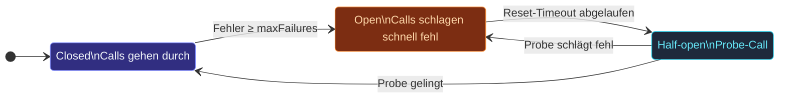

Ein **Circuit Breaker** wickelt Calls, die fehlschlagen könnten
(ein flakey HTTP-Endpoint, eine langsame DB-Query, ein Ask an einen
kämpfenden Actor), und kurzschließt, wenn der Fehler anhält.  Drei
Zustände bilden eine einfache State-Machine:



- **Closed** (Start): Calls gehen durch; Fehler werden gezählt.
- **Open**: Calls schlagen sofort mit `CircuitBreakerOpenError`
  fehl; kein Traffic erreicht den Downstream.
- **Half-open**: Der erste Call nach dem Reset-Timeout wird
  durchgelassen.  Erfolg → Closed.  Fehler → wieder Open.

## Ein minimales Beispiel

```ts
import { CircuitBreaker, CircuitBreakerOpenError } from 'actor-ts';

const breaker = new CircuitBreaker({
  maxFailures:    5,        // nach 5 aufeinanderfolgenden Fehlern öffnen
  resetTimeoutMs: 30_000,   // versuche eine Probe nach 30s
  callTimeoutMs:  2_000,    // jeder Call > 2s zählt als Fehler
});

try {
  const data = await breaker.call(() => fetch('https://flaky.example/items'));
  // closed → Call durchgelassen
} catch (e) {
  if (e instanceof CircuitBreakerOpenError) {
    // Breaker ist open — versuche den Upstream gar nicht erst
  } else {
    // entweder ist der Call selbst fehlgeschlagen oder es gab einen Timeout
  }
}
```

Der Breaker kümmert sich nicht darum, *was* der Call ist — überall,
wo du eine Funktion hast, die ein `Promise<T>` zurückgibt, kannst
du sie wickeln.  Für Actor-zu-Actor-Calls wickle ein `ask`:

```ts
const breaker = new CircuitBreaker({ maxFailures: 3, resetTimeoutMs: 10_000 });

async function askWithBreaker(): Promise<Reply> {
  return breaker.call(() => target.ask({ kind: 'q' }, 5_000));
}
```

## Die State-Machine im Detail

### Closed → Open

Das Ergebnis jedes Calls aktualisiert einen Zähler:

- **Erfolg** setzt den Fehler-Zähler auf 0 zurück.
- **Fehler** inkrementiert ihn.  Wenn der Zähler `maxFailures`
  *aufeinanderfolgend* erreicht, übergeht der Breaker zu Open und
  zeichnet auf, wann er als nächstes eine Probe erlaubt
  (`now + resetTimeoutMs`).

Was als Fehler zählt:

- Das Promise rejected.
- Der Call überschreitet `callTimeoutMs` (falls konfiguriert) —
  der Breaker rejected mit `CircuitBreakerTimeoutError` und zählt
  es als Fehler.
- *Optional:* Wenn `isFailure(err)` `false` zurückgibt, umgeht der
  Fehler die Zählung (das Promise rejected immer noch zum
  Aufrufer, aber der Breaker inkrementiert nicht).  Verwende das
  für "das ist nicht wirklich ein Service-Fehler"-Fehler — 404s,
  Validierungsfehler, etc.

```ts
new CircuitBreaker({
  maxFailures: 5,
  resetTimeoutMs: 30_000,
  isFailure: (err) => !(err instanceof ValidationError),
});
```

### Open → Half-open

Sobald Open, rejected jeder Call sofort mit
`CircuitBreakerOpenError`.  Der Breaker bleibt Open, bis
`Date.now() >= nextProbeAt`.  Zu dem Zeitpunkt übergeht der
*nächste* Call zu **Half-open** und wird durchgelassen.  Das ist
kein geplantes Aufwachen — der Breaker prüft lazy beim nächsten
`call()`.

### Half-open → Closed (oder zurück zu Open)

Der Probe-Call entweder:

- **Gelingt** → Breaker schließt.  Zähler zurücksetzen.  Normalbetrieb.
- **Schlägt fehl** → Breaker öffnet wieder mit frischem
  `nextProbeAt`.

Während Half-open ist nur die *eine* Probe im Flug.  Parallele
Calls während Half-open gehen *auch* durch (der Breaker
serialisiert nicht), aber die Zustands-Übergänge des Breakers
werden vom ersten Vollenden getrieben.

## Observability

```ts
const breaker = new CircuitBreaker({ /* ... */ });

const unsubscribe = breaker.onStateChange((state) => {
  metrics.gauge('circuit_breaker.state', state);
  log.info(`circuit breaker → ${state}`);
});

// Später: `unsubscribe()` zum Entfernen.
```

Verwende das, um Zustands-Übergänge in deine Logging- oder
Metriken-Pipeline zu verdrahten.  Der Listener feuert bei jedem
Übergang, einschließlich erzwungener via `breaker.setState(...)`.

`breaker.state` liest den aktuellen Zustand synchron.

## Manuelle Overrides

```ts
breaker.setState('open');     // Open erzwingen — nützlich für Admin "drain diese Dep"
breaker.setState('closed');   // Closed erzwingen — manuelles Recovery
```

`setState` ist meist für Tests und Admin-Endpoints.  Production-Code
sollte sich auf den natürlichen Übergangspfad verlassen; zu
`setState` aus regulärem Code zu greifen, bedeutet meist, dass der
Breaker nicht richtig konfiguriert ist.

## Die Zahlen wählen

Drei Parameter; so denkst du über sie:

- **`maxFailures`** — hoch genug, dass ein einzelner transienter
  Aussetzer den Breaker nicht öffnet, niedrig genug, dass ein
  echter Ausfall ihn öffnet, bevor zu viel Traffic sich staut.
  3-10 ist typisch.  Niedriger für kritische Pfade (schnell
  öffnen); höher für Pfade, wo Falsch-Auslösungen teuer sind.
- **`resetTimeoutMs`** — lang genug, damit der Downstream sich
  erholen kann, aber kurz genug, dass du es bemerkst, wenn er es
  hat.  10-60 Sekunden für typische HTTP-/DB-Calls; sub-Sekunde
  nur, wenn der Breaker eine wirklich lokale Ressource frontet.
- **`callTimeoutMs`** — das längste, das der *einzelne Call*
  brauchen sollte.  Wenn die p99 des Upstreams 800 ms ist, setze
  das auf 2-3 s.  Es niedriger als die normale Latenz des
  Upstreams zu setzen, bedeutet, dass du alles zu einem Timeout
  erklärst.

## Verglichen mit Retry

Ein Breaker und ein Retry-Helfer sind **komplementär**, kein
Ersatz:

- **Retry** sagt "versuche es nach einer Verzögerung erneut, wenn
  dieser Call fehlschlägt."  Er behandelt jeden Call unabhängig
  und brennt sein Budget für die aktuelle Operation.
- **Breaker** sagt "nach genug neuesten Fehlern, hör eine Weile
  auf zu versuchen."  Er trägt Zustand über Calls hinweg.

Die richtige Kombination ist **Retry innerhalb eines Breaker-Calls**:

```ts
breaker.call(() => retry(
  () => fetch('https://flaky.example'),
  { attempts: 3, delayMs: 100, factor: 2 },
));
```

Der Retry handhabt die Per-Call-Resilienz; der Breaker handhabt
die "Hör auf, die kaputte Dep zu hämmern"-Koordination.  Lege den
Retry nicht *außerhalb* des Breakers — du würdest durch die
`CircuitBreakerOpenError`s retrien, was sinnlos ist.

import { Aside } from '@astrojs/starlight/components';

<Aside type="caution" title="Ein Breaker pro logischer Abhängigkeit">
  ```ts
  const breaker = new CircuitBreaker(opts);
  // Verwendet für sowohl /payments als auch /shipping...
  ```
  Ein einzelner Breaker für zwei unverwandte Abhängigkeiten löst
  bei *einem von beiden* Fehlern aus und sperrt *beide* aus.
  Spawne einen Breaker pro logischem Upstream — einen für Payments,
  einen für Shipping — und lass sie unabhängig auslösen.
</Aside>

<Aside type="caution" title="Teile keinen Breaker über einen Actor-Restart">
  ```ts
  class MyActor extends Actor<...> {
    private readonly breaker = new CircuitBreaker(opts);
    // ↑ wird bei jedem Restart zurückgesetzt
  }
  ```
  Den Breaker auf den Actor zu legen, bedeutet, dass er nur so
  lange überlebt wie der Actor.  Wenn der Zustand des Breakers
  Restarts überleben soll, hebe ihn in eine Extension oder einen
  Parent-Actor und injiziere ihn in den Konstruktor.
</Aside>

<Aside type="caution" title="`half-open` queued nicht">
  Parallele Calls während Half-open gehen alle durch — der
  Breaker ist kein Semaphore.  Wenn "nur eine Probe gleichzeitig"
  wichtig ist, serialisiere Calls selbst eine Schicht über dem
  Breaker.
</Aside>

## Wie es weitergeht

- **[Retry](/de/patterns/retry/)** — der komplementäre
  Per-Call-Retry-Helfer.
- **[Backoff-Supervisor](/de/patterns/backoff-supervisor/)** —
  Exponential-Backoff-Restarts für ein Child eines Actors.
- **[Ask-Pattern](/de/fundamentals/ask-pattern/)** — was du
  typischerweise wickelst, wenn der Call Actor-zu-Actor ist.

Die [`CircuitBreaker`](/api/classes/circuitbreaker/)-API-Referenz
deckt die volle Schnittstelle ab.
