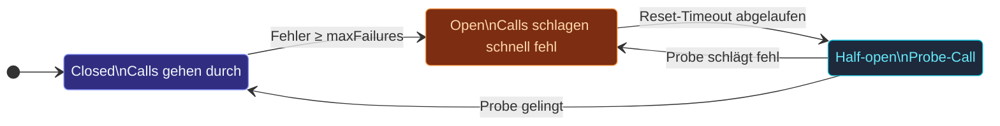

Ein **Circuit Breaker** wickelt Calls, die fehlschlagen könnten
(ein flakey HTTP-Endpoint, eine langsame DB-Query, ein Ask an einen
kämpfenden Actor), und kurzschließt, wenn der Fehler anhält.  Drei
Zustände bilden eine einfache State-Machine:


```mermaid
stateDiagram-v2
  direction LR
  [*] --> Closed
  Closed: Closed\nCalls gehen durch
  Open: Open\nCalls schlagen schnell fehl
  HalfOpen: Half-open\nProbe-Call
  Closed --> Open: Fehler ≥ maxFailures
  Open --> HalfOpen: Reset-Timeout abgelaufen
  HalfOpen --> Closed: Probe gelingt
  HalfOpen --> Open: Probe schlägt fehl
  classDef ok    fill:#312e81,stroke:#818cf8,color:#f1f5f9;
  classDef bad   fill:#7c2d12,stroke:#fb923c,color:#fed7aa;
  classDef probe fill:#1e293b,stroke:#06b6d4,color:#67e8f9;
  class Closed ok
  class Open bad
  class HalfOpen probe
```

- **Closed** (Start): Calls gehen durch; Fehler werden gezählt.
- **Open**: Calls schlagen sofort mit `CircuitBreakerOpenError`
  fehl; kein Traffic erreicht den Downstream.
- **Half-open**: Der erste Call nach dem Reset-Timeout wird
  durchgelassen.  Erfolg → Closed.  Fehler → wieder Open.

## Ein minimales Beispiel

```ts
import { CircuitBreaker, CircuitBreakerOpenError } from 'actor-ts';

const breaker = new CircuitBreaker({
  maxFailures:    5,        // nach 5 aufeinanderfolgenden Fehlern öffnen
  resetTimeoutMs: 30_000,   // versuche eine Probe nach 30s
  callTimeoutMs:  2_000,    // jeder Call > 2s zählt als Fehler
});

try {
  const data = await breaker.call(() => fetch('https://flaky.example/items'));
  // closed → Call durchgelassen
} catch (e) {
  if (e instanceof CircuitBreakerOpenError) {
    // Breaker ist open — versuche den Upstream gar nicht erst
  } else {
    // entweder ist der Call selbst fehlgeschlagen oder es gab einen Timeout
  }
}
```

Der Breaker kümmert sich nicht darum, *was* der Call ist — überall,
wo du eine Funktion hast, die ein `Promise<T>` zurückgibt, kannst
du sie wickeln.  Für Actor-zu-Actor-Calls wickle ein `ask`:

```ts
const breaker = new CircuitBreaker({ maxFailures: 3, resetTimeoutMs: 10_000 });

async function askWithBreaker(): Promise<Reply> {
  return breaker.call(() => target.ask({ kind: 'q' }, 5_000));
}
```

## Die State-Machine im Detail

### Closed → Open

Das Ergebnis jedes Calls aktualisiert einen Zähler:

- **Erfolg** setzt den Fehler-Zähler auf 0 zurück.
- **Fehler** inkrementiert ihn.  Wenn der Zähler `maxFailures`
  *aufeinanderfolgend* erreicht, übergeht der Breaker zu Open und
  zeichnet auf, wann er als nächstes eine Probe erlaubt
  (`now + resetTimeoutMs`).

Was als Fehler zählt:

- Das Promise rejected.
- Der Call überschreitet `callTimeoutMs` (falls konfiguriert) —
  der Breaker rejected mit `CircuitBreakerTimeoutError` und zählt
  es als Fehler.
- *Optional:* Wenn `isFailure(err)` `false` zurückgibt, umgeht der
  Fehler die Zählung (das Promise rejected immer noch zum
  Aufrufer, aber der Breaker inkrementiert nicht).  Verwende das
  für "das ist nicht wirklich ein Service-Fehler"-Fehler — 404s,
  Validierungsfehler, etc.

```ts
new CircuitBreaker({
  maxFailures: 5,
  resetTimeoutMs: 30_000,
  isFailure: (err) => !(err instanceof ValidationError),
});
```

Die Optionen werden bei der Konstruktion validiert: ein fehlendes oder
nicht-positives `maxFailures`, ein negatives `resetTimeoutMs` oder ein
nicht-positives `callTimeoutMs` wirft `OptionsError` (lasse
`callTimeoutMs` ganz weg, um den Per-Call-Timeout zu deaktivieren).

#### Fehler über ihren Namen ignorieren

`isFailure` ist ein Prädikat und lebt damit im Code.
`ignoredErrorNames` ist dieselbe Idee als Daten ausgedrückt — eine
Liste von `Error.name`-Werten, die nie zählen — und genau das erlaubt
es dem Betrieb, sie in `application.conf` zu ändern, ohne zu deployen:

```ts
new CircuitBreaker({
  maxFailures: 5,
  resetTimeoutMs: 30_000,
  ignoredErrorNames: ['ValidationError', 'NotFoundError'],
});
```

Die Liste wird **vor** `isFailure` geprüft, und ein gelisteter Name ist
nie ein Fehler, was das Prädikat auch sagt.  Diese Reihenfolge ist
Absicht: die Liste ist die Hälfte des Klassifikators, die dem Betrieb
gehört, das Prädikat die des Entwicklers — könnte ein einkompiliertes
Prädikat die Liste überstimmen, liefe der Config-Key genau in den
Deployments ins Leere, die ihn gesetzt haben.  Für einen *nicht*
gelisteten Namen entscheidet weiterhin `isFailure`.

`'CircuitBreakerTimeoutError'` ist listbar und bedeutet genau, was da
steht: ein Call, der seinen eigenen `callTimeoutMs` gerissen hat, zählt
nicht gegen den Breaker.  Stimmig — „langsam ist nicht tot“ — und
überraschend genug, dass es beim Deployment, das sich dafür
entscheidet, notiert gehört.

### Open → Half-open

Sobald Open, rejected jeder Call sofort mit
`CircuitBreakerOpenError`.  Der Breaker bleibt Open, bis
`Date.now() >= nextProbeAt`.  Zu dem Zeitpunkt übergeht der
*nächste* Call zu **Half-open** und wird durchgelassen.  Das ist
kein geplantes Aufwachen — der Breaker prüft lazy beim nächsten
`call()`.

### Half-open → Closed (oder zurück zu Open)

Der Probe-Call entweder:

- **Gelingt** → Breaker schließt.  Zähler zurücksetzen.  Normalbetrieb.
- **Schlägt fehl** → Breaker öffnet wieder mit frischem
  `nextProbeAt`.

Während Half-open ist nur die *eine* Probe im Flug.  Parallele
Calls während Half-open gehen *auch* durch (der Breaker
serialisiert nicht), aber die Zustands-Übergänge des Breakers
werden vom ersten Vollenden getrieben.

### Der Reopen-Fahrplan

Standardmäßig ist das Fenster flach: jedes Öffnen wartet
`resetTimeoutMs`.  Zwei optionale Stellschrauben ändern das, und beide
sind neutral ausgeliefert, damit das Default-Verhalten das jedes
früheren Releases bleibt.

```ts
const breaker = new CircuitBreaker({
  maxFailures:       5,
  resetTimeoutMs:    15_000,  // the first window
  backoffFactor:     2,       // each further open doubles it
  maxResetTimeoutMs: 60_000,  // …up to here
  randomFactor:      0.2,     // then spread by ±20%
});
```

Die Verzögerung für das *n*-te aufeinanderfolgende Öffnen ist
`resetTimeoutMs × backoffFactor^(n − 1)`, begrenzt auf
`maxResetTimeoutMs`, anschließend mit `1 ± randomFactor`
multipliziert.  Oben also 15 s, 30 s, 60 s, 60 s …, jeweils ±20 %.
Der Zähler fällt zurück, sobald eine Probe gelingt und der Breaker
schließt — eine Dependency, die sich erholt, beginnt wieder beim
ersten Fenster statt in einem langen zu bleiben, das sie sich im
Ausfall verdient hat.

Der Jitter folgt demselben Vertrag wie bei `retry` und
`exponentialBackoff` und bringt hier dasselbe: N Repliken, die auf
ein und dasselbe Upstream-Ereignis hin geöffnet haben, proben nicht
mehr im Gleichschritt, und die sich erholende Dependency trifft eine
gestreute Folge von Proben statt einer synchronisierten Welle.

`maxResetTimeoutMs` begrenzt das *gesamte* Fenster, nicht nur das
Wachstum — ein `resetTimeoutMs` oberhalb der Grenze wird deshalb bei
der Konstruktion abgelehnt statt still gekürzt: stilles Kürzen
ersetzte ein Fenster, das der Betrieb gewählt hat, durch eines, das
niemand aufgeschrieben hat.  Der Default sind 60 s, und genau die muss
ein längeres `resetTimeoutMs` anheben.

`breaker.nextProbeAt` liest den geplanten Zeitstempel,
`breaker.consecutiveOpens` den Exponenten dahinter — so sieht eine
Metrik den Fahrplan, ohne ihn abwarten zu müssen.

## Breaker aus der Konfiguration

`new CircuitBreaker({ … })` ist die Tür für einen Breaker, dessen
Settings im Code stehen.  Die **`CircuitBreakerExtension`** ist die
andere: sie löst einen Breaker über seine Id auf, die Zahlen kommen
also aus HOCON, und die Instanz gehört dem System statt dem, was sie
erzeugt hat.

```ts
import { CircuitBreakerExtensionId } from 'actor-ts';

const breakers = system.extension(CircuitBreakerExtensionId);
const payments = breakers.breaker('payment-api');
const shipping = breakers.breaker('shipping-api');
```

```hocon
actor-ts.circuit-breaker {
  default {
    max-failures  = 5
    reset-timeout = 15s
  }
  payment-api {
    max-failures        = 3
    reset-timeout       = 30s
    backoff-factor      = 2.0
    random-factor       = 0.2
    ignored-error-names = ["ValidationError"]
  }
}
```

`payment-api` nimmt seine eigenen vier Blätter und erbt den Rest von
`default`; `shipping-api` hat gar keinen Block und ist vollständig der
`default`-Block.  Jede Id ist eine eigene Instanz mit eigenen Settings
— das ist der Rat „ein Breaker pro logischer Abhängigkeit“ weiter
unten, konfigurierbar gemacht statt bloß empfohlen.  Dieselbe Id
liefert immer dieselbe Instanz.

Was eine Config-Datei nicht ausdrücken kann, wird als zweites Argument
übergeben und sticht beide Blöcke:

```ts
const payments = breakers.breaker('payment-api', {
  isFailure: (err) => err.name !== 'ValidationError',
});
```

Gelesen wird es einmal, beim Erzeugen der Instanz — ein späteres
`breaker('payment-api')` liefert den bereits existierenden Breaker
zurück, statt ihn neu zu konfigurieren.  Ein schlechter Wert in einem
der beiden Blöcke wirft bei genau diesem ersten Aufruf `OptionsError`,
ein vertippter Override scheitert also laut, statt einen Breaker still
auf den Framework-Defaults laufen zu lassen.

Die vollständige Key-Liste steht in der
[Konfigurations-Referenz](/de/reference/configuration/#actor-tscircuit-breaker).

## Observability

```ts
const breaker = new CircuitBreaker({ /* ... */ });

const unsubscribe = breaker.onStateChange((state) => {
  metrics.gauge('circuit_breaker.state', state);
  log.info(`circuit breaker → ${state}`);
});

// Später: `unsubscribe()` zum Entfernen.
```

Verwende das, um Zustands-Übergänge in deine Logging- oder
Metriken-Pipeline zu verdrahten.  Der Listener feuert bei jedem
Übergang, einschließlich erzwungener via `breaker.setState(...)`.

`breaker.state` liest den aktuellen Zustand synchron.

## Manuelle Overrides

```ts
breaker.setState('open');     // Open erzwingen — nützlich für Admin "drain diese Dep"
breaker.setState('closed');   // Closed erzwingen — manuelles Recovery
```

`setState` ist meist für Tests und Admin-Endpoints.  Production-Code
sollte sich auf den natürlichen Übergangspfad verlassen; zu
`setState` aus regulärem Code zu greifen, bedeutet meist, dass der
Breaker nicht richtig konfiguriert ist.

## Die Zahlen wählen

Drei Parameter entscheiden, wann der Breaker auslöst; so denkst du
über sie:

- **`maxFailures`** — hoch genug, dass ein einzelner transienter
  Aussetzer den Breaker nicht öffnet, niedrig genug, dass ein
  echter Ausfall ihn öffnet, bevor zu viel Traffic sich staut.
  3-10 ist typisch.  Niedriger für kritische Pfade (schnell
  öffnen); höher für Pfade, wo Falsch-Auslösungen teuer sind.
- **`resetTimeoutMs`** — lang genug, damit der Downstream sich
  erholen kann, aber kurz genug, dass du es bemerkst, wenn er es
  hat.  10-60 Sekunden für typische HTTP-/DB-Calls; sub-Sekunde
  nur, wenn der Breaker eine wirklich lokale Ressource frontet.
- **`callTimeoutMs`** — das längste, das der *einzelne Call*
  brauchen sollte.  Wenn die p99 des Upstreams 800 ms ist, setze
  das auf 2-3 s.  Es niedriger als die normale Latenz des
  Upstreams zu setzen, bedeutet, dass du alles zu einem Timeout
  erklärst.

Drei weitere formen den Reopen-Fahrplan, und alle drei sind
standardmäßig aus:

- **`backoffFactor`** — bei `1` lassen für eine Dependency, deren
  Ausfälle kurz sind und sich von selbst klären; zu `2` greifen,
  wenn ein wiederholt fehlschlagender Upstream einer ist, den du
  seltener fragen solltest.  Das Wachstum akkumuliert nur, solange
  der Breaker nie schließt, kostet im Normalfall also nichts.
- **`maxResetTimeoutMs`** — wie lange du bereit bist, eine
  Erholung *nicht* zu bemerken.  Muss mindestens `resetTimeoutMs`
  sein; der Default von 60 s ist die Obergrenze, auf die sich der
  Rest des Projekts für einen Backoff geeinigt hat, hinter dem
  jemand wartet.
- **`randomFactor`** — `0.2`, wenn mehr als ein Prozess diesen
  Breaker gegen dieselbe Dependency fährt, `0`, wenn es genau
  einer ist.  Jitter geht darum, eine Flotte zu entkoppeln, und
  eine einzelne Instanz hat nichts, wovon sie sich entkoppeln
  müsste.

## Verglichen mit Retry

Ein Breaker und ein Retry-Helfer sind **komplementär**, kein
Ersatz:

- **Retry** sagt "versuche es nach einer Verzögerung erneut, wenn
  dieser Call fehlschlägt."  Er behandelt jeden Call unabhängig
  und brennt sein Budget für die aktuelle Operation.
- **Breaker** sagt "nach genug neuesten Fehlern, hör eine Weile
  auf zu versuchen."  Er trägt Zustand über Calls hinweg.

Die richtige Kombination ist **Retry innerhalb eines Breaker-Calls**:

```ts
breaker.call(() => retry(
  () => fetch('https://flaky.example'),
  { attempts: 3, delayMs: 100, factor: 2 },
));
```

Der Retry handhabt die Per-Call-Resilienz; der Breaker handhabt
die "Hör auf, die kaputte Dep zu hämmern"-Koordination.  Lege den
Retry nicht *außerhalb* des Breakers — du würdest durch die
`CircuitBreakerOpenError`s retrien, was sinnlos ist.

import { Aside } from '@astrojs/starlight/components';

<Aside type="caution" title="Ein Breaker pro logischer Abhängigkeit">
  ```ts
  const breaker = new CircuitBreaker(options);
  // Verwendet für sowohl /payments als auch /shipping...
  ```
  Ein einzelner Breaker für zwei unverwandte Abhängigkeiten löst
  bei *einem von beiden* Fehlern aus und sperrt *beide* aus.
  Spawne einen Breaker pro logischem Upstream — einen für Payments,
  einen für Shipping — und lass sie unabhängig auslösen.
</Aside>

<Aside type="caution" title="Teile keinen Breaker über einen Actor-Restart">
  ```ts
  class MyActor extends Actor<...> {
    private readonly breaker = new CircuitBreaker(options);
    // ↑ wird bei jedem Restart zurückgesetzt
  }
  ```
  Den Breaker auf den Actor zu legen, bedeutet, dass er nur so
  lange überlebt wie der Actor.  Wenn der Zustand des Breakers
  Restarts überleben soll, löse ihn über die
  [`CircuitBreakerExtension`](#breaker-aus-der-konfiguration) auf —
  `system.extension(CircuitBreakerExtensionId).breaker('payment-api')`
  liefert für die Lebensdauer des Systems immer dieselbe Instanz —
  oder hebe ihn in einen Parent-Actor und injiziere ihn.
</Aside>

<Aside type="caution" title="`half-open` queued nicht">
  Parallele Calls während Half-open gehen alle durch — der
  Breaker ist kein Semaphore.  Wenn "nur eine Probe gleichzeitig"
  wichtig ist, serialisiere Calls selbst eine Schicht über dem
  Breaker.
</Aside>

## Wie es weitergeht

- **[Retry](/de/patterns/retry/)** — der komplementäre
  Per-Call-Retry-Helfer.
- **[Backoff-Supervisor](/de/patterns/backoff-supervisor/)** —
  Exponential-Backoff-Restarts für ein Child eines Actors.
- **[Ask-Pattern](/de/fundamentals/ask-pattern/)** — was du
  typischerweise wickelst, wenn der Call Actor-zu-Actor ist.

Die [`CircuitBreaker`](/api/classes/circuitbreaker/)-API-Referenz
deckt die volle Schnittstelle ab.
