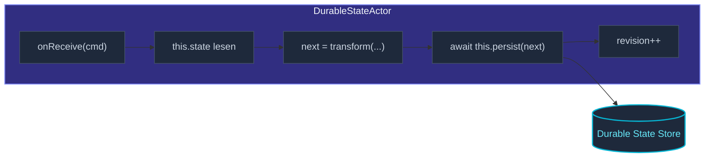

`DurableStateActor<Cmd, S>` ist das "Ich will einfach, dass der
aktuelle Wert überlebt"-Persistenz-Modell.  Kein Event-Log, kein
Replay — nur ein Snapshot des States, bei jedem
`persist(newState)` überschrieben.



Verglichen mit [`PersistentActor`](/de/persistence/persistent-actor/):

| Aspekt | `PersistentActor` | `DurableStateActor` |
| --- | --- | --- |
| Was gespeichert wird | Jedes je geschriebene Event | Der aktuelle State-Snapshot |
| Recovery | Events abspielen | Snapshot laden |
| Storage-Kosten | Wächst mit Events | Konstant pro Actor |
| Historie | Ja | Nein |
| Audit / Time Travel | Ja | Nein |
| Gleichzeitige Writes | Sequenziell | Optimistisch (Revisions-Check) |

Wähle Durable State, wenn die Historie nicht nützlich ist — Feature
Flags, last-known Configs, "aktuelle Cart-Inhalte" ohne den
Audit-Trail.

## Ein minimales Beispiel

```ts
import { DurableStateActor, DurableStateOptions, ActorSystem, Props } from 'actor-ts';
import { InMemoryDurableStateStore } from 'actor-ts';
import { match } from 'ts-pattern';

type CartCmd =
  | { kind: 'add';    sku: string }
  | { kind: 'remove'; sku: string }
  | { kind: 'view';   replyTo: ActorRef<State> };

interface State { items: string[]; }

class Cart extends DurableStateActor<CartCmd, State> {
  constructor(options: DurableStateOptions<State>) { super(options); }

  override async onReceive(cmd: CartCmd): Promise<void> {
    await match(cmd)
      .with({ kind: 'add' },    (c) => this.persist({ items: [...this.state.items, c.sku] }))
      .with({ kind: 'remove' }, (c) => this.persist({ items: this.state.items.filter(s => s !== c.sku) }))
      .with({ kind: 'view' },   (c) => { c.replyTo.tell(this.state); })
      .exhaustive();
  }
}

// Setup:
const system = ActorSystem.create('demo');
const store  = new InMemoryDurableStateStore();

const durableStateOptions = DurableStateOptions.create<State>()
  .withPersistenceId('cart-user-42')
  .withStore(store)
  .withEmptyState(() => ({ items: [] }));
const cart = system.spawn(
  Props.create(() => new Cart(durableStateOptions)),
  'cart',
);

cart.tell({ kind: 'add', sku: 'book-1' });
cart.tell({ kind: 'add', sku: 'book-2' });
// Nach einem Neustart: `this.state.items` ist wieder ['book-1', 'book-2'].
```

## Die Settings

```ts
interface DurableStateSettings<S> {
  persistenceId: string;
  store:         DurableStateStore;
  emptyState:    () => S;
}
```

Drei Felder:

- **`persistenceId`** — der Schlüssel, unter dem der State
  gespeichert ist.  Wie bei `PersistentActor` eine ID pro logischer
  Entity (`cart-user-42`, `flags-region-eu`, …).
- **`store`** — die `DurableStateStore`-Implementierung (in-memory,
  SQLite, Object Storage, benutzerdefiniert).
- **`emptyState()`** — Factory, die aufgerufen wird, wenn noch kein
  Eintrag existiert (erste Ausführung, gelöschter State).  Stellt
  den Initialwert bereit.

Reiche sie durch die `Props.create(() => new Cart({...}))`-Factory.
Die Settings können pro Actor-Inkarnation variieren (unterschiedliche
IDs für unterschiedliche User, derselbe Store).

## State-Zugriff + Persistenz

Innerhalb der Actor-Handler:

```ts
this.state       // aktueller State-Wert — überall lesbar
this.revision    // monoton wachsender Counter, wird bei jedem Persist erhöht
this.persist(s)  // überschreibt den gespeicherten State mit `s`, gibt Promise<void> zurück
```

`this.state` ist **synchron** — das Framework lädt den State in
`preStart`, und `state` gibt zurück, was gerade im Speicher steht.
Vor dem ersten Persist (oder Load) gibt es `emptyState()` zurück.

`this.persist(next)` schreibt den neuen State in den Store mit der
aktuellen Revision + 1.  Kehrt zurück, sobald der Store
bestätigt.  Innerhalb von `onReceive` warte mit `await` darauf,
bevor du den nächsten State als autoritativ behandelst.

## Optimistische Concurrency

```ts
try {
  await this.persist(next);
} catch (e) {
  if (e instanceof DurableStateConcurrencyError) {
    // Ein anderer Writer war schneller — neu laden und erneut versuchen oder zum User durchreichen.
  }
}
```

Wenn zwei Writer gleichzeitig dieselbe `persistenceId` aktualisieren,
lehnt der Revisions-Check des Stores den zweiten mit
`DurableStateConcurrencyError` ab.  Strategien:

- **Das Problem vermeiden** — stelle sicher, dass immer nur ein
  Actor zur selben Zeit in eine gegebene `persistenceId` schreibt.
  Das ist meistens trivial: jeder `cart-user-42` hat einen Actor
  auf einem Node (per Sharding oder Singleton).
- **Neu laden und erneut versuchen** — den Fehler fangen, State neu
  laden, den neuen Wert neu berechnen, erneut persistieren.
  Funktioniert, wenn die Operation idempotent ist.
- **Zum Aufrufer durchreichen** — mit einem Fehler antworten; den
  Aufrufer entscheiden lassen, ob er erneut versuchen will.

Bei den meisten Actor-System-Mustern sollten gleichzeitige Writes
nicht passieren — eine Entity pro `persistenceId`, über Routing
oder Sharding adressiert.  Wenn du Concurrency-Fehler in Produktion
siehst, bedeutet das meist, dass zwei Actors denselben Key schreiben,
was ein Routing-Bug ist.

## Wann Durable State gegen Persistent Actor gewinnt

Drei Signale, dass du das richtige Werkzeug gewählt hast:

- **Die State-Form ist einfach** (ein einzelnes Objekt, eine kleine
  Map).  Das Ganze zu überschreiben ist billig.
- **Du brauchst keinen Event-Stream** — keine Projektionen, kein
  Audit-Log, keine "zeig mir, wie wir hier gelandet sind"-
  Anforderungen.
- **Reads dominieren Writes** — jedes Read ist ein synchrones
  `this.state`, kein Replay.

Drei Signale, dass du stattdessen zu `PersistentActor` greifen
solltest:

- **Die Historie ist wichtig** — Auditing, regulatorisch, "zeig dem
  User ein Changelog."
- **Der State ist groß und Änderungen sind klein** — den gesamten
  State bei jeder Änderung zu schreiben ist verschwenderisch;
  kleine Events anzuhängen ist billiger.
- **Du willst Projektionen** — Read-Side-Views, die den Event-Stream
  brauchen.

## State-Migration

Wie bei `PersistentActor` unterstützt Durable State Schema-Evolution
durch einen Adapter:

```ts
import { StateAdapter } from 'actor-ts';

class V1ToV2Adapter implements StateAdapter<StateV2> {
  upcast(stored: unknown, version: number): StateV2 {
    if (version === 1) return migrate(stored as StateV1);
    return stored as StateV2;
  }
}

class Cart extends DurableStateActor<...> {
  protected stateAdapter() { return new V1ToV2Adapter(); }
}
```

Der persistierte Eintrag wird in einen `{ _v, _t, _e }`-Envelope
verpackt; beim Laden läuft das `upcast` des Adapters, um ältere
Versionen zu migrieren.  Siehe
[Migration im Überblick](/de/persistence/migration/overview/) für
die vollständige Story.

## Verschlüsselung + Kompression

Per-Actor-Overrides sind verfügbar:

```ts
class Sensitive extends DurableStateActor<...> {
  protected encryption() { return { algorithm: 'aes-gcm', keyId: 'k1' }; }
  protected compression() { return { algorithm: 'gzip' }; }
}
```

Werden von Stores berücksichtigt, die sie implementieren
(Object-Storage mit Verschlüsselung, etc.); ignoriert von Stores,
die das nicht tun (In-Memory, SQLite).  Siehe
[Object-Storage-Verschlüsselung](/de/persistence/object-storage/encryption/)
für die Durable-State-Verschlüsselungs-Story.

## Häufige Stolperfallen

import { Aside } from '@astrojs/starlight/components';

<Aside type="caution" title="`persist` nicht zu awaiten">
  ```ts
  override onReceive(cmd) {
    this.persist(next);            // ✗ kein await
    cmd.replyTo.tell('done');      // antwortet "done" bevor der Write fertig ist
  }
  ```
  Ohne `await` passiert die Antwort, bevor der State durable ist.
  Wenn der Prozess zwischen der Antwort und dem eigentlichen Write
  abstürzt, denkt der User, dass die Änderung angewendet wurde, aber
  das war sie nicht.  Immer `await`-en, bevor du einen Write
  bestätigst.
</Aside>

<Aside type="caution" title="`this.state` direkt mutieren">
  ```ts
  this.state.items.push(cmd.sku);    // ✗ mutiert die gespeicherte Referenz
  await this.persist(this.state);    // persistiert den mutierten Wert
  ```
  Das funktioniert *zufällig* in manchen Store-Implementierungen,
  aber es ist ein Footgun: das State-Objekt, das schon geladen ist,
  wird vielleicht herumgereicht (z. B. in eine Antwort), und du hast
  es mutiert, bevor der Persist bestätigt hat.  Baue ein *neues*
  State-Objekt und gib es an `persist` weiter.
</Aside>

<Aside type="caution" title="Großer State, häufige Updates">
  ```ts
  // 10 MB State, persistiert bei jedem Tastendruck — schlechte Form.
  ```
  Durable State schreibt den **gesamten** State bei jedem Update.
  Für große States, die sich häufig in kleinen Beträgen ändern, ist
  Event Sourcing effizienter — jede Änderung ist ein kleines
  angehängtes Event, nicht ein neu geschriebenes Megabyte.
</Aside>

## Wie geht's weiter

- **[Persistenz im Überblick](/de/persistence/overview/)** —
  die Entscheidung Durable State vs. Event Sourcing.
- **[PersistentActor](/de/persistence/persistent-actor/)** —
  wenn die Historie wichtig ist.
- **[Migration im Überblick](/de/persistence/migration/overview/)** —
  State-Schemas weiterentwickeln.
- **[Object Storage](/de/persistence/object-storage/overview/)** —
  S3- + Filesystem-Backends für Durable State.

Die [`DurableStateActor`](/api/classes/durablestateactor/)-API-Referenz
deckt die vollständige Oberfläche ab.
