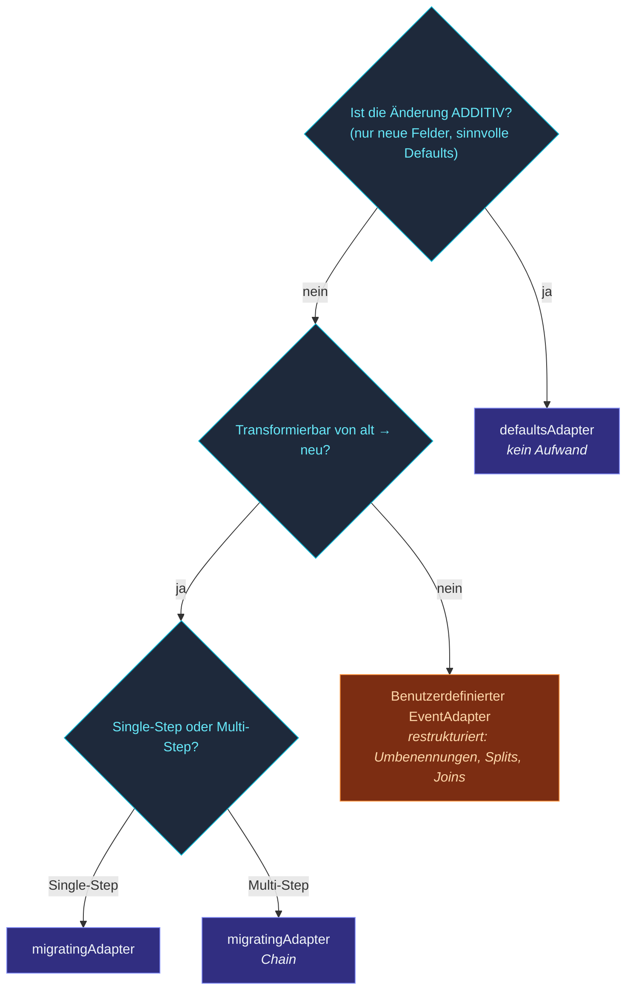

Event-sourced Systeme behalten Events **für immer**.  Ein Event,
das in v1 deines Codes geschrieben wurde, bleibt im Journal,
wenn v3 ausgeliefert wird.  Wenn v3 dieses Event liest, kann die
Form falsch sein: ein Feld wurde umbenannt, ein Enum hat eine
Variante bekommen, ein Wert wurde in zwei gesplittet.

Das Migrations-Toolkit des Frameworks beantwortet: **"Wie
entwickle ich Event- / State-Formen weiter, ohne Recovery zu
brechen?"**

Vier kooperierende Werkzeuge:

| Werkzeug | Wann |
| --- | --- |
| **[Envelope-Format](/de/persistence/migration/envelope-format/)** | Jedes persistierte Event trägt einen Versions-Tag.  Ermöglicht Migration. |
| **[Schema-Registry](/de/persistence/migration/schema-registry/)** | Optional — deklariert bekannte Schemas + ihre Versionen. |
| **[defaultsAdapter](/de/persistence/migration/default-adapter/)** | Defaults automatisch füllen für Felder, die in einer neueren Version hinzugefügt wurden. |
| **[migratingAdapter](/de/persistence/migration/migrating-adapter/)** | Transformationen von v1 → v2 → v3 verketten. |
| **[Legacy wrappen](/de/persistence/migration/wrap-legacy/)** | Un-envelope'te Legacy-Events per Bulk in versionierte Envelopes wickeln. |

Plus eine fokussiertere Seite:
[Rezepte](/de/persistence/migration/recipes/) — das Kochbuch
häufiger Migrationen.

## Der Envelope

Ohne Migration sind persistierte Events rohe Payloads:

```json
{ "kind": "deposited", "amount": 100 }
```

Wenn du einen Adapter an den Actor hängst, verpackt das Framework
das Event zur Persist-Zeit in einen **Envelope**:

```json
{
  "_v": 1,                                    // Version
  "_t": "deposited",                          // Typ-Tag
  "_e": { "kind": "deposited", "amount": 100 } // Payload
}
```

Beim Lesen sieht der Adapter die Version + Payload und
**upcasted** auf die aktuelle Form, bevor das `onEvent` des
Actors sie sieht.

Siehe [Envelope-Format](/de/persistence/migration/envelope-format/)
für die Details.

## Ein durchgespieltes Beispiel

Du lieferst v1 aus:

```ts
type EventV1 = { kind: 'deposited'; amount: number };
```

Das Journal akkumuliert V1-Events.  In v2 fügst du `currency`
hinzu:

```ts
type EventV2 = { kind: 'deposited'; amount: number; currency: string };
```

`currency` zum Typ hinzuzufügen bricht die Recovery für
V1-Events (die das Feld nicht haben).  Drei Optionen:

### Option A — Default

Richte einen `defaultsAdapter` ein, der fehlende Felder füllt:

```ts
class Account extends PersistentActor<...> {
  override eventAdapter() {
    return defaultsAdapter<EventV2>({
      manifest:       'deposited',
      currentVersion: 2,
      defaults:       { 1: { currency: 'USD' } },
    });
  }
}
```

V1-Events werden zurückgelesen als
`{ kind: 'deposited', amount: 100, currency: 'USD' }`.  Billig,
automatisch, **funktioniert nur für additive Änderungen**.

### Option B — Migrieren

```ts
class Account extends PersistentActor<...> {
  override eventAdapter() {
    const chain = MigrationChain.for<EventV2>('deposited', 2)
      .add({ fromVersion: 1, toVersion: 2,
             upcast: (v1: EventV1): EventV2 => ({ ...v1, currency: lookupCurrency(v1) }) });
    return migratingAdapter(chain);
  }
}
```

Die Chain läuft sequenziell.  V1-Events fließen durch den
`1 → 2`-Schritt; V2-Events überspringen ihn.

### Option C — Benutzerdefiniert

Für komplexe Migrationen (Umbenennungen, Restrukturierung,
Splitting) implementiere `EventAdapter<E>` direkt:

```ts
const adapter: EventAdapter<EventV2> = {
  manifest: () => 'deposited',
  toJournal: (e) => ({ manifest: 'deposited', version: 2, payload: e }),
  fromJournal: (stored) => stored.version === 1
    ? migrateV1ToV2(stored.payload as EventV1)
    : stored.payload as EventV2,
};
```

Volle Kontrolle; keine Einschränkungen bei Formtransformationen.

## Eine Strategie wählen



## State-Adapter

`DurableStateActor` hat die gleiche Maschinerie über
`StateAdapter`:

```ts
class Cart extends DurableStateActor<...> {
  protected stateAdapter() {
    return defaultsSnapshotAdapter<StateV2>({
      manifest: 'CartState', currentVersion: 2, defaults: { 1: { /* ... */ } },
    });
  }
}
```

Persistierte States werden in den gleichen Envelope (`_v` /
`_t` / `_e`) verpackt.  Die gleichen Migrations-Werkzeuge
funktionieren für beide Persistenz-Arten.

## Schema-Registry

Für größere Codebases mit vielen Event-Typen gibt die
**Schema-Registry** ein typisiertes Register aller bekannten
Event-Formen + ihrer Versionen:

```ts
import { SchemaRegistry } from 'actor-ts';

const registry = new SchemaRegistry()
  .add('Deposited', 2)
  .add('Withdrawn', 1)
  .add('AccountClosed', 1);
```

Optional — Adapter funktionieren ohne sie.  Nützlich, wenn:

- Du eine einzige Source of Truth für "welche Versionen
  existieren" willst.
- Du Laufzeit-Validierung willst, dass Events zu einem
  registrierten Schema passen.
- Du Tooling baust, das Schemas introspectet (Admin-Dashboards,
  Migrations-Skripte).

Siehe [Schema-Registry](/de/persistence/migration/schema-registry/).

## Legacy-Events

Wenn dein Journal Events aus der Zeit vor der Adapter-Aktivierung
hat, haben sie keine Envelopes — sie sind rohe Payloads.  Der
**WrapLegacy**-Helper überbrückt:

```ts
import { migrateInMemoryJournal } from 'actor-ts';

// One-shot bulk rewrite — wrap every raw event as a v1 envelope
// BEFORE the actor with the new adapter recovers.
await migrateInMemoryJournal(journal, (e) => `${e.kind}`);
```

Das ist ein einmaliges Umschreiben der gespeicherten Daten;
danach replayt dein normaler Adapter die nun eingewickelten
v1-Events.  Siehe
[Legacy wrappen](/de/persistence/migration/wrap-legacy/).

## Operatives Rollout

Migrationen werden normalerweise in Phasen ausgerollt:

1. **Code-Änderung** — den Adapter hinzufügen, mit der neuen
   Version deployen, die alt + neu lesen kann.
2. **Verifizieren** — mehrere persistenceIds wiederherstellen;
   sicherstellen, dass weder alte noch neue Events Fehler
   produzieren.
3. **V2-Events zu schreiben beginnen** — dein `onCommand`
   produziert V2-förmige Events (der Adapter wird auf dem
   Write-Pfad nicht involviert).
4. **(Optional) Schema-Cleanup** — sobald genug V2-Events
   akkumulieren und Snapshots die V1-Events abdecken, kannst du
   die Chain vereinfachen, indem du sehr alte Versionsschritte
   entfernst, wenn du bestätigt hast, dass keine V1-Events mehr
   verbleiben.

Für Rolling Deployments ohne Downtime siehe
[Rolling Migration](/de/operations/upgrades/rolling-migration/)
und [Rezepte](/de/persistence/migration/recipes/).

## Wie geht's weiter

- **[Envelope-Format](/de/persistence/migration/envelope-format/)** —
  das On-Disk-Format.
- **[defaultsAdapter](/de/persistence/migration/default-adapter/)** —
  Zero-Config-Additive-Migrationen.
- **[migratingAdapter](/de/persistence/migration/migrating-adapter/)** —
  verkettete Versions-Transformationen.
- **[Legacy wrappen](/de/persistence/migration/wrap-legacy/)** —
  Pre-Envelope-Events ins System bringen.
- **[Schema-Registry](/de/persistence/migration/schema-registry/)** —
  der typisierte Schema-Katalog.
- **[Rezepte](/de/persistence/migration/recipes/)** — das
  Entscheidungsbaum-Kochbuch.
- **[Rolling Migration](/de/operations/upgrades/rolling-migration/)** —
  diese Änderungen ohne Downtime deployen.
