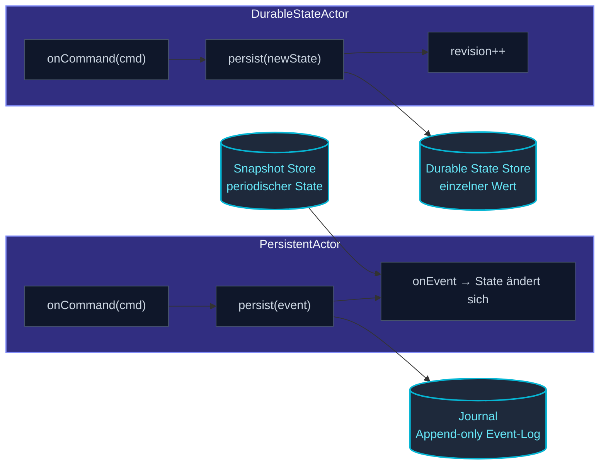
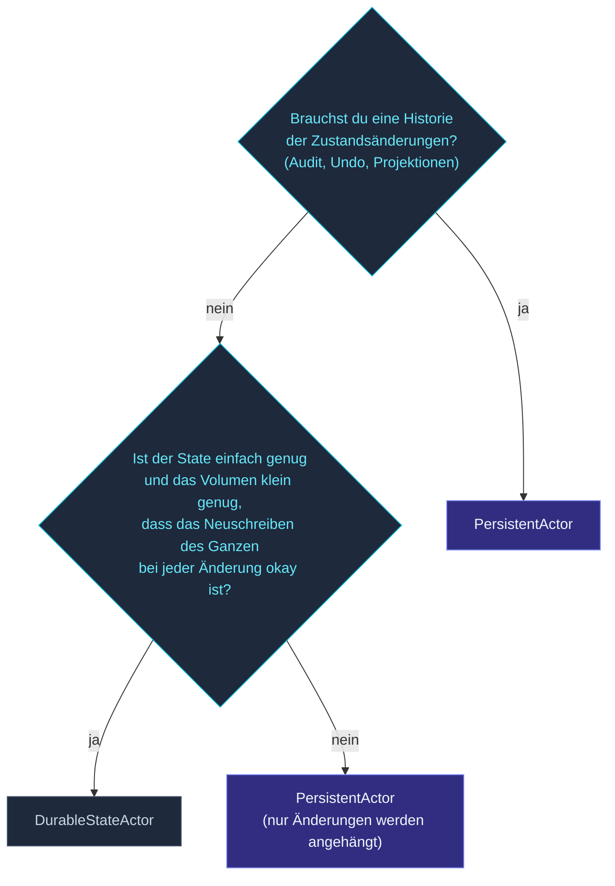

Standardmäßig lebt Actor-State im Speicher.  Wenn ein Actor abstürzt
und neu startet, beginnt jedes Feld bei Null.  Für State, der
überleben soll — Benutzerkonten, Warenkörbe, Bestell-Workflows, alles
jenseits des aktuellen Requests — brauchst du **Persistenz**.

actor-ts bietet zwei komplementäre Modelle:

| Modell | Was du persistierst | Wann |
| --- | --- | --- |
| **Event Sourcing** (`PersistentActor`) | Ein **Log von Events** — jede zustandsändernde Tatsache, die je beobachtet wurde. | Audit-Trails, Time Travel, Projektionen, wenn "wie sind wir hierher gekommen" wichtig ist. |
| **Durable State** (`DurableStateActor`) | Ein **einzelner Snapshot** — der aktuelle State, bei jedem Update überschrieben. | Wenn der aktuelle Wert alles ist, was du brauchst, und die Historie nicht nützlich ist. |

Beide spielen beim Actor-Start ab oder stellen wieder her, sodass
der wiederbelebte Actor dort weitermacht, wo der letzte aufgehört hat.

## Das große Bild



Das Journal und der Durable-State-Store sind **austauschbar**.  Das
Framework liefert mit:

| Backend | Journal | Durable State | Snapshot Store |
| --- | --- | --- | --- |
| In-Memory | ✓ | ✓ | ✓ |
| SQLite (Bun + better-sqlite3) | ✓ | ✓ | ✓ |
| Cassandra | ✓ | — | — |
| Filesystem / S3 (Object Storage) | — | ✓ | ✓ |

Plus einen Erweiterungspunkt — implementiere die Interfaces `Journal` /
`DurableStateStore` / `SnapshotStore` für deinen eigenen Storage.

## Event Sourcing in fünf Minuten

```ts
import { Actor, PersistentActor, ActorSystem } from 'actor-ts';

type Cmd =
  | { kind: 'deposit'; amount: number }
  | { kind: 'withdraw'; amount: number };

type Event =
  | { kind: 'deposited'; amount: number; ts: number }
  | { kind: 'withdrawn'; amount: number; ts: number };

interface State { balance: number; }

class Account extends PersistentActor<Cmd, Event, State> {
  readonly persistenceId = 'account-42';

  initialState(): State { return { balance: 0 }; }

  // Rein: state + event → neuer state. Wird während der Recovery abgespielt.
  onEvent(state: State, e: Event): State {
    if (e.kind === 'deposited') return { balance: state.balance + e.amount };
    if (e.kind === 'withdrawn') return { balance: state.balance - e.amount };
    return state;
  }

  // Validiert das Command, persistiert das Event, führt Seiteneffekte nach dem Persist aus.
  onCommand(state: State, cmd: Cmd): void {
    if (cmd.kind === 'deposit') {
      this.persist({ kind: 'deposited', amount: cmd.amount, ts: Date.now() },
        (next) => { /* Seiteneffekte mit dem persistierten-und-angewendeten State */ });
    } else if (cmd.kind === 'withdraw') {
      if (state.balance < cmd.amount) {
        // Ablehnen — nichts persistieren.
        return;
      }
      this.persist({ kind: 'withdrawn', amount: cmd.amount, ts: Date.now() },
        () => {});
    }
  }
}
```

Drei Methoden erledigen die ganze Arbeit:

- **`onCommand`** — validiert die Anfrage.  Entscheidet, welche Events
  per `this.persist(event, cb)` persistiert werden.  Seiteneffekte
  gehören in `cb`.
- **`onEvent`** — reine Funktion von State + Event zum neuen State.
  **Keine Seiteneffekte** hier — diese Funktion läuft während der
  Recovery, um das Journal abzuspielen, möglicherweise viele Male.
- **`initialState`** — wie der State aussieht, bevor irgendwelche
  Events da sind.

Beim Start liest das Framework jedes Event für `account-42`
aus dem Journal, spielt sie durch `onEvent` ab, und der
resultierende State ist das, was `onCommand` sieht.  Commands werden
erst verarbeitet, wenn die Recovery abgeschlossen ist.

Siehe [PersistentActor](/de/persistence/persistent-actor/) für
die vollständige Oberfläche.

## Durable State in fünf Minuten

```ts
import { DurableStateActor } from 'actor-ts';

interface State { items: string[]; }

class Cart extends DurableStateActor<CartCmd, State> {
  constructor(settings: DurableStateSettings<State>) { super(settings); }

  override async onReceive(cmd: CartCmd): Promise<void> {
    if (cmd.kind === 'add') {
      const next: State = { items: [...this.state.items, cmd.sku] };
      await this.persist(next);   // überschreibt den gespeicherten State
    } else if (cmd.kind === 'view') {
      cmd.replyTo.tell(this.state);
    }
  }
}
```

`persist(newState)` überschreibt den gespeicherten Snapshot.  Bei
einem Neustart lädt `preStart` ihn zurück; `this.state` spiegelt den
geladenen Wert wider.  Kein Event-Log; kein Replay; einfach "speichere
den aktuellen State."

Siehe [DurableStateActor](/de/persistence/durable-state/) für
die vollständige API.

## Event Sourcing vs. Durable State — die richtige Wahl

Der ehrliche Entscheidungsbaum:



Event Sourcing gewinnt, wenn:

- **Die Historie wichtig ist** — Auditing, regulatorische Compliance,
  "zeig mir, wie wir hier gelandet sind", Projektionen.
- **Der State groß ist**, aber die Änderungen klein — ein 100-Byte-Event
  anzuhängen ist billiger als den ganzen State zu schreiben.
- **Du Projektionen willst** — Read-Side-Views über den
  Event-Stream, siehe [Projektionen](/de/persistence/projections/).
- **Schema-Evolution ein langes Spiel ist** — Event-Typen können
  unabhängig vom aktuellen State migriert werden.

Durable State gewinnt, wenn:

- **Die Historie nicht nützlich ist** — der aktuelle Wert ist alles,
  was du brauchst.
- **Der State klein und einfach ist** — Überschreiben ist billig.
- **Du optimistische Concurrency willst** — Durable-State-Stores haben
  einen Revision Counter; gleichzeitige Writes lösen einen
  `DurableStateConcurrencyError` aus.

Viele Produktionssysteme mischen beides — Durable State für die
Konfigurations-artigen "ein aktueller Wert"-Dinge, Event Sourcing
für die Workflow-artigen "Historie-der-Entscheidungen"-Dinge.

## Snapshots

100 000 Events beim Start abspielen ist langsam.  Snapshots kürzen
das Replay-Fenster:

```ts
class Account extends PersistentActor<Cmd, Event, State> {
  // ...
  override snapshotPolicy() { return everyNEvents(100); }
  // Nach jeweils 100 Events wird der aktuelle State als Snapshot geschrieben.
}
```

Beim Start tut das Framework Folgendes:

1. Lädt den neuesten Snapshot (falls vorhanden).
2. Spielt Events *ab nach der seqNr dieses Snapshots* ab.

Ein 100-Event-Fenster ist schnell.  Wähle das Snapshot-Intervall
basierend auf deiner Event-Rate und akzeptablen Startzeit.

Siehe [Snapshots](/de/persistence/snapshots/) für die
Konfiguration und Per-Actor-Policy-Optionen.

## Projektionen — Read-Side-Views

Ein `PersistentActor` schreibt Events.  Eine **Projektion**
konsumiert sie und baut eine abgeleitete View, die für Queries
zugeschnitten ist:

```ts
import { ProjectionActor } from 'actor-ts';

class CartView extends ProjectionActor<CartEvent> {
  readonly persistenceId = 'view-cart-summary';
  readonly tag = 'cart';

  async handleEvent(event: CartEvent, seqNr: number): Promise<void> {
    if (event.kind === 'added') {
      await this.db.execute('INSERT INTO cart_items ...');
    }
    // ...
  }
}
```

Die Projektion abonniert Events mit Tag `'cart'` aus dem
Journal, verarbeitet sie in Reihenfolge, persistiert ihren eigenen
Fortschritt (sodass ein Neustart vom richtigen Offset weitermacht).

Das entkoppelt Writes (das Journal des `PersistentActor`) von
Reads (die View der Projektion) — die Read-Seite kann für die
Query-Muster, die sie bedient, denormalisiert werden.

Siehe [Projektionen](/de/persistence/projections/) für das
vollständige Muster.

## Austauschbare Backends

Das Framework definiert drei Interfaces:

```ts
interface Journal {
  // Events anhängen, Events lesen, nach Tag abfragen
}

interface DurableStateStore {
  // Laden, mit Revision persistieren, löschen
}

interface SnapshotStore {
  // Snapshot speichern, neuesten laden, ältere löschen
}
```

Eingebaute Implementierungen leben unter
[`persistence/journals/*`](/de/persistence/journals/in-memory/)
und [`persistence/snapshot-stores/*`](/de/persistence/snapshot-stores/in-memory/).

Für Produktion deckt die **SQLite**-Kombination aus Journal +
Snapshot + State Single-Node-Deployments ab; das
**Cassandra**-Journal deckt Multi-Node-Cluster ab, in denen das
Journal geteilt werden muss.

## Wann NICHT persistieren

import { Aside } from '@astrojs/starlight/components';

<Aside type="caution" title="Cache-artige Actors">
  ```ts
  class Cache extends PersistentActor<...> {
    // ✗ wenn der Cache neu aufgebaut werden kann, nicht persistieren
  }
  ```
  Ein Cache kann per Definition aus einer Source of Truth neu
  aufgebaut werden.  Den Cache zu persistieren bedeutet, dass du die
  Speicherkosten verdoppelt hast, ohne Recovery-Nutzen über "warmer
  Neustart" hinaus.  Verwende dafür einen einfachen Actor + einen
  externen Cache (Redis, Memcached).
</Aside>

<Aside type="caution" title="Winziger State ohne Failover-Anforderung">
  Ein Actor, der 100 Bytes State in einem Prozess hält, dessen
  Neustart du selbst kontrollierst (z. B. ein CLI-Tool), braucht
  wahrscheinlich keine Persistenz.  Persistenz hat Setup-Kosten
  (Journal-Konfiguration, Store-Auswahl, Schema-Management);
  überspringe sie, wenn die Recovery-Anforderung des States "User
  führt den Befehl erneut aus" lautet.
</Aside>

<Aside type="caution" title="Reine Transformations-Actors">
  Ein Actor, dessen Job "Input nehmen, transformieren, Output senden"
  ist, ohne persistenten internen State, hat nichts zu persistieren.
  Einfacher `Actor` ist die richtige Basis; `PersistentActor` fügt
  Maschinerie hinzu, die du nie nutzen würdest.
</Aside>

## Wie geht's weiter

- **[PersistentActor](/de/persistence/persistent-actor/)** —
  die Event-Sourcing-API im Detail.
- **[Durable State](/de/persistence/durable-state/)** —
  die einfachere Snapshot-artige Alternative.
- **[Snapshots](/de/persistence/snapshots/)** —
  Replay-Fenster-Reduktion für Event-sourced Actors.
- **[Projektionen](/de/persistence/projections/)** — Read-Side-Views,
  die aus Event-Streams gebaut werden.
- **[Journals — In-Memory](/de/persistence/journals/in-memory/)** —
  der Tests/Dev-Default.
- **[Journals — SQLite](/de/persistence/journals/sqlite/)** —
  Single-Node-Produktions-Default.
- **[Migration im Überblick](/de/persistence/migration/overview/)** —
  Event/State-Schemas über die Zeit weiterentwickeln.

Die [`PersistentActor`](/api/classes/persistentactor/)- und
[`DurableStateActor`](/api/classes/durablestateactor/)-API-Referenzen
decken die vollständige Basisklassen-Oberfläche ab.
