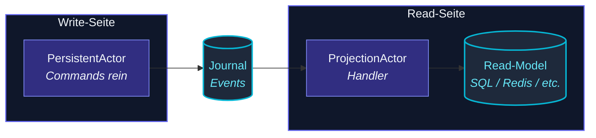

Ein `PersistentActor` schreibt Events.  Eine **Projektion**
konsumiert sie und baut eine **Read-Side-View**, die für Queries
zugeschnitten ist:



Das Journal ist **Append-only und autoritativ**.  Projektionen
sind abgeleitet — sie können von Grund auf neu aufgebaut werden,
indem das Journal abgespielt wird.  Das entkoppelt
Write-Durchsatz (durable, append-only) von Read-Durchsatz
(denormalisiert, query-optimiert).

## Ein minimales Beispiel

```ts
import { ProjectionActor, type ByTagSettings } from 'actor-ts';
import { SqliteQuery } from 'actor-ts';

type AccountEvent =
  | { kind: 'deposited'; amount: number }
  | { kind: 'withdrawn'; amount: number };

const projection = ProjectionActor.byTag<AccountEvent>({
  name: 'account-balance-view',
  tag:  'account',
  query: new SqliteQuery({ path: '/var/lib/events.db' }),
  offsetStore: new SqliteOffsetStore({ path: '/var/lib/offsets.db' }),
  async handle(event) {
    if (event.event.kind === 'deposited') {
      await viewDb.execute(
        'UPDATE balances SET balance = balance + ? WHERE pid = ?',
        [event.event.amount, event.persistenceId],
      );
    }
  },
});

system.actorOf(Props.create(() => projection), 'balance-projection');
```

Der Actor:

1. Lädt seinen **Offset-Cursor** beim `preStart` aus dem
   Offset-Store.
2. Pollt die **Query-Schicht** für Events, die zum `tag` passen,
   ab dem Cursor.
3. Ruft `handle` für jedes Event auf.
4. Persistiert den neuen Cursor.
5. Wiederholt.

## Zwei Query-Formen

| Factory | Cursor-Typ | Verwendung |
| --- | --- | --- |
| **`ProjectionActor.byPersistenceId(...)`** | sequenceNr (pro pid) | Lies die vollständige Historie einer Entity. |
| **`ProjectionActor.byTag(...)`** | Offset (Timestamp + Tiebreaker) | Lies alles, was mit `<tag>` getaggt ist, im Journal. |

Tag-basiert ist der häufige Fall — der `PersistentActor` ruft
`tagsFor(event)` auf, um Events zu labeln; die Projektion
abonniert das Tag.  Per-pid ist nützlich für schmale Views (die
Aktivität eines Users).

## At-least-once Delivery

```ts
// Crash-Recovery-Sequenz:
//   1. Offset-Cursor auf Wert N speichern.
//   2. Handler verarbeitet Event N+1.
//   3. Crash bevor der Cursor gespeichert wird.
//   4. Beim Neustart: Cursor ist immer noch N → Handler erhält Event N+1 erneut.
```

Wenn der Handler läuft, aber der Cursor nicht persistiert wird,
**verarbeitet die Projektion dasselbe Event erneut** beim
Neustart.  Das ist **At-least-once Delivery** — das Framework
garantiert, dass kein Event verpasst wird, aber Duplikate sind
möglich.

Handler müssen **idempotent** sein:

- **UPSERT** in das Read-Model (kein blindes `INSERT`).
- **Verarbeitete Event-IDs verfolgen** im Read-Model selbst für
  Dedup.
- **Die `sequenceNr` des Events als Per-pid-Dedup-Key verwenden**
  — sie nimmt nie ab, ist monoton pro persistenceId.

Wenn du den Handler nicht idempotent machen kannst, muss die
Projektion an einem 2-Phase-Commit mit dem Offset-Save teilnehmen —
viel komplexer, nicht out-of-the-box bereitgestellt.

## OffsetStore

```ts
import { InMemoryOffsetStore, SqliteOffsetStore } from 'actor-ts';

// Default (verloren beim Neustart):
new InMemoryOffsetStore();

// Produktion (Single-Node):
new SqliteOffsetStore({ path: '/var/lib/offsets.db' });
```

Der Cursor ist nur eine Zahl (oder ein Compound-Offset) — pro
Projection-Name + Scope gespeichert.  Implementierungen:

- `InMemoryOffsetStore` — okay für Tests, nutzlos in Produktion
  (jeder Neustart verarbeitet vom Anfang neu).
- `SqliteOffsetStore` — Single-File-Durable-Offsets.
- Benutzerdefiniert — implementiere `OffsetStore` gegen deinen
  eigenen Store (Redis, Postgres, was auch immer dein Read-Model
  verwendet).

Für echte Produktions-Setups **kollokiere den Offset-Store mit
dem Read-Model**, sodass sie zusammen abstürzen — das minimiert
das Re-Processing-Fenster.

## Polling

```ts
new ProjectionActor.byTag({
  name: '...',
  tag:  '...',
  liveOptions: {
    pollIntervalMs: 500,    // Default 1000 ms
  },
  ...
});
```

Die Projektion pollt.  Im Idle sind die Poll-Kosten eine
Journal-Query pro `pollIntervalMs`.  Tuning:

- Niedriger (250-500 ms) → schnellere End-to-End-Propagation, mehr
  Datenbank-Last.
- Höher (5-10 s) → langsame Sichtbarkeit, aber billig.

Für sehr niedriglatente Read-Model-Updates siehe
[Push-basierte Query](/de/persistence/push-based-query/), die
Sub-Poll-Intervall-Delivery über den In-Process-Event-Bus erhält.

## Per-pid-Projektionen

```ts
const projection = ProjectionActor.byPersistenceId<AccountEvent>({
  name:           'account-42-view',
  persistenceId:  'account-42',
  query,
  offsetStore,
  async handle(event) {
    // ... nur die Events dieses Accounts behandeln
  },
});
```

Ein Actor pro persistenceId.  Nützlich für **Per-Entity-Views**:

- Eine "User-Activity-Timeline"-Projektion pro User.
- Eine "Per-Order-Audit-Trail"-Projektion pro Order.

Für große Zahlen von pids ist das **nicht** der Weg zu skalieren —
eine Projektion pro pid zu spawnen skaliert nicht auf Millionen
von Usern.  Verwende dafür eine einzelne Tag-basierte Projektion,
die nach pid hasht.

## Mehrere Projektionen, dasselbe Journal

```ts
// Drei Projektionen, drei Offset-Cursors, drei unabhängige Views:
system.actorOf(Props.create(() => ProjectionActor.byTag<E>({ name: 'balance', ... })));
system.actorOf(Props.create(() => ProjectionActor.byTag<E>({ name: 'audit-log', ... })));
system.actorOf(Props.create(() => ProjectionActor.byTag<E>({ name: 'monthly-stats', ... })));
```

Jede hat ihren eigenen Offset-Cursor; sie lesen unabhängig vom
Journal.  Das ist die **Stärke** von Event Sourcing — ein
Event-Stream, viele abgeleitete Views, keine an die andere
gekoppelt.

import { Aside } from '@astrojs/starlight/components';

<Aside type="caution" title="Idempotenz ist nicht optional">
  ```ts
  await db.execute('INSERT INTO events (...) VALUES (...)');   // ✗ Duplikate beim Retry
  ```
  Ohne Idempotenz wird **At-least-once zu "gelegentlich
  doppelt."**  Der Retry passiert bei jedem Neustart, der einen
  ausstehenden Handler hat.  Verwende UPSERT oder schließe die
  sequenceNr des Events in die Zeile ein und dedupe zur Schreib-Zeit.
</Aside>

<Aside type="caution" title="Von Grund auf neu aufbauen">
  ```bash
  # Um eine Projektion von vorne neu aufzubauen:
  DELETE FROM offsets WHERE projection_name = 'balance';
  # Oder gib beim nächsten Start einen frischen OffsetStore mit.
  ```
  Das Zurücksetzen des Offsets spielt jedes Event für diesen Tag
  ab.  Für große Journals kann das eine Weile dauern.  Manchmal
  beabsichtigt (Schema-Migration des Read-Models); meist nicht
  das, was du zufällig willst.
</Aside>

<Aside type="caution" title="Langsame Handler bremsen die Projektion">
  ```ts
  async handle(event) {
    await callSlowExternalService();   // 500ms pro Event
  }
  ```
  Die Handler-Latenz begrenzt direkt den Durchsatz.  Bei
  500 ms/Event verarbeitet die Projektion 2 Events/sec.  Für
  Journals mit hohem Durchsatz parallelisiere innerhalb des Handlers
  (Promise.all) oder splitte die Arbeit in mehrere Projektionen.
</Aside>

## Wie geht's weiter

- **[Persistenz im Überblick](/de/persistence/overview/)** —
  das größere Bild.
- **[PersistentActor](/de/persistence/persistent-actor/)** —
  was die Events produziert.
- **[Persistence Query](/de/persistence/persistence-query/)** —
  die Read-Side-API, die die Projektion verwendet.
- **[Push-basierte Query](/de/persistence/push-based-query/)** —
  Sub-Poll-Intervall-Delivery über den Event-Bus.

Die [`ProjectionActor`](/api/classes/projectionactor/)-API-Referenz
deckt alle Settings ab.
