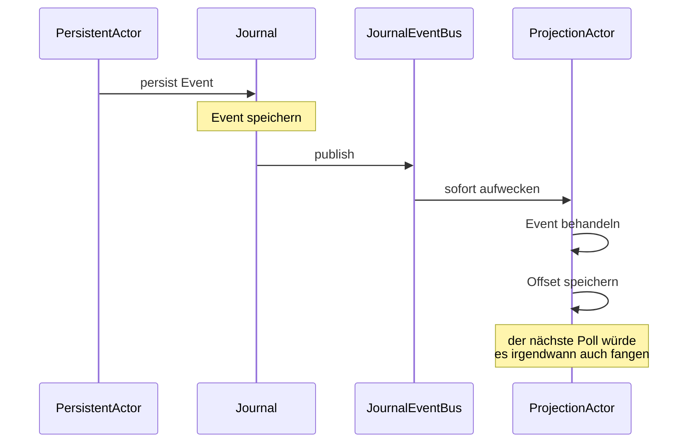

Die Default-[`PersistenceQuery`](/de/persistence/persistence-query/)
ist **Poll-basiert**: Live-Streams prüfen das Journal alle
`pollIntervalMs` (Default 1 s) auf neue Events.  In Ordnung für die
meisten Projektionen, führt aber bis zu 1 Sekunde Latenz pro Event
ein.

Für niedrigere Latenz fügt das Framework **Push-Delivery** über
einen In-Process-**`JournalEventBus`** hinzu:



Der Bus liefert in **einstelligen Millisekunden** statt im
Poll-Intervall.  At-least-once-Semantik ist erhalten — wenn der
Subscriber eine Publikation verpasst (Startup-Race, Crash), holt der
nächste Poll sie nach.

## Wann das wichtig ist

Sub-Poll-Intervall-Delivery ist **nur in einem spezifischen Fall
wertvoll**:

- Der `PersistentActor` und der `ProjectionActor` sind **auf
  demselben Node**.
- Die Latenz von `persist()` bis zum Projection-Handler ist für
  den User sichtbar.

Über Nodes hinweg (Writer auf Node-A, Projektion auf Node-B) hilft
der Bus nicht — er ist ein In-Process-Bus.  Über Nodes hinweg bist
du entweder durch die Poll-Kadenz begrenzt oder durch die
journal-eigene Replication-/Pub/Sub-Schicht (Cassandras CDC,
Postgres Logical Replication, etc.).

Für die meisten Apps ist **das Default-Polling in Ordnung** —
1 Sekunde Projection-Lag ist selten ein Problem.  Greife zu
Push-basiertem, wenn:

- Eine Echtzeit-UI eine Projektion abonniert.
- Ein Cluster-Singleton-Koordinator in Echtzeit auf seine eigenen
  Persistence-Events reagieren muss.
- Die Projektion kompensierende Aktionen in einer Saga antreibt,
  wo sich Poll-Lag über Schritte hinweg aufsummiert.

## Wie aktivieren

```ts
const projection = ProjectionActor.byTag<E>(system, ByTagProjectionOptions.create<E>()
  .withName('realtime-balance')
  .withTag('account')
  .withQuery(new SqliteQuery({ path: '...' }))
  .withLiveOptions({
    push: true,                  // Bus-Subscription aktivieren
    pollIntervalMs: 5_000,       // Fallback-Poll-Kadenz — kann hoch sein
  })
  .withHandle(async (event) => { /* ... */ }));
```

Mit `push: true`:

- Die Projektion abonniert **zusätzlich** den In-Process-Bus des
  Journals.
- Bei Bus-Delivery wacht die Projektion sofort auf, fragt das
  Journal nach dem/den neuen Event(s) ab und verarbeitet sie.
- Der Poll läuft trotzdem als Sicherheitsnetz mit `pollIntervalMs`
  — setze ihn auf 5-30 Sekunden, da Push den Hot-Path übernimmt.

Der Fallback-Poll fängt:

- Events, die der Bus verpasst hat (selten — Subscription-Races
  beim Start).
- Events von Cross-Process-Writern (werden nicht über den
  In-Process-Bus geliefert).
- Events, bei denen dein Handler abgestürzt ist und die er beim
  Neustart erneut versuchen muss.

## Der Mechanismus

```ts
// Innerhalb des Journals, bei jedem erfolgreichen Append:
this.events.publish(persistentEvent);

// Innerhalb der Projektion, bei jeder Subscription:
this.events.subscribe((event) => {
  if (matchesFilter(event)) wakeUpAndProcess();
});
```

Der Bus ist ein einfaches In-Process-Pub/Sub — kein Netzwerk, keine
Serialisierung.  Publish ist synchron; Subscriber feuern im selben
Tick.

Für die SQLite- und In-Memory-Journals ist der Bus automatisch
verdrahtet.  Für benutzerdefinierte Journals sollte deine
`Journal`-Implementierung bei jedem erfolgreichen Append
`this.events.publish(...)` aufrufen, um Push-Delivery an
In-Process-Konsumenten zu ermöglichen.

## Außerhalb des Scopes

Push-Delivery ist **strikt In-Process**.  Für Cross-Node-Push-Delivery:

- Das [DistributedPubSub](/de/cluster/pubsub/) des Frameworks
  bedient general-purpose Cluster-Pub/Sub.  Du würdest manuell auf
  Events publizieren, die du cluster-weit streamen willst.
- Das Cassandra-Journal hat die Option, **CDC** für
  Cross-Cluster-Delivery zu verwenden, aber das ist nicht
  standardmäßig verdrahtet.

Für "Echtzeit-Projektionen über Nodes" ist das einfachste Muster:

- Der `PersistentActor` (auf welchem Node er auch immer gehostet
  wird) **publiziert beim Persistieren auch via DistributedPubSub**
  (benutzerdefinierter Code obenauf des Per-Persist-Callbacks).
- Subscriber auf jedem Node erhalten die Benachrichtigung und
  triggern ihre Projektionen.

## Wann NICHT verwenden

import { Aside } from '@astrojs/starlight/components';

<Aside type="caution" title="Cross-Process Writer/Projection">
  ```ts
  // Writer auf Node-A, Projektion auf Node-B
  liveOptions: { push: true };   // nutzlos — Bus ist In-Process
  ```
  Push-Delivery passiert nur, wenn Writer und Reader sich ein
  ActorSystem teilen.  Cross-Node-Delivery ist durch Polling oder
  eine manuelle Cluster-Pubsub-Schicht begrenzt.
</Aside>

<Aside type="caution" title="Publisher mit hoher Event-Rate">
  ```ts
  // 10 000 Events/sec — Bus feuert jedes Mal synchron
  ```
  Bei hohen Raten kann der synchrone Publish-Pfad des Bus den
  Persist-Callback des Writers blockieren.  Für sehr hohen
  Durchsatz senke die Batch-Size der Projektion und akzeptiere
  Poll-only.
</Aside>

<Aside type="caution" title="Bus-Delivery ist ein Aufwecken, keine Auslieferung">
  ```ts
  // Subscriber bekommt "etwas ist passiert" → fragt das Journal ab → behandelt
  ```
  Der Bus signalisiert "prüf das Journal."  Das eigentliche Event
  wird trotzdem aus dem Journal gelesen.  Das bedeutet, der Bus
  kann feuern, nachdem das Event bereits von einem aktuellen Poll
  gelesen wurde — das ist okay; die Query gibt keine neuen Events
  zurück und die Projektion idlet.
</Aside>

## Wie geht's weiter

- **[Persistenz im Überblick](/de/persistence/overview/)** —
  das größere Bild.
- **[Persistence Query](/de/persistence/persistence-query/)** —
  die zugrunde liegende API.
- **[Projektionen](/de/persistence/projections/)** — was
  den Bus konsumiert.
- **[DistributedPubSub](/de/cluster/pubsub/)** — für
  Cross-Node-Echtzeit-Fan-out.
