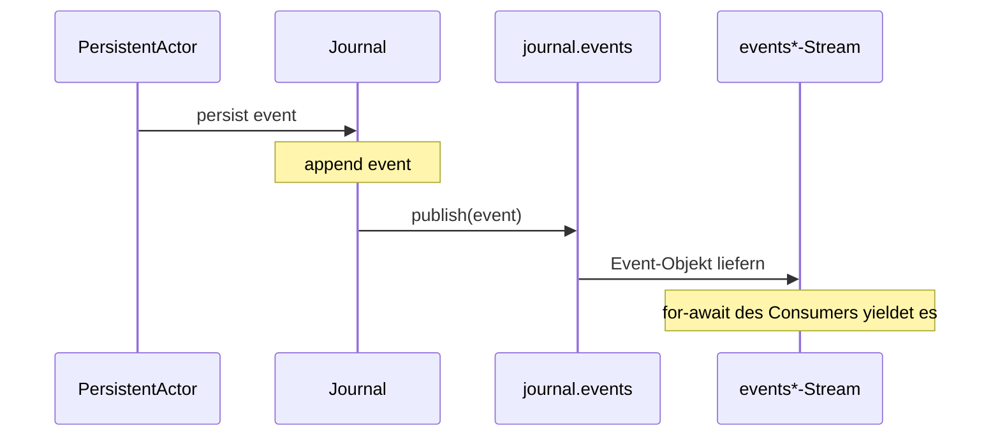

Die Live-[`PersistenceQuery`](/de/persistence/persistence-query/)-Streams
— `eventsByPersistenceId` und `eventsByTag` — sind **standardmäßig
poll-basiert**: sie lesen das Journal alle `pollIntervalMs`
(Default 1 s) auf neue Events erneut.  Für die meisten
Projektionen okay, aber bis zu eine Sekunde Latenz pro Event.

Wenn das zugrunde liegende Journal einen In-Process-**Event-Bus**
(`journal.events`) bereitstellt, wechseln dieselben Live-Streams
**automatisch** zu **Push-Delivery** — sie abonnieren den Bus und
liefern jedes neue Event innerhalb von Millisekunden, wobei das
Polling nur als Sicherheitsnetz bleibt.  Es gibt **kein
Opt-in-Flag**; es passiert, sobald das Journal einen Bus hat.


```mermaid
sequenceDiagram
  participant PA as PersistentActor
  participant J as Journal
  participant BUS as journal.events
  participant Q as events*-Stream
  PA->>J: persist event
  Note over J: append event
  J->>BUS: publish(event)
  BUS->>Q: Event-Objekt liefern
  Note over Q: for-await des Consumers yieldet es
```

## Welche Journals pushen

Das In-Memory- und das SQLite-Journal verdrahten `journal.events`
automatisch, ihre Live-Streams pushen also.  Ein Journal ohne Bus
pollt einfach.  Ein eigenes `Journal` macht mit, indem es einen
`events`-Bus bereitstellt und bei jedem erfolgreichen Append
publiziert.

## Einen Live-Stream konsumieren

Push gilt für die **Live**-Streams (`eventsByTag` /
`eventsByPersistenceId`), die ein `AsyncIterable` zurückgeben:

```ts
import { offsetStart } from 'actor-ts';
// `query` ist eine PersistenceQuery (SqliteQuery / InMemoryQuery / …) — siehe Persistence Query.

for await (const tagged of query.eventsByTag<AccountEvent>('account', offsetStart())) {
  handle(tagged.event);   // via Bus in ~ms geliefert, wenn verfügbar,
                          // sonst beim nächsten Poll
}
```

`LiveQueryOptions` justiert das Fallback-Polling — `{ pollIntervalMs }`.
Es gibt **kein `push`-Feld**: Push ist
automatisch, wenn der Bus existiert, du kannst also ein *höheres*
`pollIntervalMs` setzen (das Polling ist nur ein Backstop).

## Der Bus liefert das Event, nicht nur einen Weckruf

Der Push-Stream abonniert den Bus **zuerst**, macht dann den
Catch-up-Read für die Historie und drainiert danach gepufferte
Bus-Events — es gibt also keine Startup-Lücke.  Jede Publikation
trägt das **Event-Objekt selbst**, der Stream yieldet es also
direkt; er fragt das Journal nicht bei jeder Benachrichtigung neu
ab.

At-least-once bleibt erhalten: verpasst ein Abonnement eine
Publikation (Startup-Race, Crash), holt das Fallback-Polling sie
nach.

## ProjectionActor pollt — er nutzt den Bus nicht

[`ProjectionActor`](/de/persistence/projections/) treibt sich
selbst durch **Polling** der einmaligen `currentEventsByTag` /
`currentEventsByPersistenceId` auf einem Timer (`pollIntervalMs`);
er abonniert den Journal-Bus **nicht**.  Die Latenz einer
Projektion ist also durch ihr Poll-Intervall begrenzt.  Für echte
Push-Latenz konsumiere den Live-`events*`-Stream direkt (wie oben)
statt über den `ProjectionActor` zu gehen.

## Nur In-Process

`journal.events` ist ein In-Process-Bus — Push funktioniert nur,
wenn Writer und Stream-Consumer ein `ActorSystem` teilen (selber
Knoten).  Über Knoten hinweg bist du durch Polling begrenzt, durch
die Replikation / CDC des Journals, oder indem du selbst auf
[DistributedPubSub](/de/cluster/pubsub/) publizierst.

import { Aside } from '@astrojs/starlight/components';

<Aside type="caution" title="Über Knoten: der Bus reicht nicht hin">
  ```ts
  // Writer auf Knoten A, Stream-Consumer auf Knoten B
  ```
  Der Event-Bus ist In-Process.  Knotenübergreifende
  Echtzeit-Delivery ist durch Polling oder eine manuelle
  DistributedPubSub-Schicht begrenzt.
</Aside>

<Aside type="caution" title="Synchrones Publish auf dem Hot-Path">
  ```ts
  // Das Journal publiziert synchron bei jedem Append
  ```
  Der Bus feuert synchron auf dem Append-Pfad des Writers.  Bei
  sehr hohen Event-Raten fügt das dem Persist-Pfad Arbeit hinzu;
  halte Bus-Subscriber leicht (Event yielden; schwere Arbeit
  nachgelagert).
</Aside>

## Wie geht es weiter

- **[Persistence Query](/de/persistence/persistence-query/)** — die zugrunde liegende `events*`-API.
- **[Projektionen](/de/persistence/projections/)** — der poll-basierte Projektions-Actor.
- **[DistributedPubSub](/de/cluster/pubsub/)** — knotenübergreifender Echtzeit-Fan-out.
