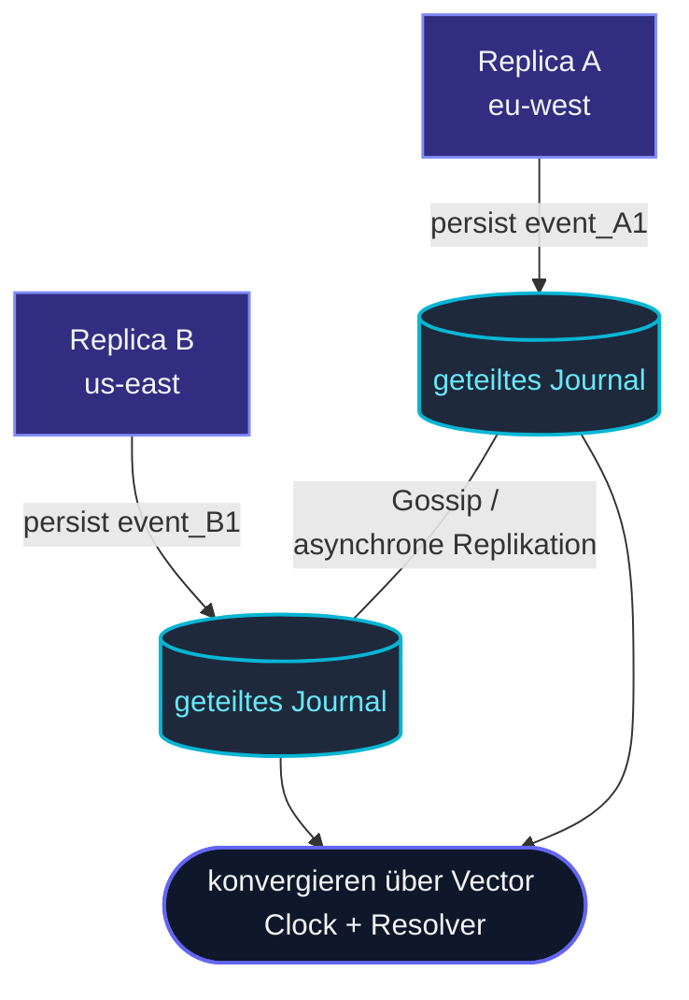

Standard-[Event Sourcing](/de/persistence/persistent-actor/) hat
**einen Writer pro `persistenceId`** — eine einzelne
Actor-Instanz hängt Events an; eine andere Instanz (nach Failover)
spielt sie ab.  Das ist in Ordnung für Sharded Entities, wo das
Framework Ein-Actor-pro-Key garantiert.

**Replicated Event Sourcing** entfernt diese Einschränkung.
Mehrere Replicas **derselben Entity** können gleichzeitig aktiv
sein — auf verschiedenen Nodes, in verschiedenen Regionen — und
jede persistiert unabhängig.  Das Framework verwendet **Vector
Clocks**, um nebenläufige Edits zu erkennen + **Conflict
Resolver**, um sie zu mergen.



## Wann verwenden

Das ist das **Nischen**-Persistenz-Muster.  Die meisten Apps
sollten es nicht brauchen.  Use Cases:

- **Multi-Region Active-Active** — dieselbe Entity schreibbar in
  EU + US.  Netzwerk-Partition zwischen Regionen stoppt keine
  Seite.
- **Edge-artige Replikation** — Entities replizieren nah am
  User, gleichen zentral ab.
- **Cluster-spanning gleichzeitige Writer** — dieselbe Entity wird
  auf mehreren Cluster-Nodes ohne Singleton-Koordination
  bearbeitet.

Für typische Sharded-Entity-Setups gibt
[ClusterSharding](/de/cluster/sharding/overview/) +
[PersistentActor](/de/persistence/persistent-actor/)
automatisch Exactly-One-Writer pro Key — einfacher als das hier.

## Was du aufgibst

Replicated Event Sourcing tauscht **Einfachheit** gegen
**Verfügbarkeit**:

| Single-Writer-ES | Replicated ES |
| --- | --- |
| Totale Event-Order pro pid | Partielle Order — nebenläufige Events können ungeordnet sein |
| State ist ein deterministischer Fold | State ist ein Fold + Conflict Resolution |
| Commands werden gegen den neuesten State validiert | Commands werden gegen die View der lokalen Replica validiert |
| Neustart spielt das Log ab | Neustart spielt das Log ab + gleicht nebenläufige Branches ab |

Das Mental-Model ist **CRDT-artig für Events** — Multi-Writer-
Konvergenz by Design.

## Ein minimales Beispiel

```ts
import {
  ReplicatedEventSourcedActor,
  vectorClock,
  type ConflictResolver,
} from 'actor-ts';

type State = { value: number };
type Event = { kind: 'set'; value: number };

const resolver: ConflictResolver<State, Event> = {
  resolve(state, conflicts) {
    // Wenn zwei Replicas gleichzeitig unterschiedliche Werte setzen, gewinnt das Maximum:
    const values = conflicts.map(c => (c.event as Event).value);
    return { value: Math.max(...values) };
  },
};

class Counter extends ReplicatedEventSourcedActor<Cmd, Event, State> {
  readonly persistenceId = 'counter-42';
  readonly replicaId     = process.env.REPLICA_ID!;
  readonly conflictResolver = resolver;

  initialState() { return { value: 0 }; }
  onEvent(state: State, event: Event) {
    return { value: event.value };
  }
  // ... onCommand etc.
}
```

Der Actor erweitert `ReplicatedEventSourcedActor` statt
`PersistentActor`.  Drei zusätzliche Dinge zu spezifizieren:

- **`replicaId`** — der stabile Identifier dieser Replica
  (anders als `persistenceId`).
- **`conflictResolver`** — wie nebenläufige Events gemergt
  werden.
- Das Journal muss **über Replicas geteilt** sein (Cassandra,
  geteilter Object Storage, etc.).

## Die Komponenten

| Komponente | Zweck |
| --- | --- |
| **[VectorClock](/de/persistence/replicated-event-sourcing/vector-clocks/)** | Verfolgt Kausalität über Replicas — erkennt nebenläufige Writes. |
| **[ConflictResolver](/de/persistence/replicated-event-sourcing/conflict-resolver/)** | Entscheidet, wie nebenläufige Events in einen einzigen State gemergt werden. |
| **[Single-Writer-Lease](/de/persistence/replicated-event-sourcing/single-writer-lease/)** | Optional — gattert Writes über ein Lease für stärkere Konsistenz. |
| **[Replicated Snapshots](/de/persistence/replicated-event-sourcing/snapshotting/)** | Snapshots, die die Vector Clock für volle Recovery enthalten. |

Jedes bekommt seine eigene Deep-Dive-Seite.

## Wann NICHT verwenden

import { Aside } from '@astrojs/starlight/components';

<Aside type="caution" title="Sharded Entities sind einfacher">
  ```ts
  // ClusterSharding gibt automatisch genau-einen-Actor-pro-Key
  ```
  Wenn dein einziger Bedarf "Entities über Nodes verteilen" ist,
  ist Sharding + plain PersistentActor viel einfacher.
  Replicated ES ist für **gleichzeitige Writer auf DIESELBE
  Entity**.
</Aside>

<Aside type="caution" title="Keine natürliche Konfliktauflösung">
  ```ts
  // "User ändert Namen in EU und US gleichzeitig — was gewinnt?"
  ```
  Replicated ES verlangt, dass du einen Resolver definierst.  Wenn
  "was gewinnt" keine sinnvolle Antwort hat, ist Replicated ES
  die falsche Form — verwende ein Single-Writer-Muster
  (Singleton / Sharding).
</Aside>

<Aside type="caution" title="Starke Konsistenz erforderlich">
  ```ts
  // Finanzen: Saldo darf niemals divergenten State widerspiegeln
  ```
  Replicated ES ist **eventually consistent**.  Für absolute
  Konsistenz (keine divergenten Reads, keine
  nach-dem-Tatbestand-gemergten States), verwende einen Singleton
  oder Sharding (ein Writer zur Zeit).
</Aside>

## Vergleich

```
                              Sharding + PersistentActor    Replicated ES
Mehrere Writer pro Entity?    Nein (genau einer)            Ja
Conflict Resolution nötig?    Nein                          Ja
Cross-Region Active-Active?   Sharding bevorzugt eine Region Ja
Operative Komplexität?        Niedrig                       Hoch
Verwenden wenn                Default                       Du brauchst es wirklich
```

## Wie geht's weiter

- **[Vector Clocks](/de/persistence/replicated-event-sourcing/vector-clocks/)** —
  wie Nebenläufigkeit erkannt wird.
- **[Conflict Resolver](/de/persistence/replicated-event-sourcing/conflict-resolver/)** —
  wie nebenläufige Events mergen.
- **[Single-Writer-Lease](/de/persistence/replicated-event-sourcing/single-writer-lease/)** —
  optionale Stärkere-Konsistenz-Gate.
- **[Replicated Snapshots](/de/persistence/replicated-event-sourcing/snapshotting/)** —
  Vector-Clock-aware Snapshots.
- **[PersistentActor](/de/persistence/persistent-actor/)** —
  die einfachere Single-Writer-Alternative.
- **[Sharding im Überblick](/de/cluster/sharding/overview/)** —
  das übliche Scale-out-Muster.
