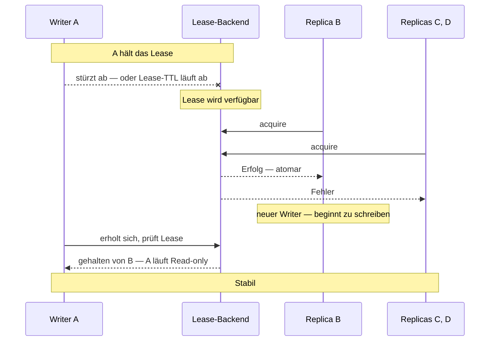

Replicated Event Sourcing tauscht Single-Writer-Konsistenz gegen
Verfügbarkeit — mehrere Replicas können gleichzeitig schreiben,
und der Conflict Resolver merged.

Für manche Workloads **sollten Konflikte überhaupt nicht
passieren** — sie repräsentieren Bugs oder Domain-Verletzungen.
Aber die Multi-Region-Verfügbarkeit zu verlieren wäre ein
Rückschritt.

Das **Single-Writer-Lease** ist der Mittelweg:

```
   Zu jedem Moment hält GENAU EINE Replica das Lease.
   Der Lease-Halter schreibt Events normal.
   Andere Replicas lesen, aber schreiben nicht (bis sie das Lease erwerben).
   Wenn der Lease-Halter ausfällt, erwirbt eine andere Replica es.
```

Verwandelt Replicated ES effektiv in ein **failover-fähiges
Single-Writer-System** mit den Recovery-Semantiken von
Replicated-ES darunter.

```ts
import { ReplicatedEventSourcedActor, KubernetesLease } from 'actor-ts';

class Account extends ReplicatedEventSourcedActor<Cmd, Event, State> {
  readonly persistenceId = `account-${this.userId}`;
  readonly replicaId     = process.env.REPLICA_ID!;
  readonly conflictResolver = ...;

  // Lease opt-in:
  readonly lease: Lease = new KubernetesLease({
    name:  `account-${this.userId}-writer`,
    owner: process.env.REPLICA_ID!,
    ttlMs: 30_000,
    namespace: 'default',
  });
}
```

Der Actor:

1. Versucht beim `preStart`, das Lease zu erwerben.
2. Bei Erfolg → wird der **Writer**.
3. Bei Misserfolg → startet im **Read-only-Modus**.
4. Bei `onLost` → fällt zurück in Read-only; eine andere Replica
   erwirbt schließlich.

## Wann verwenden

Wenn du **Active-Active-Failover** willst, aber **Single-Writer-
Konsistenz**:

- **Finanztransaktionen** — Saldoänderungen müssen
  serialisieren.
- **Stock / Inventar** — gleichzeitiges Dekrementieren könnte
  überschießen.
- **Workflow-Zustandsmaschinen** — Übergänge können nicht
  gleichzeitig sein.

Ohne das Lease bräuchtest du einen Resolver, der gleichzeitige
Abhebungen handhabt — möglich, aber fehleranfällig.  Mit dem
Lease entstehen Konflikte einfach nicht.

## Wie sich Read-only-Replicas verhalten

```ts
override async onCommand(state: State, cmd: Cmd): Promise<void> {
  if (!this.lease.checkAlive()) {
    // Ich bin nicht der Writer — ablehnen oder weiterleiten
    cmd.replyTo.tell({ kind: 'not-writer', currentWriter: ... });
    return;
  }
  // Ich bin der Writer — normal fortfahren
  this.persist(event, () => {});
}
```

Die Replica:

- Spielt das Journal trotzdem ab (sieht die Events des Writers).
- Erhält State (Read-Side-Queries funktionieren).
- Meldet `state` an Reader.

Aber **lehnt Writes ab** — Aufrufer sehen "diese Replica ist nicht
der Writer; frag woanders."

Für einen Client, der Writes transparent routet, ist das hart.
Das übliche Muster ist ein **Proxy-Actor**, der den Lease-Besitz
beobachtet + Writes an den aktuellen Writer routet.

## Failover-Sequenz



Failover-Fenster: TTL des Leases (typischerweise 15-30 s).
Kürzere TTL = schnelleres Failover, aber mehr Renewal-Traffic.

## Conflict-Resolver weiterhin nötig

```ts
class Account extends ReplicatedEventSourcedActor<...> {
  readonly lease = ...;
  readonly conflictResolver = ...;   // ← weiterhin erforderlich
}
```

Der Resolver ist weiterhin Pflicht.  Warum?

- **Während des Failover-Fensters** könnten der alte + der neue
  Writer kurz schreiben — der alte, bevor er bemerkt, dass sein
  Lease weg ist, der neue nach dem Erwerb.  Der Resolver
  handhabt diese seltenen nebenläufigen Events.
- **Netzwerk-Partition** zwischen dem Lease-Backend und einer
  Replica — die Replica denkt, sie hält das Lease + schreibt,
  während eine andere Replica es tatsächlich erworben hat.  Der
  Resolver gleicht ab, wenn die Partition heilt.

Das Lease **reduziert die Konflikt-Frequenz auf nahe null**,
eliminiert sie aber nicht.  Habe immer einen Resolver.

## Lease-Backends

Genauso wie Cluster-Singleton-Leases — siehe
[Coordination](/de/coordination/overview/).

- **`InMemoryLease`** — Tests.
- **`KubernetesLease`** — Produktion auf K8s.
- **Benutzerdefiniert** — implementiere `Lease` gegen dein
  Koordinations-Backend (etcd, Consul).

## Performance

Das Lease hinzuzufügen:

- **Lease-Acquire** — ein Netzwerk-Call zum Lease-Backend
  (K8s-Lease-Patch, etc.).  Sub-Sekunde.
- **Renewal** — jedes `ttl / 3` (~10 s typisch).  Billig.
- **Konflikt-Frequenz fällt auf nahe null** — Resolver läuft
  selten.

Das Lease selbst verlangsamt normale Writes nicht — sie laufen
lokal ohne Lease-Konsultation pro Call.  Der Check ist
`lease.checkAlive()` (lokal, Sub-Mikrosekunde).

## Ohne das Lease

Plain Replicated ES:

- Mehrere Writer pro Replica.
- Conflict-Resolver läuft bei jedem nebenläufigen Write.
- Keine Koordination erforderlich; toleriert Partitions.
- "Eventually consistent."

Mit dem Lease:

- Ein Writer zur Zeit (cluster-weit).
- Konflikte sind selten (nur während Failover / Partition).
- Koordination über das Lease-Backend.
- "Stark konsistent außer während Failover."

Wähle nach deinen Konsistenz- vs. Verfügbarkeitsanforderungen.

import { Aside } from '@astrojs/starlight/components';

<Aside type="caution" title="Lease-Backend-Verfügbarkeit">
  ```ts
  // Lease-Backend down → keine Replica kann erwerben → keine Writes
  ```
  Das Lease-Backend (K8s-API-Server, etcd) ist jetzt im Write-Pfad.
  Seine Verfügbarkeit wird zu einem SPOF.  Für Multi-Region
  Active-Active verwende ein regions-repliziertes Lease-Backend.
</Aside>

<Aside type="caution" title="Read-only-Replicas brauchen weiterhin Supervision">
  ```ts
  // Replica, die Read-only ist, stürzt ab
  ```
  Behandle Read-only-Replicas für Supervision genauso wie den
  Writer; sie sind immer noch aktive Actors, die State erhalten.
</Aside>

<Aside type="caution" title="Lease + Conflict-Resolver-Mismatch">
  ```ts
  readonly conflictResolver = ...;   // nimmt viele Konflikte an
  readonly lease            = ...;   // macht Konflikte selten
  ```
  Manche "teuren Merge"-Resolver sind unnötig, wenn das Lease die
  Konflikte nahe null hält.  Halte den Resolver einfach + sicher;
  Lease-geschützte Systeme exerzieren selten die komplexen Pfade.
</Aside>

## Wie geht's weiter

- **[Replicated Event Sourcing im Überblick](/de/persistence/replicated-event-sourcing/overview/)** —
  das größere Bild.
- **[Conflict Resolver](/de/persistence/replicated-event-sourcing/conflict-resolver/)** —
  der Resolver, den das hier komplementiert.
- **[Coordination im Überblick](/de/coordination/overview/)** —
  die Lease-Abstraktion.
- **[KubernetesLease](/de/coordination/kubernetes-lease/)** —
  das K8s-native Lease-Backend.
