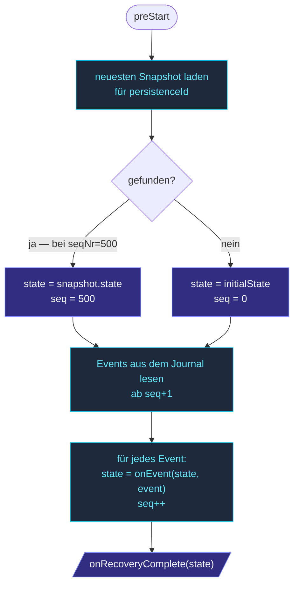

Ein `PersistentActor` liest sein gesamtes Event-Log, um sich
wiederherzustellen.  Für einen Actor, der jahrelang gelebt und
100 000 Events emittiert hat, ist das ein langsamer Start.
**Snapshots** sind ein periodischer Dump des aktuellen States — bei
der Recovery lädt das Framework den neuesten Snapshot und spielt nur
Events *danach* ab.

```
Journal:   E1  E2  E3  E4  E5 ... E150 ... E1000  ← alle je geschriebenen Events
           ↑                              ↑
           Recovery                       neuester Snapshot
           startet hier                   gespeichert bei seqNr=500

           Ohne Snapshots: 1000 Events abspielen.
           Mit Snapshot @500: Snapshot laden, dann E501..E1000 abspielen.
```

Der Trade-off: Snapshots kosten Disk-Platz und Schreib-Durchsatz,
aber kaufen begrenzte Recovery-Zeit.

## Eine Snapshot-Policy konfigurieren

Der Actor deklariert **wann** gesnappshottet werden soll, per
`snapshotPolicy()`:

```ts
import { PersistentActor, everyNEvents } from 'actor-ts';

class Account extends PersistentActor<Command, Event, State> {
  // ...
  override snapshotPolicy() {
    return everyNEvents(100);   // Snapshot alle 100 Events
  }
}
```

`everyNEvents(N)` ist die häufigste Policy.  Das Framework ruft die
Policy-Funktion nach jeder Event-Anwendung auf; `true` zurückgeben
löst einen Snapshot des aktuellen States in den Snapshot Store aus.

Für individuelle Policies:

```ts
override snapshotPolicy() {
  return (seqNr, state, event) => {
    // Snapshot bei einer bestimmten Event-Art:
    if (event.kind === 'finalized') return true;
    // Oder bei einer State-Eigenschaft:
    if (state.balance > 1_000_000) return true;
    return false;
  };
}
```

Die Signatur: `(seqNr, state, event) => boolean`.  `seqNr` ist die
Sequenznummer des gerade angewendeten Events, `state` ist der State
*nach* dem Anwenden, `event` ist das Event, das den Aufruf
ausgelöst hat.

## Das Snapshot-Intervall wählen

```ts
everyNEvents(N)
```

Die Zahlen, die zählen:

- **Recovery-Zeit** — wie lange Replay-from-Snapshot dauert.
  Niedrigeres N bedeutet schnellere Recovery.
- **Snapshot-Schreibkosten** — jeder Snapshot serialisiert den
  *vollständigen* State.  Für große States ist das nicht-triviale
  Arbeit.  Höheres N amortisiert diese Kosten über mehr Events.
- **Storage** — Snapshots brauchen Platz, sogar mit der
  "Ältere löschen"-Policy.

Typische Zahlen:

- **Kleiner State, niedrige Schreibrate** — `everyNEvents(1000)`.
  Ein Tausend-Event-Replay ist immer noch schnell; Snapshots sind
  selten.
- **Mittlerer State, moderate Schreibrate** — `everyNEvents(100)`.
  Sinnvoller Default.
- **Großer State, hohe Schreibrate** — `everyNEvents(1000)` mit
  schnellem Journal, ODER überlege, zu `DurableStateActor` zu
  wechseln, wenn Events nicht nützlich sind.

Nicht übertunen.  `everyNEvents(100)` ist ein vernünftiger
Startpunkt; miss die Recovery-Latenz in Produktion, bevor du
änderst.

## Wo Snapshots leben

Snapshots werden in einem **separaten** Snapshot Store gespeichert,
konfiguriert auf Persistence-Extension-Ebene:

```ts
import { PersistenceExtensionId, InMemoryJournal, InMemorySnapshotStore } from 'actor-ts';

system.extension(PersistenceExtensionId).configure({
  journal:       new InMemoryJournal(),
  snapshotStore: new InMemorySnapshotStore(),
});
```

Eingebaute Snapshot Stores:

| Store | Wann |
| --- | --- |
| `InMemorySnapshotStore` | Tests, Dev. |
| `SqliteSnapshotStore` | Single-Node-Produktion. |
| `ObjectStorageSnapshotStore` | Filesystem / S3 mit optionaler Verschlüsselung. |
| `CachedSnapshotStore` | Wickelt einen anderen Store mit einem Read-Through-Cache ein. |

Das Journal und der Snapshot Store sind unabhängig; du kannst sie
mischen (z. B. Cassandra-Journal + Object-Storage-Snapshot-Store).

## Was gespeichert wird

Ein Snapshot ist `{ persistenceId, sequenceNr, state }`.  Der Store
behält typischerweise:

- Den **neuesten** Snapshot pro `persistenceId`.
- Optional ein paar **ältere**, falls der neueste korrupt ist
  (pro Store konfigurierbar).

Wenn der Actor sich wiederherstellt, gibt der Store den **neuesten**
Snapshot für die `persistenceId` des Actors zurück.  Ältere
Snapshots werden nicht geladen, es sei denn, du fragst explizit
über die Lower-Level-API des Stores.

## Recovery-Flow mit Snapshots



`onEvent` ist immer noch rein — gleiche Regel wie ohne Snapshots.
Der Snapshot ist nur der Punkt, wo das Replay *startet*; alles
danach ist Event-Replay wie üblich.

## Snapshot-Adapter — Schema-Evolution

Wenn sich die **State-Form** ändert (ein Feld wird umbenannt, ein
Wert wird restrukturiert), können alte Snapshots nicht mehr in die
neue Form deserialisiert werden.  Zwei Optionen:

1. **Alte Snapshots löschen** — die nächste Recovery spielt von
   Grund auf ab und baut die neue State-Form aus dem (immer noch
   aktuellen) Event-Log auf.
2. **Einen Snapshot-Adapter** verwenden, um alte Snapshots beim
   Laden hochzukasten:

   ```ts
   class V1ToV2SnapAdapter implements SnapshotAdapter<StateV2> {
     upcast(stored: unknown, version: number): StateV2 {
       if (version === 1) return migrateSnapshot(stored as StateV1);
       return stored as StateV2;
     }
   }

   class Account extends PersistentActor<...> {
     override snapshotAdapter() { return new V1ToV2SnapAdapter(); }
   }
   ```

Mit einem gesetzten Adapter werden Snapshots in einem
`{ _v, _t, _e }`-Envelope persistiert; beim Laden migriert der
Adapter ältere Versionen, bevor er den State zurückgibt.

Siehe [Migration im Überblick](/de/persistence/migration/overview/)
für die breitere Migrationsstrategie (Event-Adapter +
Snapshot-Adapter zusammen).

## Ohne Snapshots

Ein `PersistentActor` ohne Snapshot-Policy snappshottet nie — die
Recovery spielt jedes Event vom Anfang der Zeit ab.  Für einen
Actor, der insgesamt 10 Events emittiert, ist das in Ordnung; für
einen Event-sourced Cart, der über das Leben eines Users 10 000
Events akkumuliert, ist das ein Recovery-Zeit-Problem.

Das Framework snappshottet nicht automatisch.  Wenn du keine Policy
setzt, bekommst du keine Snapshots — `snapshotPolicy()` defaultet
auf `() => false`.

## Häufige Stolperfallen

import { Aside } from '@astrojs/starlight/components';

<Aside type="caution" title="Snapshot-Adapter müssen zum Journal-Adapter passen">
  ```ts
  override eventAdapter()    { return new V1ToV2EventAdapter();    }
  override snapshotAdapter() { /* (none) */ }
  ```
  Wenn deine Events einen Adapter haben (sodass alte Events beim
  Laden auf die aktuelle Form hochgekastet werden), deine Snapshots
  aber **nicht**, lädt die Recovery einen V1-Snapshot und versucht,
  V2-Events darauf anzuwenden — falsche Form, still kaputter State.
  Entweder beide haben Adapter oder keiner; konsistente Versionierung
  ist die Regel.
</Aside>

<Aside type="caution" title="`onRecoveryComplete` feuert nicht, wenn keine Events">
  ```ts
  override onRecoveryComplete(state) {
    this.fetchSubscribers();   // läuft nach der Recovery
  }
  ```
  Tatsächlich feuert `onRecoveryComplete` **doch** — einmal, nachdem
  der initiale State eingerichtet ist, auch wenn keine Events / kein
  Snapshot da sind.  Verwende es frei.  Die Falle ist *wann* es
  feuert: nach `preStart`, vor dem ersten Command.  Die
  Mailbox-Verarbeitung wird wieder aufgenommen, nachdem
  `onRecoveryComplete` zurückkehrt.
</Aside>

<Aside type="caution" title="Snapshots nach jedem Event">
  ```ts
  override snapshotPolicy() { return () => true; }
  // → Snapshots bei jedem Event
  ```
  Snapshot-bei-jedem-Event bedeutet, dass jeder Persist auch den
  vollen State schreibt.  Für nicht-triviale States verdoppelt oder
  verdreifacht das die Schreibkosten.  Wenn du dieses Verhalten
  willst, willst du wahrscheinlich stattdessen `DurableStateActor`
  — er ist für "immer aktuell" entworfen.
</Aside>

## Wie geht's weiter

- **[PersistentActor](/de/persistence/persistent-actor/)** —
  die Basisklasse, deren `snapshotPolicy()` du überschreibst.
- **[Snapshot Stores — In-Memory](/de/persistence/snapshot-stores/in-memory/)** —
  der Dev/Test-Store.
- **[Snapshot Stores — SQLite](/de/persistence/snapshot-stores/sqlite/)** —
  Single-Node-Produktion.
- **[Snapshot Stores — Cached](/de/persistence/snapshot-stores/cached-snapshot-store/)** —
  Read-Through-Cache über einem anderen Store.
- **[Migration im Überblick](/de/persistence/migration/overview/)** —
  State + Event-Schema-Evolution.

Die [`SnapshotStore`](/api/interfaces/snapshotstore/)- und
[`SnapshotPolicy`](/api/types/snapshotpolicy/)-API-Referenzen
decken die vollständige Oberfläche ab.
