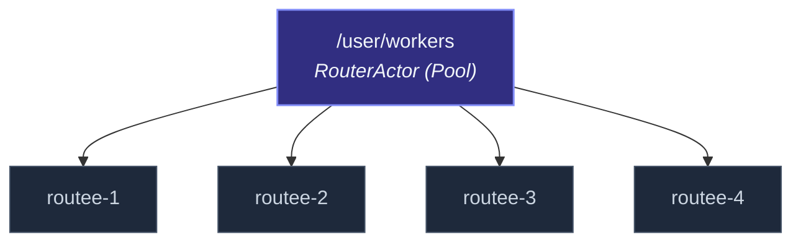

Ein Router braucht **Routees**, an die er Nachrichten weiterleitet.
Zwei Wege, sie zu bekommen, die sehr unterschiedliche
Lifecycle-Beziehungen kodieren:

| Modell | Wer besitzt die Routees? | Discovery |
| --- | --- | --- |
| **Pool** | Der Router — er spawnt die Routees aus einem `Props`. | Statisch zur Spawn-Zeit; Größe ändert sich nicht ohne Router-Restart. |
| **Group** | Jemand anderes — die Routees existieren bereits. | Dynamisch (Group-Router re-discovern bei Bedarf). |

Der lokale `Router` ist **immer ein Pool**.  Der
Cluster-`ClusterRouter` ist **immer eine Group** (Routees werden
aus Cluster-Up-Members an einem bekannten Pfad abgeleitet).  Zu
wissen, welches du hast, prägt, wie du über Lifecycle, Supervision
und Resize denkst.

## Pool-Router

```ts
import { Router, Props } from 'actor-ts';

const pool = system.actorOf(
  Router.roundRobin(4, Props.create(() => new Worker())),
  'workers',
);
```

Was das erzeugt:



Der Router *besitzt* seine Routees — sie sind seine Kinder.
Konsequenzen:

- **Lifecycle ist gekoppelt.**  Stoppe den Router → alle Routees
  stoppen.  Keine zurückbleibenden Waisen.
- **Supervision ist unkompliziert.**  Der Router supervised seine
  Routees mit der Strategie, die die Routee-`Props` deklarieren
  (oder dem Default).
- **Fehler sind wiederherstellbar.**  Ein abgestürzter Routee wird
  vom Supervisor neu gestartet; der Router routet weiter.

Aber es bedeutet auch:

- **Routees sind aus Sicht des Routers zustandslos.**  Ein neu
  gestarteter Routee hat nichts mehr von der vorherigen Instanz.
  Wenn Routees Zustand halten, der Routing-Pool-Restarts
  überleben soll, persistiere ihn (siehe
  [PersistentActor](/de/persistence/persistent-actor/)).
- **Größe ist zur Spawn-Zeit fixiert.**  `Router.roundRobin(4, ...)`
  hat immer 4 Routees.  Zum Resizen: stoppen und neu spawnen.
- **Routees haben keine Namen, die du wiedererkennen würdest.**
  Sie sind `routee-1` bis `routee-N`, vom Router automatisch
  benannt.

Richtige Form für **homogene Worker-Pools** — N zustandslose
Workers, alle gleich, die einen Stream von Arbeit parallelisieren.

## Group-Router *(nur Cluster)*

```ts
import { ClusterRouter } from 'actor-ts';

const router = system.actorOf(
  ClusterRouter.props({
    cluster,
    routerType: 'round-robin',
    routeePath: '/user/worker',
    role: 'compute',   // optional: nur Routees auf dieser Rolle
  }),
  'compute-router',
);
```

Was das erzeugt:

```
/user/compute-router    ← der Cluster-Router
  (keine Kinder — Routees leben bereits auf anderen Nodes)
```

Der Router *findet* seine Routees, statt sie zu erstellen.  Jeder
Node, der die Rolle `'compute'` trägt, hat vermutlich einen Actor
unter `/user/worker`; der Router konstruiert für jeden eine
`RemoteActorRef` und routet zu diesen.

Konsequenzen:

- **Lifecycle ist unabhängig.**  Stoppe den Router → Routees laufen
  weiter.  Stoppe einen Routee → der Router stoppt das Senden an
  ihn (nachdem die Cluster-Mitgliedschaft es bemerkt), aber der
  Rest des Pools ist unberührt.
- **Topologie-getriebenes Sizing.**  Füge einen Node hinzu → der
  Router nimmt ihn automatisch auf.  Entferne einen Node → der
  Router stoppt das Senden.  Kein Restart nötig.
- **Routees haben bedeutungsvolle Identitäten.**  Sie leben an
  bekannten Pfaden und können Per-Node-Zustand halten.

Aber auch:

- **Du bist für das Spawnen der Routees verantwortlich.**  Jeder
  Node muss `/user/worker` irgendwo in seinem Startup erstellt
  haben.  Der Cluster-Router spawnt sie *nicht*.
- **Ein leerer Pool verwirft Nachrichten mit einer Warnung.**  Wenn
  kein Node die Rolle matcht, landet jedes `tell` an den Router
  in Dead Letters.  Siehe die
  [Cluster-Router](/de/cluster/cluster-router/)-Docs für die
  exakte Semantik.
- **Supervision ist Per-Node.**  Jeder Routee wird von seinem
  eigenen Parent auf seinem eigenen Node supervised — der
  Cluster-Router hat keine Autorität über sie.

Richtige Form für **fixed-name Workers über einen Cluster** — ein
(oder ein festes Set von) benannte(n) Actor(s) pro Node, jeder mit
Per-Node-Zustand, alle zusammen einen Fan-Out-Workload bedienend.

## Drei konkrete Fragen, um zwischen ihnen zu entscheiden

1. **Halten die Routees Per-Instance-Zustand, der wichtig ist?**
   - Nein, sie sind austauschbare Workers → **Pool**.
   - Ja, restart-überlebenswichtiger Zustand → **Group** (mit
     jedem Routee als `PersistentActor` oder den Zustand über
     einen externen Store haltend).

2. **Muss sich die Pool-Größe zur Laufzeit ändern?**
   - Nein, fixe Pool-Größe für die Dauer → **Pool**.
   - Ja, die Größe folgt der Cluster-Mitgliedschaft → **Group**.

3. **Soll das Stoppen des Routers die Routees kaskadiert stoppen?**
   - Ja, sie haben keinen Zweck ohne den Router → **Pool**.
   - Nein, sie existieren unabhängig → **Group**.

Wenn zwei der drei Antworten auf ein Modell zeigen, ist das das
richtige Modell.  Wenn sie sich widersprechen, bist du wahrscheinlich
mitten im Design — der Mismatch sagt dir etwas darüber, wie die
Routees sich zum Router verhalten sollten.

## Eine häufige Verwirrung: Cluster-aware *Pool*-Router

Die Pool/Group-Unterscheidung wird manchmal durch das
"Cluster-Pool"-Pattern in anderen Actor-Toolkits getrübt, das
seine eigenen Routees spawnt, aber *über* Cluster-Nodes hinweg
(ein Routee pro Node).  actor-ts exponiert das nicht — der
Cluster-Router ist immer group-förmig.  Wenn du einen festen Pool
willst, der zufällig einen Cluster spannt, würdest du einen
Top-Level-"Deployment"-Actor pro Node schreiben, der die lokalen
Routees spawnt, plus einen `ClusterRouter`, der sie per Pfad ins
Visier nimmt.  Siehe
[Sharded Daemon Process](/de/cluster/sharding/sharded-daemon-process/)
für das Pattern, das "N globale Workers spawnen" am nächsten kommt.

## Stop-Verhalten, im Vergleich

| Du stoppst... | Pool-Router | Group-Router |
| --- | --- | --- |
| Den Router | Alle Routees stoppen (Kinder kaskadieren). | Routees laufen weiter. |
| Einen Routee | Supervisor restartet ihn (Default) oder Pool schrumpft. | Router stoppt das Senden an ihn (nachdem der Cluster es bemerkt), Geschwister unberührt. |
| Das Actor-System | Alles stoppt normal. | Alles stoppt auf diesem Node; Routees auf anderen Nodes laufen weiter. |

Die Asymmetrie ist wichtig für **sauberen Shutdown** — ein
Pool-Router faltet sich sauber zusammen, wenn das System
terminiert; ein Group-Router hinterlässt Routees auf anderen
Nodes, die nicht wissen, dass dieser Aufrufer weg ist.  Verwende
Coordinated Shutdown, um das Richtige zu tun (siehe
[Coordinated Shutdown](/de/fundamentals/coordinated-shutdown/)).

## Wie es weitergeht

- **[Router](/de/routing/router/)** — die lokale
  Pool-Router-API.
- **[Cluster-Router](/de/cluster/cluster-router/)** — die
  Group-Router-API.
- **[Sharded Daemon Process](/de/cluster/sharding/sharded-daemon-process/)** —
  cluster-weite Hintergrund-Workers, das Nächste, was einem
  "Cluster-Pool" gleichkommt.
- **[Strategien](/de/routing/strategies/)** — die
  Routing-Entscheidungen gelten identisch für beide Modelle; der
  Unterschied ist, was auf der Routees-Liste steht, nicht wie die
  Strategie wählt.
