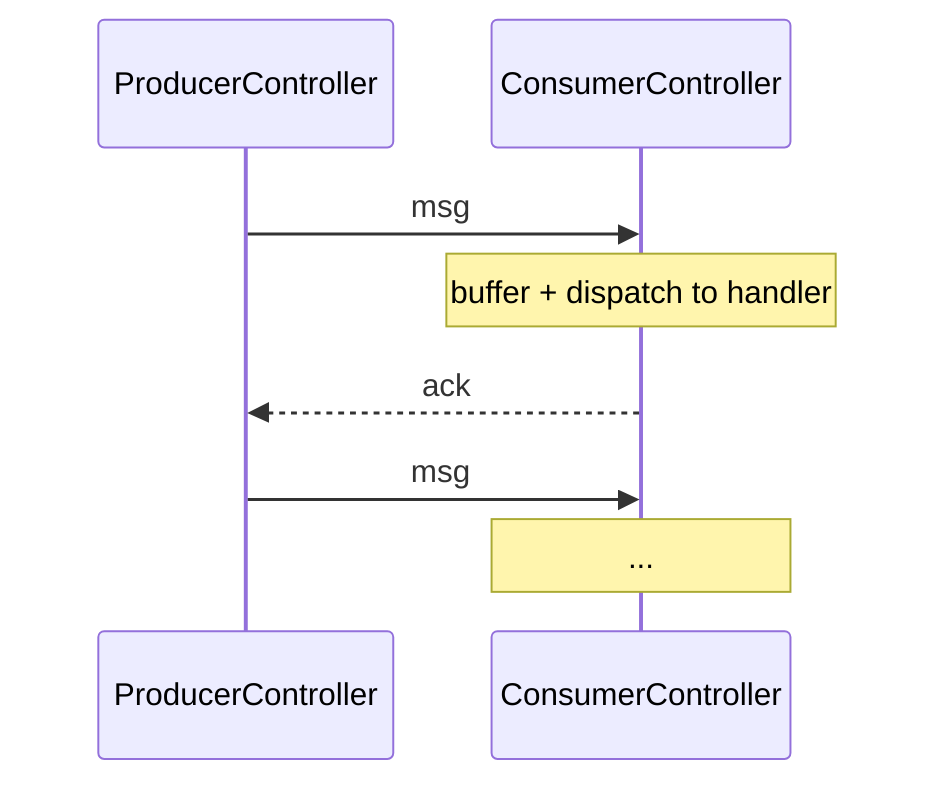

By default, `tell` is **fire-and-forget**.  Messages may be lost
(stopped recipient, mailbox overflow, network drops in cluster
setups).  For workloads where loss is unacceptable, the framework
provides **reliable delivery** via the
**`ProducerController` / `ConsumerController`** pair.



Adds **sequence numbers** + **acks** to the basic `tell`
contract.  Producer holds unacked messages; consumer dedups by
seq.

## When to reach for this

For workloads where:

- **Loss is unacceptable** — payment instructions, audit
  records, billing events.
- **Duplicates are tolerable but rare** — at-least-once with
  consumer-side dedup is fine.
- **Order matters within a stream** — sequence numbers preserve.

For workloads where loss is acceptable (telemetry, metrics,
fire-and-forget UX updates), use plain `tell`.

## At-least-once vs effectively-once

The framework's reliable delivery is **at-least-once** by
default — a message may be redelivered if the producer crashes
between sending and receiving the ack.

For **effectively-once**, the controller already dedupes
incoming duplicates per `(producerId, seq)` — but only within
its in-memory lifetime.  If you need dedup that survives
consumer restarts, persist your own processed-seq alongside
the business state in the handler:

```ts
new ConsumerController<DeliveryMsg>({
  handler: async (body) => {
    if (await alreadyProcessed(body.id)) return;   // your idempotency check
    await this.handle(body);
    await markProcessed(body.id);
  },
});
```

The controller's in-memory dedup handles the common
retransmit-before-ack case; your handler's persisted dedup
handles consumer crashes mid-processing.  Together they give
**effectively-once** in the durable sense.

## The two controllers

| Controller | Role |
| --- | --- |
| **[ProducerController](/delivery/producer-controller/)** | Wraps the sender side — assigns sequence numbers, holds unacked messages, retransmits. |
| **[ConsumerController](/delivery/consumer-controller/)** | Wraps the receiver side — orders messages by seq, dedupes, sends acks. |

Pair them via a **producer-consumer link** — each producer
talks to one consumer (or N consumers via routing, but the
link is 1:1 per stream).

## A minimal example

```ts
import {
  Props,
  ProducerController,
  ProducerControllerOptions,
  ConsumerController,
} from 'actor-ts';

// Consumer side — handler function, auto-ack on resolve:
const consumer = system.spawn(
  Props.create(() => new ConsumerController<OrderEvent>({
    handler: async (order) => {
      await processOrder(order);
    },
  })),
);

// Producer side — wraps outgoing messages in seq + ack tracking:
const producerControllerOptions = ProducerControllerOptions.create<OrderEvent>()
  .withProducerId('order-producer-1')
  .withConsumer(consumer)
  .withWindowSize(16);
const producer = system.spawn(
  Props.create(() => new ProducerController<OrderEvent>(producerControllerOptions)),
);

producer.tell({
  kind: 'reliable-delivery.send',
  body: { orderId: 'o-1', amount: 100 },
});
```

The framework handles seq assignment, retransmission,
ordering — your code handles the business logic + dedup.

## Sequence-number semantics

```
Each producer assigns strictly increasing seq numbers, starting at 1:
  msg 1, msg 2, msg 3, ...

The consumer sees them IN ORDER (after retransmissions sort out):
  msg 1, msg 2, msg 3, ...

Duplicates (due to retransmit) appear with the SAME seq:
  msg 1, msg 1 (dup), msg 2, ...
  → consumer dedupes by seq
```

The seq is **per-producer** — multiple producers have
independent seq spaces.

## Combining with persistence

For full durability across producer / consumer crashes:

```ts
// Producer-side: persist the in-flight buffer (the messages
// you've tell'd but haven't seen an ack for) so a crash before
// ack doesn't lose them.

// Consumer-side: persist the processed-seq per producer in
// your handler so a crash mid-processing doesn't re-run a
// completed unit of work.
```

Persisting on both sides gives **end-to-end effectively-once**:

- Producer crashes mid-send → recovers persisted in-flight
  buffer → resumes retransmitting unacked messages.
- Consumer crashes mid-process → recovers persisted
  processed-seq → handler dedupes the redelivery.

Without persistence, recovery resets to zero on both sides —
the producer forgets unacked messages and the consumer's
in-memory dedup is gone.

## Comparison with broker-based delivery

```
Producer/ConsumerController:  in-cluster reliable delivery
Kafka / RabbitMQ / NATS:       external broker-mediated delivery
```

Both achieve at-least-once + dedup-via-seq.  Differences:

| Aspect | In-cluster controllers | External broker |
| --- | --- | --- |
| Operational complexity | Low — part of the cluster | High — separate broker to run |
| Latency | Sub-millisecond | Network + broker overhead |
| Throughput | Bounded by single-actor processing | Higher (broker scales independently) |
| External consumers | No (cluster-internal) | Yes |
| Persistence | Via PersistentActor | Built into broker |

For **cluster-internal** reliable delivery, use the
controllers.  For **external systems or cross-cluster**, use
a broker (Kafka, etc.).

## Where to next

- **[Producer controller](/delivery/producer-controller/)** —
  sender-side details.
- **[Consumer controller](/delivery/consumer-controller/)** —
  receiver-side details.
- **[Ack semantics](/delivery/ack-semantics/)** — what
  acks mean and when they fire.
- **[PersistentActor](/persistence/persistent-actor/)** —
  pairing with persistence for full durability.
