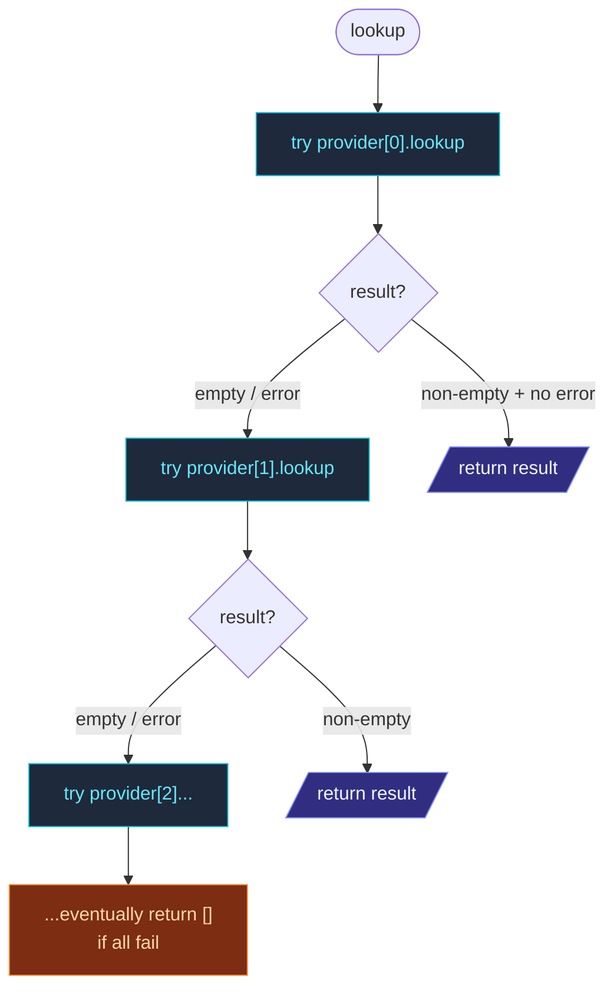

`AggregateSeedProvider` wraps multiple seed providers and tries
them **in order**, returning the first non-empty result.  Useful
when:

- You want **DNS first**, fall back to **static seeds** if DNS is
  unreachable.
- The same code runs in **multiple environments**: K8s for prod,
  static config for local dev.
- You're doing **disaster recovery** — primary discovery
  mechanism + backup.

```ts
import {
  Cluster,
  AggregateSeedProvider,
  KubernetesApiSeedProvider,
  DnsSeedProvider,
  ConfigSeedProvider,
} from 'actor-ts';

const provider = new AggregateSeedProvider([
  new KubernetesApiSeedProvider({ namespace, labelSelector, containerPort: 2552 }),
  new DnsSeedProvider({ service: '_actor-ts._tcp.example.com' }),
  new ConfigSeedProvider({ seeds: ['fallback-1:2552', 'fallback-2:2552'] }),
]);

const seeds = await provider.lookup();
await Cluster.join(system, { host, port, seeds });
```

## How it chains



The provider stops at the **first non-empty result**.  An empty
list from one provider triggers fallback to the next; an error
also triggers fallback (with the error logged at debug level).

If **every** provider fails or returns empty, `lookup()` resolves
to `[]` — the cluster's `Cluster.join` then either self-bootstraps
or retries (depending on its own settings).

## Common patterns

### Local dev → prod K8s

```ts
new AggregateSeedProvider([
  new ConfigSeedProvider({ envVar: 'ACTOR_TS_SEEDS' }),     // 1st: env var
  new KubernetesApiSeedProvider({                            // 2nd: K8s API
    namespace: process.env.K8S_NAMESPACE ?? '',
    labelSelector: 'app=actor-ts',
    containerPort: 2552,
  }),
]);
```

Local dev: `export ACTOR_TS_SEEDS=localhost:2552` → uses the env
var.  In K8s, the env var isn't set; falls through to the K8s
API.

### DNS-first with static fallback

```ts
new AggregateSeedProvider([
  new DnsSeedProvider({ service: '_actor-ts._tcp.example.com' }),
  new ConfigSeedProvider({
    seeds: ['known-stable-node-1:2552', 'known-stable-node-2:2552'],
  }),
]);
```

Try DNS first; if it returns empty (DNS server hiccup, no records
yet during bootstrapping), use known-stable static IPs.

### Multi-region disaster recovery

```ts
new AggregateSeedProvider([
  new KubernetesApiSeedProvider({ namespace: 'primary-region', ... }),
  new KubernetesApiSeedProvider({ namespace: 'failover-region', ... }),
]);
```

In a multi-region deployment, try the local region first; if no
pods are running locally, attempt to join the failover region's
cluster.  Aggressive — only makes sense if the regions are
actually meant to share state.

## Error handling

```ts
new AggregateSeedProvider([
  new KubernetesApiSeedProvider({ ... }),   // raises 403 in non-K8s
  new ConfigSeedProvider({ seeds: ['10.0.0.1:2552'] }),
]);
```

A 403 from K8s API → logged + skipped → falls through to the
config provider.  This makes aggregate the right tool for "this
code path runs everywhere" — the K8s lookup just becomes a noop
where K8s isn't available.

Errors logged at **debug** level — quiet by default.  Configure
the system at `debug` level if you want visibility into which
providers tried + failed.

## Ordering matters

The first provider that returns a non-empty result is used.
**Test the order** explicitly:

| Order | Effect |
| --- | --- |
| K8s, then DNS | K8s wins in K8s deployments; DNS is the fallback. |
| DNS, then K8s | DNS wins everywhere; K8s only fires when DNS is unreachable. |

Put the **preferred** provider first; the **fallback** last.

import { Aside } from '@astrojs/starlight/components';

<Aside type="caution" title="Empty result triggers fallback">
  ```ts
  // 1st provider returns [] (no matching pods yet) → falls back to 2nd
  ```
  Empty is **not** an error, but it does trigger fallback.  This
  is usually what you want — first-node-up sees empty, falls back
  to a static seed.  But if your primary provider intentionally
  returns empty (e.g., to indicate "no peers ready"), use a
  single provider instead.
</Aside>

<Aside type="caution" title="Latency stacks">
  ```ts
  new AggregateSeedProvider([
    new DnsSeedProvider({ service: 'slow-dns.example' }),   // 30s timeout
    new ConfigSeedProvider({ seeds: ['fallback:2552'] }),
  ]);
  ```
  If the first provider times out, you wait for that timeout
  before trying the second.  For latency-sensitive boot, put
  fast providers first or set short timeouts on slow ones.
</Aside>

<Aside type="caution" title="No partial results">
  ```ts
  // K8s returns ['1.1.1.1:2552']; DNS returns ['2.2.2.2:2552']
  // Aggregate returns ONLY ['1.1.1.1:2552'] — DNS is never consulted
  ```
  Aggregate is **first-wins**, not "union of all."  If you want
  the union (K8s pods + DNS-discovered VMs in a hybrid setup),
  you'd need a different abstraction — either pre-merge before
  passing to `Cluster.join`, or write a custom provider.
</Aside>

## Where to next

- **[Discovery overview](/discovery/overview/)** — the
  bigger picture.
- **[Config seed provider](/discovery/seed-providers/config/)** —
  static-list provider commonly used as fallback.
- **[DNS seed provider](/discovery/seed-providers/dns/)** —
  the DNS-based provider.
- **[Kubernetes API seed provider](/discovery/seed-providers/kubernetes-api/)** —
  the K8s-based provider.
- **[Joining and seeds](/cluster/joining-and-seeds/)** —
  how the result is used.
