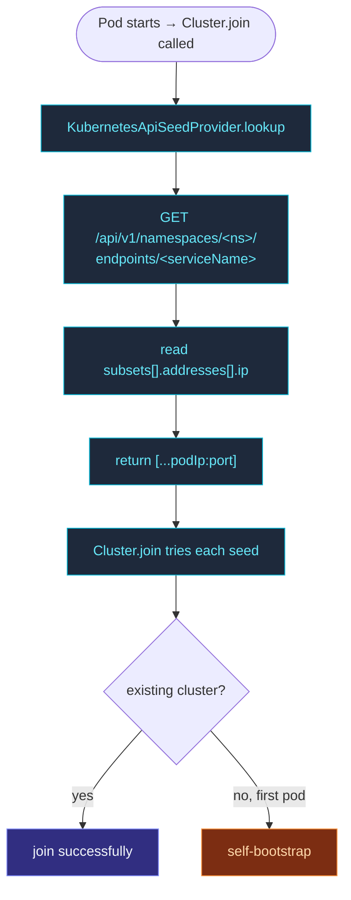

`KubernetesApiSeedProvider` reads the Endpoints of a named
Service from the K8s API and returns the ready pod IPs as seeds.
Works without DNS, without SRV, without manual seed-list
maintenance — the Service is your contract.

```ts
import { Cluster, ClusterOptions, KubernetesApiSeedProvider, KubernetesApiSeedProviderOptions } from 'actor-ts';

const kubernetesApiSeedProviderOptions = KubernetesApiSeedProviderOptions.create()
  .withNamespace(process.env.K8S_NAMESPACE!)
  .withServiceName('actor-ts')
  .withSystemName('my-app')
  .withPort(2552);
const provider = new KubernetesApiSeedProvider(
  kubernetesApiSeedProviderOptions,
);

const seeds = await provider.lookup();
const clusterOptions = ClusterOptions.create()
  .withHost(process.env.POD_IP!)
  .withPort(2552)
  .withSeeds(seeds);
await Cluster.join(
  system,
  clusterOptions,
);
```

For every ready pod backing the `actor-ts` Service in the
namespace, the provider returns `<pod-ip>:2552`.

## Configuration

```ts
type KubernetesApiSeedProviderOptionsType = {
  namespace:       string;
  serviceName:     string;
  systemName:      string;
  port:            number;
  fetchEndpoints?: () => Promise<string[]>;  // override the in-cluster API
};
```

| Field | What |
| --- | --- |
| `namespace` | K8s namespace to query — typically your app's namespace. |
| `serviceName` | The Service (or Endpoints) name whose ready pods form the cluster. |
| `systemName` | The actor-system name stamped on each discovered address. |
| `port` | The cluster-transport port on each backing pod. |
| `fetchEndpoints` | Override the Endpoints-fetch function — defaults to the in-cluster API. |

For pods running in-cluster, only `fetchEndpoints` is optional —
the framework reads the Endpoints from the standard API at
`https://kubernetes.default.svc` using the mounted ServiceAccount
token.  The other four fields are required.

## RBAC

The pod's ServiceAccount needs read access to the Service's
Endpoints in the namespace:

```yaml
apiVersion: rbac.authorization.k8s.io/v1
kind: Role
metadata:
  name: actor-ts-endpoints-reader
  namespace: my-app
rules:
  - apiGroups: [""]
    resources: ["endpoints"]
    verbs: ["get"]
---
apiVersion: rbac.authorization.k8s.io/v1
kind: RoleBinding
metadata:
  name: actor-ts-endpoints-reader
  namespace: my-app
subjects:
  - kind: ServiceAccount
    name: actor-ts
roleRef:
  kind: Role
  name: actor-ts-endpoints-reader
  apiGroup: rbac.authorization.k8s.io
```

Without these, the lookup gets a 403; `Cluster.join` retries
indefinitely.

## What it returns

From the Service's Endpoints object:

- **Ready pods** in `subsets[].addresses[]` → included as
  `<podIP>:<port>`.
- **Not-ready / pending pods** (in `notReadyAddresses`) → skipped
  (no ready IP yet).
- **This pod itself** → may be included or not depending on
  readiness timing; the cluster handles self-as-seed correctly.

## Cluster-wide vs replica-set

Membership is defined by the Service's own `spec.selector` — the
provider only needs the Service *name*:

```yaml
# One Service fronting every cluster pod:
apiVersion: v1
kind: Service
metadata:
  name: actor-ts
spec:
  clusterIP: None        # headless — Endpoints carry the pod IPs
  selector:
    app: actor-ts
  ports:
    - port: 2552
```

Point the provider at that Service with
`.withServiceName('actor-ts')`.  For most deployments, **one
Service per cluster** — every pod the Service selects bootstraps
into one cluster.

For role-based asymmetric clusters (workers vs. HTTP gateways), a
single Service whose selector (`app=actor-ts`) covers both roles
is enough; the role tag inside the cluster is separate from the
Service's pod selection.

## What happens at startup



If you're the first pod up, the K8s API returns this pod only.
The framework's self-bootstrap logic handles this:
`Cluster.join` with seeds containing only itself self-promotes
to leader.

Subsequent pods see the existing pods and join through them.

## One Service per cluster

| Service layout | Effect |
| --- | --- |
| One Service, selector `app=actor-ts` | One cluster across the namespace. |
| Two Services, selectors `env=prod` / `env=staging` | Separate prod and staging clusters in one namespace. |
| One Service per named cluster | Explicit cluster name; multiple clusters in one namespace. |

Stable Service design matters — the **cluster's identity** is the
Service you point at.  Changing which pods the Service selects (or
the Service name) splits the cluster.

## When NOT

import { Aside } from '@astrojs/starlight/components';

<Aside type="caution" title="Pods without IPs">
  Not-ready pods aren't in the Service's Endpoints `addresses` —
  the provider skips them.  Until at least one pod is `Ready`, the
  lookup returns an empty list.  This is rarely a problem (first
  pod self-bootstraps), but be aware during fast scale-ups.
</Aside>

<Aside type="caution" title="Cross-namespace lookup">
  ```ts
  namespace: 'other-namespace';   // ✗ unusual; check RBAC
  ```
  The default RBAC binding above scopes to one namespace.  For
  cross-namespace lookups, use ClusterRole + ClusterRoleBinding,
  or a Role per source namespace.
</Aside>

<Aside type="caution" title="K8s API rate limits">
  ```ts
  // 1000 pods restarting simultaneously → 1000 lookups → API throttling
  ```
  The K8s API has per-client rate limits.  For very large
  deployments, stagger startup (StatefulSet `podManagementPolicy:
  OrderedReady`) to avoid thundering-herd lookups.
</Aside>

## Where to next

- **[Discovery overview](/discovery/overview/)** — the
  bigger picture.
- **[Kubernetes deployment](/operations/deployment/kubernetes/)** —
  the full K8s recipe.
- **[Config seed provider](/discovery/seed-providers/config/)** —
  fallback for non-K8s.
- **[Aggregate seed provider](/discovery/seed-providers/aggregate/)** —
  combine K8s with a fallback.
- **[Joining and seeds](/cluster/joining-and-seeds/)** —
  how seeds are consumed.
