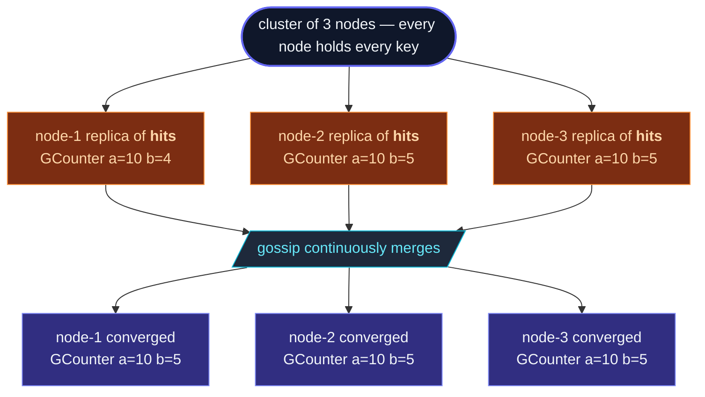

**Distributed data** is the cluster's eventually-consistent
shared-state layer.  Every node holds a **local replica** of every
key.  Updates apply locally first; gossip propagates them; conflicting
concurrent updates merge automatically via the data type's CRDT
semantics.



The shared state is **CRDT** — conflict-free replicated data type.
A handful of carefully-designed types (counters, sets, registers,
maps) whose merge operation is **commutative, associative, and
idempotent**: gossip can deliver updates in any order, repeat
them, or drop them, and replicas still converge on the same value.

## When to use DistributedData

Three patterns:

1. **Cluster-wide counters and gauges** — total request count,
   active session count, current rate limit.  Every node can
   read and write without coordinating; the merged value is the
   global truth.
2. **Membership sets** — "which sessions are active," "which
   feature flags are enabled."  Add and remove items from any
   node; the set's semantics handle concurrent adds correctly.
3. **Configuration registers** — a single value that nodes write
   to and read from, with timestamps deciding the winner on
   concurrent writes.

## A minimal example

```ts
import { ActorSystem, Cluster, ClusterOptions } from 'actor-ts';
import { DistributedDataId, GCounter } from 'actor-ts';

const system  = ActorSystem.create('my-app');
const cluster = await Cluster.join(system, ClusterOptions.create().withHost(host).withPort(port).withSeeds(seeds));
const dd      = system.extension(DistributedDataId).start(cluster);

// Increment a counter — no coordination, just merge into the local replica.
dd.update<GCounter>(
  'request-count',
  GCounter.empty,
  (c) => c.increment(dd.selfReplicaId(), 1),
);

// Read the local view — gives you the latest known merged state.
const counter = dd.get<GCounter>('request-count');
console.log(counter?.value);   // sum across all known replicas
```

The local update is immediate; gossip propagates it to peers over
the next few rounds.  Reads are always local (cheap, no network),
and read what the local replica currently knows — which converges
toward the global state.

## The CRDT types

| Type | What it is | When |
| --- | --- | --- |
| **`GCounter`** | Grow-only counter.  Each replica counts its own contribution; the value is the sum. | Counts that only go up — total impressions, completed jobs. |
| **`PNCounter`** | Increment-and-decrement counter (two `GCounter`s under the hood). | Counts that go both ways — current active sessions. |
| **`GSet`** | Grow-only set.  Adds only, no removes. | Append-only collections — observed event types, encountered users. |
| **`ORSet`** | Observed-Remove set.  Adds and removes; concurrent add+remove resolves to add (the add was observed). | Membership sets where items come and go. |
| **`LWWRegister<T>`** | Last-Writer-Wins register.  A single value, the winner is the most recent timestamp. | Single-value config — feature flag, last-known leader. |
| **`MVRegister<T>`** | Multi-Value register.  Concurrent writes are kept as a set; the caller picks. | When you need to detect "two replicas wrote concurrently." |
| **`LWWMap<K, V>`** | A map of `K` to LWW values. | Per-key single-value config. |
| **`ORMap<K, C>`** | A map where the values are themselves CRDTs. | Per-key counters, per-key sets. |
| **`GCounterMap<K>`** | Convenience: a map of GCounters. | Per-key click counters, per-tenant request counts. |

See [CRDT types](/distributed-data/crdt-types/) for the
deep dive on each — `merge()` semantics, when they fit, when they
don't.

## Consistency knobs

Reads and writes both have a **consistency** parameter:

```ts
await dd.updateAsync('hits', GCounter.empty,
  (c) => c.increment(dd.selfReplicaId(), 1),
  { consistency: 'majority', timeoutMs: 2_000 });

const hits = await dd.getAsync<GCounter>('hits',
  { consistency: 'majority' });
```

| Level | What it means |
| --- | --- |
| `'local'` *(default)* | Apply locally; rely on gossip to propagate.  Read returns the local replica's view. |
| `'majority'` | Wait until ⌈N/2 + 1⌉ replicas have acked.  Read merges majority responses. |
| `'all'` | Wait for every up-member.  Strongest consistency, highest latency. |
| `{ kind: 'count'; n: 3 }` | Wait for exactly `n` acks. |

Quorum doesn't change the merge semantics — every update still
merges into every replica eventually.  Quorum just gives you a
**guarantee** about *when* enough replicas have seen the write.

For most reads and writes, `'local'` is the right default.  Reach
for `'majority'` when:

- You want a read to reflect a recent write *you* made — `'local'`
  works only if you read on the same node you wrote to; majority
  reads cover the cross-node case.
- You want a write to be "durable" before responding to a client —
  `'majority'` ensures a node failure won't lose it.

## Subscribing to changes

```ts
const unsubscribe = dd.subscribe<GCounter>('hits', (counter) => {
  console.log(`hits is now ${counter.value}`);
});

// ... later
unsubscribe();
```

The callback fires synchronously after every successful update or
merge that *changes the local value*.  Use it to wire DistributedData
into the rest of your app — e.g., update a UI on changes, trigger
follow-up logic when a counter crosses a threshold.

## Durability

By default, DistributedData is in-memory only.  When the whole
cluster restarts (cold start), every key starts empty again.

For **survive-restart** semantics, use the **durable** variant:

```ts
import { DistributedDataOptions, DurableDistributedDataStore } from 'actor-ts';

const dd = system.extension(DistributedDataId).start(
  cluster,
  DistributedDataOptions.create().withDurableStore(
    new DurableDistributedDataStore({
      durableStateStore: someStore,
      keys: ['hits', 'config'],   // only these keys are persisted
    }),
  ),
);
```

The durable layer persists changes to disk (or wherever the
durable-state store lives); on restart, the replica's state is
restored before joining the gossip.

See [Durable storage](/distributed-data/durable-storage/)
for the configuration details.

## When NOT to use DistributedData

import { Aside } from '@astrojs/starlight/components';

<Aside type="caution" title="Strong consistency needed">
  DistributedData is **eventually consistent**.  A read might
  reflect stale state for a few hundred ms after a write on
  another node.  If you need "every read sees every prior write"
  in real time, use a singleton or a persistent actor with
  explicit coordination.
</Aside>

<Aside type="caution" title="High-cardinality keyspace">
  Every node holds every key.  10 000 keys is fine; 10 million is
  not.  For per-key state at scale, use
  [sharding](/cluster/sharding/overview/) — each entity
  is one actor on one node, not replicated.
</Aside>

<Aside type="caution" title="Large per-key values">
  Gossiping a 10 MB blob to every node every gossip round is
  wasteful.  DistributedData is for *small* shared state — counters,
  flags, sets of IDs.  For large data (full configurations,
  documents), use a persistent journal or a dedicated key-value
  store with referenced lookups.
</Aside>

<Aside type="caution" title="Order-sensitive logic">
  CRDT merge is **order-independent** by design.  If your app's
  correctness depends on "increment then decrement then increment"
  vs "increment then increment then decrement," the CRDT will
  produce the same value (`+1` either way) but you've lost the
  intermediate state.  This usually isn't a problem; if it is,
  you need event sourcing, not a CRDT.
</Aside>

## Where to next

- **[CRDT types](/distributed-data/crdt-types/)** —
  deep dive on each type's semantics.
- **[Replication](/distributed-data/replication/)** — how
  gossip moves updates between replicas.
- **[Quorum reads/writes](/distributed-data/quorum-reads-writes/)** —
  the consistency-level knobs in detail.
- **[Durable storage](/distributed-data/durable-storage/)** —
  for survive-restart state.
- **[Cluster overview](/cluster/overview/)** — the
  membership underneath.
- **[Sharding overview](/cluster/sharding/overview/)** —
  the per-key alternative when keys are too numerous to replicate.

The [`DistributedData`](/api/classes/distributeddata/)
API reference covers the full extension surface.
